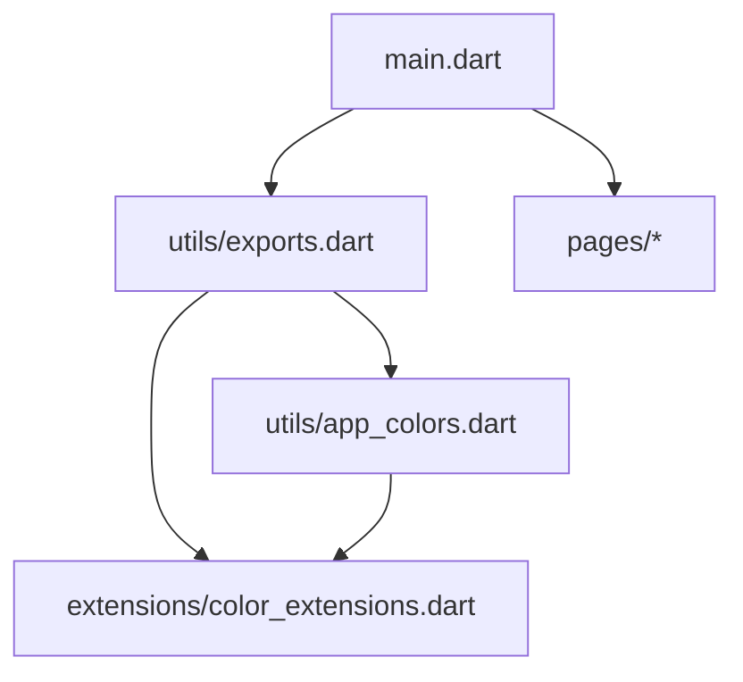
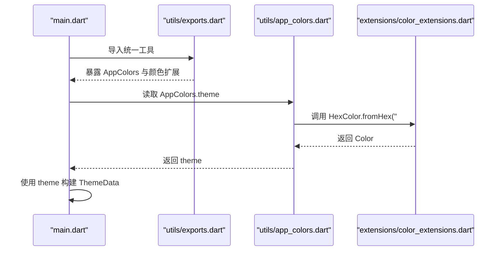
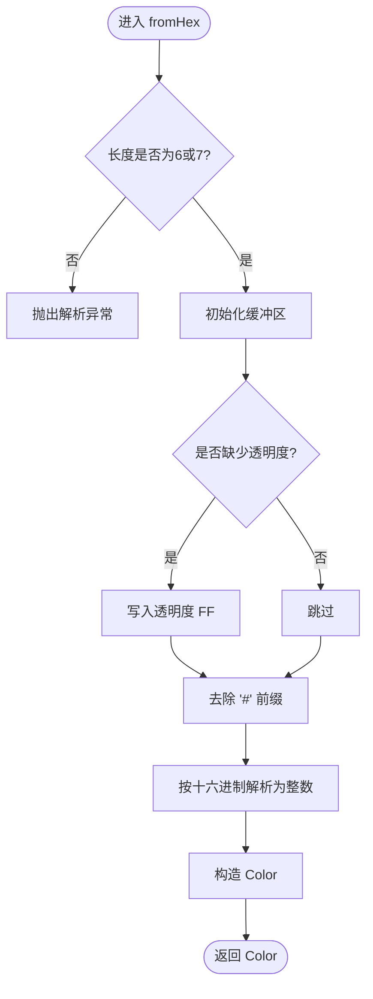
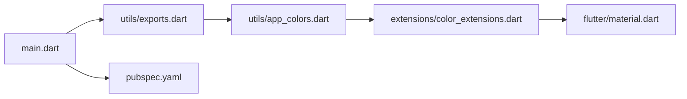

# Dart扩展方法

<cite>
**本文引用的文件**
- [color_extensions.dart](file://lib/extensions/color_extensions.dart)
- [app_colors.dart](file://lib/utils/app_colors.dart)
- [exports.dart](file://lib/utils/exports.dart)
- [main.dart](file://lib/main.dart)
- [pubspec.yaml](file://pubspec.yaml)
</cite>

## 目录
1. [简介](#简介)
2. [项目结构](#项目结构)
3. [核心组件](#核心组件)
4. [架构总览](#架构总览)
5. [详细组件分析](#详细组件分析)
6. [依赖关系分析](#依赖关系分析)
7. [性能考虑](#性能考虑)
8. [故障排查指南](#故障排查指南)
9. [结论](#结论)
10. [附录](#附录)

## 简介
本文件围绕本项目中的Dart扩展方法，重点说明 color_extensions.dart 提供的 Color 扩展能力，尤其是 HexColor.fromHex 的实现原理与使用方式。同时总结在Flutter开发中使用扩展方法的优势（可读性、API简化、类型安全）、最佳实践（命名、参数设计、错误处理）、常见使用场景（颜色转换、格式化），以及如何编写自定义扩展方法与选择原则，并给出性能与调试建议。

## 项目结构
本项目将通用工具以“utils”组织，并通过统一的导出文件对外暴露；颜色相关逻辑集中在 extensions 与 utils 两个位置：
- lib/extensions/color_extensions.dart：定义 Color 的静态扩展方法 fromHex，以及 String 的 toColor 便捷方法。
- lib/utils/app_colors.dart：集中管理应用主题色，通过 HexColor.fromHex 生成 Color 常量。
- lib/utils/exports.dart：统一导出常用工具，包括颜色扩展与资源生成代码。
- lib/main.dart：应用入口，使用 AppColors.theme 构建主题。

图表来源
- [main.dart:1-23](file://lib/main.dart#L1-L23)
- [exports.dart:1-5](file://lib/utils/exports.dart#L1-L5)
- [app_colors.dart:1-27](file://lib/utils/app_colors.dart#L1-L27)
- [color_extensions.dart:1-21](file://lib/extensions/color_extensions.dart#L1-L21)

章节来源
- [main.dart:1-23](file://lib/main.dart#L1-L23)
- [exports.dart:1-5](file://lib/utils/exports.dart#L1-L5)
- [app_colors.dart:1-27](file://lib/utils/app_colors.dart#L1-L27)
- [color_extensions.dart:1-21](file://lib/extensions/color_extensions.dart#L1-L21)

## 核心组件
- 颜色扩展（Color 扩展）
  - 提供静态方法 fromHex，用于从十六进制字符串创建 Color。
  - 支持两种输入格式：带前缀 # 的7位或纯6位十六进制字符串。
  - 未提供透明度时默认不透明（FF）。
- 字符串扩展（String 扩展）
  - 提供 toColor 便捷方法，内部委托给 HexColor.fromHex。
- 颜色常量（AppColors）
  - 集中定义主题色、标题色、内容色等，全部通过 HexColor.fromHex 生成。

章节来源
- [color_extensions.dart:1-21](file://lib/extensions/color_extensions.dart#L1-L21)
- [app_colors.dart:1-27](file://lib/utils/app_colors.dart#L1-L27)

## 架构总览
下图展示了从应用入口到颜色扩展的调用链：应用启动时读取 AppColors.theme，该值由 HexColor.fromHex 解析得到；页面通过 Theme 获取主题色进行渲染。

图表来源
- [main.dart:1-23](file://lib/main.dart#L1-L23)
- [exports.dart:1-5](file://lib/utils/exports.dart#L1-L5)
- [app_colors.dart:1-27](file://lib/utils/app_colors.dart#L1-L27)
- [color_extensions.dart:1-21](file://lib/extensions/color_extensions.dart#L1-L21)

## 详细组件分析

### HexColor.fromHex 实现原理
- 输入格式
  - 支持 "#FFFFFF"（7位）或 "FFFFFF"（6位）两种形式。
  - 若传入长度为6或7且包含或不包含前缀，会先补齐透明度为 FF（不透明）。
- 处理流程
  - 去除前缀 #（如有）。
  - 将结果作为十六进制整数解析，构造 Color。
- 复杂度
  - 时间复杂度 O(n)，n 为字符串长度（通常为6或7）。
  - 空间复杂度 O(1)，仅使用固定大小的缓冲区。
- 边界与健壮性
  - 当前实现未对非法字符做显式校验，异常由 int.parse 抛出。
  - 不支持带透明度的8位格式（如 "#AARRGGBB"），如需可在此基础上扩展。

图表来源
- [color_extensions.dart:6-13](file://lib/extensions/color_extensions.dart#L6-L13)

章节来源
- [color_extensions.dart:6-13](file://lib/extensions/color_extensions.dart#L6-L13)

### String.toColor 便捷方法
- 作用：为字符串提供 toColor 方法，内部直接调用 HexColor.fromHex，便于在UI层直接使用字符串转颜色。
- 使用示例路径
  - 在任意引入 exports.dart 的文件中，可直接使用 "FFFFFF".toColor()。

章节来源
- [color_extensions.dart:16-21](file://lib/extensions/color_extensions.dart#L16-L21)
- [exports.dart:1-5](file://lib/utils/exports.dart#L1-L5)

### AppColors 颜色常量
- 作用：集中管理主题色、标题色、内容色等，所有颜色均通过 HexColor.fromHex 生成，保证一致性与可维护性。
- 使用示例路径
  - main.dart 中通过 AppColors.theme 设置主题种子色。

章节来源
- [app_colors.dart:1-27](file://lib/utils/app_colors.dart#L1-L27)
- [main.dart:1-23](file://lib/main.dart#L1-L23)

### 在Flutter中的优势
- 可读性提升
  - 通过 toColor 与 fromHex，颜色定义更直观，减少样板代码。
- API简化
  - 将颜色转换封装为扩展方法，调用方无需记住函数名或类名。
- 类型安全
  - 返回值类型为 Color，编译期即可避免类型错误。
- 可测试性
  - 纯函数式的转换逻辑易于单元测试覆盖。

[本节为概念性说明，不直接分析具体文件]

### 最佳实践
- 命名规范
  - 扩展名应体现领域语义，如 HexColor、HexColorExtension。
  - 方法名简洁明确，如 fromHex、toColor。
- 参数设计
  - 输入尽量标准化（如统一接受带/不带 # 的十六进制）。
  - 对可选参数（如透明度）提供默认行为（如默认不透明）。
- 错误处理
  - 对非法输入进行校验并抛出明确的异常信息，便于定位问题。
  - 建议在业务层捕获并转换为友好的用户提示。
- 可复用性
  - 将通用转换逻辑放在 extensions 或 utils 下，通过统一导出暴露。
- 文档化
  - 为每个扩展方法添加清晰注释，说明支持的格式、默认行为与异常条件。

[本节为概念性说明，不直接分析具体文件]

### 在项目中的使用场景
- 颜色转换
  - 使用 HexColor.fromHex 将配置或远程颜色值转为 Color。
  - 使用 String.toColor 在UI层快速转换。
- 主题管理
  - 通过 AppColors 集中管理主题色，配合 Theme.of(context) 使用。
- 动态配色
  - 根据用户偏好或数据源动态生成颜色，再注入到主题或组件样式中。

章节来源
- [app_colors.dart:1-27](file://lib/utils/app_colors.dart#L1-L27)
- [main.dart:1-23](file://lib/main.dart#L1-L23)
- [color_extensions.dart:1-21](file://lib/extensions/color_extensions.dart#L1-L21)

### 如何编写自定义扩展方法
- 步骤
  - 确定目标类型（如 String、int、List 等）。
  - 在 extensions 目录下新建文件，定义 extension 名称与方法。
  - 在 utils/exports.dart 中统一导出，供全局使用。
- 选择原则
  - 当方法属于某个类型的自然能力时，优先考虑扩展方法。
  - 当逻辑复杂或涉及多类型交互时，优先使用独立函数或类。
- 注意事项
  - 避免污染全局命名空间，控制扩展粒度。
  - 保持幂等与可测试性，便于回归验证。

[本节为概念性说明，不直接分析具体文件]

### 扩展方法与普通函数的区别与选择
- 区别
  - 扩展方法可以以“点语法”调用，增强可读性；普通函数需要显式传参。
  - 扩展方法不能访问私有成员，适合纯功能型操作。
- 选择
  - 简单、无副作用的转换/格式化优先用扩展方法。
  - 复杂逻辑、跨模块协作建议使用函数或类封装。

[本节为概念性说明，不直接分析具体文件]

## 依赖关系分析
- 入口依赖
  - main.dart 通过 exports.dart 引入 AppColors 与颜色扩展。
- 颜色依赖
  - app_colors.dart 依赖 color_extensions.dart 的 HexColor.fromHex。
- 外部依赖
  - pubspec.yaml 声明了 flutter 与 color 等依赖，确保运行时可用。

图表来源
- [main.dart:1-23](file://lib/main.dart#L1-L23)
- [exports.dart:1-5](file://lib/utils/exports.dart#L1-L5)
- [app_colors.dart:1-27](file://lib/utils/app_colors.dart#L1-L27)
- [color_extensions.dart:1-21](file://lib/extensions/color_extensions.dart#L1-L21)
- [pubspec.yaml:1-136](file://pubspec.yaml#L1-L136)

章节来源
- [main.dart:1-23](file://lib/main.dart#L1-L23)
- [exports.dart:1-5](file://lib/utils/exports.dart#L1-L5)
- [app_colors.dart:1-27](file://lib/utils/app_colors.dart#L1-L27)
- [color_extensions.dart:1-21](file://lib/extensions/color_extensions.dart#L1-L21)
- [pubspec.yaml:1-136](file://pubspec.yaml#L1-L136)

## 性能考虑
- 时间复杂度
  - fromHex 为 O(n)，n 很小（6或7），开销可忽略。
- 内存占用
  - 使用 StringBuffer 临时拼接，内存分配极小。
- 优化建议
  - 高频调用时可缓存已解析的颜色对象（例如 Map<String, Color>）。
  - 批量转换时避免重复解析相同字符串。
- 基准建议
  - 在关键路径上使用微基准测试评估影响，必要时引入缓存策略。

[本节为概念性说明，不直接分析具体文件]

## 故障排查指南
- 常见问题
  - 非法字符导致解析失败：检查输入是否为合法十六进制。
  - 长度不符合预期：确保输入为6或7位（含/不含 #）。
  - 透明度缺失：默认不透明，如需透明需扩展支持8位格式。
- 调试技巧
  - 打印输入字符串与中间结果，确认格式是否符合预期。
  - 在异常处捕获并记录堆栈，定位问题来源。
  - 使用断言或单元测试覆盖边界情况（空串、超长串、非法字符）。
- 改进建议
  - 增加输入校验与友好错误消息。
  - 提供可选参数以支持透明度（如 alpha）。

章节来源
- [color_extensions.dart:6-13](file://lib/extensions/color_extensions.dart#L6-L13)

## 结论
本项目通过 color_extensions.dart 提供了简洁高效的 Color 扩展能力，结合 AppColors 统一管理主题色，显著提升了代码可读性与可维护性。遵循最佳实践与性能建议，可在更大规模项目中稳定复用这些扩展方法。未来可进一步扩展透明度支持与输入校验，以满足更多场景需求。

[本节为总结性内容，不直接分析具体文件]

## 附录
- 快速参考
  - 从十六进制字符串创建 Color：HexColor.fromHex("...")
  - 字符串转 Color："...".toColor()
  - 主题色使用：AppColors.theme
- 相关文件路径
  - 颜色扩展：[color_extensions.dart](file://lib/extensions/color_extensions.dart)
  - 颜色常量：[app_colors.dart](file://lib/utils/app_colors.dart)
  - 统一导出：[exports.dart](file://lib/utils/exports.dart)
  - 应用入口：[main.dart](file://lib/main.dart)
  - 依赖声明：[pubspec.yaml](file://pubspec.yaml)