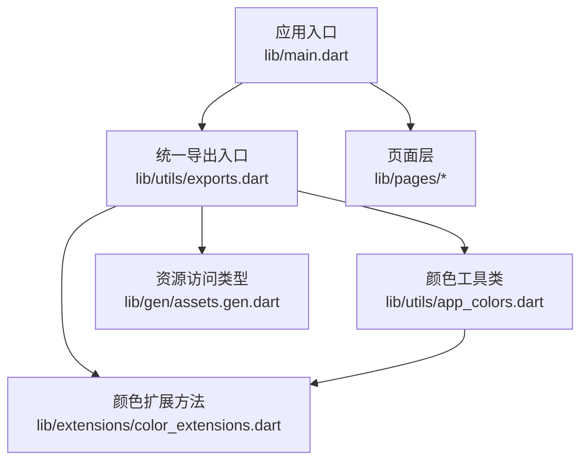
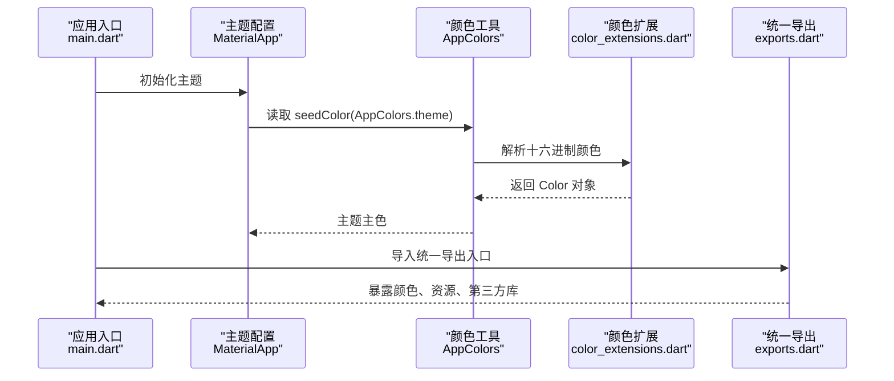
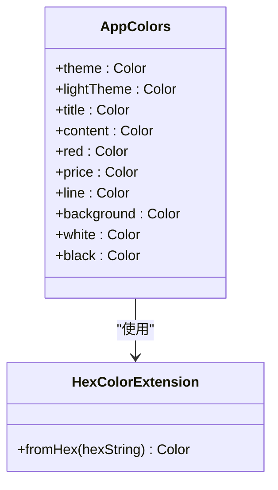
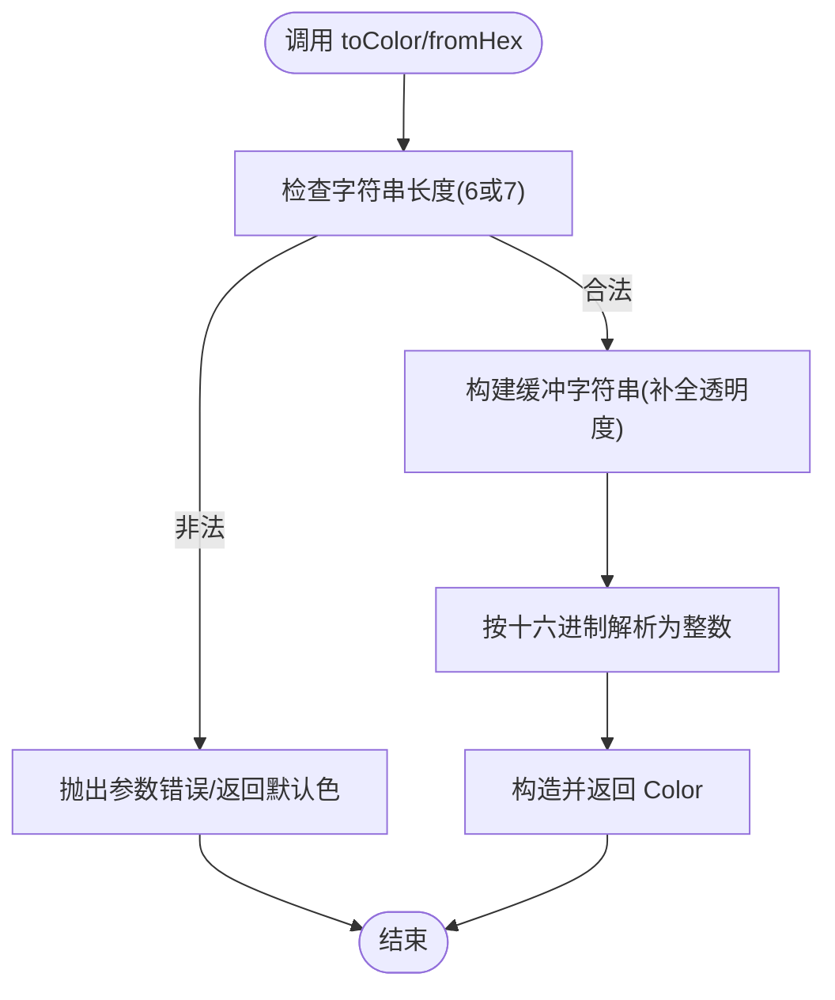
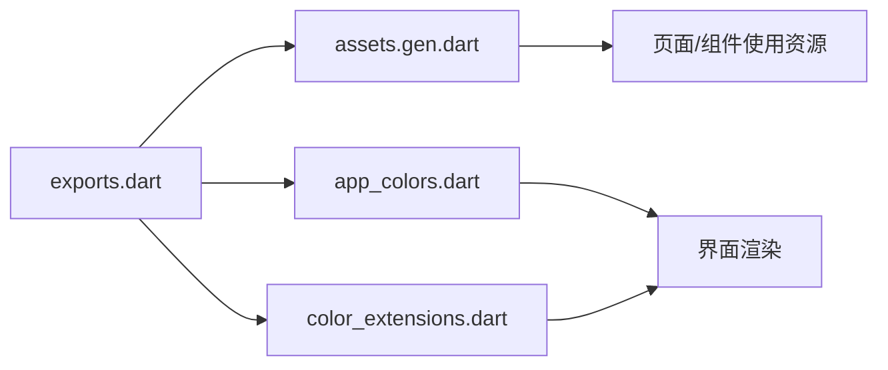
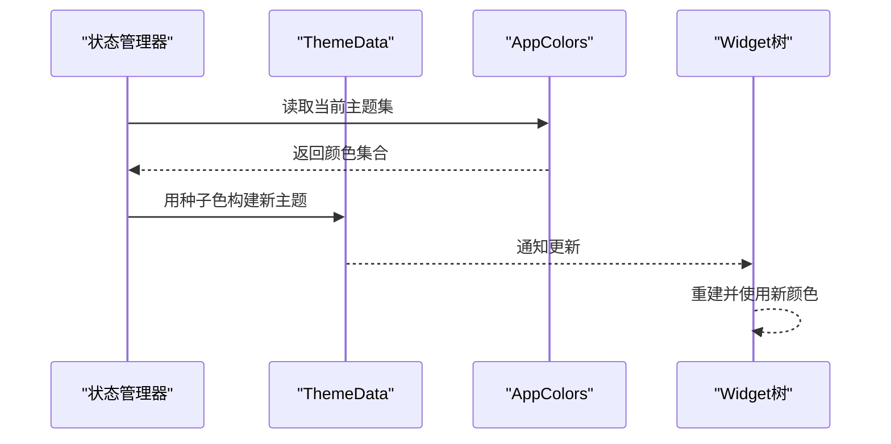
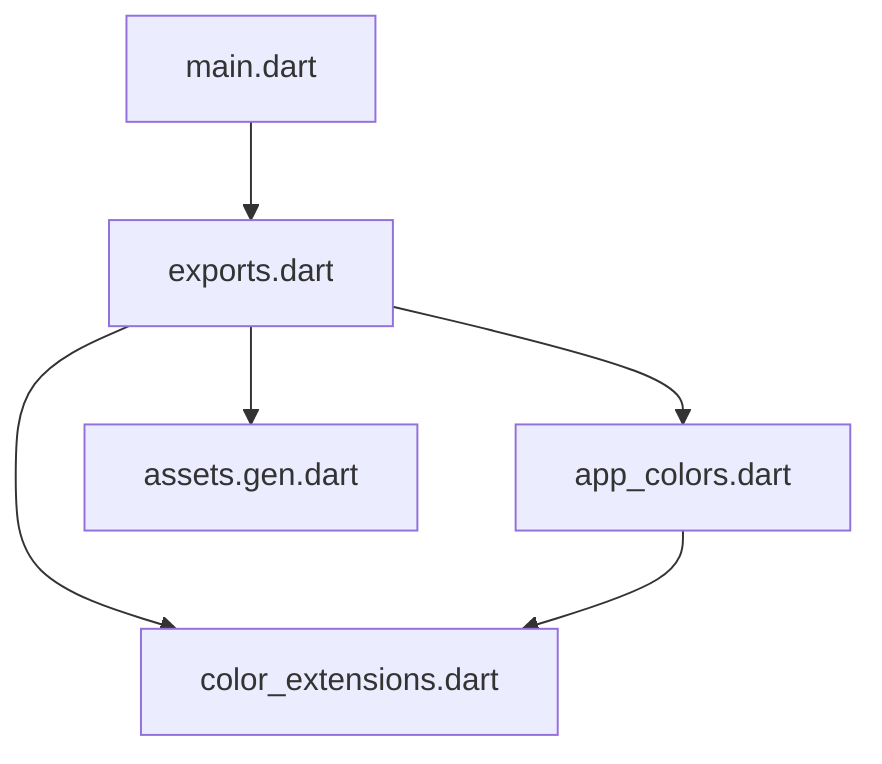

# 工具系统

<cite>
**本文引用的文件**
- [lib/main.dart](file://lib/main.dart)
- [lib/utils/app_colors.dart](file://lib/utils/app_colors.dart)
- [lib/extensions/color_extensions.dart](file://lib/extensions/color_extensions.dart)
- [lib/utils/exports.dart](file://lib/utils/exports.dart)
- [lib/gen/assets.gen.dart](file://lib/gen/assets.gen.dart)
</cite>

## 目录
1. [简介](#简介)
2. [项目结构](#项目结构)
3. [核心组件](#核心组件)
4. [架构总览](#架构总览)
5. [详细组件分析](#详细组件分析)
6. [依赖关系分析](#依赖关系分析)
7. [性能考虑](#性能考虑)
8. [故障排查指南](#故障排查指南)
9. [结论](#结论)
10. [附录](#附录)

## 简介
本文件面向开发者，系统化说明本项目中的“工具系统”，重点覆盖：
- 颜色管理系统：AppColors 的颜色定义、主题配置与可扩展的动态切换思路
- Dart 扩展方法：color_extensions.dart 提供的 Color 扩展能力
- 资源导出机制：通过 exports.dart 统一管理模块导出接口
- 工具类设计原则与使用规范
- 自定义工具开发指南与最佳实践、性能优化建议

## 项目结构
工具系统主要分布在以下位置：
- lib/utils：集中存放颜色工具与统一导出入口
- lib/extensions：提供 Dart 扩展方法（如 Color 扩展）
- lib/gen：由代码生成工具产出的资源访问类型（图片、SVG 等）
- lib/main.dart：应用启动并注入主题色

图表来源
- [lib/main.dart:1-23](file://lib/main.dart#L1-L23)
- [lib/utils/exports.dart:1-5](file://lib/utils/exports.dart#L1-L5)
- [lib/utils/app_colors.dart:1-27](file://lib/utils/app_colors.dart#L1-L27)
- [lib/extensions/color_extensions.dart:1-21](file://lib/extensions/color_extensions.dart#L1-L21)
- [lib/gen/assets.gen.dart:1-234](file://lib/gen/assets.gen.dart#L1-L234)

章节来源
- [lib/main.dart:1-23](file://lib/main.dart#L1-L23)
- [lib/utils/exports.dart:1-5](file://lib/utils/exports.dart#L1-L5)

## 核心组件
- AppColors：集中管理应用色板，提供主题主色、标题色、内容色、背景色等常用颜色常量。所有颜色均通过 HexColor.fromHex 解析，便于统一格式与透明度处理。
- color_extensions.dart：为 Color 和 String 提供扩展方法，支持从十六进制字符串创建 Color，以及将字符串直接转换为 Color。
- exports.dart：作为工具层的统一出口，聚合导出第三方库（如 flutter_svg）、生成的资源访问类型（assets.gen.dart）、颜色工具与颜色扩展，降低上层模块的导入成本。
- assets.gen.dart：由 FlutterGen 生成的资源访问封装，提供类型安全的图片/SVG 访问方式，简化资源引用。

章节来源
- [lib/utils/app_colors.dart:1-27](file://lib/utils/app_colors.dart#L1-L27)
- [lib/extensions/color_extensions.dart:1-21](file://lib/extensions/color_extensions.dart#L1-L21)
- [lib/utils/exports.dart:1-5](file://lib/utils/exports.dart#L1-L5)
- [lib/gen/assets.gen.dart:1-234](file://lib/gen/assets.gen.dart#L1-L234)

## 架构总览
应用启动时通过 MaterialApp 设置主题色，种子色来自 AppColors.theme；业务页面通过统一导出入口获取颜色与资源，保证风格一致性与可维护性。

图表来源
- [lib/main.dart:14-19](file://lib/main.dart#L14-L19)
- [lib/utils/app_colors.dart:5-8](file://lib/utils/app_colors.dart#L5-L8)
- [lib/extensions/color_extensions.dart:4-13](file://lib/extensions/color_extensions.dart#L4-L13)
- [lib/utils/exports.dart:1-5](file://lib/utils/exports.dart#L1-L5)

## 详细组件分析

### 颜色管理系统（AppColors）
- 设计要点
  - 单一职责：集中管理颜色常量，避免散落各处导致不一致
  - 统一解析：所有颜色通过 HexColor.fromHex 解析，确保格式一致与透明度默认值正确
  - 可扩展：新增颜色只需在 AppColors 中添加静态字段，无需改动调用方
- 主题集成
  - 应用启动时将 AppColors.theme 作为 ColorScheme 的种子色，自动派生 primary、secondary、surface 等衍生色
- 动态切换思路（建议）
  - 将 AppColors 中的颜色改为响应式状态（如通过 Provider/Riverpod/Bloc），在运行时切换主题集合
  - 结合 Theme.of(context).copyWith(colorScheme: ...) 实现全局刷新
  - 持久化用户偏好（如浅色/深色模式）并在应用启动时恢复

图表来源
- [lib/utils/app_colors.dart:5-27](file://lib/utils/app_colors.dart#L5-L27)
- [lib/extensions/color_extensions.dart:4-13](file://lib/extensions/color_extensions.dart#L4-L13)

章节来源
- [lib/utils/app_colors.dart:1-27](file://lib/utils/app_colors.dart#L1-L27)
- [lib/main.dart:14-19](file://lib/main.dart#L14-L19)

### Dart 扩展方法（color_extensions.dart）
- 功能说明
  - HexColor.fromHex：从十六进制字符串创建 Color，兼容带/不带 # 前缀，长度 6 或 7 位，缺失透明度时默认不透明
  - String.toColor：便捷地将字符串转为 Color，内部委托给 HexColor.fromHex
- 复杂度与健壮性
  - 时间复杂度 O(n)，n 为字符串长度
  - 输入校验：当前实现未对非法字符做严格校验，建议在调用处或扩展中增加异常提示或容错策略
- 使用建议
  - 在颜色常量定义处统一使用该扩展，避免重复逻辑
  - 对外暴露的 API 应做好入参校验与错误提示

图表来源
- [lib/extensions/color_extensions.dart:4-21](file://lib/extensions/color_extensions.dart#L4-L21)

章节来源
- [lib/extensions/color_extensions.dart:1-21](file://lib/extensions/color_extensions.dart#L1-L21)

### 资源导出机制（exports.dart 与 assets.gen.dart）
- 统一导出
  - exports.dart 聚合导出 flutter_svg、生成的资源访问类型、颜色工具与颜色扩展，使上层模块仅需一次导入即可使用
- 资源访问
  - assets.gen.dart 提供 Assets.images.* 等类型安全访问器，支持图片与 SVG，减少硬编码路径带来的错误
- 使用示例（路径引用）
  - 图片：Assets.images.appLogo1024.image(...)
  - SVG：Assets.images.tabbar.tabbarHight01.svg(...)

图表来源
- [lib/utils/exports.dart:1-5](file://lib/utils/exports.dart#L1-L5)
- [lib/gen/assets.gen.dart:17-71](file://lib/gen/assets.gen.dart#L17-L71)
- [lib/gen/assets.gen.dart:73-147](file://lib/gen/assets.gen.dart#L73-L147)
- [lib/gen/assets.gen.dart:161-233](file://lib/gen/assets.gen.dart#L161-L233)

章节来源
- [lib/utils/exports.dart:1-5](file://lib/utils/exports.dart#L1-L5)
- [lib/gen/assets.gen.dart:1-234](file://lib/gen/assets.gen.dart#L1-L234)

### 主题配置与动态切换（基于现有代码的演进建议）
- 现状
  - 应用通过 ColorScheme.fromSeed(seedColor: AppColors.theme) 设置主题种子色
- 演进建议
  - 将 AppColors 抽象为可替换的主题集（如 Light/Dark），通过状态管理在运行时切换
  - 在切换时重建 ThemeData，触发全局重绘
  - 结合系统主题（亮/暗模式）自动选择主题集

图表来源
- [lib/main.dart:14-19](file://lib/main.dart#L14-L19)
- [lib/utils/app_colors.dart:5-8](file://lib/utils/app_colors.dart#L5-L8)

章节来源
- [lib/main.dart:14-19](file://lib/main.dart#L14-L19)
- [lib/utils/app_colors.dart:1-27](file://lib/utils/app_colors.dart#L1-L27)

## 依赖关系分析
- 模块耦合
  - main.dart 依赖 exports.dart 以获取工具能力
  - app_colors.dart 依赖 color_extensions.dart 进行颜色解析
  - exports.dart 聚合导出多个模块，降低上层耦合度
- 外部依赖
  - flutter_svg：用于 SVG 资源展示
  - FlutterGen 生成的 assets.gen.dart：类型安全的资源访问

图表来源
- [lib/main.dart:1-3](file://lib/main.dart#L1-L3)
- [lib/utils/exports.dart:1-5](file://lib/utils/exports.dart#L1-L5)
- [lib/utils/app_colors.dart:1-2](file://lib/utils/app_colors.dart#L1-L2)
- [lib/extensions/color_extensions.dart:1-1](file://lib/extensions/color_extensions.dart#L1-L1)
- [lib/gen/assets.gen.dart:12-15](file://lib/gen/assets.gen.dart#L12-L15)

章节来源
- [lib/main.dart:1-3](file://lib/main.dart#L1-L3)
- [lib/utils/exports.dart:1-5](file://lib/utils/exports.dart#L1-L5)

## 性能考虑
- 颜色解析
  - HexColor.fromHex 每次调用都会进行字符串处理与整型解析，建议在常量定义阶段完成解析（当前已如此），避免在高频渲染路径中重复解析
- 主题切换
  - 切换主题会触发 Widget 树重建，建议仅在必要时切换，并结合局部 rebuild 或状态提升减少不必要的重建
- 资源加载
  - 使用 assets.gen.dart 的类型安全访问可减少路径错误导致的运行时开销
  - 对于大图片或复杂 SVG，注意缓存与按需加载，避免首屏卡顿

## 故障排查指南
- 颜色显示异常
  - 检查传入的十六进制字符串是否为 6 或 7 位，是否包含合法的十六进制字符
  - 若需透明度，请确保传入 8 位格式或在扩展中补充透明度逻辑
- 主题未生效
  - 确认 MaterialApp 的 theme 是否正确设置了 ColorScheme.fromSeed
  - 若实现动态切换，确保状态变更后触发了 ThemeData 的重建
- 资源无法加载
  - 确认 assets.gen.dart 已正确生成且资源路径存在
  - 检查 pubspec.yaml 中 assets 声明是否完整

章节来源
- [lib/extensions/color_extensions.dart:4-21](file://lib/extensions/color_extensions.dart#L4-L21)
- [lib/main.dart:14-19](file://lib/main.dart#L14-L19)
- [lib/gen/assets.gen.dart:17-71](file://lib/gen/assets.gen.dart#L17-L71)

## 结论
本项目通过 AppColors 集中管理颜色，借助 color_extensions.dart 提供统一的颜色解析能力，并通过 exports.dart 统一导出工具与资源访问类型，形成清晰、易维护的工具体系。在此基础上，可通过状态管理实现主题动态切换，进一步提升用户体验与可配置性。遵循本文的设计原则与最佳实践，可在保证性能的同时快速扩展工具能力。

## 附录

### 工具类设计原则与使用规范
- 单一职责：每个工具类只负责一个领域（如颜色、资源、网络）
- 集中管理：通过统一导出入口暴露能力，降低模块间耦合
- 不可变常量：颜色等静态资源以常量形式定义，避免运行时修改
- 扩展优先：优先使用 Dart 扩展方法增强现有类型能力，保持调用简洁

### 自定义工具开发指南
- 新增颜色
  - 在 AppColors 中添加新的静态 Color 字段，使用 HexColor.fromHex 解析
- 新增扩展方法
  - 在 extensions 目录下新增扩展文件，命名清晰，职责单一
  - 在 exports.dart 中导出新扩展，供全局使用
- 新增资源访问
  - 将资源放入 assets 目录，运行代码生成后通过 assets.gen.dart 访问
  - 如需统一入口，可在 exports.dart 中再次导出

### 最佳实践与性能优化技巧
- 避免在 build 中执行耗时计算，将结果缓存到 State 或 Provider
- 合理使用 const 构造与不可变数据，减少重建
- 对频繁调用的工具函数进行基准测试，识别热点并优化
- 使用类型安全的资源访问，减少运行时错误