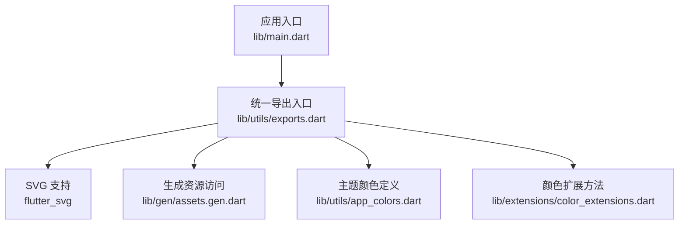
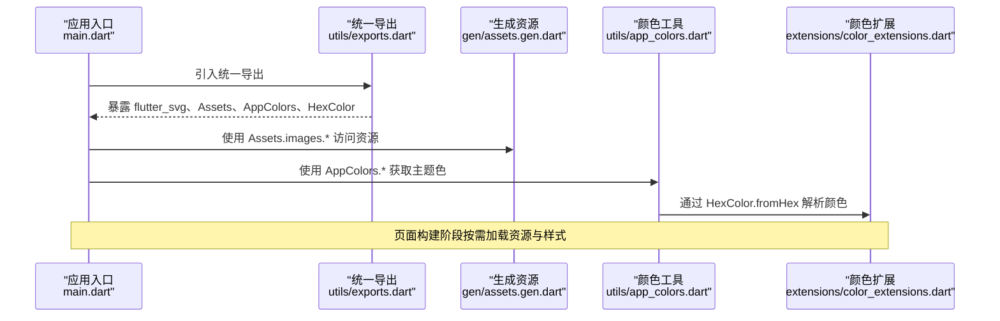
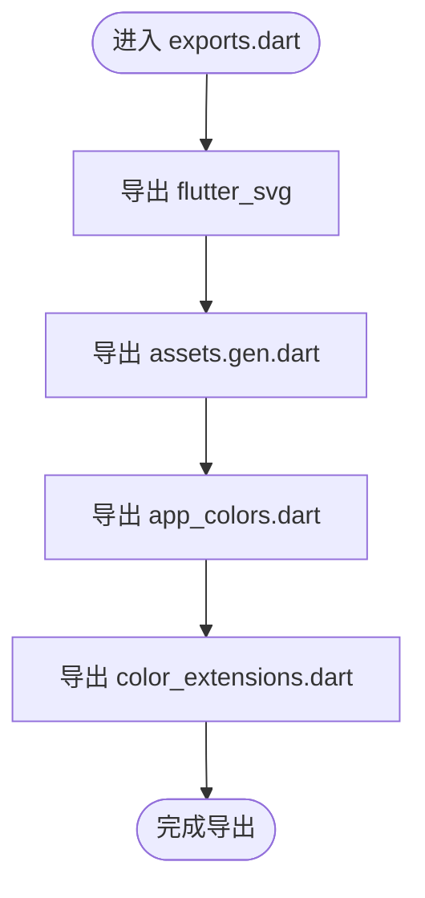
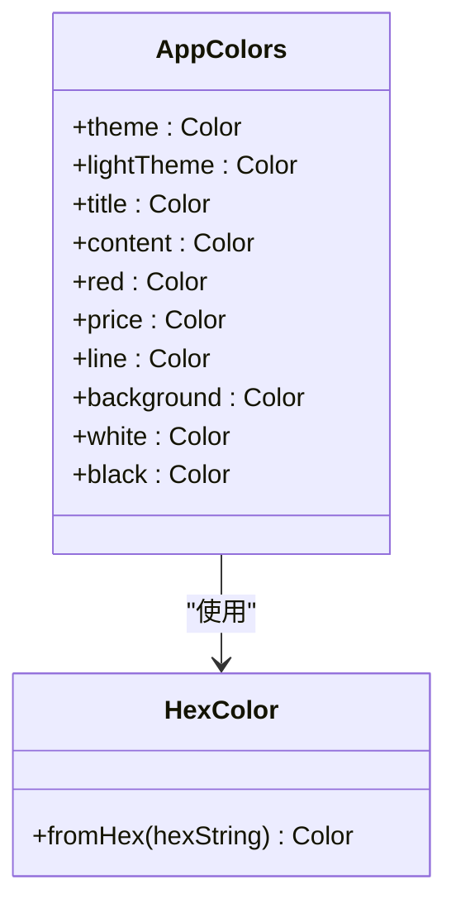
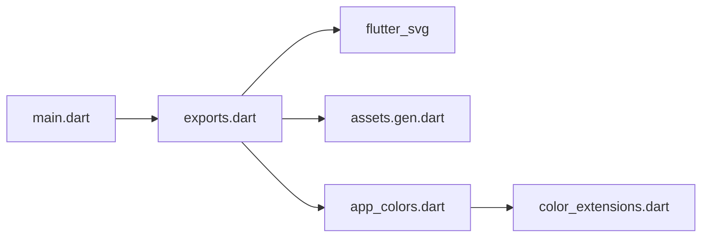

# 资源导出机制

<cite>
**本文引用的文件**
- [lib/utils/exports.dart](file://lib/utils/exports.dart)
- [lib/main.dart](file://lib/main.dart)
- [lib/utils/app_colors.dart](file://lib/utils/app_colors.dart)
- [lib/extensions/color_extensions.dart](file://lib/extensions/color_extensions.dart)
- [lib/gen/assets.gen.dart](file://lib/gen/assets.gen.dart)
- [flutter_gen.yaml](file://flutter_gen.yaml)
</cite>

## 更新摘要
**所做更改**
- 更新了Tab栏资源命名约定的说明，从带零填充的编号标准化为简单顺序编号
- 修正了assets.gen.dart中Tab栏资产属性的示例代码
- 更新了相关图表和代码示例以反映最新的命名规范
- 增强了资源管理最佳实践部分，包含命名规范的指导

## 目录
1. [简介](#简介)
2. [项目结构](#项目结构)
3. [核心组件](#核心组件)
4. [架构总览](#架构总览)
5. [详细组件分析](#详细组件分析)
6. [依赖关系分析](#依赖关系分析)
7. [性能与可维护性考虑](#性能与可维护性考虑)
8. [故障排查指南](#故障排查指南)
9. [结论](#结论)
10. [附录：最佳实践与示例](#附录最佳实践与示例)

## 简介
本文件围绕 Flutter 项目的"资源导出机制"展开，重点解释 lib/utils/exports.dart 的模块统一导出设计，以及如何通过该出口集中管理页面组件、工具类、服务接口等公共 API。当前仓库中 exports.dart 主要承担"工具与资源"的统一再导出职责，包括 SVG 支持、生成型资源访问（Assets）、主题颜色定义与扩展方法等。通过单一入口导出，可以显著简化导入语句、提升代码组织性与可维护性，并为后续扩展至更多模块（如 pages、services）奠定基础。

**更新** Tab栏资源命名已标准化为简单顺序编号，提升了资源引用的一致性和可读性。

## 项目结构
本项目采用按功能域划分的目录组织方式：
- lib/pages：页面组件
- lib/services：服务层（当前为空目录，便于后续扩展）
- lib/widgets：通用 UI 组件（当前为空目录，便于后续扩展）
- lib/utils：工具与配置（包含颜色、导出入口等）
- lib/extensions：Dart 扩展（如颜色转换）
- lib/gen：由 flutter_gen 生成的资源访问代码（assets.gen.dart）
- lib/main.dart：应用入口，演示如何从统一导出入口引入所需能力



**图表来源**
- [lib/main.dart:1-23](file://lib/main.dart#L1-L23)
- [lib/utils/exports.dart:1-5](file://lib/utils/exports.dart#L1-L5)
- [lib/gen/assets.gen.dart:1-72](file://lib/gen/assets.gen.dart#L1-L72)
- [lib/utils/app_colors.dart:1-27](file://lib/utils/app_colors.dart#L1-L27)
- [lib/extensions/color_extensions.dart:1-21](file://lib/extensions/color_extensions.dart#L1-L21)

**章节来源**
- [lib/main.dart:1-23](file://lib/main.dart#L1-L23)
- [lib/utils/exports.dart:1-5](file://lib/utils/exports.dart#L1-L5)

## 核心组件
- 统一导出入口（exports.dart）
  - 作用：将第三方库（flutter_svg）、生成资源（assets.gen.dart）、主题颜色（app_colors.dart）、颜色扩展（color_extensions.dart）集中导出，供其他模块以统一路径引用。
  - 优势：减少重复 import；屏蔽内部实现细节；便于统一管理版本与替换实现。
- 生成资源访问（assets.gen.dart）
  - 由 flutter_gen 根据 assets/images 自动生成类型安全的资源访问器，提供图片与 SVG 的便捷调用方式。
  - 配置位于 flutter_gen.yaml，指定输出目录与集成选项。
  - **更新** Tab栏资源已采用简化的顺序编号命名（tabbarHight1, tabbarNormal2），提升了命名一致性。
- 主题颜色（app_colors.dart）
  - 集中管理应用色板，使用 HexColor 扩展进行十六进制到 Color 的转换。
- 颜色扩展（color_extensions.dart）
  - 为 Color 与 String 提供便捷的十六进制转换方法，提高可读性与复用性。

**章节来源**
- [lib/utils/exports.dart:1-5](file://lib/utils/exports.dart#L1-L5)
- [lib/gen/assets.gen.dart:1-72](file://lib/gen/assets.gen.dart#L1-L72)
- [flutter_gen.yaml:1-3](file://flutter_gen.yaml#L1-L3)
- [lib/utils/app_colors.dart:1-27](file://lib/utils/app_colors.dart#L1-L27)
- [lib/extensions/color_extensions.dart:1-21](file://lib/extensions/color_extensions.dart#L1-L21)

## 架构总览
下图展示了应用启动时如何通过统一导出入口获取资源与工具能力，并在页面中使用。



**图表来源**
- [lib/main.dart:1-23](file://lib/main.dart#L1-L23)
- [lib/utils/exports.dart:1-5](file://lib/utils/exports.dart#L1-L5)
- [lib/gen/assets.gen.dart:1-72](file://lib/gen/assets.gen.dart#L1-L72)
- [lib/utils/app_colors.dart:1-27](file://lib/utils/app_colors.dart#L1-L27)
- [lib/extensions/color_extensions.dart:1-21](file://lib/extensions/color_extensions.dart#L1-L21)

## 详细组件分析

### 统一导出入口（exports.dart）
- 设计模式：门面（Facade）式再导出。对外仅暴露必要符号，对内保持模块解耦。
- 当前导出范围：
  - flutter_svg：提供 SVG 渲染能力
  - assets.gen.dart：类型安全的资源访问
  - app_colors.dart：主题色集合
  - color_extensions.dart：颜色转换扩展
- 可扩展方向：
  - 新增 pages、services、widgets 的聚合导出，形成"应用级 API 表面"
  - 按功能域拆分多个子导出文件（如 utils_exports.dart、pages_exports.dart），再由根 exports.dart 聚合



**图表来源**
- [lib/utils/exports.dart:1-5](file://lib/utils/exports.dart#L1-L5)

**章节来源**
- [lib/utils/exports.dart:1-5](file://lib/utils/exports.dart#L1-L5)

### 生成资源访问（assets.gen.dart）
- 由 flutter_gen 自动生成，提供 Assets.images.* 等命名空间化的资源访问器。
- 优点：编译期检查资源键名；避免硬编码字符串导致的运行时错误；统一资源访问风格。
- 配置：flutter_gen.yaml 指定输出目录与 flutter_svg 集成。
- **更新** Tab栏资源命名已标准化：
  - 高亮状态：`tabbarHight1`, `tabbarHight2`, `tabbarHight3`
  - 正常状态：`tabbarNormal1`, `tabbarNormal2`, `tabbarNormal3`
  - 移除了之前的零填充格式（如 `tabbarHight01`, `tabbarNormal02`）

```mermaid
classDiagram
class Assets {
+images : $AssetsImagesGen
}
class $AssetsImagesGen {
+appLogo1024 : AssetGenImage
+tabbar : $AssetsImagesTabbarGen
+values : AssetGenImage[]
}
class $AssetsImagesTabbarGen {
+tabbarHight1 : SvgGenImage
+tabbarHight2 : SvgGenImage
+tabbarHight3 : SvgGenImage
+tabbarNormal1 : SvgGenImage
+tabbarNormal2 : SvgGenImage
+tabbarNormal3 : SvgGenImage
+values : SvgGenImage[]
}
Assets --> "$AssetsImagesGen" : "images"
$AssetsImagesGen --> "$AssetsImagesTabbarGen" : "tabbar"
```

**图表来源**
- [lib/gen/assets.gen.dart:17-71](file://lib/gen/assets.gen.dart#L17-L71)

**章节来源**
- [lib/gen/assets.gen.dart:1-234](file://lib/gen/assets.gen.dart#L1-L234)
- [flutter_gen.yaml:1-3](file://flutter_gen.yaml#L1-L3)

### 主题颜色与扩展（app_colors.dart 与 color_extensions.dart）
- app_colors.dart：集中定义主题色板，便于全局一致性与换肤。
- color_extensions.dart：提供 HexColor.fromHex 与 String.toColor，简化颜色创建。
- 组合效果：在 exports.dart 中一并导出，使上层模块无需关心具体实现位置。



**图表来源**
- [lib/utils/app_colors.dart:1-27](file://lib/utils/app_colors.dart#L1-L27)
- [lib/extensions/color_extensions.dart:1-21](file://lib/extensions/color_extensions.dart#L1-L21)

**章节来源**
- [lib/utils/app_colors.dart:1-27](file://lib/utils/app_colors.dart#L1-L27)
- [lib/extensions/color_extensions.dart:1-21](file://lib/extensions/color_extensions.dart#L1-L21)

## 依赖关系分析
- main.dart 通过统一导出入口引入所需能力，降低对底层实现的直接耦合。
- exports.dart 作为门面，聚合第三方库、生成资源、工具与扩展。
- assets.gen.dart 依赖 flutter_svg 与 vector_graphics（由 flutter_gen 集成）。
- app_colors.dart 依赖 color_extensions.dart 提供的颜色转换能力。



**图表来源**
- [lib/main.dart:1-23](file://lib/main.dart#L1-L23)
- [lib/utils/exports.dart:1-5](file://lib/utils/exports.dart#L1-L5)
- [lib/gen/assets.gen.dart:1-72](file://lib/gen/assets.gen.dart#L1-L72)
- [lib/utils/app_colors.dart:1-27](file://lib/utils/app_colors.dart#L1-L27)
- [lib/extensions/color_extensions.dart:1-21](file://lib/extensions/color_extensions.dart#L1-L21)

**章节来源**
- [lib/main.dart:1-23](file://lib/main.dart#L1-L23)
- [lib/utils/exports.dart:1-5](file://lib/utils/exports.dart#L1-L5)

## 性能与可维护性考虑
- 启动与加载
  - 资源访问通过生成代码进行，避免运行时反射或动态查找开销。
  - 仅在需要时构造 Widget 并加载资源，避免不必要的初始化。
- 可维护性
  - 通过统一导出入口集中管理依赖与 API 表面，便于版本升级与替换实现。
  - 颜色与资源集中管理，减少散落的全局常量与硬编码字符串。
  - **更新** 简化的资源命名减少了混淆，提高了代码可读性。
- 可扩展性
  - 可按功能域拆分导出文件，再由根 exports.dart 聚合，保持清晰边界。
  - 未来可在 services 与 widgets 中继续扩展导出，形成完整的应用级 API。

## 故障排查指南
- 资源未生效或找不到
  - 确认 flutter_gen 已正确运行且输出目录为 lib/gen/（见 flutter_gen.yaml）。
  - 确保 assets 目录结构与生成代码一致。
  - **更新** 检查资源命名是否遵循新的简化格式（如 `tabbarHight1` 而非 `tabbarHight01`）。
- 颜色显示异常
  - 检查 HexColor.fromHex 的输入格式是否合法（支持带或不带 # 的十六进制）。
  - 确认 AppColors 中的颜色值是否正确设置。
- 循环依赖风险
  - 当前 exports.dart 仅做再导出，无业务逻辑，不易产生循环依赖。
  - 若后续在导出文件中加入业务逻辑，需避免被导出的模块反向依赖导出入口。

**章节来源**
- [flutter_gen.yaml:1-3](file://flutter_gen.yaml#L1-L3)
- [lib/extensions/color_extensions.dart:1-21](file://lib/extensions/color_extensions.dart#L1-L21)
- [lib/utils/app_colors.dart:1-27](file://lib/utils/app_colors.dart#L1-L27)

## 结论
通过 lib/utils/exports.dart 的统一导出机制，本项目实现了资源与工具的集中管理与简洁引用。结合 flutter_gen 的类型安全资源访问与集中的主题颜色管理，有效提升了代码的组织性与可维护性。**更新后的Tab栏资源命名规范进一步简化了资源引用，提高了代码的可读性和一致性。** 建议在未来逐步将 pages、services、widgets 的公共 API 也纳入统一的导出体系，进一步收敛依赖边界，降低模块间耦合度。

## 附录：最佳实践与示例

- 命名规范
  - 导出文件命名：exports.dart（根级聚合）、*_exports.dart（按功能域细分）
  - 导出符号命名：遵循 Dart 约定，类名大驼峰，方法与变量小驼峰
  - 资源访问：使用 Assets.images.* 等生成命名空间，避免硬编码字符串
  - **更新** Tab栏资源命名：采用简单顺序编号（tabbarHight1, tabbarNormal2），避免零填充格式
- 版本控制与向后兼容
  - 在导出入口中集中管理依赖版本，升级时仅需修改一处
  - 对导出 API 进行语义化版本管理，废弃旧接口时使用 @Deprecated 并提供迁移指引
  - **更新** 资源命名变更是破坏性变更，需要在项目中全面更新资源引用
- 循环依赖处理
  - 导出文件只做再导出，不包含业务逻辑
  - 若必须引入业务逻辑，请将其下沉到独立模块，并由导出入口聚合
- 在不同模块间正确使用导出接口
  - 页面模块：通过统一导出入口引入颜色与资源，避免直接依赖内部实现
  - 服务模块：如需暴露给 UI，建议在 services 内定义接口并通过导出入口聚合
  - 组件模块：在 widgets 中复用通用 UI，并通过导出入口暴露必要 API
- 实际使用场景（基于现有代码）
  - 应用入口通过统一导出入口引入主题与资源，构建 Material 应用
  - 页面中使用生成资源访问器与主题色，保证视觉一致性
  - **更新** 使用新的Tab栏资源命名：`Assets.images.tabbar.tabbarHight1.svg()` 而非旧的 `tabbarHight01`

**章节来源**
- [lib/main.dart:1-23](file://lib/main.dart#L1-L23)
- [lib/utils/exports.dart:1-5](file://lib/utils/exports.dart#L1-L5)
- [lib/gen/assets.gen.dart:1-72](file://lib/gen/assets.gen.dart#L1-L72)
- [lib/utils/app_colors.dart:1-27](file://lib/utils/app_colors.dart#L1-L27)
- [lib/extensions/color_extensions.dart:1-21](file://lib/extensions/color_extensions.dart#L1-L21)