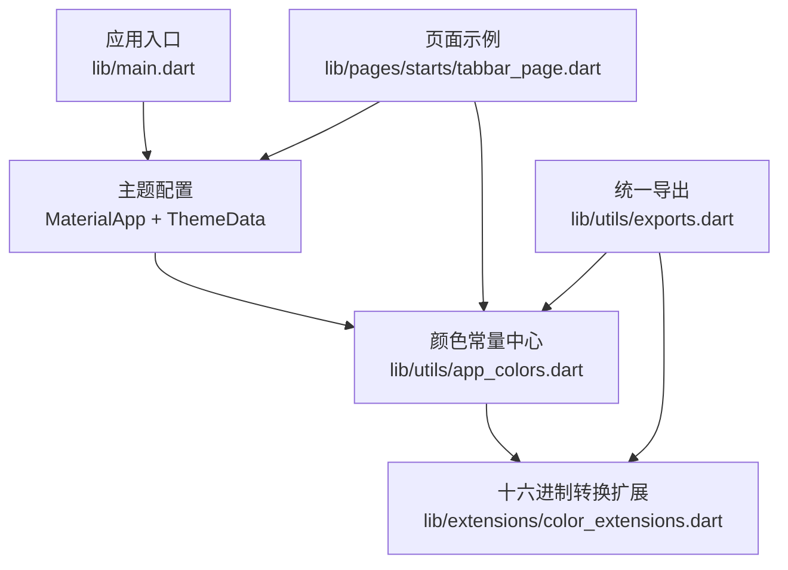
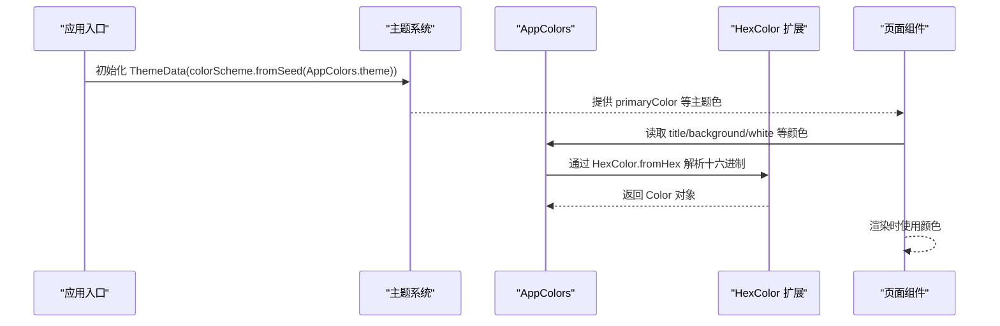
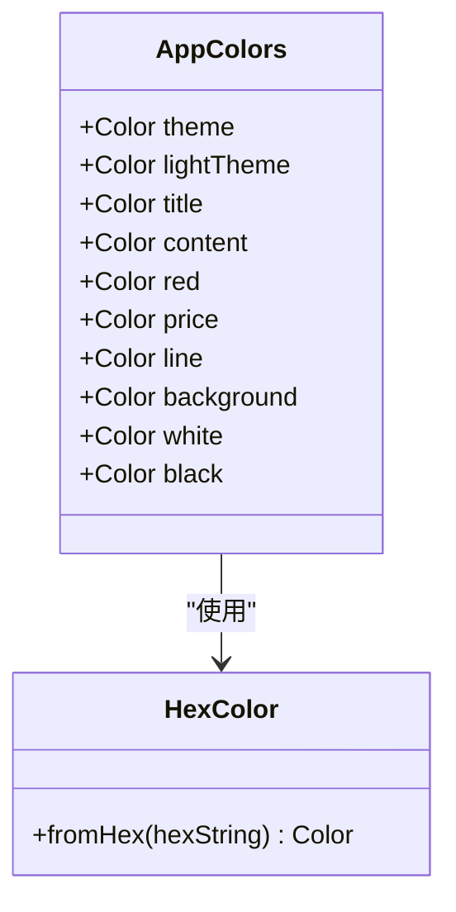
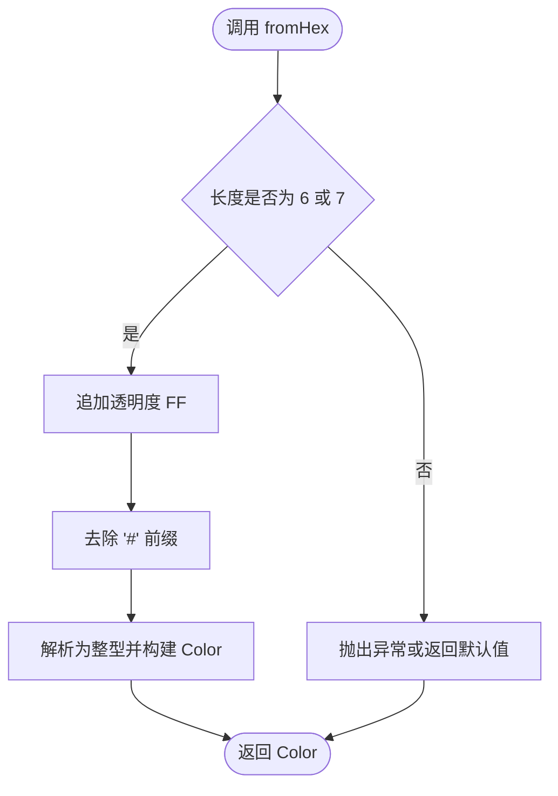
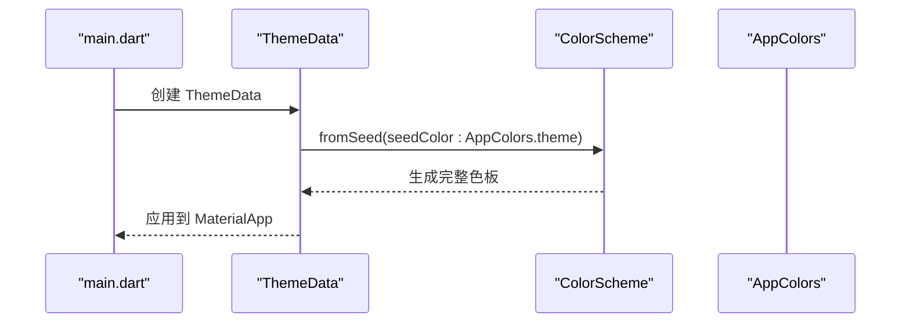
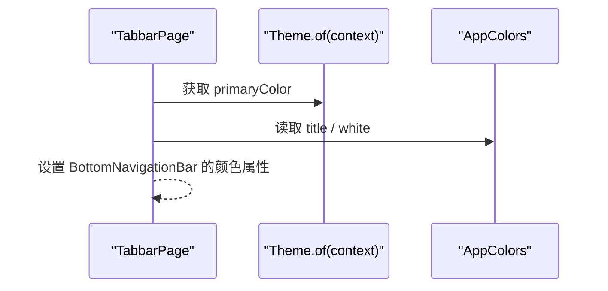
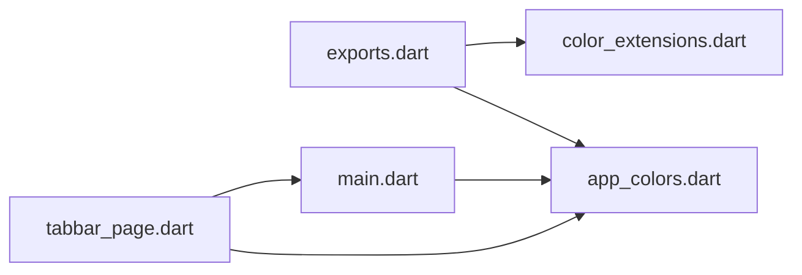

# 颜色管理系统

<cite>
**本文引用的文件**
- [lib/utils/app_colors.dart](file://lib/utils/app_colors.dart)
- [lib/extensions/color_extensions.dart](file://lib/extensions/color_extensions.dart)
- [lib/main.dart](file://lib/main.dart)
- [lib/pages/starts/tabbar_page.dart](file://lib/pages/starts/tabbar_page.dart)
- [lib/utils/exports.dart](file://lib/utils/exports.dart)
</cite>

## 更新摘要
**变更内容**
- 更新了 HexColor 扩展方法的描述，明确当前实现仅包含 `fromHex` 静态方法和 `toColor` 字符串扩展方法
- 移除了对已删除的 `toHex()` 方法的引用
- 强调了颜色系统现在主要依赖 `HexColor.fromHex` 进行十六进制转换
- 更新了相关的使用示例和最佳实践

## 目录
1. [简介](#简介)
2. [项目结构](#项目结构)
3. [核心组件](#核心组件)
4. [架构总览](#架构总览)
5. [详细组件分析](#详细组件分析)
6. [依赖关系分析](#依赖关系分析)
7. [性能考虑](#性能考虑)
8. [故障排查指南](#故障排查指南)
9. [结论](#结论)
10. [附录](#附录)

## 简介
本文件系统性地梳理并文档化颜色管理方案，围绕 AppColors 类的设计理念与实现、HexColor 扩展方法的使用、颜色值的统一管理方式展开。同时说明主题色（theme）、浅色主题（lightTheme）、标题色（title）、内容色（content）、强调色（red）、价格色（price）、线条色（line）、背景色（background）等颜色类型的用途，以及颜色系统如何与 Flutter 主题系统集成，并通过 HexColor.fromHex 完成十六进制到 Color 的转换。文末提供颜色自定义与扩展的最佳实践、实际使用示例与性能优化建议。

**更新** 当前实现已简化，移除了冗余的 toHex() 方法，专注于核心的 fromHex 转换功能，提供更清晰的颜色处理接口。

## 项目结构
颜色相关代码集中在 utils 与 extensions 两个目录：
- lib/utils/app_colors.dart：集中定义所有颜色常量，统一入口，便于维护与复用。
- lib/extensions/color_extensions.dart：提供 HexColor 扩展方法与字符串转颜色的便捷方法。
- lib/main.dart：在应用启动时通过 ThemeData 将主色注入主题体系。
- lib/pages/starts/tabbar_page.dart：展示如何在 UI 中使用 AppColors 与主题色。
- lib/utils/exports.dart：统一导出工具类，简化上层导入。

**图表来源**
- [lib/main.dart:14-19](file://lib/main.dart#L14-L19)
- [lib/utils/app_colors.dart:5-27](file://lib/utils/app_colors.dart#L5-L27)
- [lib/extensions/color_extensions.dart:4-21](file://lib/extensions/color_extensions.dart#L4-L21)
- [lib/pages/starts/tabbar_page.dart:56-78](file://lib/pages/starts/tabbar_page.dart#L56-L78)
- [lib/utils/exports.dart:1-5](file://lib/utils/exports.dart#L1-L5)

**章节来源**
- [lib/main.dart:14-19](file://lib/main.dart#L14-L19)
- [lib/utils/app_colors.dart:5-27](file://lib/utils/app_colors.dart#L5-L27)
- [lib/extensions/color_extensions.dart:4-21](file://lib/extensions/color_extensions.dart#L4-L21)
- [lib/pages/starts/tabbar_page.dart:56-78](file://lib/pages/starts/tabbar_page.dart#L56-L78)
- [lib/utils/exports.dart:1-5](file://lib/utils/exports.dart#L1-L5)

## 核心组件
- AppColors：静态颜色常量集合，封装主题色、辅助色、中性色等，作为全局颜色唯一来源。
- HexColor 扩展：提供 fromHex 静态方法，支持 #RGB、#RRGGBB 格式，自动补全透明度为不透明；并提供 String 的 toColor 便捷方法。
- 主题集成：在 MaterialApp 中通过 ColorScheme.fromSeed(seedColor: AppColors.theme) 将主色注入主题体系，使 Theme.of(context).primaryColor 与应用主色一致。

**更新** 当前实现专注于核心的十六进制转换功能，移除了冗余的方法，提供更简洁的 API 接口。

**章节来源**
- [lib/utils/app_colors.dart:5-27](file://lib/utils/app_colors.dart#L5-L27)
- [lib/extensions/color_extensions.dart:4-21](file://lib/extensions/color_extensions.dart#L4-L21)
- [lib/main.dart:14-19](file://lib/main.dart#L14-L19)

## 架构总览
颜色系统的职责边界清晰：
- 数据层：AppColors 提供不可变的静态 Color 常量。
- 工具层：HexColor 扩展负责十六进制解析与转换。
- 主题层：MaterialApp 通过 ColorScheme.fromSeed 将主色接入主题，供全局读取。
- 视图层：页面通过 AppColors 或 Theme.of(context) 获取颜色，保证一致性。

**图表来源**
- [lib/main.dart:14-19](file://lib/main.dart#L14-L19)
- [lib/utils/app_colors.dart:5-27](file://lib/utils/app_colors.dart#L5-L27)
- [lib/extensions/color_extensions.dart:4-21](file://lib/extensions/color_extensions.dart#L4-L21)
- [lib/pages/starts/tabbar_page.dart:56-78](file://lib/pages/starts/tabbar_page.dart#L56-L78)

## 详细组件分析

### AppColors 设计与实现
- 设计目标
  - 单一事实源：所有颜色集中管理，避免散落硬编码。
  - 语义化命名：按用途划分 theme、lightTheme、title、content、red、price、line、background、white、black。
  - 不可变常量：static final 确保运行时稳定且可被编译器优化。
  - 构造私有：AppColors._() 防止实例化，仅以静态成员访问。
- 颜色类型与用途
  - theme：主色调，用于品牌色、按钮主色、导航选中态等。
  - lightTheme：浅主色调，常用于高亮背景或卡片底色。
  - title：标题文字色，用于重要文本。
  - content：正文/副标题色，用于次要信息。
  - red：强调/错误/删除等警示色。
  - price：价格色，用于金额展示，增强可读性。
  - line：分割线/边框色，保持界面层次。
  - background：页面背景色，营造整体基调。
  - white/black：基础中性色，用于对比与遮罩。
- 与主题的关系
  - 通过 ColorScheme.fromSeed 将 theme 注入主题，使得 Theme.of(context).primaryColor 与 AppColors.theme 保持一致，便于跨平台与动态主题切换。

**图表来源**
- [lib/utils/app_colors.dart:5-27](file://lib/utils/app_colors.dart#L5-L27)
- [lib/extensions/color_extensions.dart:4-14](file://lib/extensions/color_extensions.dart#L4-L14)

**章节来源**
- [lib/utils/app_colors.dart:5-27](file://lib/utils/app_colors.dart#L5-L27)

### HexColor 扩展方法
- 功能
  - fromHex：从十六进制字符串创建 Color，支持 #RGB 与 #RRGGBB，默认透明度为不透明（FF）。
  - toColor：String 扩展方法，内部委托给 fromHex，提升可读性与链式调用体验。
- 复杂度
  - 时间复杂度 O(1)，空间复杂度 O(1)。
- 注意事项
  - 输入校验：当前实现假设输入合法，建议在业务侧做前置校验或使用更严格的解析器。
  - 透明度：如需透明色，应传入带 Alpha 的格式或在业务层进行 alpha 处理。

**更新** 当前实现已简化，移除了冗余的 toHex() 方法，专注于核心的 fromHex 转换功能和 toColor 字符串扩展方法，提供更清晰的 API 接口。

**图表来源**
- [lib/extensions/color_extensions.dart:4-14](file://lib/extensions/color_extensions.dart#L4-L14)

**章节来源**
- [lib/extensions/color_extensions.dart:4-21](file://lib/extensions/color_extensions.dart#L4-L21)

### 与 Flutter 主题系统集成
- 集成点
  - 在 MaterialApp 的 ThemeData 中通过 ColorScheme.fromSeed(seedColor: AppColors.theme) 设置种子色，从而派生出一套完整的色彩体系（包括 primary、secondary、surface、onSurface 等）。
- 优势
  - 统一入口：只需修改 AppColors.theme 即可全局生效。
  - 可拓展性：后续可基于 seedColor 生成明暗主题或更多语义色。
- 使用示例
  - 页面中通过 Theme.of(context).primaryColor 获取主色，或通过 AppColors 获取其他语义色。

**图表来源**
- [lib/main.dart:14-19](file://lib/main.dart#L14-L19)
- [lib/utils/app_colors.dart:8-8](file://lib/utils/app_colors.dart#L8-L8)

**章节来源**
- [lib/main.dart:14-19](file://lib/main.dart#L14-L19)

### 页面中的颜色使用示例
- 典型用法
  - 使用 AppColors.title 作为未选中项文字色。
  - 使用 Theme.of(context).primaryColor 作为选中项高亮色。
  - 使用 AppColors.white 作为页面/导航栏背景色。
- 效果
  - 保证导航栏、图标、文字在不同平台下视觉一致。
  - 通过主题色与语义色的组合，形成清晰的层级与信息密度。

**图表来源**
- [lib/pages/starts/tabbar_page.dart:56-78](file://lib/pages/starts/tabbar_page.dart#L56-L78)

**章节来源**
- [lib/pages/starts/tabbar_page.dart:56-78](file://lib/pages/starts/tabbar_page.dart#L56-L78)

## 依赖关系分析
- 直接依赖
  - AppColors 依赖 HexColor 扩展进行十六进制解析。
  - main.dart 依赖 AppColors 与 Flutter 主题 API。
  - 页面依赖 AppColors 与主题 API。
- 间接依赖
  - exports.dart 统一导出 AppColors 与 color_extensions，降低耦合度。
- 潜在风险
  - 若新增颜色未纳入 AppColors，可能导致不一致。
  - 若 HexColor 输入非法，可能引发运行时异常。

**图表来源**
- [lib/utils/exports.dart:1-5](file://lib/utils/exports.dart#L1-L5)
- [lib/main.dart:14-19](file://lib/main.dart#L14-L19)
- [lib/pages/starts/tabbar_page.dart:56-78](file://lib/pages/starts/tabbar_page.dart#L56-L78)

**章节来源**
- [lib/utils/exports.dart:1-5](file://lib/utils/exports.dart#L1-L5)
- [lib/main.dart:14-19](file://lib/main.dart#L14-L19)
- [lib/pages/starts/tabbar_page.dart:56-78](file://lib/pages/starts/tabbar_page.dart#L56-L78)

## 性能考虑
- 常量缓存
  - AppColors 使用 static final，Color 对象在进程生命周期内复用，避免重复创建开销。
- 解析成本
  - HexColor.fromHex 每次调用都会进行字符串处理与整型解析，建议在频繁使用的场景下缓存结果（例如在 AppColors 中已缓存）。
- 主题派生
  - ColorScheme.fromSeed 会在主题初始化时计算派生色，属于一次性成本，适合放在应用启动阶段。
- 渲染优化
  - 尽量在 build 之外准备颜色对象，减少重建时的分配。
  - 对复杂背景或大量小部件，优先使用主题色与语义色，减少硬编码带来的分支判断。

**更新** 由于移除了冗余的 toHex() 方法，减少了不必要的内存占用和方法调用开销，提升了整体性能。

## 故障排查指南
- 症状：颜色显示异常或崩溃
  - 可能原因：十六进制格式不正确或缺少必要的前缀。
  - 处理建议：在业务侧增加输入校验，或在 HexColor 中增加异常捕获与回退策略。
- 症状：主题色未生效
  - 检查点：确认在 MaterialApp 中正确设置 colorScheme.fromSeed，并确保使用的是 AppColors.theme。
- 症状：页面颜色不一致
  - 检查点：是否混用 Theme.of(context).primaryColor 与 AppColors 中的不同语义色；建议统一入口。
- 症状：深色模式适配问题
  - 建议：后续可扩展 darkTheme，基于同一份 AppColors 生成明暗两套主题。

**更新** 当前实现更加简洁，减少了潜在的混淆点，降低了出现兼容性问题的可能性。

**章节来源**
- [lib/extensions/color_extensions.dart:4-14](file://lib/extensions/color_extensions.dart#L4-L14)
- [lib/main.dart:14-19](file://lib/main.dart#L14-L19)

## 结论
本颜色管理系统通过 AppColors 集中管理颜色常量，结合 HexColor 扩展实现统一的十六进制解析，并在应用启动时将主色注入 Flutter 主题体系，实现了"单一事实源、语义化命名、全局一致"的目标。该方案具备良好的可维护性与扩展性，便于后续引入明暗主题、品牌色替换与多端一致性保障。

**更新** 经过代码清理和优化，移除了冗余的 toHex() 方法，当前实现更加简洁高效，专注于核心的颜色转换功能，提供了更清晰的 API 接口和更好的可维护性。

## 附录

### 最佳实践：添加新颜色与扩展
- 新增颜色步骤
  - 在 AppColors 中添加新的 static final Color 常量，并给出语义化命名与注释。
  - 如需要，可在 HexColor 扩展中增加更严格的校验或支持更多格式（如带透明度）。
  - 在 exports.dart 中确保新模块被导出，以便上层统一导入。
- 一致性保障
  - 禁止在页面中直接使用硬编码颜色，统一通过 AppColors 或主题色获取。
  - 对相似用途的颜色进行分组与命名规范，避免歧义。
- 可维护性
  - 定期审查颜色使用，合并重复或冗余的颜色常量。
  - 建立颜色评审机制，确保新增颜色符合设计规范。

**更新** 当前实现已简化，建议使用标准的 HexColor.fromHex 方法进行十六进制转换，避免使用已移除的 toHex() 方法。

**章节来源**
- [lib/utils/app_colors.dart:5-27](file://lib/utils/app_colors.dart#L5-L27)
- [lib/extensions/color_extensions.dart:4-21](file://lib/extensions/color_extensions.dart#L4-21)
- [lib/utils/exports.dart:1-5](file://lib/utils/exports.dart#L1-L5)

### 实际使用示例路径
- 主题集成入口
  - [lib/main.dart:14-19](file://lib/main.dart#L14-L19)
- 页面中使用颜色
  - [lib/pages/starts/tabbar_page.dart:56-78](file://lib/pages/starts/tabbar_page.dart#L56-L78)
- 颜色常量定义
  - [lib/utils/app_colors.dart:5-27](file://lib/utils/app_colors.dart#L5-L27)
- 十六进制转换
  - [lib/extensions/color_extensions.dart:4-21](file://lib/extensions/color_extensions.dart#L4-21)

### 迁移指南：从 toHex() 到 HexColor.fromHex
**更新** 如果项目中使用了已移除的 toHex() 方法，请按以下方式迁移：

- **旧写法**：`'#FFFFFF'.toHex()`
- **新写法**：`HexColor.fromHex('#FFFFFF')`

或者使用保留的 toColor() 方法：
- **替代写法**：`'#FFFFFF'.toColor()`

**章节来源**
- [lib/extensions/color_extensions.dart:16-21](file://lib/extensions/color_extensions.dart#L16-L21)