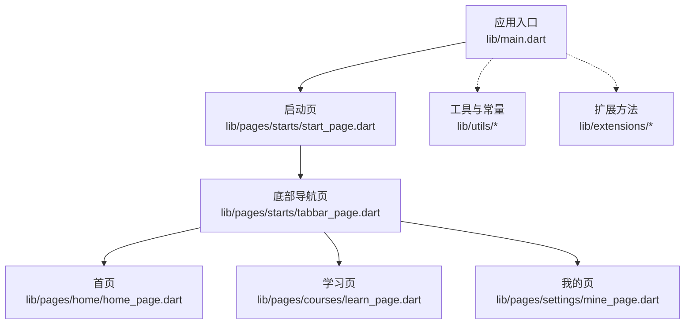
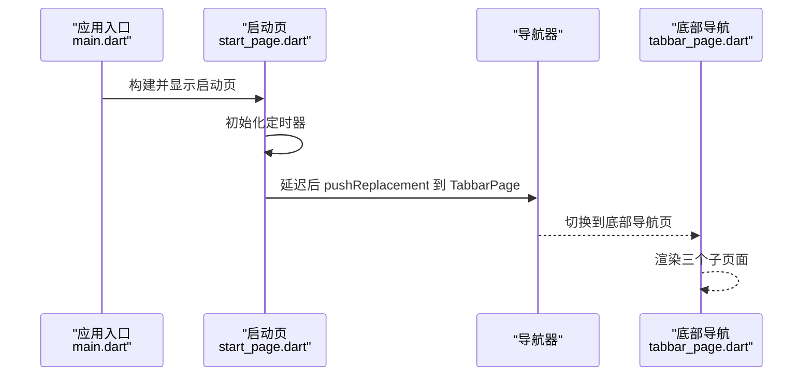
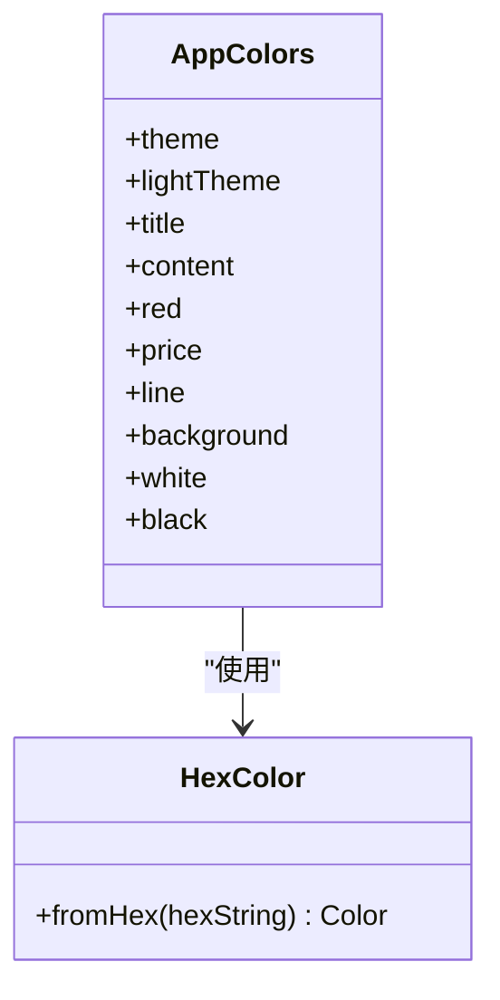
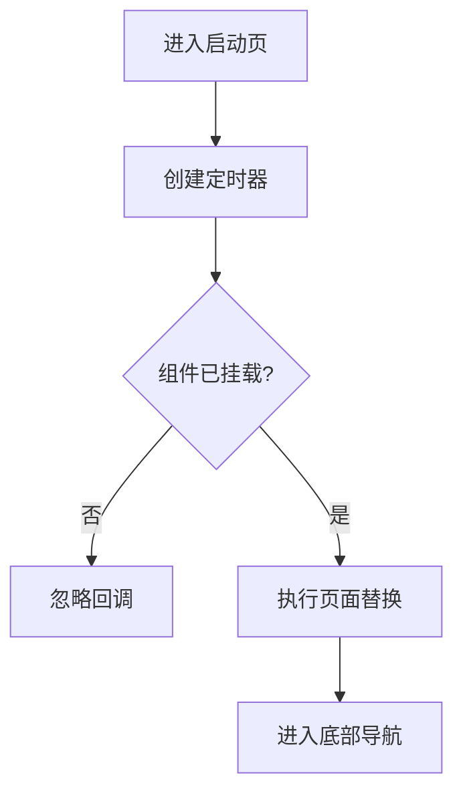
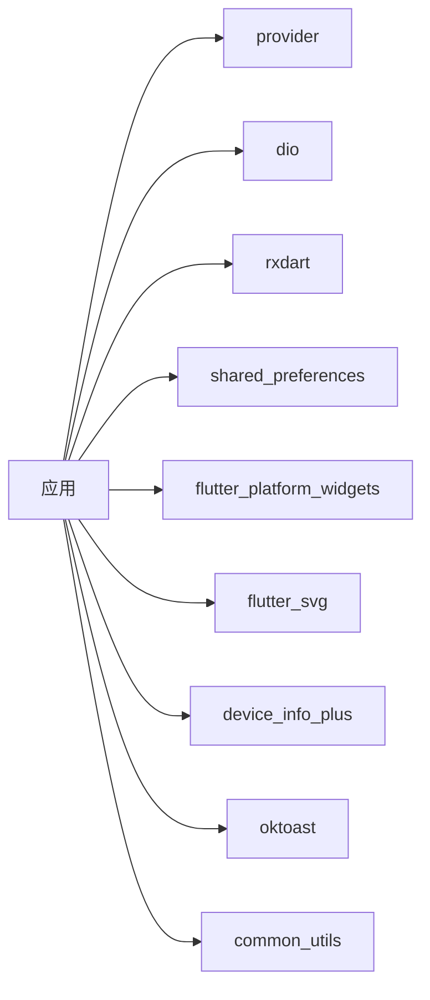

# 代码规范

<cite>
**本文引用的文件**
- [analysis_options.yaml](file://analysis_options.yaml)
- [pubspec.yaml](file://pubspec.yaml)
- [main.dart](file://lib/main.dart)
- [exports.dart](file://lib/utils/exports.dart)
- [app_colors.dart](file://lib/utils/app_colors.dart)
- [color_extensions.dart](file://lib/extensions/color_extensions.dart)
- [start_page.dart](file://lib/pages/starts/start_page.dart)
- [tabbar_page.dart](file://lib/pages/starts/tabbar_page.dart)
- [home_page.dart](file://lib/pages/home/home_page.dart)
- [learn_page.dart](file://lib/pages/courses/learn_page.dart)
- [mine_page.dart](file://lib/pages/settings/mine_page.dart)
- [widget_test.dart](file://test/widget_test.dart)
</cite>

## 目录
1. [简介](#简介)
2. [项目结构](#项目结构)
3. [核心组件](#核心组件)
4. [架构总览](#架构总览)
5. [详细组件分析](#详细组件分析)
6. [依赖分析](#依赖分析)
7. [性能考虑](#性能考虑)
8. [故障排查指南](#故障排查指南)
9. [结论](#结论)
10. [附录](#附录)

## 简介
本规范面向 Flutter/Dart 工程，目标是统一团队编码风格、提升可维护性与质量。内容涵盖：
- Dart 代码风格约定（命名、文件组织、注释）
- analysis_options.yaml 分析与规则配置说明
- Widget 编写规范（StatelessWidget/StatefulWidget 使用场景）
- 状态管理编码规范（Provider 使用模式）
- 代码审查清单与质量检查流程
- 基于本项目实际代码的示例路径指引

## 项目结构
当前工程采用按功能域划分的目录组织方式：
- lib/main.dart：应用入口，初始化主题与首页路由
- lib/pages：页面级模块（启动页、底部导航及子页面）
- lib/utils：工具与常量（颜色、导出聚合）
- lib/extensions：Dart 扩展（如颜色转换）
- lib/widgets：通用组件（当前为空，建议后续沉淀）
- lib/base、lib/services、lib/users：业务分层预留（当前为空）
- test：单元测试与集成测试

图表来源
- [main.dart:5-22](file://lib/main.dart#L5-L22)
- [start_page.dart:5-37](file://lib/pages/starts/start_page.dart#L5-L37)
- [tabbar_page.dart:8-113](file://lib/pages/starts/tabbar_page.dart#L8-L113)
- [home_page.dart:3-25](file://lib/pages/home/home_page.dart#L3-L25)
- [learn_page.dart:3-25](file://lib/pages/courses/learn_page.dart#L3-L25)
- [mine_page.dart:3-28](file://lib/pages/settings/mine_page.dart#L3-L28)

章节来源
- [main.dart:5-22](file://lib/main.dart#L5-L22)
- [pubspec.yaml:99-109](file://pubspec.yaml#L99-L109)

## 核心组件
- 应用主题与颜色体系
  - 通过 Theme 与集中式颜色类统一管理视觉变量，避免硬编码色值
  - 提供十六进制颜色解析扩展，便于从设计稿快速落地
- 页面与导航
  - 启动页负责延时跳转至底部导航；底部导航承载多标签页
  - 各子页面以 StatelessWidget 呈现无状态 UI
- 工具与导出
  - 统一导出常用工具与资源类型，减少重复导入

章节来源
- [app_colors.dart:4-27](file://lib/utils/app_colors.dart#L4-L27)
- [color_extensions.dart:3-21](file://lib/extensions/color_extensions.dart#L3-L21)
- [exports.dart:1-5](file://lib/utils/exports.dart#L1-L5)
- [start_page.dart:5-37](file://lib/pages/starts/start_page.dart#L5-L37)
- [tabbar_page.dart:8-113](file://lib/pages/starts/tabbar_page.dart#L8-L113)
- [home_page.dart:3-25](file://lib/pages/home/home_page.dart#L3-L25)
- [learn_page.dart:3-25](file://lib/pages/courses/learn_page.dart#L3-L25)
- [mine_page.dart:3-28](file://lib/pages/settings/mine_page.dart#L3-L28)

## 架构总览
应用启动后，MaterialApp 设置主题并挂载首页 StartPage；StartPage 在生命周期内执行定时器，完成后替换为 TabbarPage；TabbarPage 使用平台适配的底部导航容器承载多个子页面。

图表来源
- [main.dart:5-22](file://lib/main.dart#L5-L22)
- [start_page.dart:12-24](file://lib/pages/starts/start_page.dart#L12-L24)
- [tabbar_page.dart:15-99](file://lib/pages/starts/tabbar_page.dart#L15-L99)

## 详细组件分析

### 颜色与主题管理
- 集中式颜色类：所有颜色定义集中在单一位置，便于全局替换与一致性控制
- 颜色扩展：提供十六进制字符串转 Color 的能力，简化样式配置
- 主题接入：通过 Material 主题 seedColor 注入主色调，确保全局一致

图表来源
- [app_colors.dart:4-27](file://lib/utils/app_colors.dart#L4-L27)
- [color_extensions.dart:3-21](file://lib/extensions/color_extensions.dart#L3-L21)

章节来源
- [app_colors.dart:4-27](file://lib/utils/app_colors.dart#L4-L27)
- [color_extensions.dart:3-21](file://lib/extensions/color_extensions.dart#L3-L21)
- [main.dart:14-20](file://lib/main.dart#L14-L20)

### 启动与导航流程
- 启动页使用 StatefulWidget 管理定时器，并在 mounted 安全守卫下执行导航
- 使用 Navigator.pushReplacement 进行页面替换，避免栈堆积
- 底部导航使用跨平台组件封装，统一 Material/Cupertino 表现

图表来源
- [start_page.dart:12-24](file://lib/pages/starts/start_page.dart#L12-L24)
- [tabbar_page.dart:15-99](file://lib/pages/starts/tabbar_page.dart#L15-L99)

章节来源
- [start_page.dart:12-24](file://lib/pages/starts/start_page.dart#L12-L24)
- [tabbar_page.dart:15-99](file://lib/pages/starts/tabbar_page.dart#L15-L99)

### 页面与组件规范
- StatelessWidget：用于纯展示、无内部状态的页面或组件（如首页、学习页、我的页）
- StatefulWidget：需要管理自身状态或生命周期副作用的页面（如启动页、底部导航）
- 构造参数与 key：使用 const 构造与 super.key，保证可优化与稳定性
- 布局与样式：优先使用主题与颜色常量，避免魔法数字与硬编码色值

章节来源
- [home_page.dart:3-25](file://lib/pages/home/home_page.dart#L3-L25)
- [learn_page.dart:3-25](file://lib/pages/courses/learn_page.dart#L3-L25)
- [mine_page.dart:3-28](file://lib/pages/settings/mine_page.dart#L3-L28)
- [start_page.dart:5-37](file://lib/pages/starts/start_page.dart#L5-L37)
- [tabbar_page.dart:8-113](file://lib/pages/starts/tabbar_page.dart#L8-L113)

### 状态管理（Provider 使用模式）
- 适用场景：跨层级共享数据、表单状态、网络结果缓存等
- 推荐模式：
  - 将 Provider 置于根节点或业务模块根节点
  - 使用 ChangeNotifier/ChangeNotifierProvider 管理可变状态
  - 消费端使用 context.watch/context.select 精确订阅，避免不必要重建
  - 将 Provider 与页面解耦，保持页面仅关注 UI 与交互
- 在本工程中，provider 已作为依赖引入，可在 services 层实现状态模型并通过 Provider 暴露

章节来源
- [pubspec.yaml:44-45](file://pubspec.yaml#L44-L45)

### 代码风格约定
- 命名
  - 类与枚举：大驼峰（PascalCase），如 HomePage、AppColors
  - 变量与方法：小驼峰（camelCase），如 build、initState
  - 私有成员以下划线开头，如 _tabController
  - 常量：全大写+下划线（UPPER_SNAKE_CASE），如 MAX_RETRY_COUNT
- 文件组织
  - 每个文件一个主要类或一组紧密相关的类
  - 页面按功能域分目录（pages/*），工具与扩展分别归入 utils、extensions
  - 公共能力通过 exports.dart 统一导出，降低导入复杂度
- 注释
  - 对外 API 使用文档注释（///），对内逻辑使用行内注释解释“为什么”
  - 复杂算法或边界条件需补充说明
  - 避免冗余注释，保持代码自解释

章节来源
- [app_colors.dart:4-27](file://lib/utils/app_colors.dart#L4-L27)
- [exports.dart:1-5](file://lib/utils/exports.dart#L1-L5)
- [tabbar_page.dart:15-113](file://lib/pages/starts/tabbar_page.dart#L15-L113)

### 代码分析与规则（analysis_options.yaml）
- 启用 Flutter Lints：继承 flutter_lints 推荐规则集，保障基础质量
- 自定义规则：
  - analyzer.errors 可针对特定问题调整严重级别
  - linter.rules 可按需开启/关闭具体 lint 规则
- 使用方式：
  - 命令行：flutter analyze
  - IDE：在编辑器中查看诊断信息
  - CI：将 flutter analyze 加入流水线，阻断低质量提交

章节来源
- [analysis_options.yaml:1-32](file://analysis_options.yaml#L1-L32)

## 依赖分析
- 运行时依赖
  - provider：状态管理
  - dio：网络请求
  - rxdart：响应式流
  - shared_preferences：本地存储
  - flutter_platform_widgets：跨平台 UI 组件
  - flutter_svg：SVG 资源加载
  - device_info_plus：设备信息
  - oktoast：提示框
  - common_utils：常用工具
  - image_picker、flutter_slidable、keyboard_actions、flutter_swiper_null_safety_flutter3、flutter_screenutil、cupertino_icons 等
- 开发依赖
  - flutter_lints：代码分析
  - flutter_gen_runner/build_runner：资源生成
  - flutter_auditor：工程审计
  - flutter_launcher_icons：图标生成

图表来源
- [pubspec.yaml:30-65](file://pubspec.yaml#L30-L65)

章节来源
- [pubspec.yaml:30-65](file://pubspec.yaml#L30-L65)

## 性能考虑
- 使用 const 构造与不可变数据，减少不必要的重建
- 合理拆分 Widget，避免过大的 build 方法
- 使用 context.select 或细粒度 watch，降低重绘范围
- 图片与资源按需加载，避免一次性加载过多资源
- 列表使用 ListView.builder 等懒加载方案
- 避免在 build 中执行耗时计算，必要时使用 compute 或异步缓存

## 故障排查指南
- 常见问题
  - 未释放控制器导致内存泄漏：确保在 dispose 中释放控制器与监听
  - 在已销毁组件上调用 setState：增加 mounted 判断或使用安全守卫
  - 导航栈异常：使用 pushReplacement 替换当前页面，避免栈累积
  - 颜色不一致：统一通过 AppColors 与 Theme 获取，禁止硬编码
- 调试手段
  - 使用 flutter analyze 检查静态问题
  - 使用 DevTools 分析性能与内存
  - 通过日志与断点定位异步时序问题

章节来源
- [start_page.dart:12-24](file://lib/pages/starts/start_page.dart#L12-L24)
- [tabbar_page.dart:42-52](file://lib/pages/starts/tabbar_page.dart#L42-L52)

## 结论
通过统一的代码风格、严格的分析规则、清晰的组件分层与状态管理模式，可有效提升工程的可读性、可维护性与交付质量。建议在团队内推广本规范，并结合 CI 自动化检查持续改进。

## 附录

### 代码审查清单
- 结构与组织
  - 文件职责单一，命名清晰
  - 目录划分符合功能域
- 风格与可读性
  - 遵循命名与缩进约定
  - 注释简洁有效，解释“为什么”
- 正确性与健壮性
  - 生命周期与资源释放正确
  - 空安全与边界条件处理完备
  - 错误处理与用户反馈完善
- 性能与可维护性
  - 避免不必要重建与过度绘制
  - 抽象与复用合理，避免重复代码
- 测试与质量
  - 关键逻辑有单测覆盖
  - 通过 flutter analyze 且无新增警告

### 质量检查流程
- 本地检查
  - 运行 flutter analyze 修复告警
  - 运行 flutter test 确保用例通过
- 提交前检查
  - 格式化：dart format
  - 静态检查：flutter analyze
  - 可选：lint 规则严格化
- 流水线检查
  - 安装依赖、执行分析、运行测试、生成报告
  - 失败则阻断合并

### 示例与参考路径
- 颜色与主题
  - 颜色集中管理：[app_colors.dart:4-27](file://lib/utils/app_colors.dart#L4-L27)
  - 颜色扩展：[color_extensions.dart:3-21](file://lib/extensions/color_extensions.dart#L3-L21)
  - 主题注入：[main.dart:14-20](file://lib/main.dart#L14-L20)
- 页面与导航
  - 启动与跳转：[start_page.dart:12-24](file://lib/pages/starts/start_page.dart#L12-L24)
  - 底部导航：[tabbar_page.dart:15-99](file://lib/pages/starts/tabbar_page.dart#L15-L99)
  - 无状态页面：[home_page.dart:3-25](file://lib/pages/home/home_page.dart#L3-L25)、[learn_page.dart:3-25](file://lib/pages/courses/learn_page.dart#L3-L25)、[mine_page.dart:3-28](file://lib/pages/settings/mine_page.dart#L3-L28)
- 分析与测试
  - 分析规则：[analysis_options.yaml:1-32](file://analysis_options.yaml#L1-L32)
  - 端到端测试：[widget_test.dart:5-20](file://test/widget_test.dart#L5-L20)