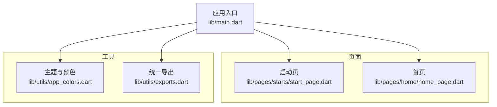
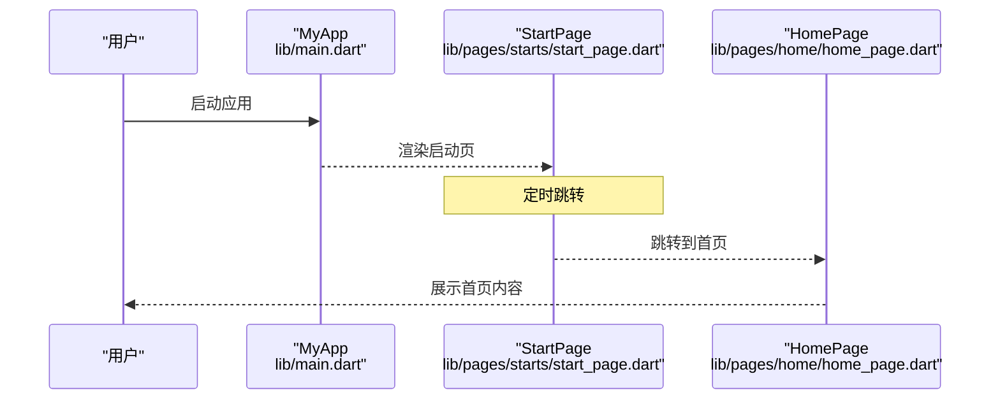
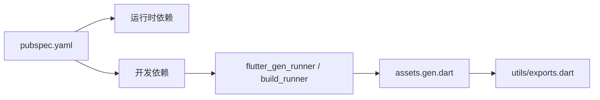

# 开发指南

<cite>
**本文引用的文件**
- [pubspec.yaml](file://pubspec.yaml)
- [analysis_options.yaml](file://analysis_options.yaml)
- [main.dart](file://lib/main.dart)
- [start_page.dart](file://lib/pages/starts/start_page.dart)
- [home_page.dart](file://lib/pages/home/home_page.dart)
- [app_colors.dart](file://lib/utils/app_colors.dart)
- [exports.dart](file://lib/utils/exports.dart)
- [widget_test.dart](file://test/widget_test.dart)
</cite>

## 目录
1. [简介](#简介)
2. [项目结构](#项目结构)
3. [核心组件](#核心组件)
4. [架构总览](#架构总览)
5. [详细组件分析](#详细组件分析)
6. [依赖分析](#依赖分析)
7. [性能考虑](#性能考虑)
8. [故障排除指南](#故障排除指南)
9. [结论](#结论)
10. [附录](#附录)

## 简介
本指南面向贡献者，提供统一的开发规范与最佳实践，涵盖：
- Dart 代码风格与命名约定
- 文件组织与模块划分
- 代码质量检查（analysis_options.yaml）配置与使用
- Git 工作流与分支管理策略
- 单元测试与集成测试编写指南
- 代码审查流程与标准
- 性能优化建议与调试技巧
- 新功能开发全流程（需求到提交）
- 常见问题与排错

## 项目结构
本项目为 Flutter 应用，采用分层与按功能域混合的组织方式：
- lib/main.dart：应用入口，初始化主题与首页路由
- lib/pages：页面层，按业务域分目录（如 starts、home、courses、settings）
- lib/utils：工具与常量（颜色、导出聚合等）
- lib/widgets：可复用 UI 组件（当前为空目录，后续可扩展）
- lib/services：网络与服务层（当前为空目录，后续可扩展）
- lib/extensions：扩展方法（如颜色扩展）
- lib/gen：资源生成代码（flutter_gen_runner 生成）
- test：单元测试与 widget 测试
- android/ios：原生平台工程
- pubspec.yaml：依赖与构建配置
- analysis_options.yaml：静态分析与 Lint 规则

**图表来源**
- [main.dart:1-23](file://lib/main.dart#L1-L23)
- [start_page.dart:1-37](file://lib/pages/starts/start_page.dart#L1-L37)
- [home_page.dart:1-25](file://lib/pages/home/home_page.dart#L1-L25)
- [app_colors.dart:1-27](file://lib/utils/app_colors.dart#L1-L27)
- [exports.dart:1-5](file://lib/utils/exports.dart#L1-L5)

**章节来源**
- [main.dart:1-23](file://lib/main.dart#L1-L23)
- [pubspec.yaml:1-136](file://pubspec.yaml#L1-L136)

## 核心组件
- 应用入口与主题
  - 入口在 main.dart，创建 MaterialApp 并设置主题色与首页路由。
  - 主题色来自 utils 中的 AppColors，便于统一管理。
- 启动页与导航
  - StartPage 使用定时器延迟跳转至 TabbarPage（由 start_page.dart 引入）。
- 首页展示
  - HomePage 作为示例页面，展示基础布局与内容。
- 工具与导出
  - app_colors.dart 集中定义颜色常量；exports.dart 聚合常用导出，简化导入。

**章节来源**
- [main.dart:1-23](file://lib/main.dart#L1-L23)
- [start_page.dart:1-37](file://lib/pages/starts/start_page.dart#L1-L37)
- [home_page.dart:1-25](file://lib/pages/home/home_page.dart#L1-L25)
- [app_colors.dart:1-27](file://lib/utils/app_colors.dart#L1-L27)
- [exports.dart:1-5](file://lib/utils/exports.dart#L1-L5)

## 架构总览
整体遵循“入口 -> 页面 -> 工具”的单向依赖关系，便于维护与扩展。

**图表来源**
- [main.dart:1-23](file://lib/main.dart#L1-L23)
- [start_page.dart:1-37](file://lib/pages/starts/start_page.dart#L1-L37)
- [home_page.dart:1-25](file://lib/pages/home/home_page.dart#L1-L25)

## 详细组件分析

### 应用入口与主题（MyApp）
- 职责：初始化应用、设置主题、指定首页。
- 关键点：
  - 通过 ColorScheme.fromSeed 基于主题色生成配色。
  - 首页路由指向 StartPage。
- 建议：
  - 将全局样式与主题集中在 theme 中，避免分散定义。
  - 如需多语言或深色模式，可在 MyApp 中扩展。

**章节来源**
- [main.dart:1-23](file://lib/main.dart#L1-L23)
- [app_colors.dart:1-27](file://lib/utils/app_colors.dart#L1-L27)

### 启动页（StartPage）
- 职责：展示启动画面并在延时后切换到主界面。
- 关键点：
  - 使用 Timer 进行延时跳转。
  - 跳转前检查 mounted，避免销毁后操作导致异常。
- 建议：
  - 若需更复杂的启动流程（如权限检查、数据预热），可封装为独立服务。
  - 考虑使用 PageRouteBuilder 实现过渡动画。

**章节来源**
- [start_page.dart:1-37](file://lib/pages/starts/start_page.dart#L1-L37)

### 首页（HomePage）
- 职责：展示首页内容与基础布局。
- 关键点：
  - 使用 Scaffold + AppBar + Column 组合。
- 建议：
  - 将复杂布局拆分为小组件，提升可读性与可测试性。
  - 文本与尺寸尽量从主题或常量中获取，保持一致性。

**章节来源**
- [home_page.dart:1-25](file://lib/pages/home/home_page.dart#L1-L25)

### 颜色与导出（AppColors、exports）
- 职责：集中管理颜色常量，并提供统一导出入口。
- 关键点：
  - AppColors 以静态字段暴露主题、标题、内容、背景等颜色。
  - exports.dart 聚合 flutter_svg、gen/assets.gen.dart、AppColors、颜色扩展。
- 建议：
  - 新增颜色时优先更新 AppColors，保持单一事实源。
  - 在页面中通过统一导出导入，减少重复 import。

**章节来源**
- [app_colors.dart:1-27](file://lib/utils/app_colors.dart#L1-L27)
- [exports.dart:1-5](file://lib/utils/exports.dart#L1-L5)

### 测试（Widget 测试）
- 职责：验证启动页与跳转逻辑。
- 关键点：
  - 使用 tester.pumpWidget 挂载 MyApp。
  - 断言启动页存在且首页不存在，延时后断言跳转成功。
- 建议：
  - 为关键交互补充更多用例（如错误状态、边界条件）。
  - 对异步跳转使用 pumpAndSettle 确保帧稳定。

**章节来源**
- [widget_test.dart:1-21](file://test/widget_test.dart#L1-L21)

## 依赖分析
- 运行时依赖
  - flutter、dio、provider、rxdart、device_info_plus、flutter_screenutil、flutter_svg、shared_preferences、oktoast、common_utils、image_picker、flutter_slidable、keyboard_actions、color 等。
- 开发依赖
  - flutter_lints、flutter_launcher_icons、flutter_auditor、flutter_gen_runner、build_runner。
- 资源生成
  - flutter_gen 集成 SVG，assets.gen.dart 由 build_runner 生成。

**图表来源**
- [pubspec.yaml:1-136](file://pubspec.yaml#L1-L136)
- [exports.dart:1-5](file://lib/utils/exports.dart#L1-L5)

**章节来源**
- [pubspec.yaml:1-136](file://pubspec.yaml#L1-L136)

## 性能考虑
- 启动优化
  - 启动页仅做必要展示，避免耗时任务；将网络请求与数据预热移至后台或懒加载。
- 渲染优化
  - 合理使用 const 构造器，减少重建开销。
  - 列表使用 ListView.builder，图片使用缓存与占位图。
- 内存与包体积
  - 按需引入依赖，避免全量导入。
  - 使用 flutter_gen 管理资源，减少手动路径维护成本。
- 网络与 I/O
  - 使用 dio 进行请求拦截、重试与超时控制。
  - 本地存储使用 shared_preferences，注意大对象序列化。

[本节为通用指导，不直接分析具体文件]

## 故障排除指南
- 静态分析与 Lint
  - 运行 flutter analyze 查看问题；根据 analysis_options.yaml 调整规则。
  - 常见项：忽略重复导入、启用单引号等。
- 资源未生效
  - 确认 assets 已在 pubspec.yaml 声明，并执行 flutter pub get。
  - 使用 flutter_gen_runner 重新生成 assets.gen.dart。
- 测试失败
  - 检查异步跳转是否使用 pumpAndSettle。
  - 确保断言文本与实际一致，必要时增加等待。
- 主题色不生效
  - 确认 Theme 已正确设置，颜色来自 AppColors。

**章节来源**
- [analysis_options.yaml:1-32](file://analysis_options.yaml#L1-L32)
- [pubspec.yaml:106-110](file://pubspec.yaml#L106-L110)
- [widget_test.dart:1-21](file://test/widget_test.dart#L1-L21)

## 结论
本项目结构清晰、依赖明确，具备完善的静态分析与测试基础。建议团队遵循本指南的编码规范、分支策略与审查流程，持续提升代码质量与交付效率。

[本节为总结，不直接分析具体文件]

## 附录

### 代码风格与命名约定（Dart）
- 文件与类名：小写下划线分隔（文件名），PascalCase（类名）。
- 变量与方法：camelCase；常量：UPPER_SNAKE_CASE。
- 布尔变量与方法：以 is/has/can 开头。
- 私有成员以下划线开头。
- 使用 const 构造器与不可变数据，提升性能与可读性。
- 注释与文档：公共 API 使用 /// 文档注释。

[本节为通用指导，不直接分析具体文件]

### 文件组织结构与命名规则
- lib/pages：按业务域分目录（如 starts、home、courses、settings），每个页面一个文件。
- lib/utils：工具与常量集中管理（颜色、导出、通用函数）。
- lib/widgets：可复用 UI 组件，按功能拆分。
- lib/services：网络与服务层，封装外部依赖。
- lib/extensions：扩展方法，增强现有类型能力。
- lib/gen：自动生成代码，勿手动修改。

[本节为通用指导，不直接分析具体文件]

### 代码质量检查（analysis_options.yaml）
- 继承 flutter_lints 推荐规则。
- 可自定义 linter rules，例如开启 prefer_single_quotes。
- 使用 ignore 指令局部禁用规则（谨慎使用）。
- 建议在 CI 中运行 flutter analyze，阻断不合格代码合并。

**章节来源**
- [analysis_options.yaml:1-32](file://analysis_options.yaml#L1-L32)

### Git 工作流与分支管理策略
- 分支模型
  - main：受保护，仅发布分支。
  - develop：集成开发分支。
  - feature/*：新功能分支。
  - hotfix/*：紧急修复分支。
  - release/*：预发布分支。
- 提交流程
  - 从 develop 拉取 feature 分支，完成开发与自测后发起 PR。
  - PR 需通过静态检查、测试与至少一名 reviewer 批准。
  - 合并后删除特性分支，保持仓库整洁。
- 提交信息
  - 采用约定式提交（feat/fix/docs/chore 等），便于变更日志生成。

[本节为通用指导，不直接分析具体文件]

### 单元测试与集成测试编写指南
- Widget 测试
  - 使用 flutter_test 与 WidgetTester。
  - 覆盖关键交互与边界条件，使用 expect 断言。
  - 异步跳转使用 pumpAndSettle。
- 单元测试
  - 针对纯函数与工具类编写用例，保证高覆盖率。
- 集成测试
  - 端到端场景（登录、下单）建议使用 integration_test 框架。
- 持续集成
  - 在 CI 中执行 flutter test 与 flutter analyze。

**章节来源**
- [widget_test.dart:1-21](file://test/widget_test.dart#L1-L21)

### 代码审查流程与标准
- 审查清单
  - 功能正确性、可读性、可维护性、性能影响、安全性。
  - 是否遵循命名与文件组织规范。
  - 是否有相应测试覆盖。
- 审查流程
  - 提交 PR 后，至少一名 reviewer 审查。
  - 评论逐条处理，直至达成一致。
  - 合并前确保所有检查通过。

[本节为通用指导，不直接分析具体文件]

### 性能优化建议与调试技巧
- 性能优化
  - 减少不必要的 rebuild（const、StatelessWidget 优先）。
  - 图片与资源使用缓存与懒加载。
  - 网络请求去重、分页与缓存策略。
- 调试技巧
  - 使用 DevTools 分析性能与内存。
  - 打印日志时使用 common_utils 或统一日志工具。
  - 使用 debugger 与断点定位问题。

[本节为通用指导，不直接分析具体文件]

### 新功能开发完整流程（需求到提交）
- 需求分析
  - 明确目标、范围与验收标准。
- 设计与评审
  - 输出技术方案与接口设计，团队评审。
- 分支与开发
  - 创建 feature/* 分支，遵循编码规范。
- 测试与自测
  - 编写单元/Widget/集成测试，本地验证。
- 代码审查与合并
  - 提交 PR，通过审查与自动化检查后合并。
- 发布与回滚
  - 进入 release/* 分支，打标签与发布；必要时准备回滚方案。

[本节为通用指导，不直接分析具体文件]

### 常见问题解答与故障排除
- 问：如何添加新颜色？
  - 答：在 AppColors 中添加静态字段，并在主题中使用。
- 问：资源未生效？
  - 答：确认 pubspec.yaml 中 assets 配置，执行 flutter pub get，并重新生成 assets.gen.dart。
- 问：测试报错找不到文本？
  - 答：检查文本是否与断言一致，必要时增加等待或使用 find.byType。
- 问：Lint 报错如何处理？
  - 答：根据 analysis_options.yaml 调整规则或修复代码问题。

**章节来源**
- [app_colors.dart:1-27](file://lib/utils/app_colors.dart#L1-L27)
- [pubspec.yaml:106-110](file://pubspec.yaml#L106-L110)
- [widget_test.dart:1-21](file://test/widget_test.dart#L1-L21)
- [analysis_options.yaml:1-32](file://analysis_options.yaml#L1-L32)