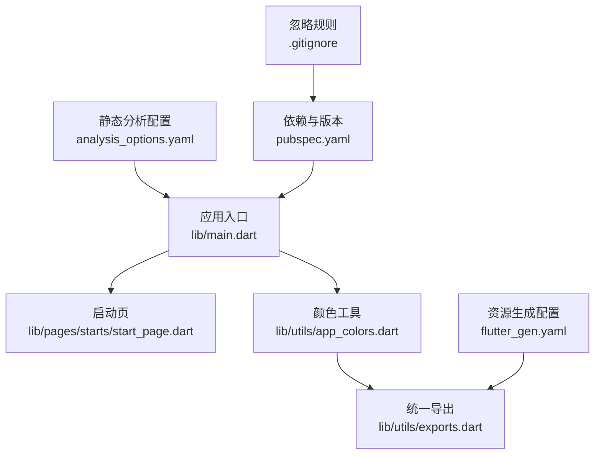
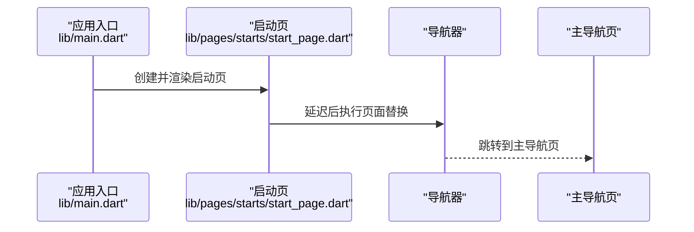
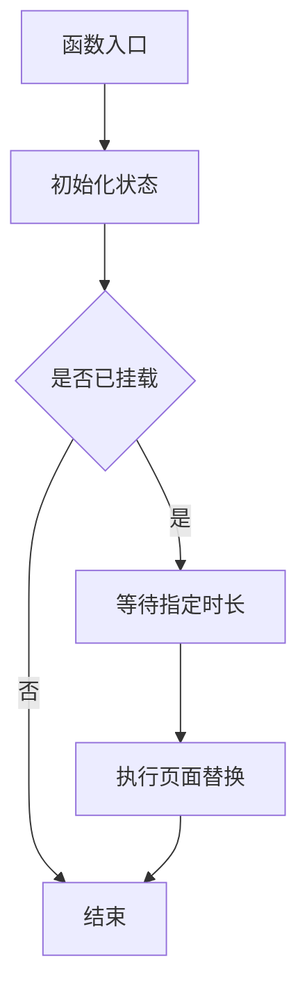
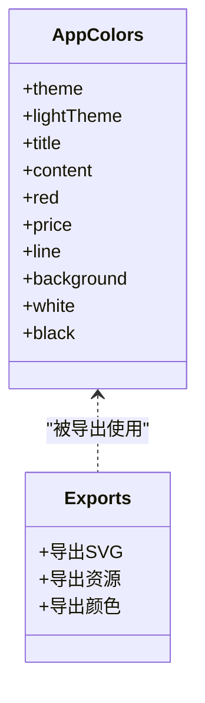
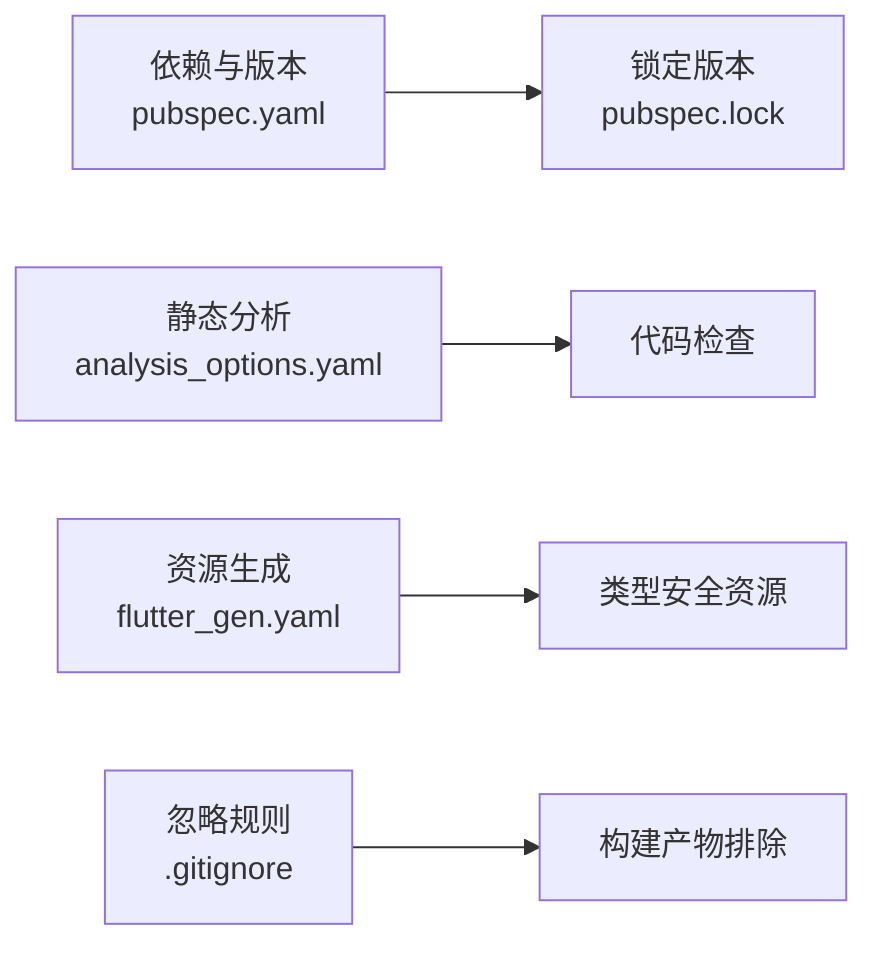

# 开发流程

<cite>
**本文引用的文件**
- [README.md](file://README.md)
- [pubspec.yaml](file://pubspec.yaml)
- [analysis_options.yaml](file://analysis_options.yaml)
- [.gitignore](file://.gitignore)
- [flutter_gen.yaml](file://flutter_gen.yaml)
- [lib/main.dart](file://lib/main.dart)
- [lib/pages/starts/start_page.dart](file://lib/pages/starts/start_page.dart)
- [lib/utils/app_colors.dart](file://lib/utils/app_colors.dart)
- [lib/utils/exports.dart](file://lib/utils/exports.dart)
</cite>

## 目录
1. [简介](#简介)
2. [项目结构](#项目结构)
3. [核心组件](#核心组件)
4. [架构总览](#架构总览)
5. [详细组件分析](#详细组件分析)
6. [依赖分析](#依赖分析)
7. [性能考虑](#性能考虑)
8. [故障排查指南](#故障排查指南)
9. [结论](#结论)
10. [附录](#附录)

## 简介
本规范旨在为 zslx_flutter Flutter 项目建立标准化的开发工作流程，覆盖从需求分析、功能设计、代码实现、测试验证到代码提交的全生命周期。文档同时明确 Git 分支管理策略、提交规范、代码审查流程、版本管理与发布流程，以及团队协作与沟通机制，确保团队高效协作、质量可控、可追溯。

## 项目结构
- 应用入口与主题：
  - 应用启动入口位于 lib/main.dart，负责初始化应用并设置主题色。
  - 颜色体系集中管理于 lib/utils/app_colors.dart，并通过统一导出 lib/utils/exports.dart 暴露给业务模块使用。
- 页面组织：
  - 页面按功能域划分在 lib/pages 下，例如启动页与底部导航等位于 lib/pages/starts。
- 配置与工具：
  - 静态分析与 Lint 规则由 analysis_options.yaml 管理。
  - 资源生成与集成通过 flutter_gen.yaml 配置。
  - 依赖与版本信息集中在 pubspec.yaml。
  - 构建产物与平台特定文件通过 .gitignore 排除。

**图表来源**
- [lib/main.dart:1-23](file://lib/main.dart#L1-L23)
- [lib/pages/starts/start_page.dart:1-37](file://lib/pages/starts/start_page.dart#L1-L37)
- [lib/utils/app_colors.dart:1-27](file://lib/utils/app_colors.dart#L1-L27)
- [lib/utils/exports.dart:1-5](file://lib/utils/exports.dart#L1-L5)
- [analysis_options.yaml:1-32](file://analysis_options.yaml#L1-L32)
- [flutter_gen.yaml:1-3](file://flutter_gen.yaml#L1-L3)
- [pubspec.yaml:1-136](file://pubspec.yaml#L1-L136)
- [.gitignore:1-46](file://.gitignore#L1-L46)

**章节来源**
- [lib/main.dart:1-23](file://lib/main.dart#L1-L23)
- [lib/pages/starts/start_page.dart:1-37](file://lib/pages/starts/start_page.dart#L1-L37)
- [lib/utils/app_colors.dart:1-27](file://lib/utils/app_colors.dart#L1-L27)
- [lib/utils/exports.dart:1-5](file://lib/utils/exports.dart#L1-L5)
- [analysis_options.yaml:1-32](file://analysis_options.yaml#L1-L32)
- [flutter_gen.yaml:1-3](file://flutter_gen.yaml#L1-L3)
- [pubspec.yaml:1-136](file://pubspec.yaml#L1-L136)
- [.gitignore:1-46](file://.gitignore#L1-L46)

## 核心组件
- 应用入口与主题：
  - 入口文件负责创建应用实例并注入主题色，保证全局视觉一致性。
- 启动流程：
  - 启动页在初始化后延迟跳转至主导航页，完成冷启动体验。
- 颜色与资源：
  - 颜色常量集中定义，便于统一管理和扩展；资源通过生成器产出类型安全的访问方式。

**章节来源**
- [lib/main.dart:1-23](file://lib/main.dart#L1-L23)
- [lib/pages/starts/start_page.dart:1-37](file://lib/pages/starts/start_page.dart#L1-L37)
- [lib/utils/app_colors.dart:1-27](file://lib/utils/app_colors.dart#L1-L27)
- [lib/utils/exports.dart:1-5](file://lib/utils/exports.dart#L1-L5)

## 架构总览
下图展示了应用启动与页面跳转的关键调用链，体现从入口到启动页再到主导航的时序关系。

**图表来源**
- [lib/main.dart:1-23](file://lib/main.dart#L1-L23)
- [lib/pages/starts/start_page.dart:1-37](file://lib/pages/starts/start_page.dart#L1-L37)

## 详细组件分析

### 启动流程与页面跳转
- 启动页在初始化阶段设置定时器，完成后进行页面替换，避免重复挂载导致的状态问题。
- 该流程保证了用户进入应用后的首屏体验与后续导航的一致性。

**图表来源**
- [lib/pages/starts/start_page.dart:12-24](file://lib/pages/starts/start_page.dart#L12-L24)

**章节来源**
- [lib/pages/starts/start_page.dart:1-37](file://lib/pages/starts/start_page.dart#L1-L37)

### 颜色与主题管理
- 颜色常量以类形式集中管理，提供主题色、标题色、内容色等常用配色。
- 通过统一导出文件对外暴露颜色与 SVG 资源能力，降低耦合度。

**图表来源**
- [lib/utils/app_colors.dart:1-27](file://lib/utils/app_colors.dart#L1-L27)
- [lib/utils/exports.dart:1-5](file://lib/utils/exports.dart#L1-L5)

**章节来源**
- [lib/utils/app_colors.dart:1-27](file://lib/utils/app_colors.dart#L1-L27)
- [lib/utils/exports.dart:1-5](file://lib/utils/exports.dart#L1-L5)

## 依赖分析
- 依赖声明与锁定：
  - 依赖项与版本在 pubspec.yaml 中声明，锁定版本在 pubspec.lock 中记录，确保构建可复现。
- 静态分析与 Lint：
  - analysis_options.yaml 启用 Flutter 推荐的 Lint 规则，保障代码风格与质量。
- 资源生成：
  - flutter_gen.yaml 配置资源生成输出路径与集成选项，提升资源访问效率与类型安全。
- 构建产物与忽略：
  - .gitignore 排除构建产物与平台临时文件，保持仓库整洁。

**图表来源**
- [pubspec.yaml:1-136](file://pubspec.yaml#L1-L136)
- [analysis_options.yaml:1-32](file://analysis_options.yaml#L1-L32)
- [flutter_gen.yaml:1-3](file://flutter_gen.yaml#L1-L3)
- [.gitignore:1-46](file://.gitignore#L1-L46)

**章节来源**
- [pubspec.yaml:1-136](file://pubspec.yaml#L1-L136)
- [analysis_options.yaml:1-32](file://analysis_options.yaml#L1-L32)
- [flutter_gen.yaml:1-3](file://flutter_gen.yaml#L1-L3)
- [.gitignore:1-46](file://.gitignore#L1-L46)

## 性能考虑
- 启动优化：
  - 启动页仅做轻量展示与必要跳转，避免在 initState 中进行耗时操作。
- 资源加载：
  - 使用资源生成器减少运行时解析开销，提高图片与 SVG 加载效率。
- 主题与颜色：
  - 集中管理颜色常量，减少重复计算与样式不一致带来的重绘。

[本节为通用指导，不直接分析具体文件]

## 故障排查指南
- 静态分析失败：
  - 检查 analysis_options.yaml 中的规则配置，必要时调整或禁用特定规则。
- 资源未生效：
  - 确认 flutter_gen.yaml 配置正确，并在修改资源后重新生成资源代码。
- 依赖冲突：
  - 核对 pubspec.yaml 的版本约束与 pubspec.lock 的锁定版本，必要时升级或降级依赖。
- 构建产物污染：
  - 清理 .dart_tool、build 等目录，确保干净构建。

**章节来源**
- [analysis_options.yaml:1-32](file://analysis_options.yaml#L1-L32)
- [flutter_gen.yaml:1-3](file://flutter_gen.yaml#L1-L3)
- [pubspec.yaml:1-136](file://pubspec.yaml#L1-L136)
- [.gitignore:1-46](file://.gitignore#L1-L46)

## 结论
本规范围绕 zslx_flutter 项目的实际结构与配置，建立了从需求到上线的标准化开发流程，明确了分支管理、提交规范、代码审查、版本与发布流程，以及团队协作机制。遵循本规范有助于提升代码质量、降低协作成本、保障交付稳定性。

## 附录

### 一、需求分析与功能设计
- 需求收集与评审：
  - 产品提出需求，技术参与可行性评估，明确范围与边界。
- 功能设计：
  - 输出交互原型与信息架构，确定关键数据流与接口契约。
- 技术方案：
  - 选择合适的数据存储、状态管理与网络方案，评估性能与可维护性。

### 二、代码实现规范
- 目录与命名：
  - 页面按功能域组织在 lib/pages，工具与扩展放在 lib/utils 与 lib/extensions。
- 代码风格：
  - 遵循 Flutter/Dart 官方风格，启用 Lint 规则，保持可读性与一致性。
- 模块化与解耦：
  - 将颜色、资源、工具类集中管理，通过统一导出降低耦合。

### 三、Git 分支管理策略
- 分支模型（基于主干的简化模型）：
  - main：稳定分支，仅接受经过测试与审查的合并。
  - develop：开发集成分支，日常功能迭代在此合并。
  - feature/*：功能分支，每个功能独立分支，完成后合并至 develop。
  - hotfix/*：紧急修复分支，直接从 main 拉出，修复后合并回 main 与 develop。
  - release/*：发布候选分支，用于预发布与回归测试，最终合并至 main 并打标签。
- 分支命名：
  - 小写加连字符，如 feature/login-page、hotfix/crash-on-start。
- 合并策略：
  - 功能分支通过 Pull Request 合并至 develop，需至少一名审查者批准。
  - 发布分支合并至 main 前需通过完整测试与验收。

### 四、代码提交规范与 Commit 消息格式
- 提交规范：
  - 每次提交聚焦单一变更，避免混合无关改动。
  - 提交前运行静态分析与基础测试，确保无阻塞错误。
- Commit 消息格式：
  - 类型: 描述 (可选上下文)
  - 常见类型：feat、fix、docs、style、refactor、test、chore
  - 示例：
    - feat: 新增启动页跳转逻辑
    - fix: 修复登录失败时的提示文案
    - docs: 更新 README 使用说明
    - style: 调整颜色常量命名
    - refactor: 重构颜色工具类
    - test: 增加启动页单元测试
    - chore: 更新依赖版本

### 五、代码审查流程与标准
- 审查清单：
  - 功能正确性：是否符合需求与交互设计。
  - 代码质量：命名清晰、结构合理、无冗余逻辑。
  - 可维护性：模块化良好、注释充分、易于扩展。
  - 安全性：敏感信息处理、权限与隐私合规。
  - 性能：避免不必要重绘、资源加载优化。
  - 兼容性：多设备与系统版本适配。
- 反馈处理：
  - 审查意见需在 24 小时内响应，重大缺陷优先修复。
  - 所有评论需闭环，直至满足要求方可合并。

### 六、新功能开发生命周期
- 需求阶段：
  - 需求评审、范围界定、风险评估。
- 设计阶段：
  - 交互与界面设计、数据流设计、接口契约定义。
- 实现阶段：
  - 功能分支开发、单元测试编写、本地调试。
- 测试阶段：
  - 集成测试、UI 自动化测试、性能与兼容性测试。
- 审查与合并：
  - 代码审查、CI 检查、合并至 develop。
- 发布阶段：
  - 发布候选构建、回归测试、灰度发布与全量上线。

### 七、版本管理与发布流程
- 版本号规范：
  - 采用语义化版本：主版本.次版本.修订号+构建号。
  - 主版本：不兼容的重大变更；次版本：向后兼容的功能增强；修订号：向后兼容的问题修复。
- 发布流程：
  - 从 develop 创建 release/* 分支，冻结变更。
  - 执行完整测试与审计，生成构建产物。
  - 合并至 main 并打标签，同步至各平台商店或分发渠道。
- 回滚策略：
  - 保留最近稳定版本的标签与构建，支持快速回滚。

### 八、团队协作与沟通机制
- 协作工具：
  - 使用项目管理工具跟踪任务与进度，代码托管平台管理分支与合并请求。
- 沟通机制：
  - 每日站会同步进展与阻塞点，周会复盘与规划。
  - 重要决策通过文档沉淀，确保信息透明与可追溯。
- 知识共享：
  - 建立团队知识库，记录常见问题与最佳实践，定期分享与培训。