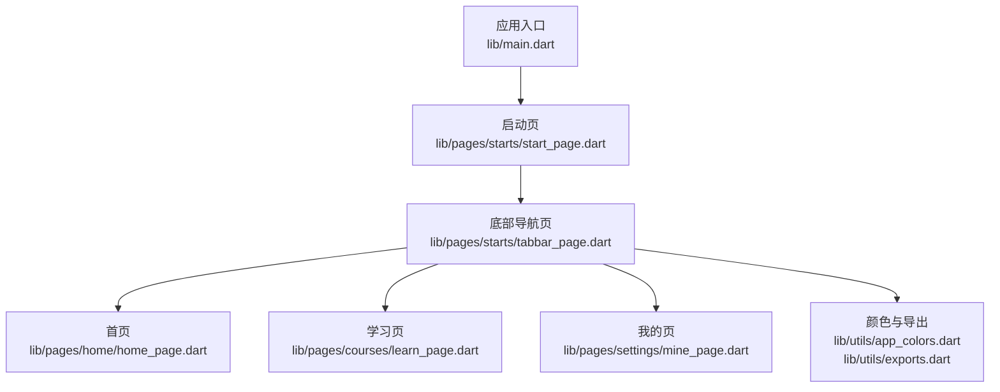
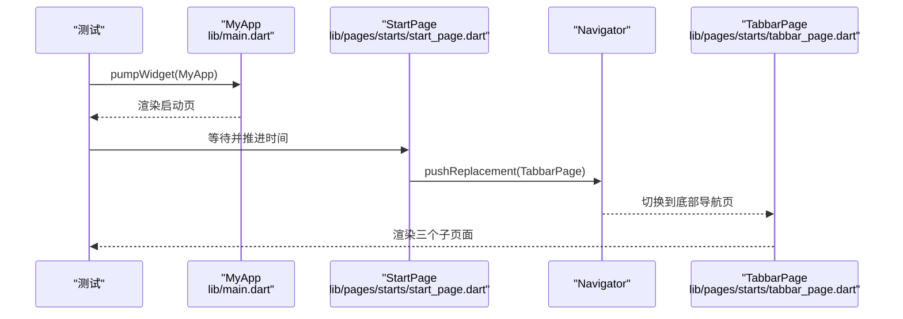
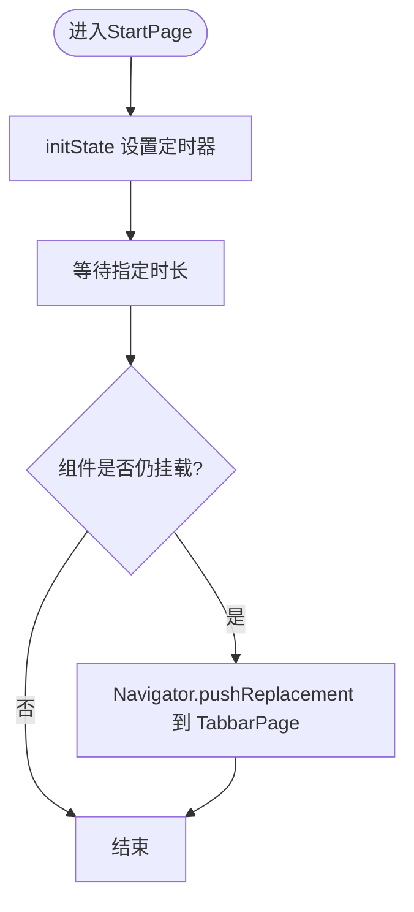
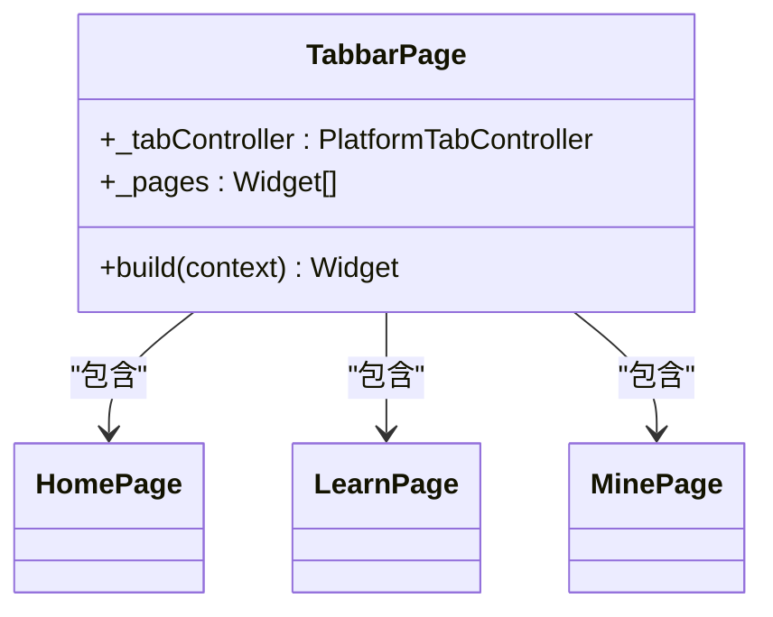
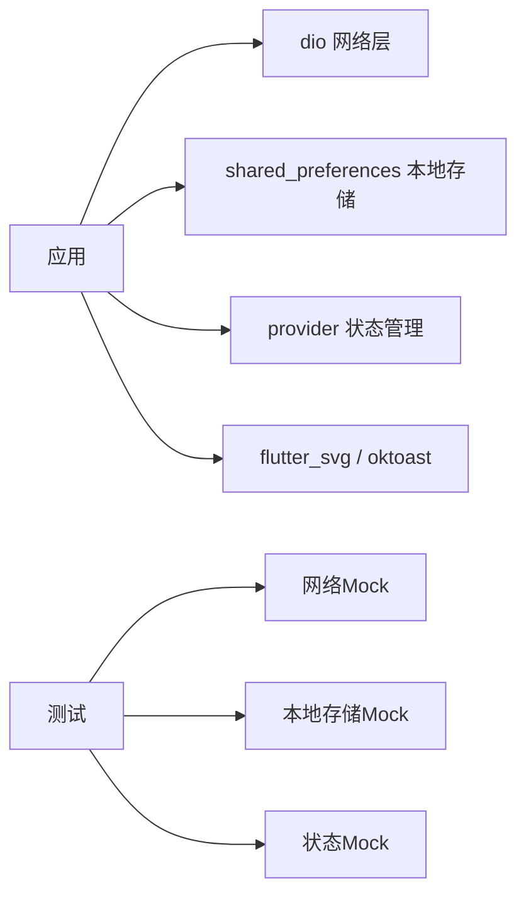

# 测试指南

<cite>
**本文引用的文件**
- [pubspec.yaml](file://pubspec.yaml)
- [analysis_options.yaml](file://analysis_options.yaml)
- [lib/main.dart](file://lib/main.dart)
- [lib/pages/starts/start_page.dart](file://lib/pages/starts/start_page.dart)
- [lib/pages/starts/tabbar_page.dart](file://lib/pages/starts/tabbar_page.dart)
- [lib/pages/home/home_page.dart](file://lib/pages/home/home_page.dart)
- [lib/pages/courses/learn_page.dart](file://lib/pages/courses/learn_page.dart)
- [lib/pages/settings/mine_page.dart](file://lib/pages/settings/mine_page.dart)
- [lib/utils/app_colors.dart](file://lib/utils/app_colors.dart)
- [lib/utils/exports.dart](file://lib/utils/exports.dart)
- [test/widget_test.dart](file://test/widget_test.dart)
</cite>

## 目录
1. [简介](#简介)
2. [项目结构](#项目结构)
3. [核心组件](#核心组件)
4. [架构总览](#架构总览)
5. [详细组件分析](#详细组件分析)
6. [依赖分析](#依赖分析)
7. [性能考虑](#性能考虑)
8. [故障排查指南](#故障排查指南)
9. [结论](#结论)
10. [附录](#附录)

## 简介
本指南面向Flutter项目的单元测试、集成测试与Widget测试，结合当前仓库的实际代码，提供从环境搭建、配置到最佳实践的系统化说明。重点覆盖：
- Widget测试：用户交互模拟、状态验证、路由跳转验证
- 异步代码测试：定时器、网络请求、本地存储的测试策略
- 测试数据管理与Mock对象使用
- 覆盖率要求与持续集成建议
- 具体用例示例与调试技巧

## 项目结构
本项目为典型的Flutter应用结构，包含页面、工具类、资源与测试目录。关键入口与页面如下：
- 应用入口：lib/main.dart
- 启动页与底部导航：lib/pages/starts/start_page.dart, lib/pages/starts/tabbar_page.dart
- 业务页面：lib/pages/home/home_page.dart, lib/pages/courses/learn_page.dart, lib/pages/settings/mine_page.dart
- 颜色与导出：lib/utils/app_colors.dart, lib/utils/exports.dart
- 测试：test/widget_test.dart（已存在一个基础Widget测试）

图表来源
- [lib/main.dart:9-22](file://lib/main.dart#L9-L22)
- [lib/pages/starts/start_page.dart:5-36](file://lib/pages/starts/start_page.dart#L5-L36)
- [lib/pages/starts/tabbar_page.dart:8-99](file://lib/pages/starts/tabbar_page.dart#L8-L99)
- [lib/pages/home/home_page.dart:3-24](file://lib/pages/home/home_page.dart#L3-L24)
- [lib/pages/courses/learn_page.dart:3-24](file://lib/pages/courses/learn_page.dart#L3-L24)
- [lib/pages/settings/mine_page.dart:3-27](file://lib/pages/settings/mine_page.dart#L3-L27)
- [lib/utils/app_colors.dart:5-27](file://lib/utils/app_colors.dart#L5-L27)
- [lib/utils/exports.dart:1-5](file://lib/utils/exports.dart#L1-L5)

章节来源
- [pubspec.yaml:30-65](file://pubspec.yaml#L30-L65)
- [lib/main.dart:1-23](file://lib/main.dart#L1-L23)
- [lib/pages/starts/start_page.dart:1-37](file://lib/pages/starts/start_page.dart#L1-L37)
- [lib/pages/starts/tabbar_page.dart:1-113](file://lib/pages/starts/tabbar_page.dart#L1-L113)
- [lib/pages/home/home_page.dart:1-25](file://lib/pages/home/home_page.dart#L1-L25)
- [lib/pages/courses/learn_page.dart:1-25](file://lib/pages/courses/learn_page.dart#L1-L25)
- [lib/pages/settings/mine_page.dart:1-28](file://lib/pages/settings/mine_page.dart#L1-L28)
- [lib/utils/app_colors.dart:1-27](file://lib/utils/app_colors.dart#L1-L27)
- [lib/utils/exports.dart:1-5](file://lib/utils/exports.dart#L1-L5)
- [test/widget_test.dart:1-21](file://test/widget_test.dart#L1-L21)

## 核心组件
- 应用入口 MyApp：初始化主题并设置启动页为StartPage
- 启动页 StartPage：在initState中通过定时器延迟后跳转到TabbarPage
- 底部导航 TabbarPage：承载三个子页面（首页、学习、我的），使用PlatformTabScaffold管理标签切换
- 页面组件：HomePage、LearnPage、MinePage均为无状态页面，展示各自内容
- 颜色与导出：AppColors集中定义颜色；exports统一导出SVG、资源与颜色扩展

章节来源
- [lib/main.dart:9-22](file://lib/main.dart#L9-L22)
- [lib/pages/starts/start_page.dart:5-36](file://lib/pages/starts/start_page.dart#L5-L36)
- [lib/pages/starts/tabbar_page.dart:8-99](file://lib/pages/starts/tabbar_page.dart#L8-L99)
- [lib/pages/home/home_page.dart:3-24](file://lib/pages/home/home_page.dart#L3-L24)
- [lib/pages/courses/learn_page.dart:3-24](file://lib/pages/courses/learn_page.dart#L3-L24)
- [lib/pages/settings/mine_page.dart:3-27](file://lib/pages/settings/mine_page.dart#L3-L27)
- [lib/utils/app_colors.dart:5-27](file://lib/utils/app_colors.dart#L5-L27)
- [lib/utils/exports.dart:1-5](file://lib/utils/exports.dart#L1-L5)

## 架构总览
下图展示了从应用启动到页面跳转的核心流程，以及测试如何介入验证行为。

图表来源
- [lib/main.dart:9-22](file://lib/main.dart#L9-L22)
- [lib/pages/starts/start_page.dart:12-23](file://lib/pages/starts/start_page.dart#L12-L23)
- [lib/pages/starts/tabbar_page.dart:15-99](file://lib/pages/starts/tabbar_page.dart#L15-L99)

章节来源
- [test/widget_test.dart:5-19](file://test/widget_test.dart#L5-L19)

## 详细组件分析

### 启动页与路由跳转（StartPage）
- 行为：在initState中设置定时器，延迟后执行pushReplacement跳转到TabbarPage
- 测试要点：
  - 使用pumpWidget渲染应用
  - 使用pump推进时间以触发定时器
  - 使用pumpAndSettle确保动画和路由完成
  - 断言启动页文本消失，目标页文本出现

图表来源
- [lib/pages/starts/start_page.dart:12-23](file://lib/pages/starts/start_page.dart#L12-L23)

章节来源
- [lib/pages/starts/start_page.dart:5-36](file://lib/pages/starts/start_page.dart#L5-L36)
- [test/widget_test.dart:5-19](file://test/widget_test.dart#L5-L19)

### 底部导航与子页面（TabbarPage）
- 行为：使用PlatformTabController管理三个子页面（首页、学习、我的）
- 测试要点：
  - 验证初始索引对应的页面可见
  - 模拟点击或滑动切换标签，验证对应页面显示
  - 注意PlatformTabScaffold在不同平台的表现差异，必要时在测试中固定平台或使用适配策略

图表来源
- [lib/pages/starts/tabbar_page.dart:8-99](file://lib/pages/starts/tabbar_page.dart#L8-L99)
- [lib/pages/home/home_page.dart:3-24](file://lib/pages/home/home_page.dart#L3-L24)
- [lib/pages/courses/learn_page.dart:3-24](file://lib/pages/courses/learn_page.dart#L3-L24)
- [lib/pages/settings/mine_page.dart:3-27](file://lib/pages/settings/mine_page.dart#L3-L27)

章节来源
- [lib/pages/starts/tabbar_page.dart:8-99](file://lib/pages/starts/tabbar_page.dart#L8-L99)

### 页面组件（HomePage、LearnPage、MinePage）
- 行为：无状态页面，展示标题与图标/文字
- 测试要点：
  - 使用find.byType或find.text断言UI元素存在
  - 可结合颜色断言（如主色）验证主题一致性

章节来源
- [lib/pages/home/home_page.dart:3-24](file://lib/pages/home/home_page.dart#L3-L24)
- [lib/pages/courses/learn_page.dart:3-24](file://lib/pages/courses/learn_page.dart#L3-L24)
- [lib/pages/settings/mine_page.dart:3-27](file://lib/pages/settings/mine_page.dart#L3-L27)
- [lib/utils/app_colors.dart:5-27](file://lib/utils/app_colors.dart#L5-L27)

## 依赖分析
- 运行时依赖：dio（网络）、provider（状态管理）、shared_preferences（本地存储）、flutter_svg（图片）、oktoast（提示）等
- 开发依赖：flutter_test、flutter_lints
- 测试相关：
  - flutter_test用于Widget测试
  - 可使用mockito进行Mock（需添加依赖）
  - 可使用http_mock_adapter或dio拦截器进行网络Mock
  - 可使用shared_preferences_mock或内存实现替代本地存储

图表来源
- [pubspec.yaml:30-65](file://pubspec.yaml#L30-L65)

章节来源
- [pubspec.yaml:30-65](file://pubspec.yaml#L30-L65)

## 性能考虑
- Widget测试中避免不必要的重绘：尽量使用const构造减少重建
- 控制pump次数与时间推进粒度，避免过度等待导致测试缓慢
- 对复杂页面拆分测试，聚焦单一职责的Widget
- 使用finders精准定位元素，减少全树扫描开销

[本节为通用指导，不直接分析具体文件]

## 故障排查指南
- 路由未跳转：检查是否在pump之后推进了足够的时间，确保定时器触发；确认使用了pumpAndSettle等待动画与路由完成
- 找不到元素：核对文本、类型或层级是否正确；必要时打印widget树定位问题
- 主题不一致：确保测试环境与真实环境使用相同Theme；可通过MaterialApp传入自定义theme或在测试中包裹
- 平台差异：PlatformTabScaffold在不同平台表现不同，可在测试中固定平台或使用条件逻辑

章节来源
- [test/widget_test.dart:5-19](file://test/widget_test.dart#L5-L19)
- [lib/pages/starts/start_page.dart:12-23](file://lib/pages/starts/start_page.dart#L12-L23)
- [lib/pages/starts/tabbar_page.dart:15-99](file://lib/pages/starts/tabbar_page.dart#L15-L99)

## 结论
本指南基于当前仓库的实际代码，提供了从Widget测试到异步测试、Mock与数据管理、覆盖率与CI的完整方案。建议在现有test/widget_test.dart基础上逐步扩展更多场景的测试用例，形成稳定的回归保障体系。

[本节为总结性内容，不直接分析具体文件]

## 附录

### 测试环境搭建与配置
- 依赖声明：在dev_dependencies中添加flutter_test（已存在）
- 分析选项：analysis_options.yaml启用flutter_lints，保持代码质量
- 资源与导出：通过exports统一导入svg与颜色，便于测试断言

章节来源
- [pubspec.yaml:67-76](file://pubspec.yaml#L67-L76)
- [analysis_options.yaml:1-32](file://analysis_options.yaml#L1-L32)
- [lib/utils/exports.dart:1-5](file://lib/utils/exports.dart#L1-L5)

### Widget测试最佳实践
- 用户交互模拟：使用tester.tap、tester.drag、tester.pumpAndSettle等API
- 状态验证：通过find.text、find.byType、find.byKey等断言UI变化
- 路由验证：在StartPage中通过定时器触发跳转，测试中推进时间并断言目标页元素出现

章节来源
- [test/widget_test.dart:5-19](file://test/widget_test.dart#L5-L19)
- [lib/pages/starts/start_page.dart:12-23](file://lib/pages/starts/start_page.dart#L12-L23)

### 异步代码测试策略
- 定时器：使用tester.pump(Duration)推进时间，配合pumpAndSettle等待完成
- 网络请求：建议使用dio拦截器或http_mock_adapter进行Mock，避免真实网络调用
- 本地存储：使用shared_preferences的内存实现或mock包替换，保证测试隔离与快速

[本节为通用指导，不直接分析具体文件]

### 测试数据管理与Mock对象
- 数据工厂：为页面或服务创建数据生成器，保证测试数据一致性与可控性
- Mock策略：
  - 网络：使用dio拦截器返回固定响应
  - 本地存储：使用内存实现或mock包
  - 状态管理：使用provider的MockProvider或InMemory实现
- 断言：结合UI与状态双重验证，确保行为正确

[本节为通用指导，不直接分析具体文件]

### 覆盖率要求与持续集成
- 覆盖率目标：建议核心模块达到80%以上行覆盖率，关键路径达到90%以上
- 报告生成：使用flutter test --coverage生成覆盖率报告，配合lcov或codecov上传
- CI配置：在GitHub Actions或GitLab CI中安装Flutter、运行测试与覆盖率收集

[本节为通用指导，不直接分析具体文件]

### 具体测试用例示例与调试技巧
- 示例参考：test/widget_test.dart中的启动页到首页跳转测试
- 调试技巧：
  - 使用debugDumpApp()打印widget树定位问题
  - 使用expect().throws捕获异常
  - 使用tester.takeScreenshot保存界面快照辅助比对

章节来源
- [test/widget_test.dart:5-19](file://test/widget_test.dart#L5-L19)