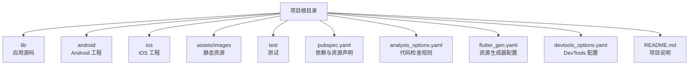
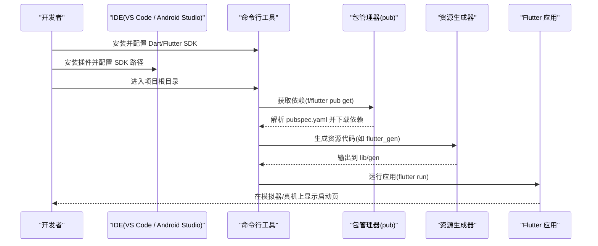
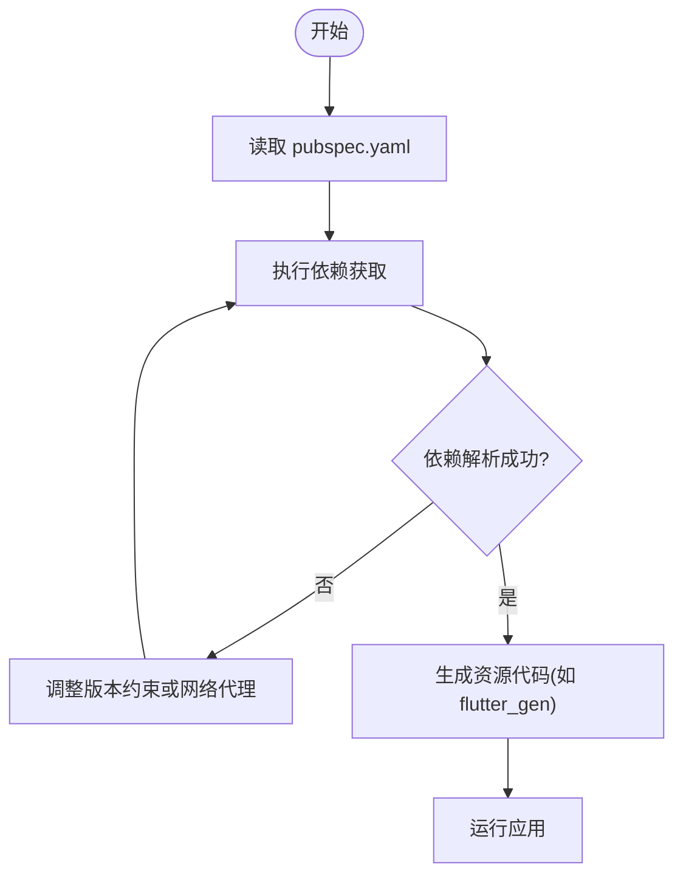
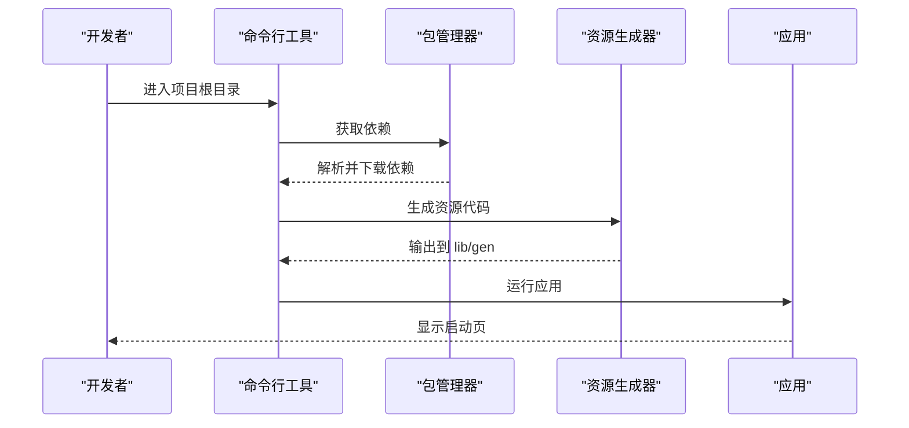
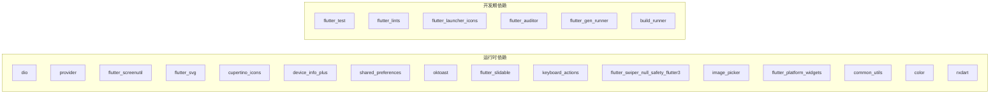

# 环境搭建

<cite>
**本文引用的文件**
- [pubspec.yaml](file://pubspec.yaml)
- [analysis_options.yaml](file://analysis_options.yaml)
- [README.md](file://README.md)
- [lib/main.dart](file://lib/main.dart)
- [android/build.gradle.kts](file://android/build.gradle.kts)
- [android/app/build.gradle.kts](file://android/app/build.gradle.kts)
- [android/local.properties](file://android/local.properties)
- [flutter_gen.yaml](file://flutter_gen.yaml)
- [devtools_options.yaml](file://devtools_options.yaml)
</cite>

## 目录
1. [简介](#简介)
2. [项目结构](#项目结构)
3. [核心组件](#核心组件)
4. [架构总览](#架构总览)
5. [详细组件分析](#详细组件分析)
6. [依赖关系分析](#依赖关系分析)
7. [性能注意事项](#性能注意事项)
8. [故障排除指南](#故障排除指南)
9. [结论](#结论)
10. [附录](#附录)

## 简介
本指南面向首次或初次接触该 Flutter 项目的开发者，目标是帮助你从零开始完成本地开发环境的安装与配置，包括 Dart SDK、Flutter SDK 的安装与校验，IDE（VS Code 或 Android Studio）的配置，项目依赖管理（基于 pubspec.yaml），代码分析规则（基于 analysis_options.yaml），以及项目初始化与首次运行。同时提供常见环境问题的排查方法与最佳实践建议。

## 项目结构
该项目是一个标准的 Flutter 工程，包含以下关键目录与文件：
- lib：应用源码入口与业务模块
- android：Android 平台原生工程与构建脚本
- ios：iOS 平台原生工程与资源
- assets/images：静态资源（图片等）
- test：单元测试与 Widget 测试
- pubspec.yaml：Dart/Flutter 依赖与资源声明
- analysis_options.yaml：静态分析与 Lint 规则
- flutter_gen.yaml：资源生成器配置
- devtools_options.yaml：DevTools 扩展配置
- README.md：项目说明与入门指引

**章节来源**
- [README.md:1-18](file://README.md#L1-L18)

## 核心组件
- 应用入口与主题：应用通过 main.dart 启动，并设置全局主题色，首页为 StartPage。
- 依赖与资源：通过 pubspec.yaml 声明运行时依赖与开发依赖，并配置静态资源路径。
- 代码质量：通过 analysis_options.yaml 启用 Flutter Lints 并自定义规则。
- 资源生成：通过 flutter_gen.yaml 集成 flutter_svg 的快捷访问。
- DevTools：通过 devtools_options.yaml 管理 DevTools 扩展开关。

**章节来源**
- [lib/main.dart:1-23](file://lib/main.dart#L1-L23)
- [pubspec.yaml:1-136](file://pubspec.yaml#L1-L136)
- [analysis_options.yaml:1-32](file://analysis_options.yaml#L1-L32)
- [flutter_gen.yaml:1-3](file://flutter_gen.yaml#L1-L3)
- [devtools_options.yaml:1-4](file://devtools_options.yaml#L1-L4)

## 架构总览
下图展示了从环境准备到应用运行的整体流程，涵盖 SDK 安装、IDE 配置、依赖获取、资源生成与首次运行。

**图表来源**
- [pubspec.yaml:21-136](file://pubspec.yaml#L21-L136)
- [flutter_gen.yaml:1-3](file://flutter_gen.yaml#L1-L3)
- [lib/main.dart:1-23](file://lib/main.dart#L1-L23)

## 详细组件分析

### 环境与 SDK 安装与配置
- Dart SDK 与 Flutter SDK
  - 确保系统已安装 Dart SDK 与 Flutter SDK，并在环境变量中正确配置 PATH。
  - 使用命令验证安装是否成功（例如查看版本信息）。
- Android 环境（如需构建 Android 应用）
  - 确认 Android SDK 路径与 NDK 版本与 Flutter 兼容。
  - 检查 android/local.properties 中的 sdk.dir 指向正确的 Android SDK 路径。
  - 检查 android/app/build.gradle.kts 中的 compileSdk、minSdk、targetSdk 与 Java/Kotlin 版本要求。
- iOS 环境（如需构建 iOS 应用）
  - 确保 Xcode 与命令行工具已安装，且签名与证书配置正确。

**章节来源**
- [android/local.properties:1-2](file://android/local.properties#L1-L2)
- [android/app/build.gradle.kts:7-41](file://android/app/build.gradle.kts#L7-L41)

### IDE 配置（VS Code 或 Android Studio）
- VS Code
  - 安装 Flutter 与 Dart 扩展。
  - 选择 Flutter SDK 路径，确保设备列表可用。
  - 配置调试与运行任务。
- Android Studio
  - 安装 Flutter 插件。
  - 配置 Flutter SDK 路径与 Android SDK 路径。
  - 配置 Gradle 与 Kotlin 版本以匹配项目要求。

[本节为通用指导，不直接分析具体文件]

### 项目依赖管理与版本控制
- 依赖声明
  - 在 pubspec.yaml 的 dependencies 中声明运行时依赖，如 dio、provider、device_info_plus、flutter_screenutil、oktoast、common_utils、image_picker、flutter_slidable、keyboard_actions、flutter_platform_widgets、cupertino_icons、rxdart、flutter_svg、shared_preferences、color 等。
  - 在 dev_dependencies 中声明开发期依赖，如 flutter_test、flutter_lints、flutter_launcher_icons、flutter_auditor、flutter_gen_runner、build_runner。
- 版本约束
  - environment.sdk 指定 Dart SDK 版本范围 ^3.12.2。
  - 各依赖使用语义化版本约束（如 ^x.y.z 或固定版本）。
- 资源与字体
  - 在 flutter 块下声明 assets 路径，如 assets/images/ 与 assets/images/tabbar/。
  - 可在此处添加自定义字体配置（当前未启用）。
- 资源生成器
  - flutter_gen.yaml 启用了 flutter_svg 集成，以便在代码中便捷引用 SVG 资源。

**图表来源**
- [pubspec.yaml:21-136](file://pubspec.yaml#L21-L136)
- [flutter_gen.yaml:1-3](file://flutter_gen.yaml#L1-L3)

**章节来源**
- [pubspec.yaml:21-136](file://pubspec.yaml#L21-L136)
- [flutter_gen.yaml:1-3](file://flutter_gen.yaml#L1-L3)

### 代码分析选项与 Lint 规则
- 启用 Flutter Lints
  - 通过 include package:flutter_lints/flutter.yaml 引入推荐的 Lint 规则集。
- 自定义规则
  - analyzer.errors 中忽略 duplicate_import。
  - linter.rules 中可根据需要开启或关闭特定规则（示例中保留了注释占位）。
- 运行分析
  - 使用命令行工具执行分析命令，或在 IDE 中查看实时诊断结果。

**章节来源**
- [analysis_options.yaml:1-32](file://analysis_options.yaml#L1-L32)

### 项目初始化与首次运行
- 初始化步骤
  - 进入项目根目录。
  - 获取依赖：执行依赖获取命令。
  - 生成资源代码：根据 flutter_gen.yaml 配置生成资源访问代码。
  - 运行应用：选择目标设备并启动应用。
- 首次运行预期
  - 应用启动后显示 MaterialApp，主题为种子色派生，首页为 StartPage。

**图表来源**
- [pubspec.yaml:21-136](file://pubspec.yaml#L21-L136)
- [flutter_gen.yaml:1-3](file://flutter_gen.yaml#L1-L3)
- [lib/main.dart:1-23](file://lib/main.dart#L1-L23)

**章节来源**
- [lib/main.dart:1-23](file://lib/main.dart#L1-L23)
- [pubspec.yaml:21-136](file://pubspec.yaml#L21-L136)
- [flutter_gen.yaml:1-3](file://flutter_gen.yaml#L1-L3)

## 依赖关系分析
- 运行时依赖
  - 网络请求：dio
  - 状态管理：provider
  - 屏幕适配：flutter_screenutil
  - 图片与图标：flutter_svg、cupertino_icons
  - 设备信息：device_info_plus
  - 本地存储：shared_preferences
  - UI 交互：oktoast、flutter_slidable、keyboard_actions、flutter_swiper_null_safety_flutter3、image_picker
  - 跨平台组件：flutter_platform_widgets
  - 工具库：common_utils、color
  - 响应式编程：rxdart
- 开发期依赖
  - 测试：flutter_test
  - 代码质量：flutter_lints
  - 资源与发布：flutter_launcher_icons、flutter_auditor、flutter_gen_runner、build_runner

**图表来源**
- [pubspec.yaml:30-87](file://pubspec.yaml#L30-L87)

**章节来源**
- [pubspec.yaml:30-87](file://pubspec.yaml#L30-L87)

## 性能注意事项
- 依赖版本管理
  - 使用语义化版本约束以避免破坏性升级；必要时使用 flutter pub outdated 检查更新。
- 资源优化
  - 合理组织 assets 目录，避免重复与冗余资源；按需加载图片与 SVG。
- 构建与缓存
  - 清理构建缓存以减少构建时间；合理使用增量编译。
- 分析规则
  - 保持 Lint 规则开启，及时修复潜在问题以提升代码质量与运行稳定性。

[本节为通用指导，不直接分析具体文件]

## 故障排除指南
- 无法获取依赖
  - 检查网络连接与镜像源配置；确认 pubspec.yaml 的版本约束是否有效。
  - 尝试清理缓存后重新获取依赖。
- 资源生成失败
  - 确认 flutter_gen.yaml 配置正确；检查 assets 路径是否存在。
  - 执行资源生成命令并查看输出日志。
- Android 构建错误
  - 检查 android/app/build.gradle.kts 中的 compileSdk、minSdk、targetSdk 与 Java/Kotlin 版本是否与本地环境匹配。
  - 确认 android/local.properties 中的 sdk.dir 指向正确的 Android SDK 路径。
- 代码分析报错
  - 根据 analysis_options.yaml 的规则提示进行修复；必要时临时忽略特定规则。
- 首次运行异常
  - 确认设备或模拟器已连接并可识别；检查权限与签名配置。
  - 查看控制台日志定位错误原因。

**章节来源**
- [pubspec.yaml:21-136](file://pubspec.yaml#L21-L136)
- [flutter_gen.yaml:1-3](file://flutter_gen.yaml#L1-L3)
- [android/app/build.gradle.kts:7-41](file://android/app/build.gradle.kts#L7-L41)
- [android/local.properties:1-2](file://android/local.properties#L1-L2)
- [analysis_options.yaml:1-32](file://analysis_options.yaml#L1-L32)

## 结论
通过本指南，你可以完成 Dart/Flutter SDK 的安装与配置、IDE 的设置、项目依赖与资源的管理、代码分析规则的启用，以及项目的初始化与首次运行。建议在团队协作中统一 SDK 与依赖版本，持续维护 analysis_options.yaml 的规则，以确保代码质量与构建稳定性。

[本节为总结性内容，不直接分析具体文件]

## 附录
- 常用命令参考
  - 获取依赖：执行依赖获取命令
  - 生成资源：执行资源生成命令
  - 运行应用：选择目标设备并运行
  - 分析代码：执行分析命令
  - 检查更新：使用过时检查命令
- 配置文件说明
  - pubspec.yaml：依赖与资源声明
  - analysis_options.yaml：代码分析规则
  - flutter_gen.yaml：资源生成器配置
  - devtools_options.yaml：DevTools 扩展配置
  - android/app/build.gradle.kts：Android 构建配置
  - android/local.properties：Android SDK 路径配置

[本节为补充说明，不直接分析具体文件]