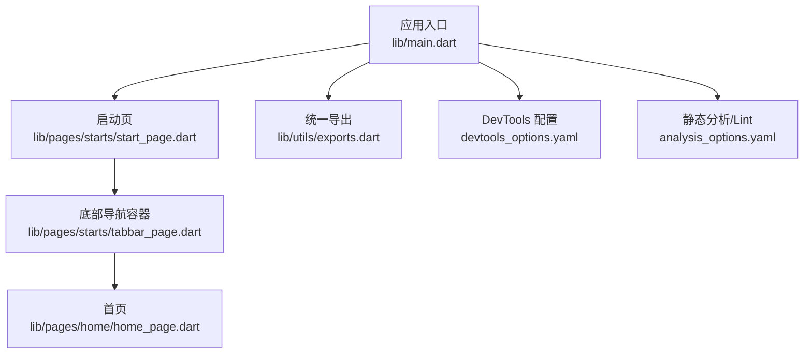
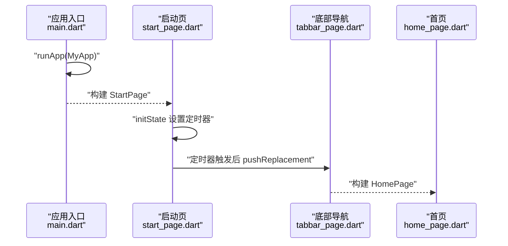
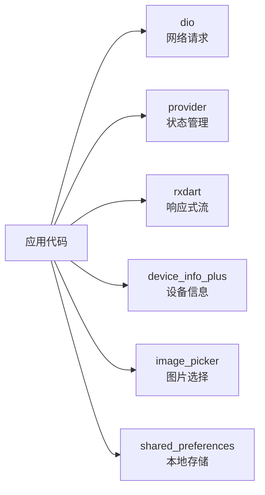

# 调试技巧

<cite>
**本文引用的文件**
- [pubspec.yaml](file://pubspec.yaml)
- [main.dart](file://lib/main.dart)
- [devtools_options.yaml](file://devtools_options.yaml)
- [analysis_options.yaml](file://analysis_options.yaml)
- [start_page.dart](file://lib/pages/starts/start_page.dart)
- [tabbar_page.dart](file://lib/pages/starts/tabbar_page.dart)
- [home_page.dart](file://lib/pages/home/home_page.dart)
- [exports.dart](file://lib/utils/exports.dart)
- [flutter_lldb_helper.py](file://ios/Flutter/ephemeral/flutter_lldb_helper.py)
- [AndroidManifest.xml（profile）](file://android/app/src/profile/AndroidManifest.xml)
- [GeneratedPluginRegistrant.java](file://android/app/src/main/java/io/flutter/plugins/GeneratedPluginRegistrant.java)
</cite>

## 目录
1. [简介](#简介)
2. [项目结构](#项目结构)
3. [核心组件](#核心组件)
4. [架构总览](#架构总览)
5. [详细组件分析](#详细组件分析)
6. [依赖分析](#依赖分析)
7. [性能考虑](#性能考虑)
8. [故障排查指南](#故障排查指南)
9. [结论](#结论)
10. [附录](#附录)

## 简介
本指南面向使用 Flutter 开发该项目的工程师，提供系统化的调试技巧与工具使用建议。内容覆盖：
- Flutter DevTools 的使用：性能分析、内存泄漏检测、UI 渲染问题排查
- 日志记录与错误处理最佳实践
- 常见问题定位：网络请求失败、状态同步问题等
- 断点调试与变量监视技巧
- 性能优化建议与瓶颈定位方法
- 移动端特有调试技巧：热重载、设备连接、网络抓包

## 项目结构
本项目为典型的 Flutter 应用，入口在 lib/main.dart，页面组织在 lib/pages 下，工具与资源导出集中在 lib/utils/exports.dart，DevTools 配置位于 devtools_options.yaml，静态分析与 Lint 规则位于 analysis_options.yaml。iOS 平台包含 LLDB 辅助脚本用于调试集成；Android profile 清单包含网络权限以支持调试通信。

**图表来源**
- [main.dart:5-22](file://lib/main.dart#L5-L22)
- [start_page.dart:5-37](file://lib/pages/starts/start_page.dart#L5-L37)
- [tabbar_page.dart:8-113](file://lib/pages/starts/tabbar_page.dart#L8-L113)
- [home_page.dart:3-25](file://lib/pages/home/home_page.dart#L3-L25)
- [exports.dart:1-5](file://lib/utils/exports.dart#L1-L5)
- [devtools_options.yaml:1-4](file://devtools_options.yaml#L1-L4)
- [analysis_options.yaml:1-32](file://analysis_options.yaml#L1-L32)

**章节来源**
- [main.dart:5-22](file://lib/main.dart#L5-L22)
- [start_page.dart:5-37](file://lib/pages/starts/start_page.dart#L5-L37)
- [tabbar_page.dart:8-113](file://lib/pages/starts/tabbar_page.dart#L8-L113)
- [home_page.dart:3-25](file://lib/pages/home/home_page.dart#L3-L25)
- [exports.dart:1-5](file://lib/utils/exports.dart#L1-L5)
- [devtools_options.yaml:1-4](file://devtools_options.yaml#L1-L4)
- [analysis_options.yaml:1-32](file://analysis_options.yaml#L1-L32)

## 核心组件
- 应用入口与主题初始化：在 main.dart 中创建 MaterialApp 并设置主题色，便于后续 UI 调试时快速识别主题相关异常。
- 启动流程：StartPage 在 initState 中使用定时器延迟跳转至 TabbarPage，适合用 DevTools 的 Timeline 观察构建与布局耗时。
- 底部导航容器：TabbarPage 管理多个页面，便于通过 Widget Inspector 检查各子页面的层级与重绘范围。
- 统一导出：exports.dart 集中导出 SVG、资源与颜色扩展，利于跨模块复用与一致性调试。

**章节来源**
- [main.dart:5-22](file://lib/main.dart#L5-L22)
- [start_page.dart:12-24](file://lib/pages/starts/start_page.dart#L12-L24)
- [tabbar_page.dart:15-52](file://lib/pages/starts/tabbar_page.dart#L15-L52)
- [exports.dart:1-5](file://lib/utils/exports.dart#L1-L5)

## 架构总览
下图展示了从应用启动到主界面的关键调用链，便于理解调试切入点与数据流。

**图表来源**
- [main.dart:5-22](file://lib/main.dart#L5-L22)
- [start_page.dart:12-24](file://lib/pages/starts/start_page.dart#L12-L24)
- [tabbar_page.dart:42-52](file://lib/pages/starts/tabbar_page.dart#L42-L52)
- [home_page.dart:3-25](file://lib/pages/home/home_page.dart#L3-L25)

## 详细组件分析

### 启动页（StartPage）调试要点
- 使用 DevTools 的 Performance 面板录制启动过程，关注 build、layout、paint 阶段耗时。
- 在定时器回调处设置断点，验证 mounted 检查是否生效，避免已销毁状态下操作 Navigator。
- 若出现卡顿，可在 build 中临时添加 RepaintBoundary 隔离区域，结合 Widget Inspector 查看重绘范围。

**章节来源**
- [start_page.dart:12-24](file://lib/pages/starts/start_page.dart#L12-L24)

### 底部导航容器（TabbarPage）调试要点
- 使用 Widget Inspector 检查 PlatformTabScaffold 的子树，确认每个 Tab 对应的页面是否正确挂载与重建。
- 在 itemChanged 回调中可加入日志，观察切换行为是否符合预期。
- 若图标或标签显示异常，检查 exports.dart 中的资源路径与颜色扩展是否正确导入。

**章节来源**
- [tabbar_page.dart:15-52](file://lib/pages/starts/tabbar_page.dart#L15-L52)
- [tabbar_page.dart:54-99](file://lib/pages/starts/tabbar_page.dart#L54-L99)
- [exports.dart:1-5](file://lib/utils/exports.dart#L1-L5)

### 首页（HomePage）调试要点
- 使用 DevTools 的 Flavors/Theme 检查当前主题色是否与预期一致。
- 若 UI 错位，使用 Layout Explorer 查看约束与对齐方式。
- 对复杂列式布局，可拆分小部件并单独测试，逐步缩小问题范围。

**章节来源**
- [home_page.dart:3-25](file://lib/pages/home/home_page.dart#L3-L25)

### iOS LLDB 集成与断点调试
- iOS 平台包含 flutter_lldb_helper.py，用于在运行时拦截特定系统调用并写入内存标记，帮助诊断调试器集成问题。
- 建议在首次运行或遇到断点不命中时，检查 Xcode 调试控制台输出是否加载了 LLDB 集成脚本。

**章节来源**
- [flutter_lldb_helper.py:1-32](file://ios/Flutter/ephemeral/flutter_lldb_helper.py#L1-L32)

### Android 调试环境
- profile 模式的 AndroidManifest.xml 包含 INTERNET 权限，确保调试期间工具链与应用通信正常。
- GeneratedPluginRegistrant.java 负责注册插件，若插件初始化失败，可在日志中查看对应错误信息。

**章节来源**
- [AndroidManifest.xml（profile）:1-7](file://android/app/src/profile/AndroidManifest.xml#L1-L7)
- [GeneratedPluginRegistrant.java:15-35](file://android/app/src/main/java/io/flutter/plugins/GeneratedPluginRegistrant.java#L15-L35)

## 依赖分析
项目依赖中包含网络库 dio、状态管理 provider、响应式 rxdart、设备信息 device_info_plus、图片选择 image_picker、本地存储 shared_preferences 等。这些依赖在调试中常用于：
- 网络请求失败：使用 Dio 的拦截器或日志打印请求/响应，配合 DevTools 的网络面板（浏览器）或抓包工具（移动端）。
- 状态同步问题：使用 Provider 的 changeNotifier 监听与 rxdart 的 Stream 组合，结合 DevTools 的 State 面板观察状态变更。
- 设备信息：device_info_plus 可用于打印设备型号、系统版本，辅助复现平台相关问题。

**图表来源**
- [pubspec.yaml:30-65](file://pubspec.yaml#L30-L65)

**章节来源**
- [pubspec.yaml:30-65](file://pubspec.yaml#L30-L65)

## 性能考虑
- 使用 DevTools 的 Performance 面板录制关键交互，关注帧率与掉帧原因。
- 使用 Memory 面板检测内存增长趋势，结合 Heap Snapshot 对比差异定位潜在泄漏。
- 使用 Widget Inspector 的“Show Repaint Boundaries”和“Show Performance Overlay”快速发现过度重绘。
- 对长列表或复杂 UI，考虑分页加载、懒加载与缓存策略。

[本节为通用性能指导，不直接分析具体文件]

## 故障排查指南

### 网络请求失败
- 现象：请求超时、返回错误或无响应。
- 排查步骤：
  - 检查 Dio 配置与拦截器日志，确认 URL、Headers、Body 正确。
  - 使用抓包工具（如 Charles、Fiddler、mitmproxy）捕获设备流量，验证服务端可达性与响应。
  - 在 Android 上确认 profile 清单包含 INTERNET 权限，避免调试时被系统拦截。
- 参考位置：
  - [pubspec.yaml:42-44](file://pubspec.yaml#L42-L44)
  - [AndroidManifest.xml（profile）:1-7](file://android/app/src/profile/AndroidManifest.xml#L1-L7)

**章节来源**
- [pubspec.yaml:42-44](file://pubspec.yaml#L42-L44)
- [AndroidManifest.xml（profile）:1-7](file://android/app/src/profile/AndroidManifest.xml#L1-L7)

### 状态同步问题
- 现象：界面状态与数据不一致，或多次更新导致闪烁。
- 排查步骤：
  - 使用 Provider 的 changeNotifier 监听，确认状态变更触发时机。
  - 使用 rxdart 的 Stream 组合，检查事件顺序与背压处理。
  - 在 DevTools 的 State 面板观察状态变化轨迹，定位异常分支。
- 参考位置：
  - [pubspec.yaml:40-45](file://pubspec.yaml#L40-L45)

**章节来源**
- [pubspec.yaml:40-45](file://pubspec.yaml#L40-L45)

### UI 渲染问题
- 现象：布局错乱、动画卡顿、重复绘制。
- 排查步骤：
  - 使用 Widget Inspector 检查层级与约束，必要时拆分组件。
  - 开启“Show Performance Overlay”，观察 FPS 与绘制时间。
  - 对复杂页面使用 RepaintBoundary 隔离，减少不必要的重绘。
- 参考位置：
  - [tabbar_page.dart:54-99](file://lib/pages/starts/tabbar_page.dart#L54-L99)

**章节来源**
- [tabbar_page.dart:54-99](file://lib/pages/starts/tabbar_page.dart#L54-L99)

### 断点调试与变量监视
- 在 Dart 代码中设置断点，观察调用栈与局部变量。
- 在 iOS 平台，LLDB 集成脚本有助于解决断点不命中或内存访问异常。
- 在 Android 平台，结合 Logcat 与 IDE 调试器，过滤关键日志。

**章节来源**
- [flutter_lldb_helper.py:1-32](file://ios/Flutter/ephemeral/flutter_lldb_helper.py#L1-L32)

### 热重载与设备连接
- 确保设备或模拟器已连接且开发者模式开启。
- 使用 IDE 的热重载功能快速迭代 UI，注意状态保持与副作用。
- 若热重载失败，检查端口占用与防火墙设置。

[本节为通用调试指导，不直接分析具体文件]

## 结论
通过系统化使用 DevTools、断点调试、日志记录与抓包工具，可以有效定位 Flutter 应用的性能瓶颈、内存泄漏与 UI 渲染问题。结合项目的依赖与平台配置，建议在日常开发中建立标准化的调试流程，提高问题定位效率与稳定性。

[本节为总结性内容，不直接分析具体文件]

## 附录

### DevTools 配置与启用
- devtools_options.yaml 用于配置 DevTools 扩展的启用状态，可根据需要开启或关闭特定功能。
- 建议在开发环境中保持默认配置，以便获得完整的调试能力。

**章节来源**
- [devtools_options.yaml:1-4](file://devtools_options.yaml#L1-L4)

### 静态分析与 Lint
- analysis_options.yaml 启用了推荐的 Lint 规则，有助于提前发现潜在问题。
- 可通过自定义规则进一步约束代码风格与质量。

**章节来源**
- [analysis_options.yaml:1-32](file://analysis_options.yaml#L1-L32)

### 资源与工具导出
- exports.dart 集中导出 SVG、资源与颜色扩展，便于跨模块复用与一致性调试。
- 若资源路径或颜色异常，优先检查该文件的导出是否正确。

**章节来源**
- [exports.dart:1-5](file://lib/utils/exports.dart#L1-L5)