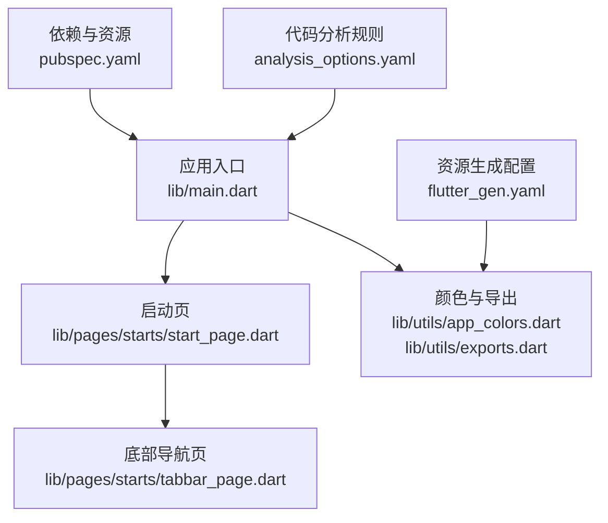
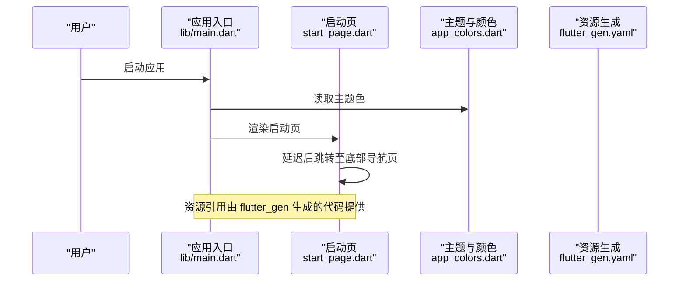
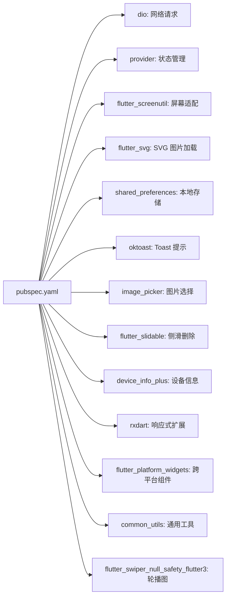

# 快速开始

<cite>
**本文引用的文件**
- [pubspec.yaml](file://pubspec.yaml)
- [analysis_options.yaml](file://analysis_options.yaml)
- [flutter_gen.yaml](file://flutter_gen.yaml)
- [lib/main.dart](file://lib/main.dart)
- [android/app/build.gradle.kts](file://android/app/build.gradle.kts)
- [ios/Runner/Info.plist](file://ios/Runner/Info.plist)
- [lib/pages/starts/start_page.dart](file://lib/pages/starts/start_page.dart)
- [lib/utils/app_colors.dart](file://lib/utils/app_colors.dart)
- [lib/utils/exports.dart](file://lib/utils/exports.dart)
</cite>

## 目录
1. [简介](#简介)
2. [项目结构](#项目结构)
3. [核心组件](#核心组件)
4. [架构总览](#架构总览)
5. [详细组件分析](#详细组件分析)
6. [依赖分析](#依赖分析)
7. [性能注意事项](#性能注意事项)
8. [故障排查指南](#故障排查指南)
9. [结论](#结论)
10. [附录](#附录)

## 简介
本指南面向首次接触该 Flutter 项目的开发者，目标是帮助你在最短时间内完成环境搭建、依赖安装、模拟器启动与第一个页面运行验证。你将了解关键配置文件的作用（如 pubspec.yaml、analysis_options.yaml、flutter_gen.yaml），并掌握常见问题的定位与解决思路。

## 项目结构
该项目是一个标准的 Flutter 工程，包含 Android 与 iOS 平台配置，以及 Dart 源码组织在 lib 目录下：
- lib/main.dart：应用入口，初始化主题并设置首页为启动页
- lib/pages：页面模块，当前包含启动页、Tabbar 页、课程、主页、设置等
- lib/utils：工具类与颜色定义
- android/ 与 ios/：平台侧构建与清单配置
- 根目录配置文件：pubspec.yaml（依赖与资源）、analysis_options.yaml（代码分析规则）、flutter_gen.yaml（资源生成器配置）

图表来源
- [lib/main.dart:1-23](file://lib/main.dart#L1-L23)
- [lib/pages/starts/start_page.dart:1-37](file://lib/pages/starts/start_page.dart#L1-L37)
- [lib/utils/app_colors.dart:1-27](file://lib/utils/app_colors.dart#L1-L27)
- [lib/utils/exports.dart:1-5](file://lib/utils/exports.dart#L1-L5)
- [pubspec.yaml:1-136](file://pubspec.yaml#L1-L136)
- [analysis_options.yaml:1-32](file://analysis_options.yaml#L1-L32)
- [flutter_gen.yaml:1-3](file://flutter_gen.yaml#L1-L3)

章节来源
- [lib/main.dart:1-23](file://lib/main.dart#L1-L23)
- [pubspec.yaml:1-136](file://pubspec.yaml#L1-L136)
- [analysis_options.yaml:1-32](file://analysis_options.yaml#L1-L32)
- [flutter_gen.yaml:1-3](file://flutter_gen.yaml#L1-L3)

## 核心组件
- 应用入口与主题：应用通过 MaterialApp 设置主题色，并将首页设置为启动页
- 启动流程：启动页在初始化时延迟跳转到底部导航页
- 颜色系统：集中管理主题色、内容色、背景色等，便于全局统一
- 资源与图标：通过 flutter_gen 自动生成资源访问代码，简化图片与 SVG 引用

章节来源
- [lib/main.dart:1-23](file://lib/main.dart#L1-L23)
- [lib/pages/starts/start_page.dart:1-37](file://lib/pages/starts/start_page.dart#L1-L37)
- [lib/utils/app_colors.dart:1-27](file://lib/utils/app_colors.dart#L1-L27)
- [flutter_gen.yaml:1-3](file://flutter_gen.yaml#L1-L3)

## 架构总览
下图展示了从应用启动到首屏渲染的关键调用链，以及资源与主题的配置关系。

图表来源
- [lib/main.dart:1-23](file://lib/main.dart#L1-L23)
- [lib/pages/starts/start_page.dart:1-37](file://lib/pages/starts/start_page.dart#L1-L37)
- [lib/utils/app_colors.dart:1-27](file://lib/utils/app_colors.dart#L1-L27)
- [flutter_gen.yaml:1-3](file://flutter_gen.yaml#L1-L3)

## 详细组件分析

### 环境与依赖配置
- Flutter SDK 版本约束：通过 environment.sdk 指定最低兼容的 Dart SDK 版本
- 第三方依赖：网络请求、状态管理、屏幕适配、SVG、本地存储、Toast、图片选择、侧滑删除等
- 开发依赖：lint、图标生成、资源生成器、审计工具
- 资源声明：assets 目录用于静态资源，配合 flutter_gen 生成类型安全的访问方式

章节来源
- [pubspec.yaml:21-87](file://pubspec.yaml#L21-L87)
- [pubspec.yaml:98-136](file://pubspec.yaml#L98-L136)

### 代码分析与质量规则
- 启用 Flutter Lints 推荐规则集
- 自定义忽略项：例如忽略重复导入
- 可通过命令行 flutter analyze 检查代码问题

章节来源
- [analysis_options.yaml:1-32](file://analysis_options.yaml#L1-L32)

### 资源生成配置
- 输出目录：默认 lib/gen/
- 集成选项：开启 flutter_svg 集成，生成便捷的资源访问方法

章节来源
- [flutter_gen.yaml:1-3](file://flutter_gen.yaml#L1-L3)

### 应用入口与首页路由
- 入口 main() 启动应用并创建 MyApp
- MyApp 使用 ThemeData 设置主题色，并将 home 设置为启动页
- 启动页在 initState 中延迟跳转到底部导航页

章节来源
- [lib/main.dart:1-23](file://lib/main.dart#L1-L23)
- [lib/pages/starts/start_page.dart:1-37](file://lib/pages/starts/start_page.dart#L1-L37)

### 颜色系统与导出
- AppColors 集中定义主题色、标题色、内容色、背景色等
- exports.dart 统一导出常用工具与资源生成代码，便于跨模块复用

章节来源
- [lib/utils/app_colors.dart:1-27](file://lib/utils/app_colors.dart#L1-L27)
- [lib/utils/exports.dart:1-5](file://lib/utils/exports.dart#L1-L5)

## 依赖分析
下图展示主要依赖之间的关系与用途，帮助你理解各包在项目中的角色。

图表来源
- [pubspec.yaml:30-65](file://pubspec.yaml#L30-L65)

章节来源
- [pubspec.yaml:30-65](file://pubspec.yaml#L30-L65)

## 性能注意事项
- 合理使用异步与定时器：启动页使用定时器进行延时跳转，注意避免内存泄漏与未挂载时的操作
- 资源加载优化：优先使用 flutter_gen 生成的资源访问方式，减少运行时解析开销
- 主题与颜色集中管理：通过 AppColors 统一管理，避免重复计算与不一致
- 网络请求与状态管理：结合 dio 与 provider，合理拆分状态与副作用，避免不必要的重建

[本节为通用指导，不直接分析具体文件]

## 故障排查指南
- 无法找到 Flutter SDK 或命令不可用
  - 确认已安装 Flutter SDK 并加入 PATH
  - 执行 flutter doctor 检查环境
- 依赖安装失败或版本冲突
  - 清理缓存后重新获取依赖
  - 检查 pubspec.yaml 中 SDK 与依赖版本是否匹配
- 资源生成未生效
  - 确保已运行资源生成命令
  - 检查 flutter_gen.yaml 配置是否正确
- 启动页无显示或跳转异常
  - 检查 main.dart 中 home 是否指向启动页
  - 查看启动页生命周期与跳转逻辑
- Android/iOS 平台构建错误
  - Android：检查 build.gradle.kts 中的 compileSdk、minSdk、Java/Kotlin 版本
  - iOS：检查 Info.plist 与 Xcode 工作区配置

章节来源
- [android/app/build.gradle.kts:7-41](file://android/app/build.gradle.kts#L7-L41)
- [ios/Runner/Info.plist:1-71](file://ios/Runner/Info.plist#L1-L71)
- [lib/main.dart:1-23](file://lib/main.dart#L1-L23)
- [lib/pages/starts/start_page.dart:1-37](file://lib/pages/starts/start_page.dart#L1-L37)

## 结论
通过以上步骤，你应能完成环境搭建、依赖安装、模拟器启动与首个页面运行验证。建议后续逐步熟悉页面结构与资源管理，并结合 lints 与调试工具提升代码质量与开发效率。

[本节为总结性内容，不直接分析具体文件]

## 附录

### 完整的环境搭建与运行步骤
- 安装 Flutter SDK
  - 前往官方文档下载并安装 Flutter SDK，确保可执行命令可用
- 安装 IDE 与插件
  - VS Code：安装 Flutter 与 Dart 插件
  - Android Studio：安装 Flutter 插件，并配置 Android SDK
- 克隆项目
  - 将仓库克隆到本地目录
- 进入项目目录并获取依赖
  - 执行依赖获取命令以安装所有依赖
- 检查设备与模拟器
  - 连接真机或启动 Android/iOS 模拟器
  - 使用设备检测命令确认设备可见
- 运行应用
  - 执行运行命令启动应用
- 验证第一个页面
  - 启动后应看到“启动页”，并在短暂延迟后跳转到底部导航页

章节来源
- [lib/main.dart:1-23](file://lib/main.dart#L1-L23)
- [lib/pages/starts/start_page.dart:1-37](file://lib/pages/starts/start_page.dart#L1-L37)

### 关键配置文件说明
- pubspec.yaml
  - 管理 Flutter 与 Dart 依赖、资源声明、图标生成配置
  - 指定 SDK 版本约束与应用元数据
- analysis_options.yaml
  - 启用 Flutter Lints 并自定义规则，支持忽略特定规则
- flutter_gen.yaml
  - 配置资源生成器输出目录与集成选项（如 flutter_svg）

章节来源
- [pubspec.yaml:21-87](file://pubspec.yaml#L21-L87)
- [pubspec.yaml:98-136](file://pubspec.yaml#L98-L136)
- [analysis_options.yaml:1-32](file://analysis_options.yaml#L1-L32)
- [flutter_gen.yaml:1-3](file://flutter_gen.yaml#L1-L3)

### 常见问题与解决方案
- 依赖版本不兼容
  - 升级或降级相关依赖，保持与 SDK 版本一致
- 资源路径错误
  - 确认 assets 目录与 pubspec.yaml 中的声明一致
- 平台权限问题
  - Android：检查 AndroidManifest.xml 与权限声明
  - iOS：检查 Info.plist 中的权限键值
- 构建失败
  - 清理构建缓存并重新构建
  - 检查 JDK、NDK、Xcode 版本与配置

章节来源
- [android/app/build.gradle.kts:7-41](file://android/app/build.gradle.kts#L7-L41)
- [ios/Runner/Info.plist:1-71](file://ios/Runner/Info.plist#L1-L71)