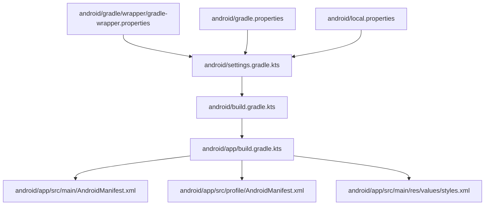
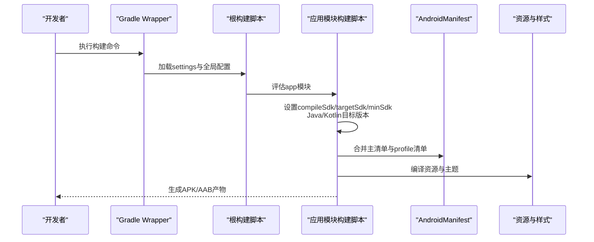
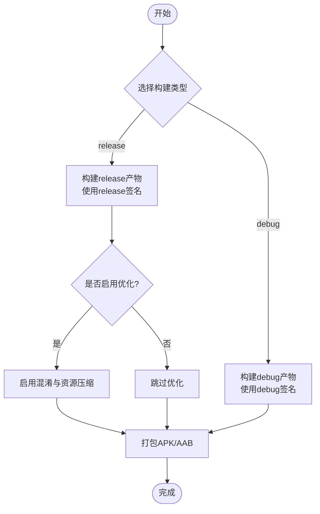
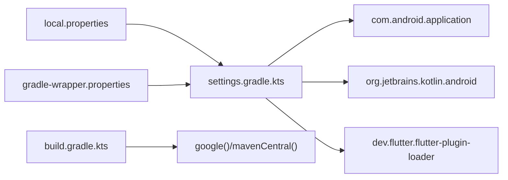

# Android构建配置

<cite>
**本文引用的文件**
- [android/app/build.gradle.kts](file://android/app/build.gradle.kts)
- [android/build.gradle.kts](file://android/build.gradle.kts)
- [android/gradle.properties](file://android/gradle.properties)
- [android/settings.gradle.kts](file://android/settings.gradle.kts)
- [android/gradle/wrapper/gradle-wrapper.properties](file://android/gradle/wrapper/gradle-wrapper.properties)
- [android/local.properties](file://android/local.properties)
- [android/app/src/main/AndroidManifest.xml](file://android/app/src/main/AndroidManifest.xml)
- [android/app/src/profile/AndroidManifest.xml](file://android/app/src/profile/AndroidManifest.xml)
- [android/app/src/main/res/values/styles.xml](file://android/app/src/main/res/values/styles.xml)
</cite>

## 目录
1. [简介](#简介)
2. [项目结构](#项目结构)
3. [核心组件](#核心组件)
4. [架构总览](#架构总览)
5. [详细组件分析](#详细组件分析)
6. [依赖关系分析](#依赖关系分析)
7. [性能优化建议](#性能优化建议)
8. [常见问题排查](#常见问题排查)
9. [结论](#结论)
10. [附录](#附录)

## 简介
本文件面向在Android平台进行Flutter应用构建与发布的开发者，系统说明Gradle构建脚本的配置项、签名与多渠道打包思路、AndroidManifest权限与元数据、APK/AAB构建流程（调试版与发布版差异）、证书管理方法、性能优化（混淆与资源压缩）以及常见构建问题的定位与解决。内容基于当前仓库中的实际配置文件进行分析与归纳。

## 项目结构
Android模块采用标准Flutter工程布局：
- android/: Gradle工程根目录，包含全局构建脚本与插件管理
- android/app/: 应用模块，包含编译配置、构建类型、清单与资源
- android/gradle/wrapper: Gradle Wrapper配置
- android/local.properties: 本地环境路径（Flutter SDK与Android SDK）

图表来源
- [android/settings.gradle.kts:1-27](file://android/settings.gradle.kts#L1-L27)
- [android/build.gradle.kts:1-25](file://android/build.gradle.kts#L1-L25)
- [android/app/build.gradle.kts:1-46](file://android/app/build.gradle.kts#L1-L46)
- [android/gradle/wrapper/gradle-wrapper.properties:1-6](file://android/gradle/wrapper/gradle-wrapper.properties#L1-L6)
- [android/gradle.properties:1-7](file://android/gradle.properties#L1-L7)
- [android/local.properties:1-2](file://android/local.properties#L1-L2)

章节来源
- [android/settings.gradle.kts:1-27](file://android/settings.gradle.kts#L1-L27)
- [android/build.gradle.kts:1-25](file://android/build.gradle.kts#L1-L25)
- [android/app/build.gradle.kts:1-46](file://android/app/build.gradle.kts#L1-L46)
- [android/gradle/wrapper/gradle-wrapper.properties:1-6](file://android/gradle/wrapper/gradle-wrapper.properties#L1-L6)
- [android/gradle.properties:1-7](file://android/gradle.properties#L1-L7)
- [android/local.properties:1-2](file://android/local.properties#L1-L2)

## 核心组件
- 应用模块编译配置：定义命名空间、编译SDK、NDK版本、Java/Kotlin目标版本、最小/目标SDK、版本号等
- 构建类型：debug与release，当前release使用debug签名以便快速验证
- 清单文件：声明入口Activity、主题、Flutter嵌入版本、查询能力等
- 资源样式：启动主题与正常主题
- Gradle环境与插件：Gradle版本、仓库源、JVM参数、AndroidX开关、插件版本与加载

章节来源
- [android/app/build.gradle.kts:7-34](file://android/app/build.gradle.kts#L7-L34)
- [android/app/src/main/AndroidManifest.xml:1-46](file://android/app/src/main/AndroidManifest.xml#L1-L46)
- [android/app/src/profile/AndroidManifest.xml:1-8](file://android/app/src/profile/AndroidManifest.xml#L1-L8)
- [android/app/src/main/res/values/styles.xml:1-19](file://android/app/src/main/res/values/styles.xml#L1-L19)
- [android/settings.gradle.kts:1-27](file://android/settings.gradle.kts#L1-L27)
- [android/gradle/wrapper/gradle-wrapper.properties:1-6](file://android/gradle/wrapper/gradle-wrapper.properties#L1-L6)
- [android/gradle.properties:1-7](file://android/gradle.properties#L1-L7)

## 架构总览
下图展示从Gradle入口到应用模块的构建装配关系，包括插件加载、仓库解析、构建类型与清单合并流程。

图表来源
- [android/settings.gradle.kts:1-27](file://android/settings.gradle.kts#L1-L27)
- [android/build.gradle.kts:1-25](file://android/build.gradle.kts#L1-L25)
- [android/app/build.gradle.kts:7-34](file://android/app/build.gradle.kts#L7-L34)
- [android/app/src/main/AndroidManifest.xml:1-46](file://android/app/src/main/AndroidManifest.xml#L1-L46)
- [android/app/src/profile/AndroidManifest.xml:1-8](file://android/app/src/profile/AndroidManifest.xml#L1-L8)
- [android/app/src/main/res/values/styles.xml:1-19](file://android/app/src/main/res/values/styles.xml#L1-L19)

## 详细组件分析

### 编译版本与语言目标
- 编译SDK与NDK：通过Flutter工具链提供，确保与Flutter版本一致
- Java与Kotlin目标：统一设置为17，保证与新特性兼容
- 最小与目标SDK：minSdk固定为24；targetSdk由Flutter工具链提供
- 应用标识与版本：applicationId、versionCode、versionName在默认配置中定义

章节来源
- [android/app/build.gradle.kts:7-26](file://android/app/build.gradle.kts#L7-L26)
- [android/app/build.gradle.kts:37-41](file://android/app/build.gradle.kts#L37-L41)

### 构建类型与签名配置
- debug：默认启用，便于开发与调试
- release：当前使用debug签名以支持快速验证；生产发布需替换为正式签名配置
- 签名管理建议：
  - 将密钥库与别名、密码等敏感信息放入独立文件或环境变量
  - 在CI/CD中注入签名凭据，避免提交到代码库
  - 为不同渠道或环境维护多套签名配置

章节来源
- [android/app/build.gradle.kts:28-34](file://android/app/build.gradle.kts#L28-L34)

### 多渠道打包策略
当前工程未内置多渠道配置。推荐做法：
- 使用productFlavors定义多个渠道（如各应用商店、内部测试渠道）
- 在对应flavor中覆盖applicationIdSuffix、versionNameSuffix、资源与清单变量
- 结合buildTypes组合出debug/release×flavors的产物矩阵
- 通过Gradle任务按渠道批量构建

提示：如需接入具体渠道（如华为、小米、OPPO、vivo），可在flavor中配置对应的包名后缀与渠道标识。

本节为概念性说明，不直接引用具体文件

### AndroidManifest权限与元数据
- 入口Activity：声明MainActivity为LAUNCHER入口，并设置launchMode、configChanges、windowSoftInputMode等
- Flutter嵌入：声明flutterEmbedding=2，确保与Flutter引擎集成
- 查询能力：queries用于声明可处理的文本动作，满足Android 11+包可见性要求
- 开发期网络权限：profile清单中包含INTERNET权限，便于调试时网络通信

章节来源
- [android/app/src/main/AndroidManifest.xml:1-46](file://android/app/src/main/AndroidManifest.xml#L1-L46)
- [android/app/src/profile/AndroidManifest.xml:1-8](file://android/app/src/profile/AndroidManifest.xml#L1-L8)

### 资源与主题
- 启动主题：LaunchTheme指定启动背景图，提升冷启动体验
- 正常主题：NormalTheme在Flutter UI绘制后生效
- 夜间模式：values-night下可定义深色主题资源

章节来源
- [android/app/src/main/res/values/styles.xml:1-19](file://android/app/src/main/res/values/styles.xml#L1-L19)

### Gradle环境与插件
- Gradle版本：通过Wrapper锁定为特定版本，保证构建一致性
- 仓库源：google()与mavenCentral()
- JVM参数：增大堆内存与元空间，降低OOM风险
- AndroidX：启用AndroidX支持
- 插件版本：Android Gradle Plugin与Kotlin插件版本在settings中集中管理

章节来源
- [android/gradle/wrapper/gradle-wrapper.properties:1-6](file://android/gradle/wrapper/gradle-wrapper.properties#L1-L6)
- [android/gradle.properties:1-7](file://android/gradle.properties#L1-L7)
- [android/settings.gradle.kts:1-27](file://android/settings.gradle.kts#L1-L27)

### APK与AAB构建流程（调试版与发布版）
- 调试版（debug）：
  - 使用debug签名，便于本地安装与调试
  - 通常不进行混淆与资源压缩
- 发布版（release）：
  - 必须使用正式签名配置
  - 建议开启混淆与资源压缩以提升安全性与体积优化
  - 可生成APK或AAB；AAB适用于Google Play等分发平台

图表来源
- [android/app/build.gradle.kts:28-34](file://android/app/build.gradle.kts#L28-L34)

章节来源
- [android/app/build.gradle.kts:28-34](file://android/app/build.gradle.kts#L28-L34)

### 签名证书配置与管理
- 当前release使用debug签名，适合临时验证
- 生产发布应创建独立密钥库，并在构建脚本中引用
- 安全建议：
  - 将密钥库与密码保存在安全位置或CI/CD密钥管理
  - 不要将真实密钥提交至代码仓库
  - 为不同环境（测试/预发/生产）分别管理签名

本节为概念性说明，不直接引用具体文件

## 依赖关系分析
- 插件与版本：
  - Android Gradle Plugin与Kotlin插件版本在settings中声明
  - Flutter Gradle插件在应用模块中引入
- 仓库与本地属性：
  - 根构建脚本声明google与mavenCentral仓库
  - local.properties提供Flutter SDK与Android SDK路径
  - gradle-wrapper.properties锁定Gradle版本

图表来源
- [android/settings.gradle.kts:1-27](file://android/settings.gradle.kts#L1-L27)
- [android/build.gradle.kts:1-25](file://android/build.gradle.kts#L1-L25)
- [android/local.properties:1-2](file://android/local.properties#L1-L2)
- [android/gradle/wrapper/gradle-wrapper.properties:1-6](file://android/gradle/wrapper/gradle-wrapper.properties#L1-L6)

章节来源
- [android/settings.gradle.kts:1-27](file://android/settings.gradle.kts#L1-L27)
- [android/build.gradle.kts:1-25](file://android/build.gradle.kts#L1-L25)
- [android/local.properties:1-2](file://android/local.properties#L1-L2)
- [android/gradle/wrapper/gradle-wrapper.properties:1-6](file://android/gradle/wrapper/gradle-wrapper.properties#L1-L6)

## 性能优化建议
- 代码混淆：
  - 在release构建类型中启用R8/ProGuard规则，减少体积并提高反编译难度
  - 针对第三方库添加必要的保留规则
- 资源压缩：
  - 启用资源压缩与移除未使用资源，减小安装包体积
- 构建缓存与并行：
  - 合理配置Gradle守护进程与并行构建
  - 利用增量编译与配置缓存提升构建速度
- NDK与C++：
  - 仅包含所需ABI，避免冗余架构
- 动态特性：
  - 按需拆分模块或使用Play Asset Delivery进一步降低首包大小

本节为通用优化建议，不直接引用具体文件

## 常见问题排查
- 构建失败：找不到Flutter SDK或Android SDK
  - 检查local.properties中flutter.sdk与sdk.dir是否正确
- Gradle版本不一致
  - 确认gradle-wrapper.properties中的Gradle版本与AGP/Kotlin版本兼容
- 内存不足导致OOM
  - 调整gradle.properties中的JVM参数，适当增加堆与元空间
- 清单冲突或权限缺失
  - 检查main与profile清单合并结果，确保必要权限已声明
- 发布包无法安装
  - 确认release已配置正确的签名，而非debug签名
- 包可见性问题（Android 11+）
  - 确保queries中声明了所需的intent-action与mimeType

章节来源
- [android/local.properties:1-2](file://android/local.properties#L1-L2)
- [android/gradle/wrapper/gradle-wrapper.properties:1-6](file://android/gradle/wrapper/gradle-wrapper.properties#L1-L6)
- [android/gradle.properties:1-7](file://android/gradle.properties#L1-L7)
- [android/app/src/main/AndroidManifest.xml:1-46](file://android/app/src/main/AndroidManifest.xml#L1-L46)
- [android/app/src/profile/AndroidManifest.xml:1-8](file://android/app/src/profile/AndroidManifest.xml#L1-L8)
- [android/app/build.gradle.kts:28-34](file://android/app/build.gradle.kts#L28-L34)

## 结论
该Flutter工程的Android构建配置简洁清晰，遵循Flutter模板的最佳实践。当前release仍使用debug签名，建议在正式发布前完善签名配置，并根据需要引入多渠道与性能优化策略。通过合理的Gradle参数、清单与资源管理，可获得稳定高效的构建体验与更小的安装包体积。

## 附录
- 常用构建命令（参考）：
  - 调试构建：flutter build apk --debug / flutter build appbundle --debug
  - 发布构建：flutter build apk --release / flutter build appbundle --release
- 相关配置位置速查：
  - 应用模块构建脚本：android/app/build.gradle.kts
  - 清单文件：android/app/src/main/AndroidManifest.xml
  - 资源样式：android/app/src/main/res/values/styles.xml
  - Gradle Wrapper：android/gradle/wrapper/gradle-wrapper.properties
  - 全局Gradle属性：android/gradle.properties
  - 插件与版本：android/settings.gradle.kts
  - 本地环境：android/local.properties