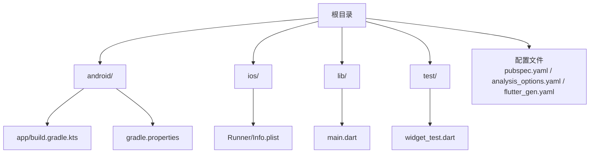
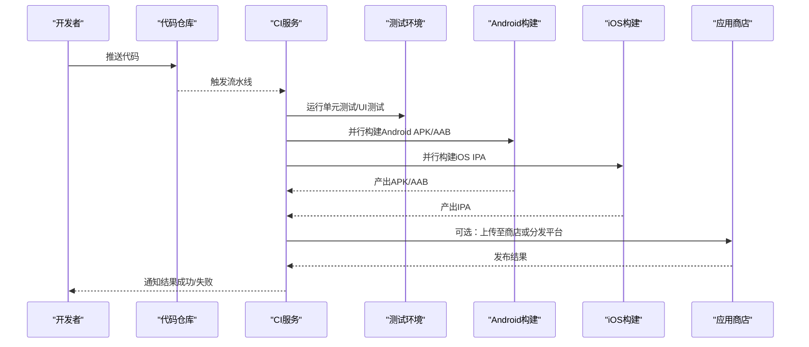
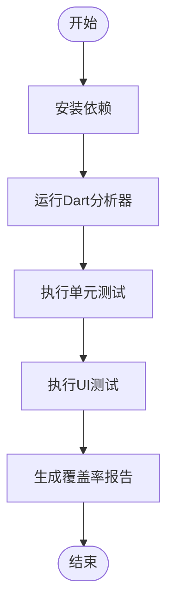
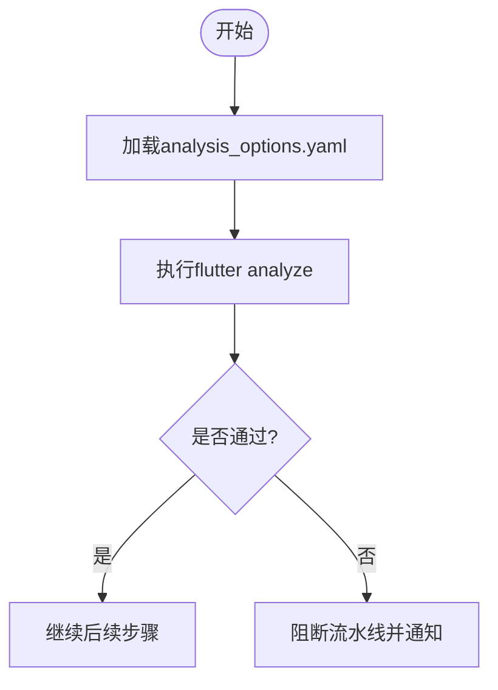
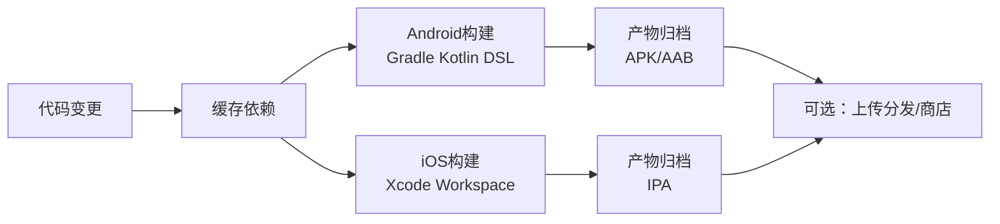
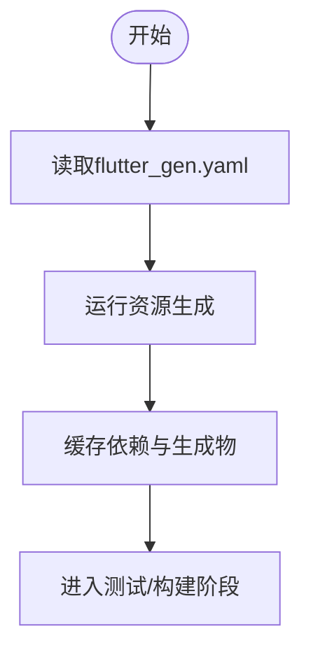
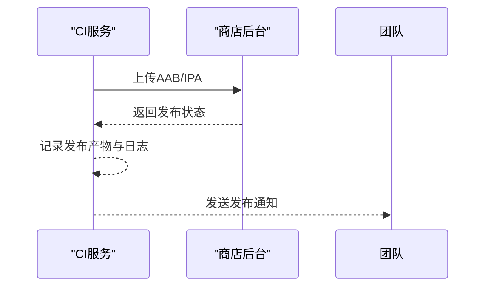
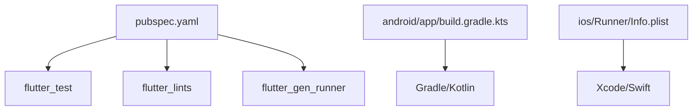

# CI/CD流水线配置

<cite>
**本文引用的文件**
- [pubspec.yaml](file://pubspec.yaml)
- [analysis_options.yaml](file://analysis_options.yaml)
- [main.dart](file://lib/main.dart)
- [widget_test.dart](file://test/widget_test.dart)
- [build.gradle.kts](file://android/app/build.gradle.kts)
- [gradle.properties](file://android/gradle.properties)
- [Info.plist](file://ios/Runner/Info.plist)
- [flutter_gen.yaml](file://flutter_gen.yaml)
</cite>

## 目录
1. [简介](#简介)
2. [项目结构](#项目结构)
3. [核心组件](#核心组件)
4. [架构总览](#架构总览)
5. [详细组件分析](#详细组件分析)
6. [依赖关系分析](#依赖关系分析)
7. [性能考虑](#性能考虑)
8. [故障排查指南](#故障排查指南)
9. [结论](#结论)
10. [附录](#附录)

## 简介
本指南面向Flutter多端（Android与iOS）项目的持续集成与持续部署（CI/CD）落地，提供GitHub Actions与GitLab CI的完整配置思路与实践建议。内容覆盖：
- 自动化测试：单元测试与UI测试的自动执行
- 代码质量检查：Dart分析器与静态检查
- 构建流程：Android与iOS并行构建、签名与产物归档
- 发布部署：应用商店自动化发布的策略与注意事项
- 监控告警：流水线状态监控与失败通知
- 安全与密钥：环境变量与敏感信息的安全管理

## 项目结构
本项目为标准的Flutter工程，包含Android与iOS原生工程以及Dart源码与测试：
- Android：使用Kotlin DSL与Gradle插件进行构建，版本与签名在配置中声明
- iOS：基于Xcode工作区，Info.plist定义Bundle标识与版本变量
- Dart：入口main.dart，测试位于test目录，分析规则由analysis_options.yaml管理
- 资源生成：通过flutter_gen.yaml启用SVG等资源代码生成

**图表来源**
- [build.gradle.kts:1-46](file://android/app/build.gradle.kts#L1-L46)
- [gradle.properties:1-7](file://android/gradle.properties#L1-L7)
- [Info.plist:1-71](file://ios/Runner/Info.plist#L1-L71)
- [main.dart:1-23](file://lib/main.dart#L1-L23)
- [widget_test.dart:1-21](file://test/widget_test.dart#L1-L21)
- [pubspec.yaml:1-136](file://pubspec.yaml#L1-L136)
- [analysis_options.yaml:1-32](file://analysis_options.yaml#L1-L32)
- [flutter_gen.yaml:1-3](file://flutter_gen.yaml#L1-L3)

**章节来源**
- [pubspec.yaml:1-136](file://pubspec.yaml#L1-L136)
- [analysis_options.yaml:1-32](file://analysis_options.yaml#L1-L32)
- [main.dart:1-23](file://lib/main.dart#L1-L23)
- [widget_test.dart:1-21](file://test/widget_test.dart#L1-L21)
- [build.gradle.kts:1-46](file://android/app/build.gradle.kts#L1-L46)
- [gradle.properties:1-7](file://android/gradle.properties#L1-L7)
- [Info.plist:1-71](file://ios/Runner/Info.plist#L1-L71)
- [flutter_gen.yaml:1-3](file://flutter_gen.yaml#L1-L3)

## 核心组件
- 应用入口与主题：main.dart定义了应用启动与主题色，便于UI一致性校验
- 测试用例：widget_test.dart对启动页到首页的跳转进行UI测试断言
- 代码质量：analysis_options.yaml启用Flutter Lints并自定义规则
- 构建配置：Android Gradle配置了编译选项、最低SDK、版本信息与签名占位；iOS Info.plist使用变量注入构建名与版本号
- 资源生成：flutter_gen.yaml启用SVG集成，减少手动资源处理

这些组件共同构成CI/CD的基础：测试驱动质量门禁、分析器保障代码规范、构建配置确保可重复构建与产物一致。

**章节来源**
- [main.dart:1-23](file://lib/main.dart#L1-L23)
- [widget_test.dart:1-21](file://test/widget_test.dart#L1-L21)
- [analysis_options.yaml:1-32](file://analysis_options.yaml#L1-L32)
- [build.gradle.kts:1-46](file://android/app/build.gradle.kts#L1-L46)
- [Info.plist:1-71](file://ios/Runner/Info.plist#L1-L71)
- [flutter_gen.yaml:1-3](file://flutter_gen.yaml#L1-L3)

## 架构总览
下图展示CI/CD流水线的整体架构：从代码提交触发，依次执行依赖安装、静态检查、测试、构建与发布，同时支持Android与iOS并行构建。

**图表来源**
- [pubspec.yaml:1-136](file://pubspec.yaml#L1-L136)
- [build.gradle.kts:1-46](file://android/app/build.gradle.kts#L1-L46)
- [Info.plist:1-71](file://ios/Runner/Info.plist#L1-L71)

## 详细组件分析

### 自动化测试集成
- 单元测试与UI测试：通过flutter test执行，结合widget_test.dart中的UI断言验证页面跳转逻辑
- 覆盖率收集：可在CI中开启coverage并上传报告，便于质量度量
- 并行化：按模块或文件拆分测试任务，缩短执行时间

**图表来源**
- [widget_test.dart:1-21](file://test/widget_test.dart#L1-L21)
- [analysis_options.yaml:1-32](file://analysis_options.yaml#L1-L32)
- [pubspec.yaml:1-136](file://pubspec.yaml#L1-L136)

**章节来源**
- [widget_test.dart:1-21](file://test/widget_test.dart#L1-L21)
- [analysis_options.yaml:1-32](file://analysis_options.yaml#L1-L32)
- [pubspec.yaml:1-136](file://pubspec.yaml#L1-L136)

### 代码质量检查
- 静态分析：使用flutter analyze，依据analysis_options.yaml的规则集进行检查
- Lint规则：继承Flutter推荐规则，可按需调整或禁用特定规则
- 质量门禁：在CI中将analyze作为必过步骤，阻止不合规代码合并

**图表来源**
- [analysis_options.yaml:1-32](file://analysis_options.yaml#L1-L32)

**章节来源**
- [analysis_options.yaml:1-32](file://analysis_options.yaml#L1-L32)

### 构建流程（Android与iOS并行）
- Android构建：基于Gradle Kotlin DSL，设置Java/Kotlin目标版本、minSdk、versionCode/versionName，并在release中配置签名
- iOS构建：基于Xcode工作区，Info.plist使用$(FLUTTER_BUILD_NAME)与$(FLUTTER_BUILD_NUMBER)注入版本信息
- 并行构建：在CI中同时启动Android与iOS构建任务，提升效率

**图表来源**
- [build.gradle.kts:1-46](file://android/app/build.gradle.kts#L1-L46)
- [Info.plist:1-71](file://ios/Runner/Info.plist#L1-L71)
- [pubspec.yaml:1-136](file://pubspec.yaml#L1-L136)

**章节来源**
- [build.gradle.kts:1-46](file://android/app/build.gradle.kts#L1-L46)
- [gradle.properties:1-7](file://android/gradle.properties#L1-L7)
- [Info.plist:1-71](file://ios/Runner/Info.plist#L1-L71)
- [pubspec.yaml:1-136](file://pubspec.yaml#L1-L136)

### 资源生成与依赖准备
- flutter_gen_runner：根据flutter_gen.yaml生成资源访问代码，提高资源引用安全性与便捷性
- 依赖安装：在CI中优先缓存.pub-cache与Pods，加速构建

**图表来源**
- [flutter_gen.yaml:1-3](file://flutter_gen.yaml#L1-L3)
- [pubspec.yaml:1-136](file://pubspec.yaml#L1-L136)

**章节来源**
- [flutter_gen.yaml:1-3](file://flutter_gen.yaml#L1-L3)
- [pubspec.yaml:1-136](file://pubspec.yaml#L1-L136)

### 自动化部署到应用商店
- Android：生成AAB后，可通过Google Play Console API或Fastlane上传；注意在CI中注入签名凭据与API密钥
- iOS：生成IPA后，可通过App Store Connect API或Fastlane分发；需要Apple Developer账号与证书/描述文件
- 分支策略：仅对主分支或指定标签执行发布任务，避免误发

[本节为概念性说明，不直接映射具体源文件]

### 流水线监控与故障告警
- 状态看板：利用CI平台的流水线视图查看各阶段状态与耗时
- 通知机制：配置邮件、企业微信、Slack等通知渠道，失败时即时提醒
- 重试与回滚：对不稳定任务配置重试；发布失败时快速回滚到上一稳定版本

[本节为概念性说明，不直接映射具体源文件]

### 环境变量与密钥安全管理
- 使用CI提供的Secrets管理敏感信息（如签名文件、商店API Key、Apple ID）
- 避免将密钥写入代码或配置文件；通过环境变量注入到构建过程
- 最小权限原则：为不同环境（开发/预发/生产）配置独立密钥与变量

[本节为概念性说明，不直接映射具体源文件]

## 依赖关系分析
- 构建依赖：Android依赖Gradle与Kotlin，iOS依赖Xcode与Swift工具链
- Dart依赖：通过pubspec.yaml管理，CI中需缓存依赖以加速
- 资源生成：flutter_gen_runner与flutter_svg集成影响构建产物

**图表来源**
- [pubspec.yaml:1-136](file://pubspec.yaml#L1-L136)
- [build.gradle.kts:1-46](file://android/app/build.gradle.kts#L1-L46)
- [Info.plist:1-71](file://ios/Runner/Info.plist#L1-L71)

**章节来源**
- [pubspec.yaml:1-136](file://pubspec.yaml#L1-L136)
- [build.gradle.kts:1-46](file://android/app/build.gradle.kts#L1-L46)
- [Info.plist:1-71](file://ios/Runner/Info.plist#L1-L71)

## 性能考虑
- 依赖缓存：缓存.pub-cache、Pods与Gradle Wrapper，显著缩短冷启动时间
- 并行化：测试与构建分阶段并行执行，充分利用CI并发能力
- 增量构建：仅在变更模块执行相关测试与构建，减少不必要开销
- 资源优化：合理使用flutter_gen减少运行时资源解析成本

[本节为通用指导，不直接映射具体源文件]

## 故障排查指南
- 分析失败：检查analysis_options.yaml规则与代码是否符合Lint要求
- 测试失败：定位widget_test.dart中的断言失败点，确认页面逻辑与依赖
- 构建失败：核对Android Gradle版本、Java/Kotlin目标版本与iOS签名配置
- 依赖问题：清理缓存并重新安装依赖，确认网络与镜像源可达

**章节来源**
- [analysis_options.yaml:1-32](file://analysis_options.yaml#L1-L32)
- [widget_test.dart:1-21](file://test/widget_test.dart#L1-L21)
- [build.gradle.kts:1-46](file://android/app/build.gradle.kts#L1-L46)
- [Info.plist:1-71](file://ios/Runner/Info.plist#L1-L71)

## 结论
通过本指南，可为Flutter项目建立稳定高效的CI/CD流水线：以测试与分析为质量门禁，以并行构建提升效率，以安全密钥管理保障发布可靠性。建议逐步落地并持续优化，结合团队实际选择GitHub Actions或GitLab CI，实现从代码到商店的全链路自动化。

[本节为总结性内容，不直接映射具体源文件]

## 附录
- 关键配置文件路径参考：
  - 应用入口：lib/main.dart
  - UI测试：test/widget_test.dart
  - 分析规则：analysis_options.yaml
  - Android构建：android/app/build.gradle.kts
  - iOS清单：ios/Runner/Info.plist
  - 资源生成：flutter_gen.yaml
  - 依赖声明：pubspec.yaml

[本节为索引性内容，不直接映射具体源文件]