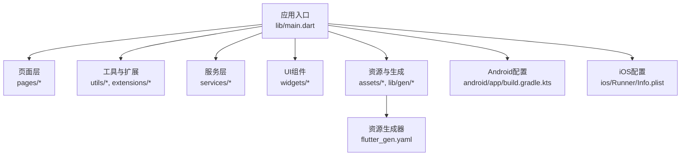
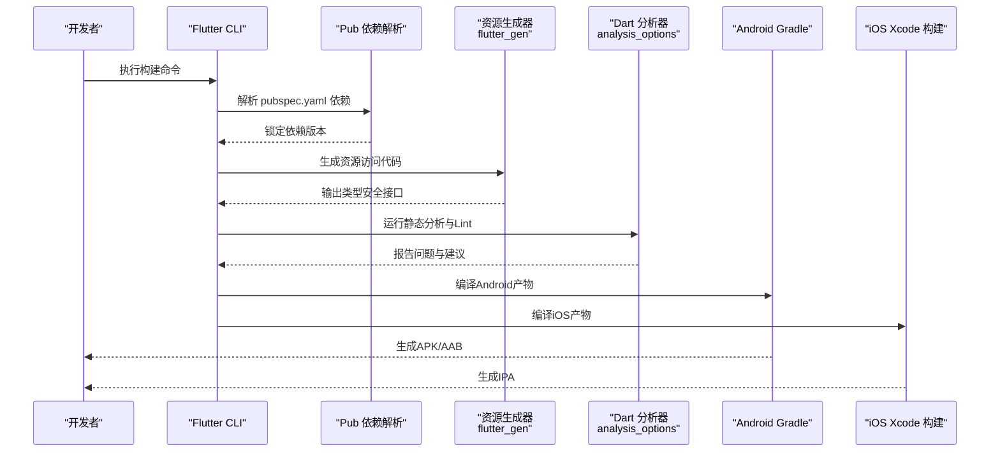
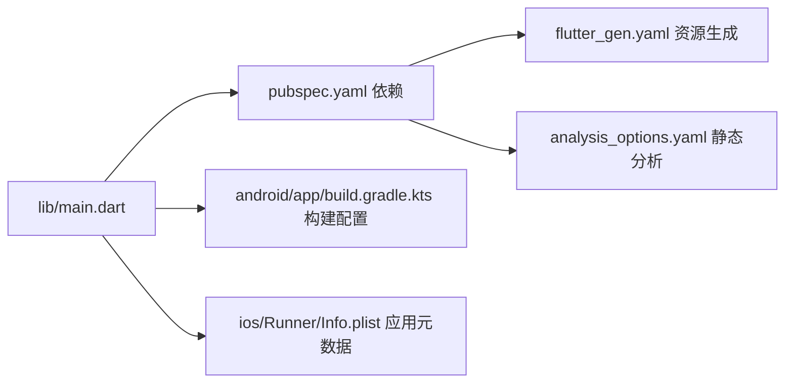

# Flutter构建优化

<cite>
**本文引用的文件**
- [pubspec.yaml](file://pubspec.yaml)
- [analysis_options.yaml](file://analysis_options.yaml)
- [flutter_gen.yaml](file://flutter_gen.yaml)
- [devtools_options.yaml](file://devtools_options.yaml)
- [lib/main.dart](file://lib/main.dart)
- [android/app/build.gradle.kts](file://android/app/build.gradle.kts)
- [android/gradle.properties](file://android/gradle.properties)
- [ios/Runner/Info.plist](file://ios/Runner/Info.plist)
</cite>

## 目录
1. [简介](#简介)
2. [项目结构](#项目结构)
3. [核心组件](#核心组件)
4. [架构总览](#架构总览)
5. [详细组件分析](#详细组件分析)
6. [依赖关系分析](#依赖关系分析)
7. [性能考量](#性能考量)
8. [故障排查指南](#故障排查指南)
9. [结论](#结论)
10. [附录](#附录)

## 简介
本指南面向Flutter项目的构建优化，围绕以下目标展开：
- 依赖管理与版本控制策略（基于 pubspec.yaml）
- 代码分割与资源优化（图片压缩、字体优化）
- Dart静态分析与Lint规则配置（analysis_options.yaml）
- 构建缓存与增量编译优化
- 不同构建模式（debug/release/profile）的配置与使用场景
- 第三方插件的构建优化技巧
- 构建性能监控与分析工具使用方法

## 项目结构
该Flutter工程采用标准分层组织：应用入口在 lib/main.dart；业务页面位于 pages；通用能力封装在 utils、widgets、services、extensions 等目录；平台相关配置分别位于 android 和 ios 目录。资源集中在 assets/images，并通过 flutter_gen 生成类型安全的资源访问代码。

图表来源
- [lib/main.dart:1-23](file://lib/main.dart#L1-L23)
- [flutter_gen.yaml:1-3](file://flutter_gen.yaml#L1-L3)
- [android/app/build.gradle.kts:1-46](file://android/app/build.gradle.kts#L1-L46)
- [ios/Runner/Info.plist:1-71](file://ios/Runner/Info.plist#L1-L71)

章节来源
- [lib/main.dart:1-23](file://lib/main.dart#L1-L23)
- [pubspec.yaml:1-136](file://pubspec.yaml#L1-L136)

## 核心组件
- 依赖声明与版本约束：通过 pubspec.yaml 管理运行时与开发时依赖，明确SDK版本与第三方包版本范围，便于可重复构建与升级。
- 资源与代码生成：通过 flutter_gen.yaml 启用 flutter_svg 集成，自动生成类型安全的资源访问方法，减少运行时错误并提升构建期检查能力。
- 静态分析与Lint：analysis_options.yaml 继承 flutter_lints，统一代码风格与质量规则，支持按需开启/关闭规则。
- 平台构建配置：Android Gradle脚本定义编译选项、最小API级别、签名配置；iOS Info.plist 定义应用元数据与启动行为。

章节来源
- [pubspec.yaml:21-87](file://pubspec.yaml#L21-L87)
- [flutter_gen.yaml:1-3](file://flutter_gen.yaml#L1-L3)
- [analysis_options.yaml:1-32](file://analysis_options.yaml#L1-L32)
- [android/app/build.gradle.kts:7-34](file://android/app/build.gradle.kts#L7-L34)
- [ios/Runner/Info.plist:5-26](file://ios/Runner/Info.plist#L5-L26)

## 架构总览
下图展示了从应用入口到平台构建的关键路径，以及资源生成与静态分析在构建流程中的位置。

图表来源
- [pubspec.yaml:21-87](file://pubspec.yaml#L21-L87)
- [flutter_gen.yaml:1-3](file://flutter_gen.yaml#L1-L3)
- [analysis_options.yaml:1-32](file://analysis_options.yaml#L1-L32)
- [android/app/build.gradle.kts:1-46](file://android/app/build.gradle.kts#L1-L46)
- [ios/Runner/Info.plist:1-71](file://ios/Runner/Info.plist#L1-L71)

## 详细组件分析

### 依赖管理与版本控制策略（pubspec.yaml）
- SDK与环境约束：固定SDK版本范围，确保团队与CI环境一致性。
- 依赖分组：将运行时依赖与开发依赖分离，避免生产包体积膨胀。
- 版本策略：
  - 使用语义化版本范围（如 ^x.y.z），平衡兼容性与稳定性。
  - 对关键库（网络、状态管理、图片处理）选择成熟稳定的主版本。
  - 定期执行依赖升级检查，评估变更影响后再升级。
- 资源与图标：通过 flutter_launcher_icons 配置自动生成多分辨率图标，减少手动维护成本。
- 资源生成：启用 flutter_svg 集成，使SVG资源具备类型安全访问方式，利于构建期校验。

章节来源
- [pubspec.yaml:21-87](file://pubspec.yaml#L21-L87)
- [pubspec.yaml:88-97](file://pubspec.yaml#L88-L97)

### 代码分割与资源优化
- 图片资源：
  - 优先使用矢量格式（SVG）以获得更小的体积与更好的缩放效果；通过 flutter_svg 加载并在 flutter_gen 中生成类型安全访问方法。
  - 位图资源建议提供多密度适配（hdpi/xhdpi/xxhdpi/xxxhdpi），并按需裁剪尺寸，避免过大图片被打包。
  - 使用构建期工具进行图片压缩（如pngcrush、jpegoptim），或在CI流水线中加入压缩步骤。
- 字体优化：
  - 仅引入需要的字重与字符集，避免全量字体导致包体增大。
  - 使用子集化工具或字体服务，按需加载字体。
- 资源声明：
  - 在 pubspec.yaml 的 assets 字段精确声明所需目录，避免冗余资源被打包。
  - 利用 flutter_gen 生成的类型安全接口，减少运行时资源查找开销。

章节来源
- [pubspec.yaml:106-136](file://pubspec.yaml#L106-L136)
- [flutter_gen.yaml:1-3](file://flutter_gen.yaml#L1-L3)

### Dart静态分析与Lint规则（analysis_options.yaml）
- 继承官方推荐规则：通过 include flutter_lints/flutter.yaml 获得基础规则集。
- 自定义规则：可按需启用/禁用特定规则，保持团队一致编码风格。
- 忽略策略：对个别文件或行使用 ignore 注释进行局部豁免，避免全局放宽规则。
- 持续集成：在CI中执行 flutter analyze，阻断不符合规范的提交。

章节来源
- [analysis_options.yaml:1-32](file://analysis_options.yaml#L1-L32)

### 构建缓存与增量编译优化
- Gradle缓存：
  - 合理设置JVM参数（堆内存、元空间、代码缓存），避免OOM并提升构建速度。
  - 启用Gradle守护进程与并行构建，缩短冷/热构建时间。
- Flutter/Dart层面：
  - 使用 --no-sound-null-safety 以外的现代构建选项，充分利用增量编译。
  - 清理不必要的依赖与资源，减少扫描与编译范围。
- 平台构建：
  - Android：配置合适的 compileSdk/targetSdk/minSdk，避免不必要的兼容性处理。
  - iOS：精简Info.plist与资源，减少Xcode构建阶段耗时。

章节来源
- [android/gradle.properties:1-7](file://android/gradle.properties#L1-L7)
- [android/app/build.gradle.kts:7-34](file://android/app/build.gradle.kts#L7-L34)

### 构建模式配置与使用场景
- Debug模式：
  - 特点：包含调试符号、未优化、快速迭代。
  - 用途：日常开发与联调。
- Release模式：
  - 特点：启用优化、移除调试信息、签名发布。
  - 用途：生产环境发布。
- Profile模式：
  - 特点：保留性能剖析信息，用于性能瓶颈定位。
  - 用途：性能测试与优化。

章节来源
- [android/app/build.gradle.kts:28-34](file://android/app/build.gradle.kts#L28-L34)

### 第三方插件的构建优化技巧
- 选择轻量替代：优先选择体积小、功能聚焦的插件，避免引入重型依赖。
- 按需启用特性：许多插件提供可选模块或开关，仅启用必要功能。
- 资源与代码生成：结合 flutter_gen 与 build_runner，在构建期生成类型安全接口，减少运行时反射与查找。
- 平台差异处理：针对Android/iOS分别优化原生侧配置，避免无用代码进入最终产物。

章节来源
- [pubspec.yaml:30-65](file://pubspec.yaml#L30-L65)
- [flutter_gen.yaml:1-3](file://flutter_gen.yaml#L1-L3)

### 构建性能监控与分析工具
- DevTools：
  - 通过 devtools_options.yaml 启用/配置扩展，便于在构建后进行分析。
- 命令行工具：
  - flutter analyze：静态分析与Lint。
  - flutter build：执行构建并可附加性能标志。
  - flutter pub outdated：检查依赖更新情况。
- CI集成：
  - 在流水线中执行分析、构建与打包，记录构建时长与产物大小，持续改进。

章节来源
- [devtools_options.yaml:1-4](file://devtools_options.yaml#L1-L4)

## 依赖关系分析
下图展示应用入口与平台配置的依赖关系，体现构建链路中的关键节点。

图表来源
- [lib/main.dart:1-23](file://lib/main.dart#L1-L23)
- [pubspec.yaml:21-87](file://pubspec.yaml#L21-L87)
- [flutter_gen.yaml:1-3](file://flutter_gen.yaml#L1-L3)
- [analysis_options.yaml:1-32](file://analysis_options.yaml#L1-L32)
- [android/app/build.gradle.kts:1-46](file://android/app/build.gradle.kts#L1-L46)
- [ios/Runner/Info.plist:1-71](file://ios/Runner/Info.plist#L1-L71)

章节来源
- [pubspec.yaml:21-87](file://pubspec.yaml#L21-L87)
- [android/app/build.gradle.kts:1-46](file://android/app/build.gradle.kts#L1-L46)
- [ios/Runner/Info.plist:1-71](file://ios/Runner/Info.plist#L1-L71)

## 性能考量
- 依赖瘦身：移除未使用的插件与资源，降低包体与初始化开销。
- 资源优化：矢量优先、位图压缩、字体子集化。
- 构建加速：合理JVM参数、启用并行与缓存、减少不必要任务。
- 分析驱动：持续运行静态分析与性能剖析，定位热点与问题。

## 故障排查指南
- 构建失败：
  - 检查依赖版本冲突与SDK版本匹配。
  - 查看Gradle/Xcode日志，定位具体错误。
- 包体过大：
  - 分析资源占用，剔除冗余图片与字体。
  - 检查是否引入了不必要的插件或功能。
- 构建缓慢：
  - 调整JVM参数与Gradle缓存。
  - 减少同步与解析阶段的负担。

章节来源
- [android/gradle.properties:1-7](file://android/gradle.properties#L1-L7)
- [android/app/build.gradle.kts:7-34](file://android/app/build.gradle.kts#L7-L34)

## 结论
通过合理的依赖管理、资源优化、静态分析与构建配置，可以显著提升Flutter项目的构建效率与产物质量。建议在团队内建立统一的规范与CI流程，持续监控与优化构建性能。

## 附录
- 常用命令参考：
  - flutter analyze：运行静态分析。
  - flutter build apk/ipa：构建发布包。
  - flutter pub outdated：检查依赖更新。
- 最佳实践清单：
  - 固定SDK与关键依赖版本。
  - 启用类型安全资源访问。
  - 在CI中执行分析与构建。
  - 定期审查资源与依赖。