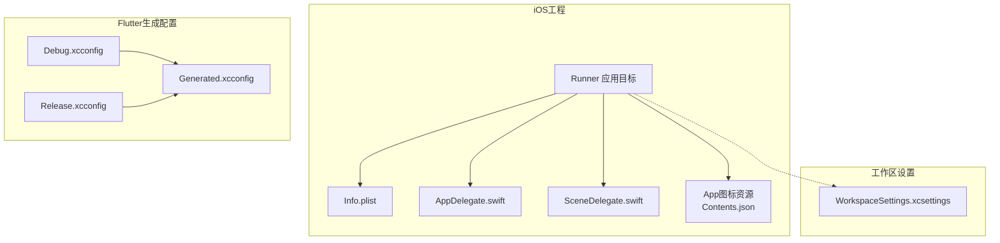
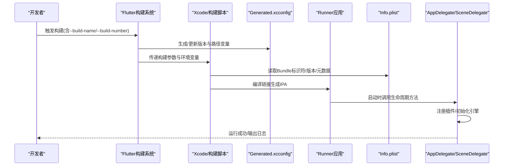
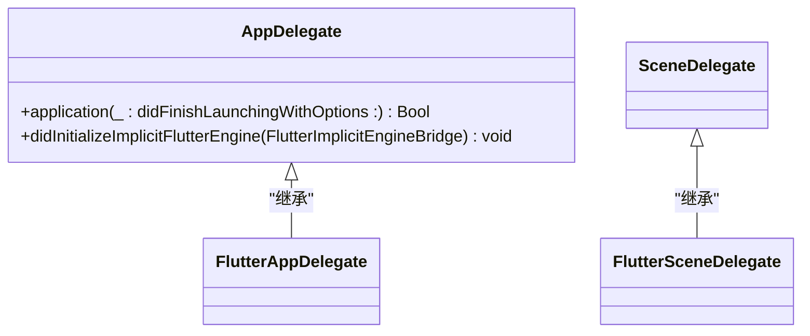
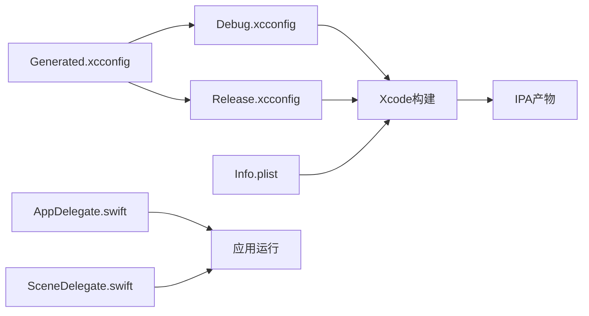

# iOS构建配置

<cite>
**本文档引用的文件**
- [Info.plist](file://ios/Runner/Info.plist)
- [Generated.xcconfig](file://ios/Flutter/Generated.xcconfig)
- [Debug.xcconfig](file://ios/Flutter/Debug.xcconfig)
- [Release.xcconfig](file://ios/Flutter/Release.xcconfig)
- [WorkspaceSettings.xcsettings](file://ios/Runner.xcworkspace/xcshareddata/WorkspaceSettings.xcsettings)
- [AppDelegate.swift](file://ios/Runner/AppDelegate.swift)
- [SceneDelegate.swift](file://ios/Runner/SceneDelegate.swift)
- [Contents.json（App图标）](file://ios/Runner/Assets.xcassets/AppIcon.appiconset/Contents.json)
- [pubspec.yaml](file://pubspec.yaml)
</cite>

## 目录
1. [简介](#简介)
2. [项目结构](#项目结构)
3. [核心组件](#核心组件)
4. [架构总览](#架构总览)
5. [详细组件分析](#详细组件分析)
6. [依赖关系分析](#依赖关系分析)
7. [性能考虑](#性能考虑)
8. [故障排查指南](#故障排查指南)
9. [结论](#结论)
10. [附录](#附录)

## 简介
本指南面向在iOS平台构建与发布Flutter应用的开发者，围绕Xcode工程设置、Bundle标识符与版本号管理、Info.plist权限与元数据、证书与描述文件管理、IPA构建流程（模拟器与真机）、TestFlight与App Store发布步骤，以及常见问题与性能优化进行系统化说明。内容基于当前仓库中的iOS配置文件与Flutter生成产物进行分析与归纳。

## 项目结构
本项目采用Flutter标准工程布局，iOS端位于ios目录：
- ios/Runner：应用目标所在，包含入口Swift文件、Info.plist、资源与Storyboard等
- ios/Flutter：由Flutter工具生成的构建配置与环境变量，包括Debug/Release xcconfig与Generated.xcconfig
- ios/Runner.xcworkspace：工作区设置，如禁用预览等

图表来源
- [Info.plist:1-71](file://ios/Runner/Info.plist#L1-L71)
- [Generated.xcconfig:1-17](file://ios/Flutter/Generated.xcconfig#L1-L17)
- [Debug.xcconfig:1-2](file://ios/Flutter/Debug.xcconfig#L1-L2)
- [Release.xcconfig:1-2](file://ios/Flutter/Release.xcconfig#L1-L2)
- [WorkspaceSettings.xcsettings:1-9](file://ios/Runner.xcworkspace/xcshareddata/WorkspaceSettings.xcsettings#L1-L9)
- [AppDelegate.swift:1-17](file://ios/Runner/AppDelegate.swift#L1-L17)
- [SceneDelegate.swift:1-7](file://ios/Runner/SceneDelegate.swift#L1-L7)
- [Contents.json（App图标）:1-1](file://ios/Runner/Assets.xcassets/AppIcon.appiconset/Contents.json#L1-L1)

章节来源
- [Info.plist:1-71](file://ios/Runner/Info.plist#L1-L71)
- [Generated.xcconfig:1-17](file://ios/Flutter/Generated.xcconfig#L1-L17)
- [Debug.xcconfig:1-2](file://ios/Flutter/Debug.xcconfig#L1-L2)
- [Release.xcconfig:1-2](file://ios/Flutter/Release.xcconfig#L1-L2)
- [WorkspaceSettings.xcsettings:1-9](file://ios/Runner.xcworkspace/xcshareddata/WorkspaceSettings.xcsettings#L1-L9)
- [AppDelegate.swift:1-17](file://ios/Runner/AppDelegate.swift#L1-L17)
- [SceneDelegate.swift:1-7](file://ios/Runner/SceneDelegate.swift#L1-L7)
- [Contents.json（App图标）:1-1](file://ios/Runner/Assets.xcassets/AppIcon.appiconset/Contents.json#L1-L1)

## 核心组件
- Bundle标识符与版本
  - Bundle标识符通过环境变量PRODUCT_BUNDLE_IDENTIFIER注入到Info.plist中，便于统一管理与区分环境
  - 显示名称、包名、可执行名、包类型等元数据在Info.plist中定义
  - 短版本号与内部版本号分别映射自FLUTTER_BUILD_NAME与FLUTTER_BUILD_NUMBER
- 启动与场景
  - AppDelegate负责应用生命周期与隐式引擎初始化
  - SceneDelegate承载UI场景配置，Storyboard与Scene类名在Info.plist中声明
- Flutter生成配置
  - Generated.xcconfig集中提供Flutter根路径、目标Dart入口、构建目录、版本信息、排除架构、DART_DEFINES等关键变量
  - Debug.xcconfig与Release.xcconfig引入Generated.xcconfig以复用通用配置
- 工作区设置
  - WorkspaceSettings.xcsettings控制工作区行为，例如是否启用预览

章节来源
- [Info.plist:1-71](file://ios/Runner/Info.plist#L1-L71)
- [Generated.xcconfig:1-17](file://ios/Flutter/Generated.xcconfig#L1-L17)
- [Debug.xcconfig:1-2](file://ios/Flutter/Debug.xcconfig#L1-L2)
- [Release.xcconfig:1-2](file://ios/Flutter/Release.xcconfig#L1-L2)
- [WorkspaceSettings.xcsettings:1-9](file://ios/Runner.xcworkspace/xcshareddata/WorkspaceSettings.xcsettings#L1-L9)
- [AppDelegate.swift:1-17](file://ios/Runner/AppDelegate.swift#L1-L17)
- [SceneDelegate.swift:1-7](file://ios/Runner/SceneDelegate.swift#L1-L7)

## 架构总览
下图展示了从Flutter构建到iOS应用运行的关键路径：Flutter生成配置驱动Xcode构建，Info.plist提供运行时元数据与权限声明，Swift入口完成引擎初始化并加载主界面。

图表来源
- [Generated.xcconfig:1-17](file://ios/Flutter/Generated.xcconfig#L1-L17)
- [Info.plist:1-71](file://ios/Runner/Info.plist#L1-L71)
- [AppDelegate.swift:1-17](file://ios/Runner/AppDelegate.swift#L1-L17)
- [SceneDelegate.swift:1-7](file://ios/Runner/SceneDelegate.swift#L1-L7)

## 详细组件分析

### Info.plist 配置要点
- 应用标识与版本
  - CFBundleIdentifier使用$(PRODUCT_BUNDLE_IDENTIFIER)，确保与Xcode目标一致
  - CFBundleShortVersionString与CFBundleVersion分别映射自$(FLUTTER_BUILD_NAME)与$(FLUTTER_BUILD_NUMBER)
- 启动与界面
  - UISceneManifest声明场景配置，指定Scene类名与Storyboard
  - UILaunchStoryboardName与UIMainStoryboardFile指向启动与主界面
- 设备与方向
  - LSRequiresIPhoneOS要求iPhone OS
  - UISupportedInterfaceOrientations定义支持的方向
- 其他开关
  - CADisableMinimumFrameDurationOnPhone用于关闭最小帧时长限制
  - UIApplicationSupportsIndirectInputEvents开启间接输入事件支持

章节来源
- [Info.plist:1-71](file://ios/Runner/Info.plist#L1-L71)

### Flutter版本与构建变量
- 版本来源
  - pubspec.yaml中的version字段决定默认构建名与构建号
  - Generated.xcconfig中的FLUTTER_BUILD_NAME与FLUTTER_BUILD_NUMBER将值注入到Info.plist
- 构建相关变量
  - FLUTTER_TARGET指向lib/main.dart
  - EXCLUDED_ARCHS针对模拟器与真机排除特定架构
  - DART_DEFINES为Dart侧可用的编译期常量集合
  - TRACK_WIDGET_CREATION与TREE_SHAKE_ICONS影响调试与资源裁剪

章节来源
- [pubspec.yaml:7-19](file://pubspec.yaml#L7-L19)
- [Generated.xcconfig:1-17](file://ios/Flutter/Generated.xcconfig#L1-L17)

### 应用入口与场景
- AppDelegate
  - 继承FlutterAppDelegate，实现didInitializeImplicitFlutterEngine以注册插件
- SceneDelegate
  - 继承FlutterSceneDelegate，承载UI场景

图表来源
- [AppDelegate.swift:1-17](file://ios/Runner/AppDelegate.swift#L1-L17)
- [SceneDelegate.swift:1-7](file://ios/Runner/SceneDelegate.swift#L1-L7)

章节来源
- [AppDelegate.swift:1-17](file://ios/Runner/AppDelegate.swift#L1-L17)
- [SceneDelegate.swift:1-7](file://ios/Runner/SceneDelegate.swift#L1-L7)

### 工作区与构建配置
- Debug.xcconfig与Release.xcconfig均引入Generated.xcconfig，保证调试与发布共用一致的Flutter变量
- WorkspaceSettings.xcsettings中PreviewsEnabled设为false，禁用预览以提升稳定性或减少资源占用

章节来源
- [Debug.xcconfig:1-2](file://ios/Flutter/Debug.xcconfig#L1-L2)
- [Release.xcconfig:1-2](file://ios/Flutter/Release.xcconfig#L1-L2)
- [WorkspaceSettings.xcsettings:1-9](file://ios/Runner.xcworkspace/xcshareddata/WorkspaceSettings.xcsettings#L1-L9)

### 应用图标资源
- Contents.json定义了不同尺寸与倍率的图标文件，覆盖iPhone与iPad及营销图
- 可通过flutter_launcher_icons等工具自动生成，避免手动维护

章节来源
- [Contents.json（App图标）:1-1](file://ios/Runner/Assets.xcassets/AppIcon.appiconset/Contents.json#L1-L1)

## 依赖关系分析
- 构建期依赖
  - Flutter生成配置（Generated.xcconfig）被Debug/Release xcconfig引用，形成统一的构建变量源
  - Info.plist通过环境变量引用Xcode目标的Bundle标识符与Flutter版本变量
- 运行期依赖
  - AppDelegate与SceneDelegate依赖Flutter框架与插件注册机制
  - Info.plist声明的Storyboard与Scene类名驱动UI加载

图表来源
- [Generated.xcconfig:1-17](file://ios/Flutter/Generated.xcconfig#L1-L17)
- [Debug.xcconfig:1-2](file://ios/Flutter/Debug.xcconfig#L1-L2)
- [Release.xcconfig:1-2](file://ios/Flutter/Release.xcconfig#L1-L2)
- [Info.plist:1-71](file://ios/Runner/Info.plist#L1-L71)
- [AppDelegate.swift:1-17](file://ios/Runner/AppDelegate.swift#L1-L17)
- [SceneDelegate.swift:1-7](file://ios/Runner/SceneDelegate.swift#L1-L7)

章节来源
- [Generated.xcconfig:1-17](file://ios/Flutter/Generated.xcconfig#L1-L17)
- [Debug.xcconfig:1-2](file://ios/Flutter/Debug.xcconfig#L1-L2)
- [Release.xcconfig:1-2](file://ios/Flutter/Release.xcconfig#L1-L2)
- [Info.plist:1-71](file://ios/Runner/Info.plist#L1-L71)

## 性能考虑
- 构建期优化
  - 利用Generated.xcconfig中的EXCLUDED_ARCHS排除不必要的架构，减小二进制体积与构建时间
  - 合理设置TRACK_WIDGET_CREATION与TREE_SHAKE_ICONS以平衡调试能力与产物大小
- 运行期优化
  - 通过Info.plist中的CADisableMinimumFrameDurationOnPhone调整帧率策略，必要时可提升滚动流畅度
  - 确保仅声明必要的权限与功能，减少启动时的系统检查开销
- 资源管理
  - 使用合适的图标尺寸与压缩格式，避免过大资源拖慢安装与启动

[本节为通用指导，不直接分析具体文件]

## 故障排查指南
- 构建失败或找不到Dart入口
  - 确认FLUTTER_TARGET指向正确的main.dart路径
  - 检查Generated.xcconfig是否已正确生成
- 版本不一致
  - 若Info.plist中的版本未更新，检查pubspec.yaml与flutter build传入的--build-name/--build-number
- 架构问题（模拟器/真机）
  - 根据EXCLUDED_ARCHS调整，确保模拟器不包含armv7，真机不包含i386
- 权限或元数据缺失
  - 如需相机、相册、麦克风等权限，需在Info.plist中添加对应键值；当前工程未显式声明这些权限键
- 启动崩溃或场景未加载
  - 核对UISceneManifest中的Scene类名与Storyboard文件名是否与代码和资源一致

章节来源
- [Generated.xcconfig:1-17](file://ios/Flutter/Generated.xcconfig#L1-L17)
- [Info.plist:1-71](file://ios/Runner/Info.plist#L1-L71)

## 结论
本指南基于仓库中的iOS配置文件梳理了Flutter工程的Bundle标识符、版本管理、Info.plist元数据与权限、构建配置与工作区设置，并给出了IPA构建、测试分发与发布的建议流程与排错要点。遵循上述实践可显著提升构建稳定性与发布效率。

[本节为总结性内容，不直接分析具体文件]

## 附录

### Xcode项目设置与构建目标
- Bundle标识符
  - 通过Xcode目标的Bundle Identifier设置，并在Info.plist中以$(PRODUCT_BUNDLE_IDENTIFIER)引用
- 版本号
  - 短版本号与内部版本号由Flutter生成变量$(FLUTTER_BUILD_NAME)与$(FLUTTER_BUILD_NUMBER)注入Info.plist
- 构建目标
  - 确保Debug与Release目标均包含正确的Signing与Code Signing Entitlements（需结合团队证书与描述文件）

章节来源
- [Info.plist:1-71](file://ios/Runner/Info.plist#L1-L71)
- [Generated.xcconfig:1-17](file://ios/Flutter/Generated.xcconfig#L1-L17)

### Info.plist权限与元数据清单
- 元数据
  - CFBundleDisplayName、CFBundleName、CFBundleExecutable、CFBundlePackageType等
- 启动与界面
  - UISceneManifest、UILaunchStoryboardName、UIMainStoryboardFile
- 设备与方向
  - LSRequiresIPhoneOS、UISupportedInterfaceOrientations
- 权限声明
  - 如需访问相机、相册、麦克风等，请在Info.plist中添加相应权限键（当前工程未包含）

章节来源
- [Info.plist:1-71](file://ios/Runner/Info.plist#L1-L71)

### 证书与描述文件管理
- 开发证书与描述文件
  - 在Apple Developer Center创建证书与Profile，并在Xcode中关联至目标
- 分发证书与App Store Connect
  - 使用Distribution证书与App Store Distribution Profile，确保Bundle ID一致
- 自动化签名
  - 可在Xcode中开启“Automatically manage signing”，选择Team后自动匹配证书与描述文件

[本节为通用指导，不直接分析具体文件]

### IPA构建流程（模拟器与设备）
- 模拟器构建
  - 选择Simulator目标，构建产物可用于本地调试与联调
- 设备构建
  - 选择真实设备目标，需要有效的签名与描述文件
- 差异点
  - 架构与符号表不同；设备构建需完整签名链；模拟器构建更快但不可上架

[本节为通用指导，不直接分析具体文件]

### TestFlight与App Store发布步骤
- TestFlight
  - 使用Ad Hoc或App Store Distribution Profile打包，上传至App Store Connect的TestFlight页面
- App Store发布
  - 使用App Store Distribution Profile，提交至App Store Connect审核
- 注意事项
  - 确保Bundle ID、版本号与元数据一致；提前准备隐私清单与权限说明

[本节为通用指导，不直接分析具体文件]

### 常见构建问题与解决
- 版本未生效
  - 检查pubspec.yaml与flutter build参数；确认Generated.xcconfig已更新
- 架构错误
  - 依据EXCLUDED_ARCHS调整；清理DerivedData后重试
- 权限缺失导致崩溃
  - 在Info.plist添加必要权限键；在首次使用时请求授权
- 启动白屏或场景未加载
  - 核对Storyboard与Scene类名；检查Bundle资源是否正确打包

章节来源
- [Generated.xcconfig:1-17](file://ios/Flutter/Generated.xcconfig#L1-L17)
- [Info.plist:1-71](file://ios/Runner/Info.plist#L1-L71)