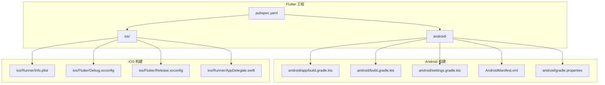
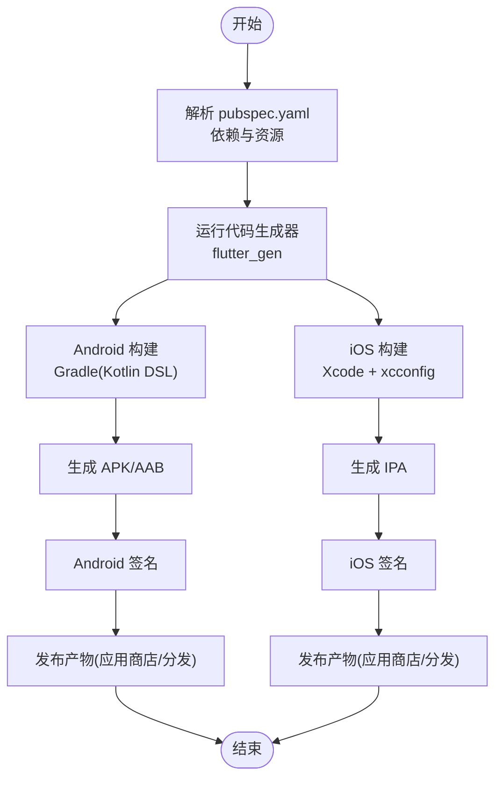
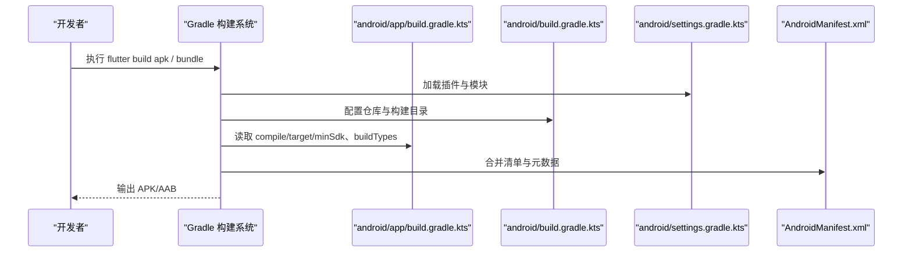
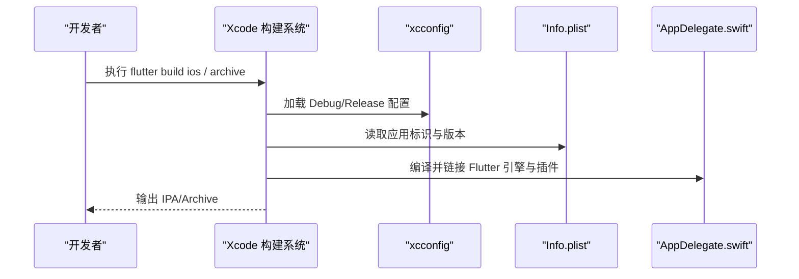
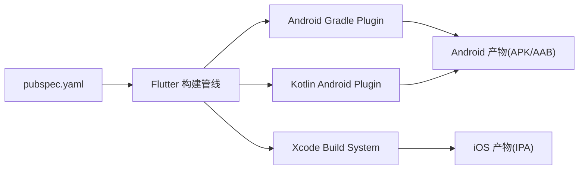

# 构建与发布

<cite>
**本文引用的文件**
- [pubspec.yaml](file://pubspec.yaml)
- [android/app/build.gradle.kts](file://android/app/build.gradle.kts)
- [android/build.gradle.kts](file://android/build.gradle.kts)
- [android/settings.gradle.kts](file://android/settings.gradle.kts)
- [android/gradle.properties](file://android/gradle.properties)
- [android/app/src/main/AndroidManifest.xml](file://android/app/src/main/AndroidManifest.xml)
- [ios/Runner/Info.plist](file://ios/Runner/Info.plist)
- [ios/Flutter/Debug.xcconfig](file://ios/Flutter/Debug.xcconfig)
- [ios/Flutter/Release.xcconfig](file://ios/Flutter/Release.xcconfig)
- [ios/Runner/AppDelegate.swift](file://ios/Runner/AppDelegate.swift)
</cite>

## 目录
1. [简介](#简介)
2. [项目结构](#项目结构)
3. [核心组件](#核心组件)
4. [架构总览](#架构总览)
5. [详细组件分析](#详细组件分析)
6. [依赖分析](#依赖分析)
7. [性能考虑](#性能考虑)
8. [故障排查指南](#故障排查指南)
9. [结论](#结论)
10. [附录](#附录)

## 简介
本指南面向 Flutter 项目的构建与发布，覆盖 Android 与 iOS 平台的构建配置、签名与多渠道打包、应用商店发布流程、构建优化、CI/CD 流水线示例、版本管理与发布策略，以及常见问题定位与生产环境建议。文档基于当前仓库中的实际配置文件进行分析与说明，确保可操作性和一致性。

## 项目结构
本项目为标准的 Flutter 工程，包含以下关键构建相关目录与文件：
- Android: 使用 Gradle(Kotlin DSL) 进行构建，入口在 android/app/build.gradle.kts，全局设置在 android/build.gradle.kts 与 settings.gradle.kts，运行时权限与入口 Activity 在 AndroidManifest.xml。
- iOS: 使用 Xcode 工作区与 xcconfig 管理构建配置，应用元数据在 Info.plist，启动逻辑在 AppDelegate.swift。
- Flutter 层: pubspec.yaml 定义依赖、资源与生成器配置；assets 目录存放图片等资源。

图表来源
- [pubspec.yaml:1-136](file://pubspec.yaml#L1-L136)
- [android/app/build.gradle.kts:1-46](file://android/app/build.gradle.kts#L1-L46)
- [android/build.gradle.kts:1-25](file://android/build.gradle.kts#L1-L25)
- [android/settings.gradle.kts:1-27](file://android/settings.gradle.kts#L1-L27)
- [android/app/src/main/AndroidManifest.xml:1-46](file://android/app/src/main/AndroidManifest.xml#L1-L46)
- [android/gradle.properties:1-7](file://android/gradle.properties#L1-L7)
- [ios/Runner/Info.plist:1-71](file://ios/Runner/Info.plist#L1-L71)
- [ios/Flutter/Debug.xcconfig:1-2](file://ios/Flutter/Debug.xcconfig#L1-L2)
- [ios/Flutter/Release.xcconfig:1-2](file://ios/Flutter/Release.xcconfig#L1-L2)
- [ios/Runner/AppDelegate.swift:1-17](file://ios/Runner/AppDelegate.swift#L1-L17)

章节来源
- [pubspec.yaml:1-136](file://pubspec.yaml#L1-L136)
- [android/app/build.gradle.kts:1-46](file://android/app/build.gradle.kts#L1-L46)
- [android/build.gradle.kts:1-25](file://android/build.gradle.kts#L1-L25)
- [android/settings.gradle.kts:1-27](file://android/settings.gradle.kts#L1-L27)
- [android/app/src/main/AndroidManifest.xml:1-46](file://android/app/src/main/AndroidManifest.xml#L1-L46)
- [android/gradle.properties:1-7](file://android/gradle.properties#L1-L7)
- [ios/Runner/Info.plist:1-71](file://ios/Runner/Info.plist#L1-L71)
- [ios/Flutter/Debug.xcconfig:1-2](file://ios/Flutter/Debug.xcconfig#L1-L2)
- [ios/Flutter/Release.xcconfig:1-2](file://ios/Flutter/Release.xcconfig#L1-L2)
- [ios/Runner/AppDelegate.swift:1-17](file://ios/Runner/AppDelegate.swift#L1-L17)

## 核心组件
- Flutter 包与资源管理: pubspec.yaml 统一管理依赖、资源路径与代码生成器（flutter_gen）。
- Android 构建脚本: app 级 build.gradle.kts 定义编译选项、SDK 版本、签名与构建类型；根级 build.gradle.kts 统一仓库与构建目录；settings.gradle.kts 声明插件与模块；gradle.properties 设置 JVM 参数与 AndroidX。
- iOS 构建配置: Info.plist 定义应用标识、显示名、版本等；xcconfig 引入 Generated 配置；AppDelegate 负责引擎初始化与插件注册。

章节来源
- [pubspec.yaml:1-136](file://pubspec.yaml#L1-L136)
- [android/app/build.gradle.kts:1-46](file://android/app/build.gradle.kts#L1-L46)
- [android/build.gradle.kts:1-25](file://android/build.gradle.kts#L1-L25)
- [android/settings.gradle.kts:1-27](file://android/settings.gradle.kts#L1-L27)
- [android/gradle.properties:1-7](file://android/gradle.properties#L1-L7)
- [ios/Runner/Info.plist:1-71](file://ios/Runner/Info.plist#L1-L71)
- [ios/Flutter/Debug.xcconfig:1-2](file://ios/Flutter/Debug.xcconfig#L1-L2)
- [ios/Flutter/Release.xcconfig:1-2](file://ios/Flutter/Release.xcconfig#L1-L2)
- [ios/Runner/AppDelegate.swift:1-17](file://ios/Runner/AppDelegate.swift#L1-L17)

## 架构总览
下图展示了从 Flutter 源码到各平台二进制产物的构建链路，包括资源处理、平台适配与产物输出。

图表来源
- [pubspec.yaml:1-136](file://pubspec.yaml#L1-L136)
- [android/app/build.gradle.kts:1-46](file://android/app/build.gradle.kts#L1-L46)
- [ios/Runner/Info.plist:1-71](file://ios/Runner/Info.plist#L1-L71)

## 详细组件分析

### Android 构建配置与多渠道打包
- 编译与 SDK: 使用 Kotlin DSL，指定 Java 17 兼容性与 NDK 版本，minSdk 设置为 24。
- 构建类型: release 类型默认使用 debug 签名，需替换为正式签名以发布。
- 仓库与插件: 根级 build.gradle.kts 配置 google() 与 mavenCentral()；settings.gradle.kts 声明 Android 与 Kotlin 插件版本并包含 :app 模块。
- 清单与入口: AndroidManifest.xml 定义了 Application 标签、Activity 的 launchMode、主题与 Intent Filter，以及 Flutter Embedding 元数据。
- Gradle 性能: gradle.properties 中设置了较大的 JVM 堆与元空间，有助于提升构建速度。

图表来源
- [android/settings.gradle.kts:1-27](file://android/settings.gradle.kts#L1-L27)
- [android/build.gradle.kts:1-25](file://android/build.gradle.kts#L1-L25)
- [android/app/build.gradle.kts:1-46](file://android/app/build.gradle.kts#L1-L46)
- [android/app/src/main/AndroidManifest.xml:1-46](file://android/app/src/main/AndroidManifest.xml#L1-L46)

章节来源
- [android/app/build.gradle.kts:1-46](file://android/app/build.gradle.kts#L1-L46)
- [android/build.gradle.kts:1-25](file://android/build.gradle.kts#L1-L25)
- [android/settings.gradle.kts:1-27](file://android/settings.gradle.kts#L1-L27)
- [android/app/src/main/AndroidManifest.xml:1-46](file://android/app/src/main/AndroidManifest.xml#L1-L46)
- [android/gradle.properties:1-7](file://android/gradle.properties#L1-L7)

### iOS 构建配置与应用商店发布
- 应用元数据: Info.plist 中 CFBundleDisplayName、CFBundleShortVersionString、CFBundleVersion 由 Flutter 构建变量注入。
- 构建配置: Debug.xcconfig 与 Release.xcconfig 均 include Generated.xcconfig，用于集成 Flutter 生成的构建设置。
- 启动与插件: AppDelegate.swift 继承 FlutterAppDelegate 并实现隐式引擎委托，完成插件注册。

图表来源
- [ios/Flutter/Debug.xcconfig:1-2](file://ios/Flutter/Debug.xcconfig#L1-L2)
- [ios/Flutter/Release.xcconfig:1-2](file://ios/Flutter/Release.xcconfig#L1-L2)
- [ios/Runner/Info.plist:1-71](file://ios/Runner/Info.plist#L1-L71)
- [ios/Runner/AppDelegate.swift:1-17](file://ios/Runner/AppDelegate.swift#L1-L17)

章节来源
- [ios/Runner/Info.plist:1-71](file://ios/Runner/Info.plist#L1-L71)
- [ios/Flutter/Debug.xcconfig:1-2](file://ios/Flutter/Debug.xcconfig#L1-L2)
- [ios/Flutter/Release.xcconfig:1-2](file://ios/Flutter/Release.xcconfig#L1-L2)
- [ios/Runner/AppDelegate.swift:1-17](file://ios/Runner/AppDelegate.swift#L1-L17)

### Flutter 构建优化技巧
- 资源与图标: 通过 flutter_launcher_icons 自动生成多分辨率图标，减少手动维护成本。
- 资源代码生成: flutter_gen 为 SVG 等资源生成类型安全的访问方法，提高开发效率与可维护性。
- 依赖精简: 仅引入必要依赖，避免冗余包增大体积。
- 构建缓存: 合理配置 Gradle 与 Xcode 缓存，加速增量构建。

章节来源
- [pubspec.yaml:81-97](file://pubspec.yaml#L81-L97)
- [pubspec.yaml:98-136](file://pubspec.yaml#L98-L136)

### CI/CD 流水线配置示例
以下为通用流水线步骤，可根据具体平台（GitHub Actions、GitLab CI、Jenkins 等）落地：
- 安装 Flutter SDK 与平台工具（Android SDK、Xcode、CocoaPods）。
- 获取依赖：flutter pub get。
- 静态检查与测试：dart analyze、flutter test。
- 构建产物：
  - Android: flutter build apk/bundle --release。
  - iOS: flutter build ios --release 并归档。
- 签名与校验：
  - Android: 使用 keystore 对 release 包签名。
  - iOS: 使用证书与描述文件签名并生成 Archive。
- 上传与发布：
  - Android: 上传至 Google Play 或内部分发平台。
  - iOS: 通过 Transporter 或 xcrun 提交至 App Store Connect。

[本节为概念性流程说明，不直接分析具体文件]

### 版本管理与发布策略
- Flutter 版本: pubspec.yaml 中的 version 字段同时映射到 Android 的 versionName/versionCode 与 iOS 的 CFBundleShortVersionString/CFBundleVersion。
- 构建号: 可通过 flutter build 的 --build-name 与 --build-number 覆盖默认值。
- 分支策略: 建议使用 main 作为稳定分支，develop 作为集成分支，feature/* 作为功能分支；发布前合并至 main 并打 Tag。
- 回滚策略: 保留历史版本产物与元数据，支持快速回滚。

章节来源
- [pubspec.yaml:7-19](file://pubspec.yaml#L7-L19)
- [android/app/build.gradle.kts:17-26](file://android/app/build.gradle.kts#L17-L26)
- [ios/Runner/Info.plist:21-26](file://ios/Runner/Info.plist#L21-L26)

## 依赖分析
Flutter 依赖与平台构建脚本之间存在明确的耦合关系：
- pubspec.yaml 决定 Dart 层依赖与资源，影响最终产物大小与功能。
- Android Gradle 脚本依赖 Flutter 插件与 Kotlin 插件，版本需在 settings.gradle.kts 中声明。
- iOS 构建通过 xcconfig 与 Info.plist 将 Flutter 生成的配置与元数据注入到 Xcode 工程中。

图表来源
- [pubspec.yaml:1-136](file://pubspec.yaml#L1-L136)
- [android/settings.gradle.kts:20-24](file://android/settings.gradle.kts#L20-L24)
- [ios/Flutter/Debug.xcconfig:1-2](file://ios/Flutter/Debug.xcconfig#L1-L2)
- [ios/Flutter/Release.xcconfig:1-2](file://ios/Flutter/Release.xcconfig#L1-L2)

章节来源
- [pubspec.yaml:1-136](file://pubspec.yaml#L1-L136)
- [android/settings.gradle.kts:1-27](file://android/settings.gradle.kts#L1-L27)
- [ios/Flutter/Debug.xcconfig:1-2](file://ios/Flutter/Debug.xcconfig#L1-L2)
- [ios/Flutter/Release.xcconfig:1-2](file://ios/Flutter/Release.xcconfig#L1-L2)

## 性能考虑
- 构建性能:
  - Android: 调整 gradle.properties 的 JVM 参数以提升内存与并发；使用 Gradle 守护进程与并行任务。
  - iOS: 启用 Xcode 并行构建与增量编译；合理使用 CocoaPods 缓存。
- 产物体积:
  - 移除未使用的依赖与资源；按需引入字体与图片；利用 flutter_gen 减少重复资源引用。
- 启动性能:
  - 控制首屏资源大小；延迟加载非关键资源；避免在主线程执行耗时任务。

[本节提供通用指导，不直接分析具体文件]

## 故障排查指南
- Android 构建失败:
  - 检查 Android SDK、NDK 与 Java 版本是否与 Gradle 脚本一致。
  - 确认 minSdk 与 targetSdk 满足插件要求。
  - 若 release 签名错误，需配置正式 keystore 并替换 debug 签名。
- iOS 构建失败:
  - 检查证书与描述文件是否有效且匹配 Bundle Identifier。
  - 确认 xcconfig 正确 include Generated.xcconfig。
  - 清理 DerivedData 与 Pods 后重试。
- 资源问题:
  - 确保 assets 路径在 pubspec.yaml 中声明；重新生成 flutter_gen 输出。
  - 图标生成失败时检查图片尺寸与格式。

章节来源
- [android/app/build.gradle.kts:12-34](file://android/app/build.gradle.kts#L12-L34)
- [android/app/src/main/AndroidManifest.xml:1-46](file://android/app/src/main/AndroidManifest.xml#L1-L46)
- [ios/Runner/Info.plist:1-71](file://ios/Runner/Info.plist#L1-L71)
- [ios/Flutter/Debug.xcconfig:1-2](file://ios/Flutter/Debug.xcconfig#L1-L2)
- [ios/Flutter/Release.xcconfig:1-2](file://ios/Flutter/Release.xcconfig#L1-L2)
- [pubspec.yaml:98-136](file://pubspec.yaml#L98-L136)

## 结论
本指南基于仓库中的实际构建配置，提供了从 Flutter 源码到 Android/iOS 产物的完整构建与发布流程，涵盖签名、多渠道、优化、CI/CD、版本管理与问题排查。建议在正式发布前完成签名配置、依赖精简与性能基准测试，并通过自动化流水线保证构建的一致性与可追溯性。

## 附录
- 常用命令参考:
  - Flutter 获取依赖: flutter pub get
  - 静态检查与测试: dart analyze; flutter test
  - Android 构建: flutter build apk --release; flutter build bundle --release
  - iOS 构建: flutter build ios --release
- 生产环境建议:
  - 开启混淆与压缩（Android ProGuard/R8，iOS Strip Unused Code）。
  - 接入崩溃监控与性能采集（如 Sentry、Firebase Crashlytics）。
  - 配置环境变量区分开发与生产（通过构建变体或 xcconfig）。

[本节为补充信息，不直接分析具体文件]