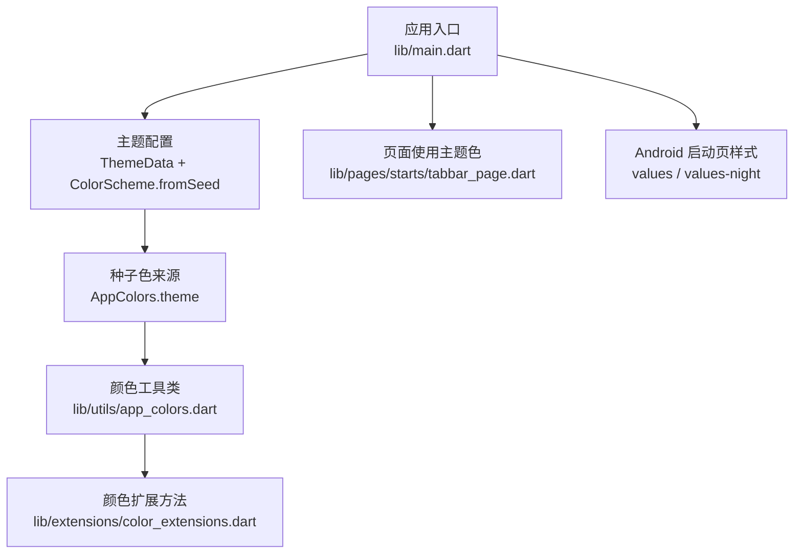
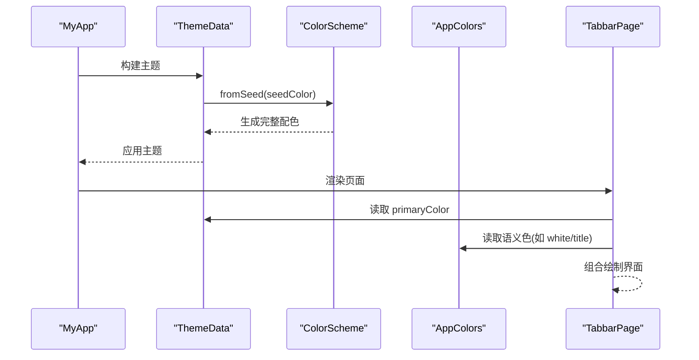
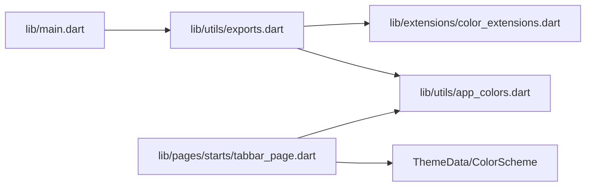

# 主题系统

<cite>
**本文引用的文件**
- [lib/main.dart](file://lib/main.dart)
- [lib/utils/app_colors.dart](file://lib/utils/app_colors.dart)
- [lib/extensions/color_extensions.dart](file://lib/extensions/color_extensions.dart)
- [lib/utils/exports.dart](file://lib/utils/exports.dart)
- [lib/pages/starts/tabbar_page.dart](file://lib/pages/starts/tabbar_page.dart)
- [android/app/src/main/res/values/styles.xml](file://android/app/src/main/res/values/styles.xml)
- [android/app/src/main/res/values-night/styles.xml](file://android/app/src/main/res/values-night/styles.xml)
</cite>

## 目录
1. [简介](#简介)
2. [项目结构](#项目结构)
3. [核心组件](#核心组件)
4. [架构总览](#架构总览)
5. [详细组件分析](#详细组件分析)
6. [依赖关系分析](#依赖关系分析)
7. [性能考虑](#性能考虑)
8. [故障排查指南](#故障排查指南)
9. [结论](#结论)
10. [附录](#附录)

## 简介
本文件系统性梳理了该 Flutter 应用的主题系统与颜色管理机制，重点包括：
- AppColors 类的设计与颜色常量组织（主色调、辅助色、语义色）
- ColorScheme.fromSeed 的种子色方案生成机制
- color_extensions.dart 提供的便捷颜色扩展方法
- 在不同平台与设备上的主题适配策略
- 主题定制、动态换肤与深色模式的实现建议
- 颜色无障碍访问与对比度检查的最佳实践

## 项目结构
主题相关代码集中在 utils 与 extensions 两个目录，入口在 main.dart 中通过 ThemeData 配置全局主题；页面示例展示了如何在 UI 中使用主题色。Android 侧通过 values 与 values-night 两套样式资源支持系统级亮/暗模式启动页背景。

图表来源
- [lib/main.dart:14-19](file://lib/main.dart#L14-L19)
- [lib/utils/app_colors.dart:5-27](file://lib/utils/app_colors.dart#L5-L27)
- [lib/extensions/color_extensions.dart:4-21](file://lib/extensions/color_extensions.dart#L4-L21)
- [lib/pages/starts/tabbar_page.dart:55-81](file://lib/pages/starts/tabbar_page.dart#L55-L81)
- [android/app/src/main/res/values/styles.xml:3-17](file://android/app/src/main/res/values/styles.xml#L3-L17)
- [android/app/src/main/res/values-night/styles.xml:3-17](file://android/app/src/main/res/values-night/styles.xml#L3-L17)

章节来源
- [lib/main.dart:14-19](file://lib/main.dart#L14-L19)
- [lib/utils/app_colors.dart:5-27](file://lib/utils/app_colors.dart#L5-L27)
- [lib/extensions/color_extensions.dart:4-21](file://lib/extensions/color_extensions.dart#L4-L21)
- [lib/pages/starts/tabbar_page.dart:55-81](file://lib/pages/starts/tabbar_page.dart#L55-L81)
- [android/app/src/main/res/values/styles.xml:3-17](file://android/app/src/main/res/values/styles.xml#L3-L17)
- [android/app/src/main/res/values-night/styles.xml:3-17](file://android/app/src/main/res/values-night/styles.xml#L3-L17)

## 核心组件
- 颜色常量集中管理：AppColors 提供统一的颜色定义，便于全局一致性与维护。
- 种子色到完整配色：通过 ColorScheme.fromSeed 将单一种子色扩展为完整的 Material 3 色彩体系。
- 便捷颜色转换：color_extensions.dart 提供十六进制字符串到 Color 的转换能力。
- 页面级主题使用：页面通过 Theme.of(context).primaryColor 获取主题主色，并结合 AppColors 中的语义色进行组合。

章节来源
- [lib/utils/app_colors.dart:5-27](file://lib/utils/app_colors.dart#L5-L27)
- [lib/main.dart:14-19](file://lib/main.dart#L14-L19)
- [lib/extensions/color_extensions.dart:4-21](file://lib/extensions/color_extensions.dart#L4-L21)
- [lib/pages/starts/tabbar_page.dart:55-81](file://lib/pages/starts/tabbar_page.dart#L55-L81)

## 架构总览
下图展示了从种子色到主题再到页面渲染的整体流程。

图表来源
- [lib/main.dart:14-19](file://lib/main.dart#L14-L19)
- [lib/utils/app_colors.dart:5-27](file://lib/utils/app_colors.dart#L5-L27)
- [lib/pages/starts/tabbar_page.dart:55-81](file://lib/pages/starts/tabbar_page.dart#L55-L81)

## 详细组件分析

### AppColors 设计与颜色组织
- 设计模式：采用静态常量集合，避免实例化开销，保证全局唯一性。
- 颜色分类：
  - 主色调：theme（作为种子色，驱动整个配色体系）
  - 浅主色调：lightTheme（用于浅色背景或强调）
  - 文本与内容：title、content
  - 功能与语义：red（错误/警示）、price（价格强调）
  - 结构与背景：line、background、white、black
- 优点：职责清晰、易于扩展与维护；配合扩展方法可快速从十六进制创建颜色。

章节来源
- [lib/utils/app_colors.dart:5-27](file://lib/utils/app_colors.dart#L5-L27)

### ColorScheme.fromSeed 的使用
- 作用：以单一种子色为基础，自动生成一套符合 Material 3 规范的完整配色（包含主色、次色、表面色、错误色等）。
- 在本项目中，种子色来自 AppColors.theme，从而确保品牌一致性。
- 优势：减少手工维护多组颜色的成本，提升跨组件视觉一致性。

章节来源
- [lib/main.dart:14-19](file://lib/main.dart#L14-L19)
- [lib/utils/app_colors.dart:5-27](file://lib/utils/app_colors.dart#L5-L27)

### 颜色扩展方法（color_extensions.dart）
- HexColor.fromHex：从十六进制字符串创建 Color，自动处理透明度（无透明度时默认不透明）。
- String.toColor：便捷地将字符串转换为 Color。
- 使用场景：在 AppColors 中统一以十六进制定义颜色，便于与设计稿对齐与团队协作。

章节来源
- [lib/extensions/color_extensions.dart:4-21](file://lib/extensions/color_extensions.dart#L4-L21)
- [lib/utils/app_colors.dart:5-27](file://lib/utils/app_colors.dart#L5-L27)

### 页面中的主题使用
- 通过 Theme.of(context).primaryColor 获取当前主题的主色，用于导航栏选中态等关键交互元素。
- 结合 AppColors 中的语义色（如 white、title）完成背景与文字对比。
- 示例：底部导航栏根据主题主色设置选中项颜色，未选中项使用标题色，保持视觉层次。

章节来源
- [lib/pages/starts/tabbar_page.dart:55-81](file://lib/pages/starts/tabbar_page.dart#L55-L81)

### 平台与设备适配策略
- Android 启动页：
  - 亮色模式：values/styles.xml 中配置 Light 主题背景
  - 暗色模式：values-night/styles.xml 中配置 Dark 主题背景
- Flutter 层主题：
  - 通过 ColorScheme.fromSeed 生成的配色会随系统明暗模式自动调整（Material 3 特性）
  - 页面通过 Theme.of(context) 获取当前上下文下的主题信息，无需硬编码颜色

章节来源
- [android/app/src/main/res/values/styles.xml:3-17](file://android/app/src/main/res/values/styles.xml#L3-L17)
- [android/app/src/main/res/values-night/styles.xml:3-17](file://android/app/src/main/res/values-night/styles.xml#L3-L17)
- [lib/main.dart:14-19](file://lib/main.dart#L14-L19)

### 主题定制、动态换肤与深色模式
- 主题定制：
  - 修改 AppColors.theme 即可改变种子色，进而影响整个应用的配色
  - 可在 ThemeData 中进一步覆盖特定颜色（如 error、surface 等），以满足业务需求
- 动态换肤：
  - 可通过 Provider 等状态管理方案切换种子色或自定义 ColorScheme，实现运行时换肤
  - 建议在入口处重建 MaterialApp 以刷新主题
- 深色模式：
  - 利用系统明暗模式自动适配；如需手动控制，可在 ThemeData 中指定 brightness 或使用 themeMode
  - 注意在 Android 启动页已配置 values-night，确保启动阶段体验一致

章节来源
- [lib/main.dart:14-19](file://lib/main.dart#L14-L19)
- [lib/utils/app_colors.dart:5-27](file://lib/utils/app_colors.dart#L5-L27)
- [android/app/src/main/res/values/styles.xml:3-17](file://android/app/src/main/res/values/styles.xml#L3-L17)
- [android/app/src/main/res/values-night/styles.xml:3-17](file://android/app/src/main/res/values-night/styles.xml#L3-L17)

### 颜色无障碍访问与对比度检查最佳实践
- 文本与背景对比度：确保正文文本与背景的对比度至少达到 WCAG AA 标准（通常要求 4.5:1 以上）
- 语义色使用：红色用于错误或危险操作，绿色用于成功提示，避免仅用颜色传达含义
- 测试建议：
  - 在亮/暗模式下分别验证可读性
  - 借助工具（如 Contrast Checker）校验对比度
  - 对关键路径（登录、支付、表单）进行专项对比度审查

[本节为通用指导，不直接分析具体文件]

## 依赖关系分析
- 入口依赖：main.dart 引入 exports.dart，统一导出 app_colors 与 color_extensions
- 颜色依赖链：AppColors 依赖 color_extensions 的十六进制解析能力
- 页面依赖：tabbar_page.dart 同时依赖 Theme 与 AppColors，体现“系统主题 + 业务语义”的组合方式

图表来源
- [lib/utils/exports.dart:1-5](file://lib/utils/exports.dart#L1-L5)
- [lib/main.dart:1-3](file://lib/main.dart#L1-L3)
- [lib/utils/app_colors.dart:1-3](file://lib/utils/app_colors.dart#L1-L3)
- [lib/extensions/color_extensions.dart:1-2](file://lib/extensions/color_extensions.dart#L1-L2)
- [lib/pages/starts/tabbar_page.dart:55-81](file://lib/pages/starts/tabbar_page.dart#L55-L81)

章节来源
- [lib/utils/exports.dart:1-5](file://lib/utils/exports.dart#L1-L5)
- [lib/main.dart:1-3](file://lib/main.dart#L1-L3)
- [lib/utils/app_colors.dart:1-3](file://lib/utils/app_colors.dart#L1-L3)
- [lib/extensions/color_extensions.dart:1-2](file://lib/extensions/color_extensions.dart#L1-L2)
- [lib/pages/starts/tabbar_page.dart:55-81](file://lib/pages/starts/tabbar_page.dart#L55-L81)

## 性能考虑
- 颜色常量静态化：AppColors 使用静态 final，避免重复实例化，降低内存占用
- 种子色方案：ColorScheme.fromSeed 由框架内部优化，减少手工维护多套颜色的成本
- 主题更新频率：动态换肤时应尽量减少不必要的 rebuild，必要时使用 Provider 精确通知变更

[本节为通用指导，不直接分析具体文件]

## 故障排查指南
- 主题未生效：
  - 确认 main.dart 中已正确设置 ThemeData 与 ColorScheme.fromSeed
  - 检查是否被后续局部主题覆盖
- 颜色显示异常：
  - 检查十六进制格式是否正确（是否缺少 # 或透明度）
  - 确认 color_extensions.dart 的 fromHex 逻辑是否被正确使用
- 暗色模式不一致：
  - 检查 Android values-night 是否配置正确
  - 确认页面是否依赖系统主题而非硬编码颜色

章节来源
- [lib/main.dart:14-19](file://lib/main.dart#L14-L19)
- [lib/extensions/color_extensions.dart:4-21](file://lib/extensions/color_extensions.dart#L4-L21)
- [android/app/src/main/res/values-night/styles.xml:3-17](file://android/app/src/main/res/values-night/styles.xml#L3-L17)

## 结论
本项目通过 AppColors 集中管理颜色常量，结合 ColorScheme.fromSeed 生成一致的 Material 3 配色，并在页面中合理使用主题色与语义色，实现了简洁、可扩展且易维护的主题系统。Android 侧通过 values 与 values-night 支持系统级明暗模式，Flutter 层则通过主题上下文自动适配。未来可在此基础上引入动态换肤与更严格的对比度检查，进一步提升用户体验与无障碍可达性。

[本节为总结性内容，不直接分析具体文件]

## 附录
- 常用主题属性参考：
  - primaryColor：主色，常用于按钮、高亮元素
  - colorScheme：完整配色方案，包含 surface、error、onXxx 等衍生色
  - brightness：明暗模式指示，可用于条件渲染
- 扩展阅读：
  - Material 3 色彩系统文档
  - WCAG 2.1 对比度规范

[本节为补充说明，不直接分析具体文件]