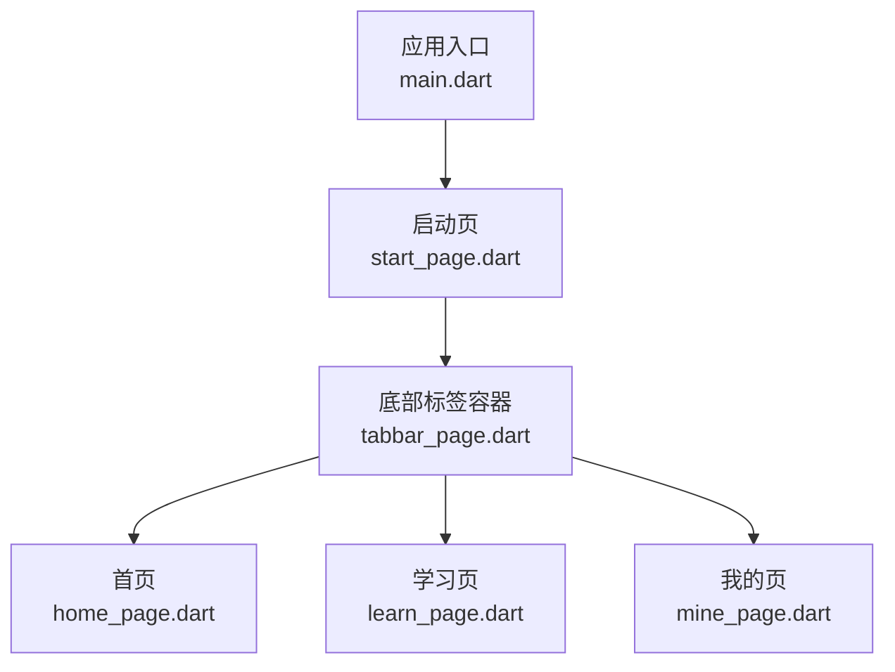
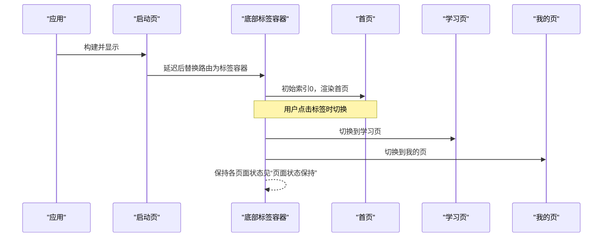
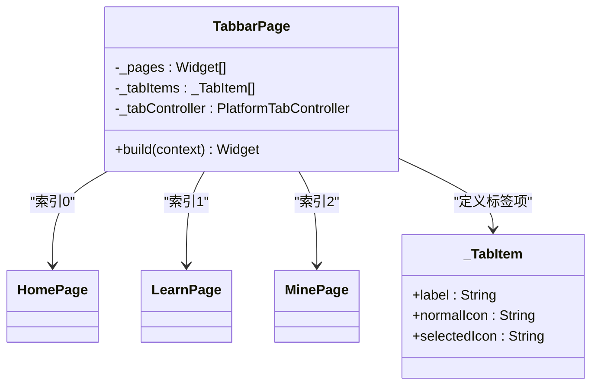
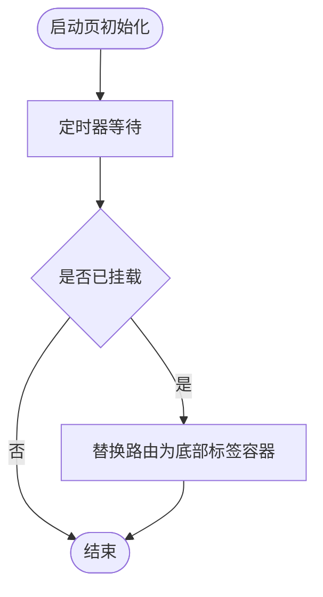
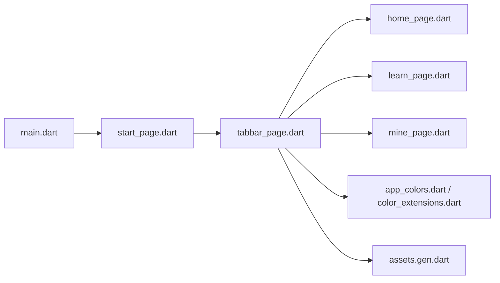

# 导航系统

<cite>
**本文引用的文件**
- [lib/main.dart](file://lib/main.dart)
- [lib/pages/starts/start_page.dart](file://lib/pages/starts/start_page.dart)
- [lib/pages/starts/tabbar_page.dart](file://lib/pages/starts/tabbar_page.dart)
- [lib/pages/home/home_page.dart](file://lib/pages/home/home_page.dart)
- [lib/pages/courses/learn_page.dart](file://lib/pages/courses/learn_page.dart)
- [lib/pages/settings/mine_page.dart](file://lib/pages/settings/mine_page.dart)
- [lib/utils/exports.dart](file://lib/utils/exports.dart)
- [lib/utils/app_colors.dart](file://lib/utils/app_colors.dart)
- [lib/extensions/color_extensions.dart](file://lib/extensions/color_extensions.dart)
- [lib/gen/assets.gen.dart](file://lib/gen/assets.gen.dart)
</cite>

## 目录
1. [简介](#简介)
2. [项目结构](#项目结构)
3. [核心组件](#核心组件)
4. [架构总览](#架构总览)
5. [详细组件分析](#详细组件分析)
6. [依赖关系分析](#依赖关系分析)
7. [性能考虑](#性能考虑)
8. [故障排查指南](#故障排查指南)
9. [结论](#结论)
10. [附录](#附录)

## 简介
本文件面向本项目中的导航系统，重点说明底部标签栏的实现原理与页面切换机制。文档围绕以下目标展开：
- TabbarPage 中 PlatformTabController 的使用方式、标签项定义、选中状态同步与页面内容管理
- IndexedStack 在页面状态保持中的作用（概念性说明）与高效切换策略
- 跨平台导航组件的选择与使用（Android/iOS 差异化处理）
- 页面间通信与数据传递的最佳实践
- 导航动画配置与性能优化建议

## 项目结构
项目采用按功能域组织页面的方式，导航入口位于应用根，启动页跳转至底部标签页容器，标签页承载三个业务页面。

图表来源
- [lib/main.dart:9-22](file://lib/main.dart#L9-L22)
- [lib/pages/starts/start_page.dart:12-24](file://lib/pages/starts/start_page.dart#L12-L24)
- [lib/pages/starts/tabbar_page.dart:8-99](file://lib/pages/starts/tabbar_page.dart#L8-L99)
- [lib/pages/home/home_page.dart:3-25](file://lib/pages/home/home_page.dart#L3-L25)
- [lib/pages/courses/learn_page.dart:3-25](file://lib/pages/courses/learn_page.dart#L3-L25)
- [lib/pages/settings/mine_page.dart:3-28](file://lib/pages/settings/mine_page.dart#L3-L28)

章节来源
- [lib/main.dart:9-22](file://lib/main.dart#L9-L22)
- [lib/pages/starts/start_page.dart:12-24](file://lib/pages/starts/start_page.dart#L12-L24)
- [lib/pages/starts/tabbar_page.dart:8-99](file://lib/pages/starts/tabbar_page.dart#L8-L99)

## 核心组件
- 应用主题与颜色：通过统一的颜色工具类与扩展方法提供一致的主题色与辅助色，供导航栏与页面使用。
- 启动页：负责短暂展示后跳转到主导航容器。
- 底部标签容器：基于跨平台组件库实现统一的底部标签栏，管理多页面切换与状态保持。
- 业务页面：首页、学习页、我的页作为标签内容，各自独立维护自身状态。

章节来源
- [lib/utils/app_colors.dart:4-27](file://lib/utils/app_colors.dart#L4-L27)
- [lib/extensions/color_extensions.dart:4-21](file://lib/extensions/color_extensions.dart#L4-L21)
- [lib/pages/starts/start_page.dart:12-24](file://lib/pages/starts/start_page.dart#L12-L24)
- [lib/pages/starts/tabbar_page.dart:8-99](file://lib/pages/starts/tabbar_page.dart#L8-L99)
- [lib/pages/home/home_page.dart:3-25](file://lib/pages/home/home_page.dart#L3-L25)
- [lib/pages/courses/learn_page.dart:3-25](file://lib/pages/courses/learn_page.dart#L3-L25)
- [lib/pages/settings/mine_page.dart:3-28](file://lib/pages/settings/mine_page.dart#L3-L28)

## 架构总览
整体导航流程如下：应用启动后进入启动页，启动页延迟跳转到底部标签容器；标签容器通过平台适配的控制器驱动标签切换，并渲染对应页面。

图表来源
- [lib/main.dart:9-22](file://lib/main.dart#L9-L22)
- [lib/pages/starts/start_page.dart:12-24](file://lib/pages/starts/start_page.dart#L12-L24)
- [lib/pages/starts/tabbar_page.dart:8-99](file://lib/pages/starts/tabbar_page.dart#L8-L99)

## 详细组件分析

### 底部标签容器（TabbarPage）
- 控制器：使用 PlatformTabController 管理当前选中标签索引，生命周期内创建并在 dispose 中释放。
- 标签项：以内部数据结构描述每个标签的文案与图标资源，并通过统一导出模块访问生成后的资源路径。
- 页面集合：将三个业务页面以列表形式集中管理，由 bodyBuilder 根据当前索引返回对应页面。
- 平台适配：通过 Material/Cupertino 配置分别定制 Android 与 iOS 的底部导航样式（背景、阴影、边距、选中色等）。
- 事件回调：提供 itemChanged 回调用于监听标签切换（当前示例为空实现，可按需扩展）。

图表来源
- [lib/pages/starts/tabbar_page.dart:8-99](file://lib/pages/starts/tabbar_page.dart#L8-L99)
- [lib/pages/home/home_page.dart:3-25](file://lib/pages/home/home_page.dart#L3-L25)
- [lib/pages/courses/learn_page.dart:3-25](file://lib/pages/courses/learn_page.dart#L3-L25)
- [lib/pages/settings/mine_page.dart:3-28](file://lib/pages/settings/mine_page.dart#L3-L28)

章节来源
- [lib/pages/starts/tabbar_page.dart:8-99](file://lib/pages/starts/tabbar_page.dart#L8-L99)
- [lib/utils/exports.dart:1-5](file://lib/utils/exports.dart#L1-L5)
- [lib/gen/assets.gen.dart:42-67](file://lib/gen/assets.gen.dart#L42-L67)

### 启动页到主导航的跳转
- 启动页在初始化完成后，延迟一段时间执行路由替换，将根路由替换为底部标签容器，避免栈污染并提升首屏体验。

图表来源
- [lib/pages/starts/start_page.dart:12-24](file://lib/pages/starts/start_page.dart#L12-L24)

章节来源
- [lib/pages/starts/start_page.dart:12-24](file://lib/pages/starts/start_page.dart#L12-L24)

### 页面状态保持与高效切换（IndexedStack 概念）
- 作用：在标签切换时保留各页面的状态（滚动位置、输入框内容、网络请求缓存等），避免重复构建带来的性能损耗与用户体验下降。
- 在本项目中，标签容器通过平台适配的 Scaffold 与控制器管理页面索引，实际底层通常借助类似 IndexedStack 的机制来复用页面实例。建议在复杂页面场景下显式使用 IndexedStack 或等价方案以确保状态稳定。
- 高效切换要点：
  - 将页面定义为 Stateful 且仅维护必要状态
  - 避免在 build 中进行昂贵计算，必要时使用缓存或懒加载
  - 合理拆分子组件，减少不必要的重建范围

[本节为概念性说明，不直接分析具体代码文件]

### 跨平台导航组件选择与差异化处理
- 选择：使用 flutter_platform_widgets 提供的 PlatformTabScaffold 与 PlatformTabController，自动在 Android 与 iOS 上呈现符合平台规范的底部导航。
- 差异化：
  - Android：通过 MaterialNavBarData 设置背景、阴影、间距、选中/未选中颜色与标签可见性
  - iOS：通过 CupertinoTabBarData 设置背景、激活色与边框等
- 优势：一套代码适配双端，降低维护成本，同时保证原生交互一致性。

章节来源
- [lib/pages/starts/tabbar_page.dart:60-81](file://lib/pages/starts/tabbar_page.dart#L60-L81)

### 页面间通信与数据传递最佳实践
- 父子通信：通过构造函数参数向子页面传递只读数据；子页面通过回调函数通知父级更新。
- 兄弟页面通信：在底部标签容器中维护共享状态，或通过全局状态管理（如 Provider/Riverpod/Bloc）进行跨页面广播。
- 路由传参：对于非标签页的跳转，建议使用命名路由与参数对象封装，确保类型安全与可维护性。
- 事件总线：在需要解耦的场景可使用轻量事件总线，但需谨慎避免过度耦合。

[本节为通用实践指导，不直接分析具体代码文件]

### 导航动画配置
- 路由动画：启动页到标签容器的替换可通过 MaterialPageRoute 的 transitionsBuilder 自定义过渡动画。
- 标签切换动画：PlatformTabScaffold 默认提供平滑切换；如需更精细控制，可在平台特定配置中调整动画时长与曲线。
- 注意事项：避免在高频切换路径上引入重型动画，以免影响流畅度。

[本节为通用实践指导，不直接分析具体代码文件]

## 依赖关系分析
- 主题与颜色：应用通过统一颜色工具与扩展方法获取主题色，供导航与页面使用。
- 资源访问：通过生成的资产类访问 SVG 图标，确保类型安全与编译期检查。
- 平台组件：依赖 flutter_platform_widgets 提供跨平台标签容器与控制器。

图表来源
- [lib/main.dart:9-22](file://lib/main.dart#L9-L22)
- [lib/pages/starts/start_page.dart:12-24](file://lib/pages/starts/start_page.dart#L12-L24)
- [lib/pages/starts/tabbar_page.dart:8-99](file://lib/pages/starts/tabbar_page.dart#L8-L99)
- [lib/utils/app_colors.dart:4-27](file://lib/utils/app_colors.dart#L4-L27)
- [lib/extensions/color_extensions.dart:4-21](file://lib/extensions/color_extensions.dart#L4-L21)
- [lib/gen/assets.gen.dart:42-67](file://lib/gen/assets.gen.dart#L42-L67)

章节来源
- [lib/utils/exports.dart:1-5](file://lib/utils/exports.dart#L1-L5)
- [lib/utils/app_colors.dart:4-27](file://lib/utils/app_colors.dart#L4-L27)
- [lib/extensions/color_extensions.dart:4-21](file://lib/extensions/color_extensions.dart#L4-L21)
- [lib/gen/assets.gen.dart:42-67](file://lib/gen/assets.gen.dart#L42-L67)

## 性能考虑
- 页面惰性加载：仅在需要时构建页面内容，避免一次性加载所有页面。
- 状态最小化：每个页面仅维护必要的状态，减少重建范围。
- 资源优化：使用矢量图（SVG）并确保尺寸合适，避免大图导致内存压力。
- 动画节流：在低端设备上禁用或简化过渡动画，保障流畅度。
- 日志与监控：在关键路径添加埋点，观察切换耗时与卡顿情况。

[本节为通用性能建议，不直接分析具体代码文件]

## 故障排查指南
- 标签无法切换：检查 PlatformTabController 是否正确创建与释放；确认 items 数量与页面集合长度一致。
- 图标不显示：确认资源路径正确且已通过生成类访问；检查 assets 配置与打包。
- 主题色异常：核对 AppColors 与 Theme 的 primaryColor 是否一致；检查颜色扩展方法调用。
- 启动页跳转失败：确认 mounted 判断与路由替换时机；避免在不可用上下文中操作 Navigator。

章节来源
- [lib/pages/starts/tabbar_page.dart:42-52](file://lib/pages/starts/tabbar_page.dart#L42-L52)
- [lib/pages/starts/start_page.dart:12-24](file://lib/pages/starts/start_page.dart#L12-L24)
- [lib/utils/app_colors.dart:4-27](file://lib/utils/app_colors.dart#L4-L27)
- [lib/extensions/color_extensions.dart:4-21](file://lib/extensions/color_extensions.dart#L4-L21)

## 结论
本项目通过 PlatformTabScaffold 与 PlatformTabController 实现了跨平台的底部标签导航，结构清晰、易于扩展。配合统一的主题与资源管理，保证了视觉一致性与可维护性。建议在复杂场景中结合 IndexedStack 或状态管理方案进一步优化状态保持与页面切换性能。

## 附录
- 相关入口与页面文件参考：
  - 应用入口：[lib/main.dart:9-22](file://lib/main.dart#L9-L22)
  - 启动页：[lib/pages/starts/start_page.dart:12-24](file://lib/pages/starts/start_page.dart#L12-L24)
  - 底部标签容器：[lib/pages/starts/tabbar_page.dart:8-99](file://lib/pages/starts/tabbar_page.dart#L8-L99)
  - 首页：[lib/pages/home/home_page.dart:3-25](file://lib/pages/home/home_page.dart#L3-L25)
  - 学习页：[lib/pages/courses/learn_page.dart:3-25](file://lib/pages/courses/learn_page.dart#L3-L25)
  - 我的页：[lib/pages/settings/mine_page.dart:3-28](file://lib/pages/settings/mine_page.dart#L3-L28)
  - 颜色工具：[lib/utils/app_colors.dart:4-27](file://lib/utils/app_colors.dart#L4-L27)、[lib/extensions/color_extensions.dart:4-21](file://lib/extensions/color_extensions.dart#L4-L21)
  - 资源生成：[lib/gen/assets.gen.dart:42-67](file://lib/gen/assets.gen.dart#L42-L67)