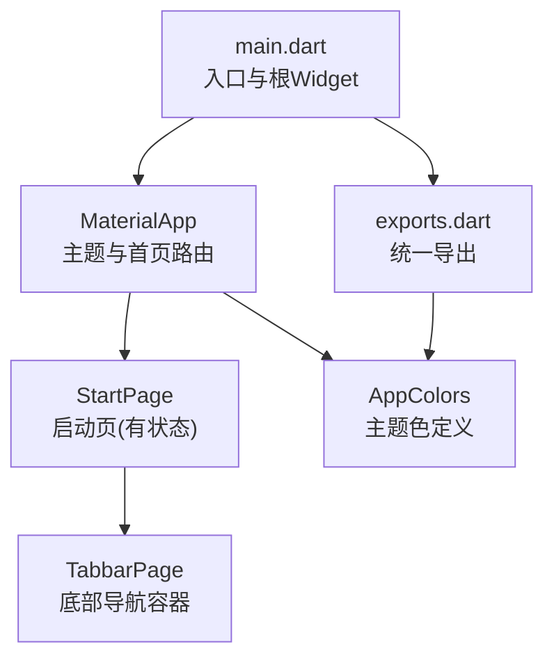
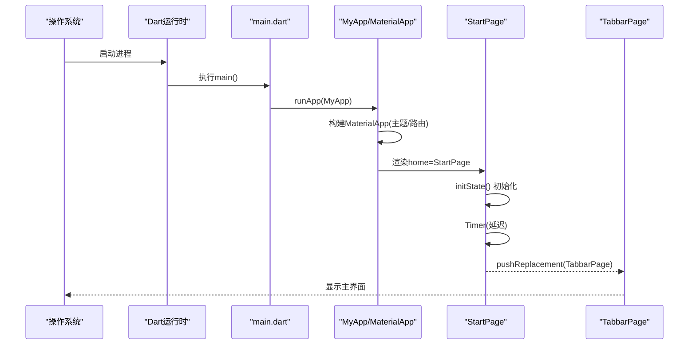
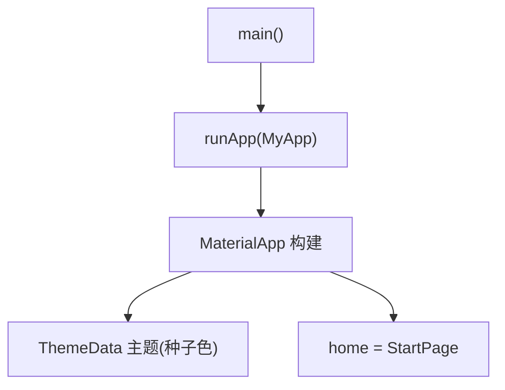
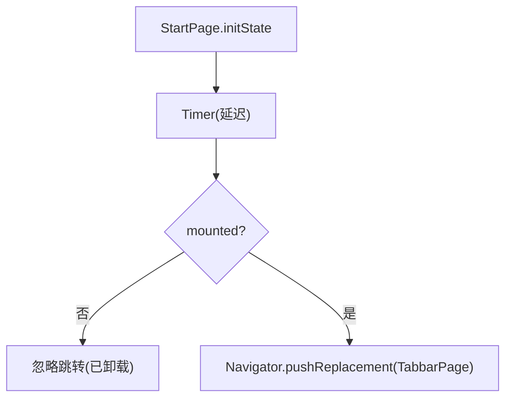
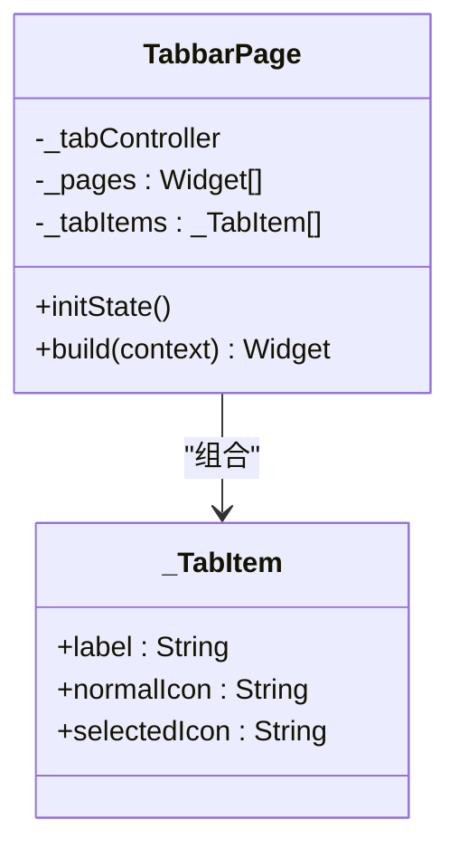
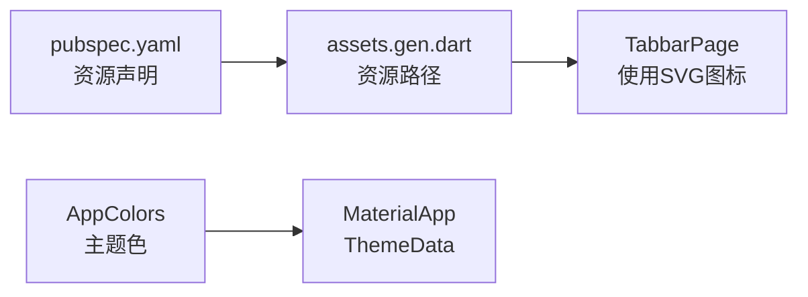

# 应用启动流程

<cite>
**本文引用的文件**
- [lib/main.dart](file://lib/main.dart)
- [lib/pages/starts/start_page.dart](file://lib/pages/starts/start_page.dart)
- [lib/pages/starts/tabbar_page.dart](file://lib/pages/starts/tabbar_page.dart)
- [lib/utils/app_colors.dart](file://lib/utils/app_colors.dart)
- [lib/utils/exports.dart](file://lib/utils/exports.dart)
- [pubspec.yaml](file://pubspec.yaml)
</cite>

## 目录
1. [简介](#简介)
2. [项目结构](#项目结构)
3. [核心组件](#核心组件)
4. [架构总览](#架构总览)
5. [详细组件分析](#详细组件分析)
6. [依赖分析](#依赖分析)
7. [性能考虑](#性能考虑)
8. [故障排查指南](#故障排查指南)
9. [结论](#结论)
10. [附录](#附录)

## 简介
本文面向Flutter应用的启动流程与生命周期管理，聚焦于入口点执行顺序、Widget树构建过程、MaterialApp配置（主题与首页路由）、启动页StartPage的延迟跳转机制与状态管理，并提供启动性能优化建议、常见问题解决方案以及自定义启动流程的实践指引。

## 项目结构
本项目的启动相关代码集中在以下位置：
- 应用入口与根Widget：lib/main.dart
- 启动页与主Tab容器：lib/pages/starts/start_page.dart、lib/pages/starts/tabbar_page.dart
- 主题颜色与导出工具：lib/utils/app_colors.dart、lib/utils/exports.dart
- 依赖与资源声明：pubspec.yaml

图表来源
- [lib/main.dart:5-22](file://lib/main.dart#L5-L22)
- [lib/pages/starts/start_page.dart:5-24](file://lib/pages/starts/start_page.dart#L5-L24)
- [lib/pages/starts/tabbar_page.dart:8-98](file://lib/pages/starts/tabbar_page.dart#L8-L98)
- [lib/utils/app_colors.dart:5-27](file://lib/utils/app_colors.dart#L5-L27)
- [lib/utils/exports.dart:1-5](file://lib/utils/exports.dart#L1-L5)

章节来源
- [lib/main.dart:5-22](file://lib/main.dart#L5-L22)
- [pubspec.yaml:99-109](file://pubspec.yaml#L99-L109)

## 核心组件
- 应用入口与根Widget：在main函数中调用runApp并挂载MyApp；MyApp作为无状态Widget，负责创建MaterialApp并设置标题、主题与首页路由。
- 启动页：StartPage为有状态Widget，在initState中通过定时器实现延迟跳转至TabbarPage，并在跳转前进行mounted检查以避免异步回调中的无效上下文操作。
- 主导航容器：TabbarPage使用PlatformTabScaffold组织多页面与底部导航，完成应用主界面的初始化。
- 主题与颜色：通过ThemeData的ColorScheme.fromSeed基于AppColors.theme生成全局主题色；AppColors集中管理颜色常量，并通过HexColor扩展支持十六进制字符串转Color。

章节来源
- [lib/main.dart:5-22](file://lib/main.dart#L5-L22)
- [lib/pages/starts/start_page.dart:5-24](file://lib/pages/starts/start_page.dart#L5-L24)
- [lib/pages/starts/tabbar_page.dart:8-98](file://lib/pages/starts/tabbar_page.dart#L8-L98)
- [lib/utils/app_colors.dart:5-27](file://lib/utils/app_colors.dart#L5-L27)
- [lib/utils/exports.dart:1-5](file://lib/utils/exports.dart#L1-L5)

## 架构总览
下图展示了从应用进程启动到首屏渲染的关键路径：系统加载Dart运行时后执行main函数，构建MyApp并挂载MaterialApp；MaterialApp根据home属性渲染StartPage；StartPage在生命周期内完成必要的初始化与延迟跳转，最终进入TabbarPage展示主界面。

图表来源
- [lib/main.dart:5-22](file://lib/main.dart#L5-L22)
- [lib/pages/starts/start_page.dart:12-24](file://lib/pages/starts/start_page.dart#L12-L24)
- [lib/pages/starts/tabbar_page.dart:8-98](file://lib/pages/starts/tabbar_page.dart#L8-L98)

## 详细组件分析

### 应用入口与根Widget（main.dart）
- main函数：调用runApp将MyApp注入到Flutter引擎，触发Widget树构建。
- MyApp：无状态Widget，返回MaterialApp实例，配置title、theme与home。
- 主题设置：通过ThemeData.colorScheme.fromSeed以AppColors.theme作为种子色，确保全局主题一致性。
- 首页路由：home指向StartPage，作为应用首次渲染的页面。

图表来源
- [lib/main.dart:5-22](file://lib/main.dart#L5-L22)
- [lib/utils/app_colors.dart:5-27](file://lib/utils/app_colors.dart#L5-L27)

章节来源
- [lib/main.dart:5-22](file://lib/main.dart#L5-L22)
- [lib/utils/app_colors.dart:5-27](file://lib/utils/app_colors.dart#L5-L27)

### 启动页（StartPage）
- 生命周期：继承StatefulWidget，在initState中执行一次性初始化逻辑。
- 延迟跳转：使用Timer设置固定时长后执行页面替换，避免阻塞首帧渲染。
- 安全跳转：在回调中使用mounted判断，防止Widget已销毁时的无效导航。
- 目标页面：跳转到TabbarPage，作为应用主容器。

图表来源
- [lib/pages/starts/start_page.dart:12-24](file://lib/pages/starts/start_page.dart#L12-L24)

章节来源
- [lib/pages/starts/start_page.dart:5-24](file://lib/pages/starts/start_page.dart#L5-L24)

### 主导航容器（TabbarPage）
- 页面组织：使用PlatformTabScaffold统一管理多个子页面与底部导航项。
- 控制器：PlatformTabController用于控制当前选中页签。
- 样式与主题：结合Theme.of(context).primaryColor与AppColors定制选中/未选中颜色。
- 资源：通过assets.gen.dart引用SVG图标资源。

图表来源
- [lib/pages/starts/tabbar_page.dart:8-112](file://lib/pages/starts/tabbar_page.dart#L8-L112)

章节来源
- [lib/pages/starts/tabbar_page.dart:8-112](file://lib/pages/starts/tabbar_page.dart#L8-L112)

### 主题与颜色（AppColors与导出）
- AppColors：集中定义主题色、内容色、背景色等，便于全局一致性与维护。
- HexColor扩展：提供十六进制字符串到Color的转换能力，简化颜色配置。
- exports统一导出：聚合常用工具与资源，减少重复导入。

章节来源
- [lib/utils/app_colors.dart:5-27](file://lib/utils/app_colors.dart#L5-L27)
- [lib/utils/exports.dart:1-5](file://lib/utils/exports.dart#L1-L5)

## 依赖分析
- 运行期依赖：MaterialApp、Navigator、Timer、PlatformTabScaffold等由Flutter框架与第三方库提供。
- 资源依赖：通过pubspec.yaml声明assets目录，TabbarPage使用生成的资源路径。
- 主题依赖：MaterialApp的ThemeData依赖AppColors提供的种子色。

图表来源
- [pubspec.yaml:99-109](file://pubspec.yaml#L99-L109)
- [lib/pages/starts/tabbar_page.dart:8-98](file://lib/pages/starts/tabbar_page.dart#L8-L98)
- [lib/utils/app_colors.dart:5-27](file://lib/utils/app_colors.dart#L5-L27)

章节来源
- [pubspec.yaml:99-109](file://pubspec.yaml#L99-L109)

## 性能考虑
- 首帧渲染优化
  - 保持MaterialApp与根Widget轻量，避免在build中进行昂贵计算。
  - 将耗时任务（如网络请求、数据库读取）移至后台或延迟执行，避免阻塞UI线程。
- 启动页优化
  - 合理设置定时器时长，避免过长导致用户感知卡顿。
  - 在initState中仅做必要初始化，复杂逻辑可延后至页面可见后再执行。
- 主题与资源
  - 使用统一的AppColors与ThemeData，减少重复计算与样式不一致带来的重绘。
  - 合理使用SVG与图片资源，避免过大资源影响启动速度。
- 导航切换
  - 使用pushReplacement替换首页，避免栈过深导致的内存压力。
  - 对TabbarPage中的子页面进行懒加载与按需构建，降低初始构建成本。

[本节为通用性能建议，不直接分析具体文件]

## 故障排查指南
- 启动后无法跳转
  - 检查StartPage的定时器是否被正确调度，确认mounted判空逻辑。
  - 确认Navigator上下文有效，避免在已销毁的Widget上执行导航。
- 主题颜色异常
  - 确认AppColors.theme是否正确传入ThemeData的colorScheme.fromSeed。
  - 检查是否有覆盖主题的局部Theme导致颜色不一致。
- 资源未生效
  - 确认pubspec.yaml中assets路径配置正确，并已重新生成资源代码。
  - 检查TabbarPage中使用的资源路径是否为生成后的路径。

章节来源
- [lib/pages/starts/start_page.dart:12-24](file://lib/pages/starts/start_page.dart#L12-L24)
- [lib/main.dart:14-20](file://lib/main.dart#L14-L20)
- [pubspec.yaml:99-109](file://pubspec.yaml#L99-L109)

## 结论
本项目采用简洁清晰的启动流程：main函数启动应用，MyApp配置MaterialApp与主题，StartPage作为启动页完成必要的初始化与延迟跳转，最终进入TabbarPage展示主界面。通过统一的主题管理与资源组织，保证了视觉一致性与可维护性。建议在后续迭代中继续遵循轻量根Widget、延迟耗时任务、合理资源管理等最佳实践，以提升启动性能与用户体验。

[本节为总结性内容，不直接分析具体文件]

## 附录
- 自定义启动流程示例（步骤说明）
  - 在main.dart中保留runApp与MyApp的基本结构。
  - 在MyApp的MaterialApp中添加必要的初始化参数（如国际化、错误处理、路由表）。
  - 在StartPage的initState中增加启动前的准备工作（如检查权限、预加载配置），完成后仍通过定时器或条件判断跳转至主页面。
  - 若需要更复杂的启动流程，可在StartPage中引入状态管理（如Provider）来协调多阶段初始化。
- 参考路径
  - 入口与根Widget：[lib/main.dart:5-22](file://lib/main.dart#L5-L22)
  - 启动页与跳转逻辑：[lib/pages/starts/start_page.dart:12-24](file://lib/pages/starts/start_page.dart#L12-L24)
  - 主导航容器：[lib/pages/starts/tabbar_page.dart:8-98](file://lib/pages/starts/tabbar_page.dart#L8-L98)
  - 主题与颜色：[lib/utils/app_colors.dart:5-27](file://lib/utils/app_colors.dart#L5-L27)
  - 资源声明：[pubspec.yaml:99-109](file://pubspec.yaml#L99-L109)

[本节为补充信息，不直接分析具体文件]