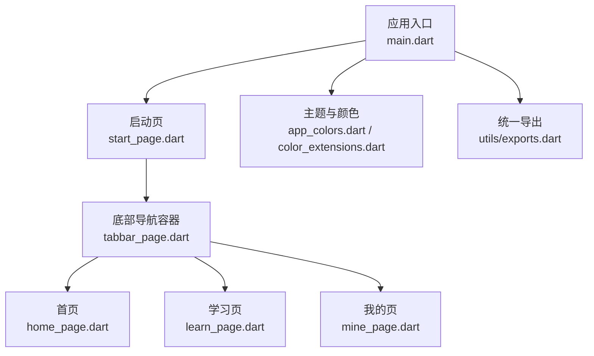
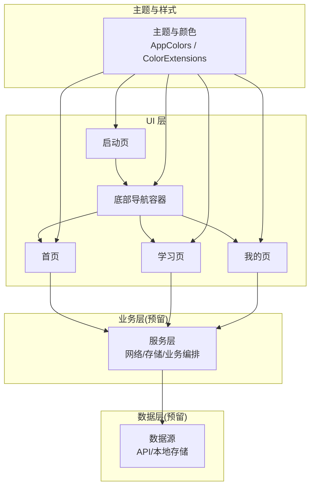
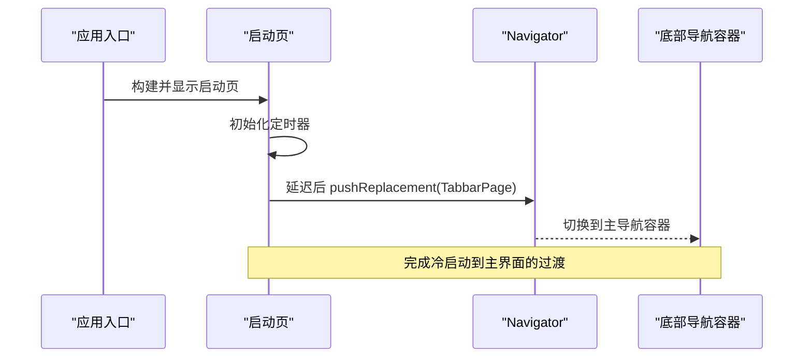
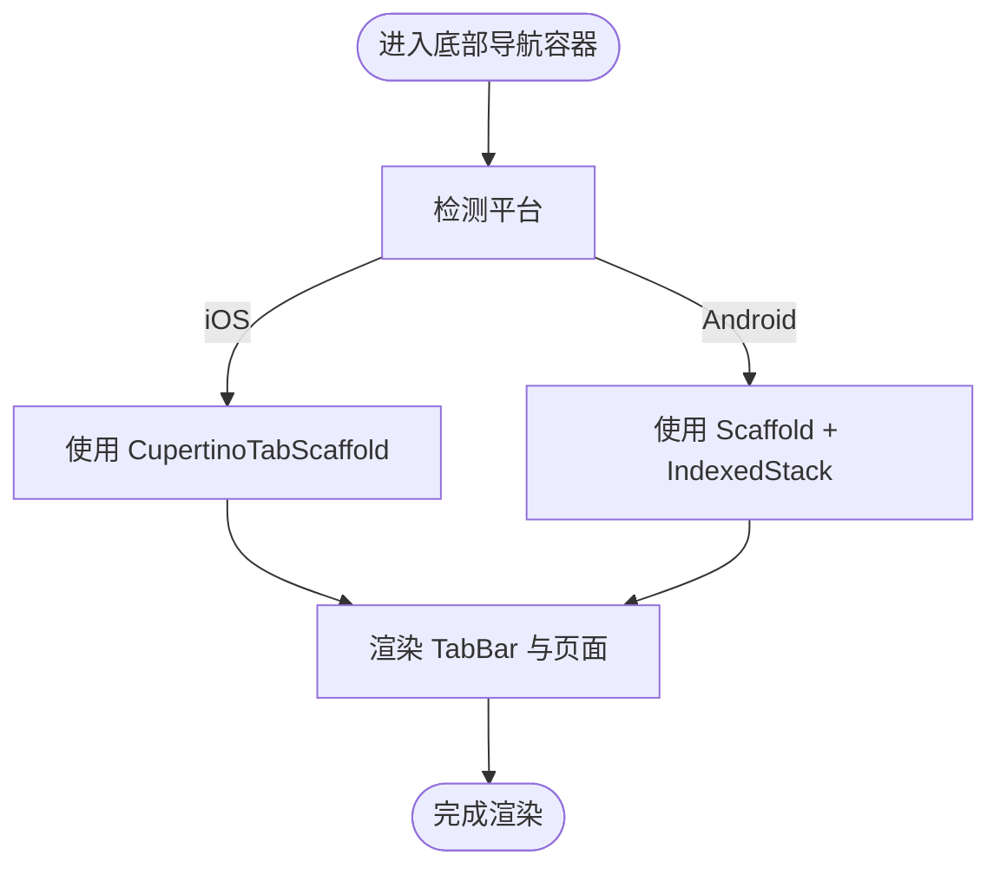
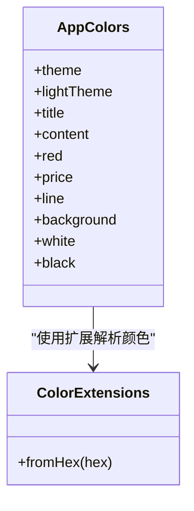
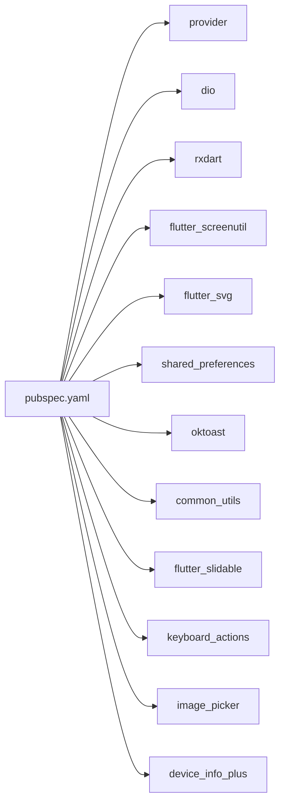

# 架构设计

<cite>
**本文引用的文件**
- [lib/main.dart](file://lib/main.dart)
- [lib/pages/starts/start_page.dart](file://lib/pages/starts/start_page.dart)
- [lib/pages/starts/tabbar_page.dart](file://lib/pages/starts/tabbar_page.dart)
- [lib/pages/home/home_page.dart](file://lib/pages/home/home_page.dart)
- [lib/pages/courses/learn_page.dart](file://lib/pages/courses/learn_page.dart)
- [lib/pages/settings/mine_page.dart](file://lib/pages/settings/mine_page.dart)
- [lib/utils/app_colors.dart](file://lib/utils/app_colors.dart)
- [lib/utils/exports.dart](file://lib/utils/exports.dart)
- [lib/extensions/color_extensions.dart](file://lib/extensions/color_extensions.dart)
- [pubspec.yaml](file://pubspec.yaml)
- [android/app/build.gradle.kts](file://android/app/build.gradle.kts)
- [ios/Runner/AppDelegate.swift](file://ios/Runner/AppDelegate.swift)
- [test/widget_test.dart](file://test/widget_test.dart)
</cite>

## 目录
1. [简介](#简介)
2. [项目结构](#项目结构)
3. [核心组件](#核心组件)
4. [架构总览](#架构总览)
5. [详细组件分析](#详细组件分析)
6. [依赖分析](#依赖分析)
7. [性能考虑](#性能考虑)
8. [故障排查指南](#故障排查指南)
9. [结论](#结论)
10. [附录：扩展点与新增模块指南](#附录：扩展点与新增模块指南)

## 简介
本文件面向开发者与产品相关同学，系统化阐述该 Flutter 应用的架构模式与设计原则。应用采用清晰的分层架构（UI 层、业务层、数据层），以组件化组织页面与通用能力，结合 Provider 作为状态管理方案，并通过主题系统与颜色集中管理实现一致的视觉风格。文档包含架构图与数据流向图，帮助理解各组件交互关系，并提供扩展点说明，指导如何添加新功能模块。

## 项目结构
应用遵循“按功能域 + 分层”的组织方式：
- lib/main.dart：应用入口，初始化主题与首页路由。
- lib/pages：页面集合，按功能域划分（启动、首页、学习、我的等）。
- lib/utils：工具与资源导出（颜色、SVG、资源生成类）。
- lib/extensions：Dart 扩展方法（如颜色扩展）。
- lib/services：服务层（当前为空，预留网络、本地存储等服务接入点）。
- lib/widgets：通用 UI 组件（当前为空，预留复用组件）。
- lib/base：基础抽象（当前为空，预留基类或基组件）。
- android/ios：平台侧配置与插件注册。

图表来源
- [lib/main.dart:1-23](file://lib/main.dart#L1-L23)
- [lib/pages/starts/start_page.dart:1-37](file://lib/pages/starts/start_page.dart#L1-L37)
- [lib/pages/starts/tabbar_page.dart:1-185](file://lib/pages/starts/tabbar_page.dart#L1-L185)
- [lib/pages/home/home_page.dart:1-25](file://lib/pages/home/home_page.dart#L1-L25)
- [lib/pages/courses/learn_page.dart:1-25](file://lib/pages/courses/learn_page.dart#L1-L25)
- [lib/pages/settings/mine_page.dart:1-28](file://lib/pages/settings/mine_page.dart#L1-L28)
- [lib/utils/app_colors.dart:1-27](file://lib/utils/app_colors.dart#L1-L27)
- [lib/utils/exports.dart:1-5](file://lib/utils/exports.dart#L1-L5)
- [lib/extensions/color_extensions.dart:1-200](file://lib/extensions/color_extensions.dart#L1-L200)

章节来源
- [lib/main.dart:1-23](file://lib/main.dart#L1-L23)
- [pubspec.yaml:1-136](file://pubspec.yaml#L1-L136)

## 核心组件
- 应用入口与主题
  - 通过 MaterialApp 设置全局主题色，使用种子色生成 ColorScheme，确保全局一致性。
  - 首页为启动页，负责短暂展示后跳转到主导航容器。
- 启动流程
  - 启动页在生命周期内定时跳转至底部导航容器，完成应用冷启动后的首屏切换。
- 底部导航容器
  - 根据平台选择 CupertinoTabScaffold 或自定义 Scaffold + IndexedStack，统一管理三个主要 Tab 页面。
- 页面组件
  - 首页、学习页、我的页均为独立 StatelessWidget，职责单一，便于测试与维护。
- 主题与颜色
  - 颜色集中定义于 AppColors，配合 HexColor 扩展进行十六进制解析；主题色注入到 Theme 中供全应用使用。
- 资源与导出
  - 通过 flutter_gen 生成资源访问类，统一导出 SVG 与资源路径，减少硬编码。

章节来源
- [lib/main.dart:1-23](file://lib/main.dart#L1-L23)
- [lib/pages/starts/start_page.dart:1-37](file://lib/pages/starts/start_page.dart#L1-L37)
- [lib/pages/starts/tabbar_page.dart:1-185](file://lib/pages/starts/tabbar_page.dart#L1-L185)
- [lib/pages/home/home_page.dart:1-25](file://lib/pages/home/home_page.dart#L1-L25)
- [lib/pages/courses/learn_page.dart:1-25](file://lib/pages/courses/learn_page.dart#L1-L25)
- [lib/pages/settings/mine_page.dart:1-28](file://lib/pages/settings/mine_page.dart#L1-L28)
- [lib/utils/app_colors.dart:1-27](file://lib/utils/app_colors.dart#L1-L27)
- [lib/utils/exports.dart:1-5](file://lib/utils/exports.dart#L1-L5)
- [lib/extensions/color_extensions.dart:1-200](file://lib/extensions/color_extensions.dart#L1-L200)

## 架构总览
应用采用分层架构与组件化设计：
- UI 层：页面与通用 Widget，负责渲染与用户交互。
- 业务层：当前未显式拆分，可在 services 层引入用例编排与领域逻辑。
- 数据层：当前未显式拆分，可在 services 层封装 Dio 请求与 SharedPreferences 存储。
- 主题与样式：集中管理颜色与主题，保证一致性与可替换性。
- 路由与导航：基于 Navigator 的页面级跳转与底部导航容器管理。

图表来源
- [lib/pages/starts/start_page.dart:1-37](file://lib/pages/starts/start_page.dart#L1-L37)
- [lib/pages/starts/tabbar_page.dart:1-185](file://lib/pages/starts/tabbar_page.dart#L1-L185)
- [lib/pages/home/home_page.dart:1-25](file://lib/pages/home/home_page.dart#L1-L25)
- [lib/pages/courses/learn_page.dart:1-25](file://lib/pages/courses/learn_page.dart#L1-L25)
- [lib/pages/settings/mine_page.dart:1-28](file://lib/pages/settings/mine_page.dart#L1-L28)
- [lib/utils/app_colors.dart:1-27](file://lib/utils/app_colors.dart#L1-L27)
- [lib/extensions/color_extensions.dart:1-200](file://lib/extensions/color_extensions.dart#L1-L200)

## 详细组件分析

### 启动流程与路由
- 启动流程
  - 应用启动后进入启动页，定时器触发后执行页面替换，跳转到底部导航容器。
- 路由策略
  - 使用 Navigator.pushReplacement 替换根路由，避免返回栈累积。
  - 底部导航容器内部通过 IndexedStack 维护多个页面实例，提升切换性能。

图表来源
- [lib/main.dart:1-23](file://lib/main.dart#L1-L23)
- [lib/pages/starts/start_page.dart:1-37](file://lib/pages/starts/start_page.dart#L1-L37)
- [lib/pages/starts/tabbar_page.dart:1-185](file://lib/pages/starts/tabbar_page.dart#L1-L185)

章节来源
- [lib/pages/starts/start_page.dart:1-37](file://lib/pages/starts/start_page.dart#L1-L37)
- [lib/pages/starts/tabbar_page.dart:1-185](file://lib/pages/starts/tabbar_page.dart#L1-L185)

### 底部导航容器与页面管理
- 平台适配
  - iOS 使用 CupertinoTabScaffold + CupertinoTabBar，保持原生体验。
  - Android 使用自定义 BottomNavigationBar，结合 AnimatedContainer 实现选中态动画。
- 页面切换
  - 使用 IndexedStack 保持页面状态，避免重复创建开销。
- 图标与文案
  - 通过 Assets 生成的资源路径引用 SVG 图标，保证多分辨率与类型安全。

图表来源
- [lib/pages/starts/tabbar_page.dart:1-185](file://lib/pages/starts/tabbar_page.dart#L1-L185)

章节来源
- [lib/pages/starts/tabbar_page.dart:1-185](file://lib/pages/starts/tabbar_page.dart#L1-L185)

### 主题系统与颜色管理
- 颜色集中管理
  - AppColors 提供主题色、标题色、内容色、背景色等，统一入口，便于维护与替换。
- 主题注入
  - 通过 ColorScheme.fromSeed 将主题色注入到 ThemeData，影响全局 primaryColor 等。
- 扩展能力
  - 使用 HexColor 扩展解析十六进制颜色字符串，简化颜色定义。

图表来源
- [lib/utils/app_colors.dart:1-27](file://lib/utils/app_colors.dart#L1-L27)
- [lib/extensions/color_extensions.dart:1-200](file://lib/extensions/color_extensions.dart#L1-L200)

章节来源
- [lib/main.dart:1-23](file://lib/main.dart#L1-L23)
- [lib/utils/app_colors.dart:1-27](file://lib/utils/app_colors.dart#L1-L27)
- [lib/utils/exports.dart:1-5](file://lib/utils/exports.dart#L1-L5)
- [lib/extensions/color_extensions.dart:1-200](file://lib/extensions/color_extensions.dart#L1-L200)

### 状态管理模式（Provider）
- 选型与现状
  - 依赖中包含 provider，但当前页面尚未使用。建议后续在业务层引入 ChangeNotifier/StateNotifier 管理跨页面共享状态（如用户信息、偏好设置）。
- 推荐实践
  - 在 services 层暴露状态提供者，UI 层通过 Provider.of 订阅更新。
  - 对复杂状态可使用 rxdart 组合流，提高响应式能力。

章节来源
- [pubspec.yaml:1-136](file://pubspec.yaml#L1-L136)

### 数据层与服务层（预留）
- 网络请求
  - 依赖 dio，建议在 services 层封装统一的 HTTP 客户端、拦截器与错误处理。
- 本地存储
  - 依赖 shared_preferences，建议在 services 层封装键值存储与序列化逻辑。
- 设备信息与图片选择
  - device_info_plus、image_picker 可用于获取设备信息与选择图片，建议在 services 层提供统一接口。

章节来源
- [pubspec.yaml:1-136](file://pubspec.yaml#L1-L136)

## 依赖分析
- 关键依赖
  - provider：状态管理。
  - dio：网络请求。
  - rxdart：响应式编程。
  - flutter_screenutil：屏幕适配。
  - flutter_svg：SVG 资源加载。
  - shared_preferences：本地存储。
  - oktoast：提示框。
  - common_utils：常用工具。
  - flutter_slidable：侧滑删除。
  - keyboard_actions：键盘事件处理。
  - image_picker：图片选择。
  - device_info_plus：设备信息。
- 平台集成
  - Android：Gradle 配置与插件注册。
  - iOS：AppDelegate 与 SceneDelegate 初始化。

图表来源
- [pubspec.yaml:1-136](file://pubspec.yaml#L1-L136)

章节来源
- [pubspec.yaml:1-136](file://pubspec.yaml#L1-L136)
- [android/app/build.gradle.kts:1-45](file://android/app/build.gradle.kts#L1-L45)
- [ios/Runner/AppDelegate.swift:1-16](file://ios/Runner/AppDelegate.swift#L1-L16)

## 性能考虑
- 页面切换优化
  - 使用 IndexedStack 保持页面状态，避免重建开销。
- 主题与颜色
  - 集中管理颜色，减少重复计算与不一致风险。
- 资源加载
  - 使用 flutter_gen 生成资源访问类，提升类型安全与编译期检查。
- 平台适配
  - 针对 iOS 使用 Cupertino 组件，获得更优的原生体验与性能。

[本节为通用性能建议，不直接分析具体文件]

## 故障排查指南
- 启动页跳转异常
  - 检查 Timer 是否被正确调用，以及 mounted 状态判断是否生效。
  - 确认目标路由是否存在且可构建。
- 主题颜色不生效
  - 确认 ColorScheme.fromSeed 的种子色是否正确传入。
  - 检查 AppColors 与 ColorExtensions 是否被正确导入与使用。
- 底部导航切换无效
  - 检查 _currentIndex 状态更新与 setState 调用。
  - 确认 IndexedStack 的 children 与 index 对应关系。
- 测试验证
  - 使用 widget_test 验证启动流程与页面切换是否符合预期。

章节来源
- [lib/pages/starts/start_page.dart:1-37](file://lib/pages/starts/start_page.dart#L1-L37)
- [lib/pages/starts/tabbar_page.dart:1-185](file://lib/pages/starts/tabbar_page.dart#L1-L185)
- [lib/utils/app_colors.dart:1-27](file://lib/utils/app_colors.dart#L1-L27)
- [test/widget_test.dart:1-20](file://test/widget_test.dart#L1-L20)

## 结论
该应用采用清晰的层级与组件化设计，UI 层职责明确，主题与颜色集中管理，路由与导航简洁高效。未来可在 services 层引入 Provider 与 dio/shared_preferences 等依赖，形成完整的业务与数据层，进一步提升可维护性与可扩展性。

[本节为总结性内容，不直接分析具体文件]

## 附录：扩展点与新增模块指南
- 新增页面模块
  - 在 lib/pages 下新建功能域目录与页面文件。
  - 若需加入底部导航，修改 tabbar_page.dart 中的页面列表与 Tab 项。
  - 若为独立路由，可在启动页或其他页面中使用 Navigator.push 跳转。
- 新增状态管理
  - 在 services 层创建 ChangeNotifier 或 StateNotifier，暴露状态与操作方法。
  - 在 UI 层通过 Provider.of 订阅状态变化，触发 rebuild。
- 新增网络或存储能力
  - 在 services 层封装 Dio 客户端与 SharedPreferences 操作，提供统一接口。
  - 在页面中调用服务层方法，解耦 UI 与数据逻辑。
- 新增主题或颜色
  - 在 AppColors 中添加新颜色常量，必要时调整 ColorScheme 种子色。
  - 在页面中使用 Theme.of(context).primaryColor 或 AppColors 获取颜色。
- 新增通用组件
  - 在 lib/widgets 中创建可复用组件，并在页面中按需引入。
- 平台适配
  - 在需要时参考 tabbar_page.dart 的平台分支逻辑，为新增功能提供差异化实现。

[本节为扩展指导，不直接分析具体文件]