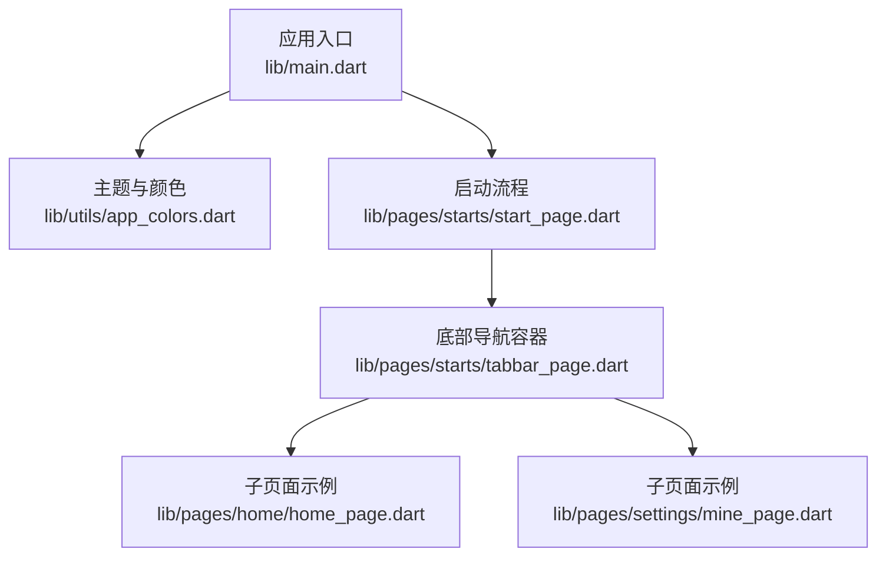
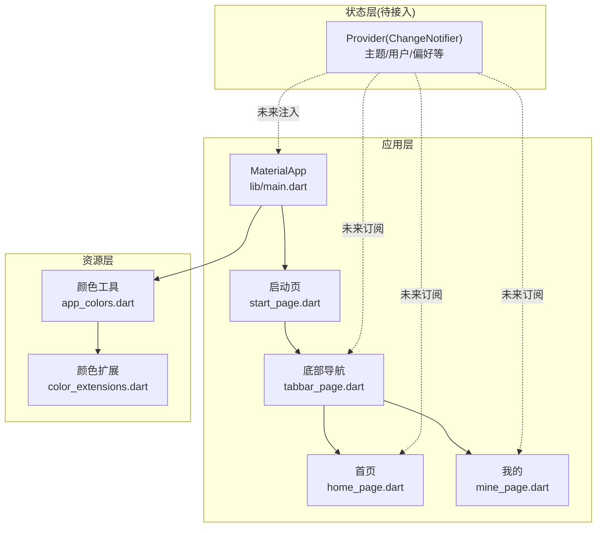
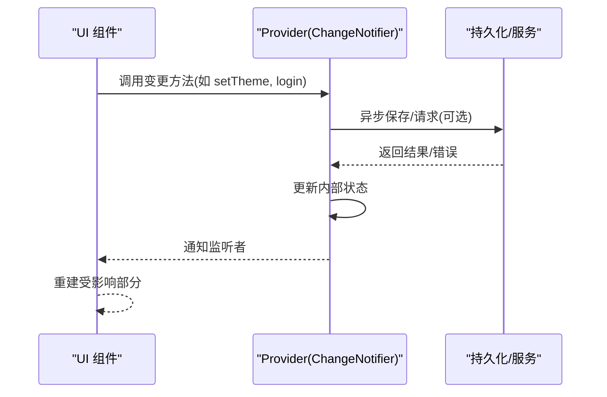
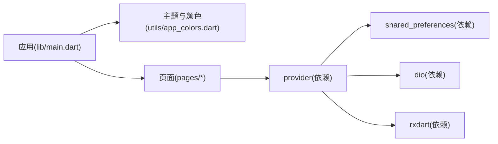

# 状态管理

<cite>
**本文引用的文件**
- [lib/main.dart](file://lib/main.dart)
- [pubspec.yaml](file://pubspec.yaml)
- [lib/utils/app_colors.dart](file://lib/utils/app_colors.dart)
- [lib/extensions/color_extensions.dart](file://lib/extensions/color_extensions.dart)
- [lib/pages/starts/start_page.dart](file://lib/pages/starts/start_page.dart)
- [lib/pages/starts/tabbar_page.dart](file://lib/pages/starts/tabbar_page.dart)
- [lib/pages/home/home_page.dart](file://lib/pages/home/home_page.dart)
- [lib/pages/settings/mine_page.dart](file://lib/pages/settings/mine_page.dart)
</cite>

## 目录
1. [简介](#简介)
2. [项目结构](#项目结构)
3. [核心组件](#核心组件)
4. [架构总览](#架构总览)
5. [详细组件分析](#详细组件分析)
6. [依赖分析](#依赖分析)
7. [性能考虑](#性能考虑)
8. [故障排查指南](#故障排查指南)
9. [结论](#结论)
10. [附录](#附录)

## 简介
本文件聚焦于本项目中基于 Provider 的状态管理实践与最佳实践。当前仓库已引入 provider 依赖，但尚未在应用层进行 Provider 的集成与使用。本文将：
- 说明如何在应用中集成 Provider（以 ChangeNotifierProvider 为例）
- 给出全局状态（主题颜色、用户信息等）的管理策略与更新机制
- 明确 StatefulWidget 与 StatelessWidget 的选择原则，以及何时通过 Provider 提升状态
- 提供状态同步、数据流管理与性能优化的实践经验
- 总结常见问题与调试技巧

## 项目结构
- 入口与主题配置位于 lib/main.dart，负责构建 MaterialApp 并设置主题色
- 颜色体系集中在 lib/utils/app_colors.dart，并通过扩展方法统一转换十六进制颜色
- 页面按功能模块划分在 lib/pages 下，包含启动页、首页、设置页等
- 依赖声明在 pubspec.yaml，其中已包含 provider 依赖

图表来源
- [lib/main.dart:1-23](file://lib/main.dart#L1-L23)
- [lib/utils/app_colors.dart:1-27](file://lib/utils/app_colors.dart#L1-L27)
- [lib/pages/starts/start_page.dart:1-37](file://lib/pages/starts/start_page.dart#L1-L37)
- [lib/pages/starts/tabbar_page.dart:42-123](file://lib/pages/starts/tabbar_page.dart#L42-L123)
- [lib/pages/home/home_page.dart:1-25](file://lib/pages/home/home_page.dart#L1-L25)
- [lib/pages/settings/mine_page.dart:1-28](file://lib/pages/settings/mine_page.dart#L1-L28)

章节来源
- [lib/main.dart:1-23](file://lib/main.dart#L1-L23)
- [pubspec.yaml:30-55](file://pubspec.yaml#L30-L55)

## 核心组件
- 应用主题与颜色
  - 主题种子色来自 AppColors.theme，用于生成 ColorScheme，影响 Theme.of(context).primaryColor
  - 颜色工具类集中管理所有颜色常量，便于统一维护与切换
- 页面与导航
  - 启动页在定时器后跳转到主导航容器
  - 底部导航容器承载多个子页面，当前未持有跨页面共享状态
- 依赖与扩展
  - 通过扩展方法将十六进制字符串转换为 Color，简化颜色定义
  - 依赖中包含 provider，为后续引入状态管理做好准备

章节来源
- [lib/main.dart:14-20](file://lib/main.dart#L14-L20)
- [lib/utils/app_colors.dart:5-27](file://lib/utils/app_colors.dart#L5-L27)
- [lib/extensions/color_extensions.dart:1-21](file://lib/extensions/color_extensions.dart#L1-L21)
- [lib/pages/starts/start_page.dart:12-24](file://lib/pages/starts/start_page.dart#L12-L24)
- [lib/pages/starts/tabbar_page.dart:55-99](file://lib/pages/starts/tabbar_page.dart#L55-L99)
- [pubspec.yaml:44-45](file://pubspec.yaml#L44-L45)

## 架构总览
当前应用采用“无状态 UI + 主题驱动”的轻量架构。下一步建议引入 Provider 作为全局状态管理中心，围绕 ChangeNotifier 暴露可观察的数据与变更方法，并在需要处消费。

图表来源
- [lib/main.dart:14-20](file://lib/main.dart#L14-L20)
- [lib/pages/starts/start_page.dart:12-24](file://lib/pages/starts/start_page.dart#L12-L24)
- [lib/pages/starts/tabbar_page.dart:55-99](file://lib/pages/starts/tabbar_page.dart#L55-L99)
- [lib/pages/home/home_page.dart:1-25](file://lib/pages/home/home_page.dart#L1-L25)
- [lib/pages/settings/mine_page.dart:1-28](file://lib/pages/settings/mine_page.dart#L1-L28)
- [lib/utils/app_colors.dart:5-27](file://lib/utils/app_colors.dart#L5-L27)
- [lib/extensions/color_extensions.dart:1-21](file://lib/extensions/color_extensions.dart#L1-L21)

## 详细组件分析

### 主题与颜色（全局样式状态）
- 现状
  - 主题种子色由 AppColors.theme 提供，MaterialApp 据此生成 ColorScheme
  - 页面通过 Theme.of(context).primaryColor 获取主色，保证视觉一致性
- 建议（引入 Provider 后的演进）
  - 将主题相关状态（如主色、明暗模式）放入一个 ChangeNotifier 中
  - 在应用根节点使用 ChangeNotifierProvider 暴露主题状态
  - 子组件通过 context.watch 或 context.read 订阅/触发主题变更
- 优势
  - 统一主题源，避免分散的颜色常量与重复逻辑
  - 支持运行时动态切换主题，且仅重建必要 Widget

章节来源
- [lib/main.dart:14-20](file://lib/main.dart#L14-L20)
- [lib/utils/app_colors.dart:5-27](file://lib/utils/app_colors.dart#L5-L27)
- [lib/extensions/color_extensions.dart:1-21](file://lib/extensions/color_extensions.dart#L1-L21)

### 启动流程与页面跳转（局部状态）
- 现状
  - 启动页在 initState 中使用定时器延迟跳转至底部导航容器
  - 该状态属于页面内部生命周期，适合用 StatefulWidget 管理
- 建议
  - 保持当前实现，因为跳转逻辑是页面内局部行为
  - 若后续需要记住上次进入位置或加载进度，可考虑将这部分状态提升到 Provider

章节来源
- [lib/pages/starts/start_page.dart:12-24](file://lib/pages/starts/start_page.dart#L12-L24)

### 底部导航容器（Tab 控制器）
- 现状
  - 使用 PlatformTabController 管理 Tab 切换，生命周期在 initState 初始化、dispose 释放
  - 当前未持有跨 Tab 共享的业务状态
- 建议
  - 若需要在多个 Tab 间共享数据（如用户信息、搜索词），可将共享状态放入 Provider
  - 对频繁更新的 UI 使用 Selector 或细粒度 watch，减少不必要的重建

章节来源
- [lib/pages/starts/tabbar_page.dart:42-52](file://lib/pages/starts/tabbar_page.dart#L42-L52)
- [lib/pages/starts/tabbar_page.dart:55-99](file://lib/pages/starts/tabbar_page.dart#L55-L99)

### 子页面（首页、我的）
- 现状
  - 均为纯展示型页面，不持有业务状态
- 建议
  - 当需要显示用户信息、消息数等时，从 Provider 读取并展示
  - 对于只读展示，优先使用 StatelessWidget；需要本地交互状态时使用 StatefulWidget

章节来源
- [lib/pages/home/home_page.dart:1-25](file://lib/pages/home/home_page.dart#L1-L25)
- [lib/pages/settings/mine_page.dart:1-28](file://lib/pages/settings/mine_page.dart#L1-L28)

### 状态提升与选择原则
- StatelessWidget vs StatefulWidget
  - StatelessWidget：无本地可变状态，仅根据传入参数渲染
  - StatefulWidget：拥有本地生命周期与可变状态（如输入框、动画、定时器）
- 何时使用 Provider 提升状态
  - 多个 Widget 需要共享同一份数据或事件回调
  - 状态跨越页面边界（如登录态、主题、网络缓存）
  - 需要解耦 UI 与业务逻辑，便于测试与维护

章节来源
- [lib/pages/starts/start_page.dart:12-24](file://lib/pages/starts/start_page.dart#L12-L24)
- [lib/pages/home/home_page.dart:1-25](file://lib/pages/home/home_page.dart#L1-L25)
- [lib/pages/settings/mine_page.dart:1-28](file://lib/pages/settings/mine_page.dart#L1-L28)

### 数据流与状态同步（推荐流程）

图表来源
- [pubspec.yaml:44-45](file://pubspec.yaml#L44-L45)

## 依赖分析
- 关键依赖
  - provider：用于状态管理
  - shared_preferences：用于本地持久化（可与 Provider 结合存储用户偏好）
  - dio：网络请求（可在 Provider 中封装 API 调用）
  - rxdart：响应式数据流（可与 Provider 配合处理复杂异步流）
- 依赖关系图

图表来源
- [pubspec.yaml:30-55](file://pubspec.yaml#L30-L55)
- [lib/main.dart:14-20](file://lib/main.dart#L14-L20)
- [lib/utils/app_colors.dart:5-27](file://lib/utils/app_colors.dart#L5-L27)

章节来源
- [pubspec.yaml:30-55](file://pubspec.yaml#L30-L55)

## 性能考虑
- 最小化重建
  - 使用 const 构造减少不必要的重建
  - 使用 Selector 或精确的 context.watch 订阅最小数据片段
- 合理拆分 Provider
  - 将不同领域状态拆分为独立 Provider（如主题、用户、网络缓存），降低耦合
- 避免在 build 中执行昂贵计算
  - 将计算结果缓存到 Provider 或内存缓存
- 异步操作
  - 在 Provider 中集中处理网络请求与错误，UI 仅负责展示
- 主题切换
  - 将主题状态置于 Provider，确保仅重建受影响的 Widget 树

[本节为通用指导，无需特定文件引用]

## 故障排查指南
- 常见症状与对策
  - 主题未生效：确认 Provider 是否包裹了 MaterialApp，且主题状态被正确订阅
  - 状态不同步：检查是否在正确的上下文中调用 read/watch，避免在错误的层级访问
  - 性能抖动：定位过度重建的 Widget，改用 Selector 或提升状态范围
  - 异步错误：在 Provider 中捕获异常并提供默认状态，避免 UI 崩溃
- 调试技巧
  - 使用 Flutter DevTools 的 Widget Inspector 与 Performance 面板定位问题
  - 在 Provider 中打印日志或使用断点，追踪状态变更路径
  - 针对主题切换，使用截图对比验证前后一致

[本节为通用指导，无需特定文件引用]

## 结论
当前项目已具备引入 Provider 的基础条件。建议以“主题与用户信息”为切入点，逐步建立清晰的状态分层与数据流：
- 在应用根节点注入必要的 ChangeNotifierProvider
- 将跨页面共享的状态上移至 Provider，页面专注渲染与交互
- 通过 Selector 与细粒度订阅优化性能
- 结合 shared_preferences 与 dio 实现持久化与网络数据的统一管理

[本节为总结性内容，无需特定文件引用]

## 附录
- 参考文件
  - 应用入口与主题：[lib/main.dart:14-20](file://lib/main.dart#L14-L20)
  - 颜色工具与扩展：[lib/utils/app_colors.dart:5-27](file://lib/utils/app_colors.dart#L5-L27)、[lib/extensions/color_extensions.dart:1-21](file://lib/extensions/color_extensions.dart#L1-L21)
  - 启动与导航：[lib/pages/starts/start_page.dart:12-24](file://lib/pages/starts/start_page.dart#L12-L24)、[lib/pages/starts/tabbar_page.dart:42-99](file://lib/pages/starts/tabbar_page.dart#L42-L99)
  - 子页面示例：[lib/pages/home/home_page.dart:1-25](file://lib/pages/home/home_page.dart#L1-L25)、[lib/pages/settings/mine_page.dart:1-28](file://lib/pages/settings/mine_page.dart#L1-L28)
  - 依赖声明：[pubspec.yaml:44-55](file://pubspec.yaml#L44-L55)

[本节为附录，无需额外来源标注]