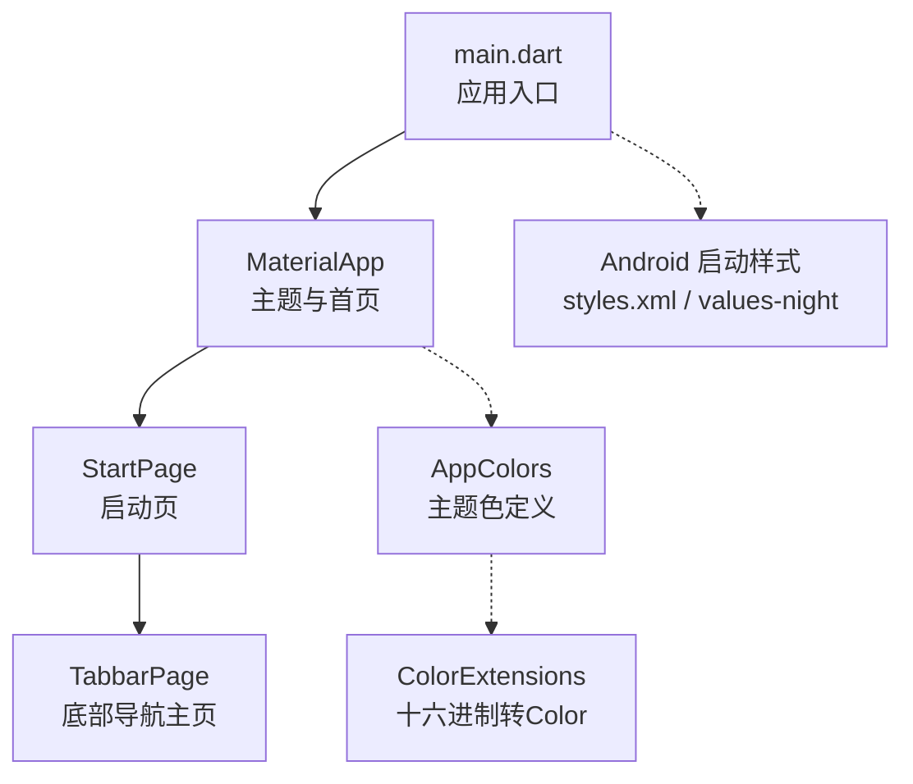
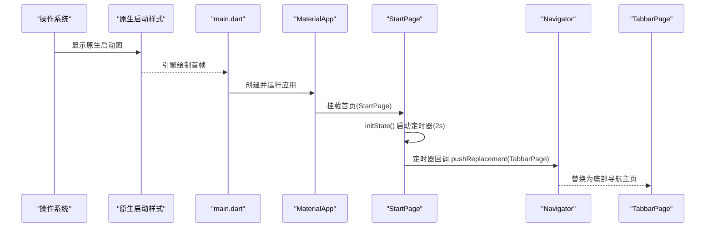
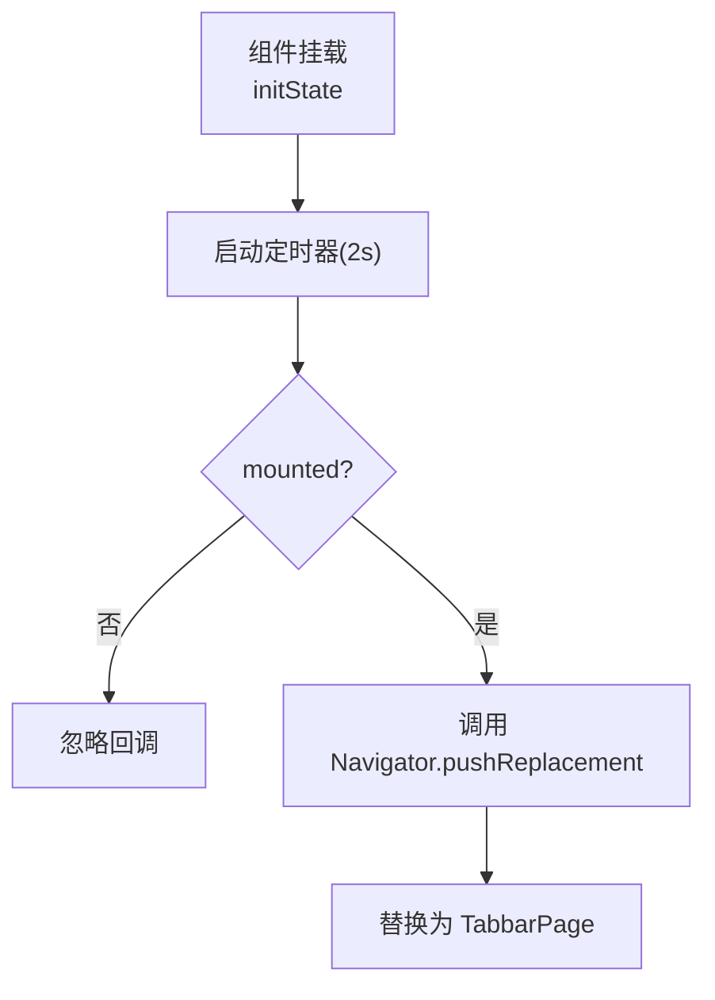
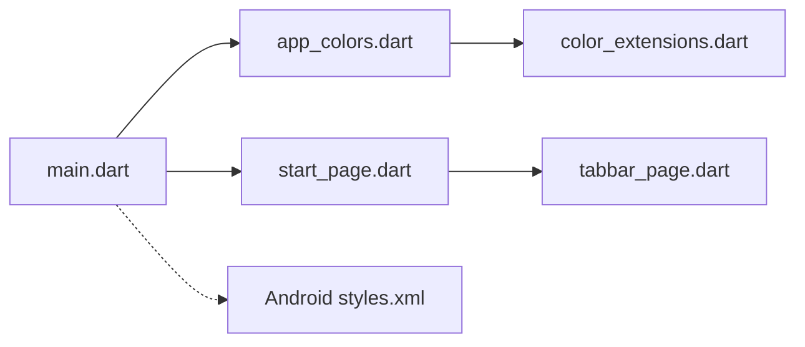

# 启动模块

<cite>
**本文引用的文件**
- [lib/main.dart](file://lib/main.dart)
- [lib/pages/starts/start_page.dart](file://lib/pages/starts/start_page.dart)
- [lib/pages/starts/tabbar_page.dart](file://lib/pages/starts/tabbar_page.dart)
- [lib/utils/app_colors.dart](file://lib/utils/app_colors.dart)
- [lib/extensions/color_extensions.dart](file://lib/extensions/color_extensions.dart)
- [pubspec.yaml](file://pubspec.yaml)
- [android/app/src/main/res/values/styles.xml](file://android/app/src/main/res/values/styles.xml)
- [android/app/src/main/res/values-night/styles.xml](file://android/app/src/main/res/values-night/styles.xml)
- [test/widget_test.dart](file://test/widget_test.dart)
</cite>

## 目录
1. [简介](#简介)
2. [项目结构](#项目结构)
3. [核心组件](#核心组件)
4. [架构总览](#架构总览)
5. [详细组件分析](#详细组件分析)
6. [依赖关系分析](#依赖关系分析)
7. [性能考虑](#性能考虑)
8. [故障排查指南](#故障排查指南)
9. [结论](#结论)
10. [附录：扩展指南](#附录扩展指南)

## 简介
本模块聚焦应用的启动流程，围绕入口配置、主题设置、路由注册与启动页的定时器跳转机制进行系统化说明。文档将解释 StartPage 的设计理念与实现逻辑，包括生命周期管理、页面跳转策略与用户体验设计（2秒延迟显示与自动跳转），并提供扩展建议与常见问题解决方案。

## 项目结构
应用采用 Flutter 标准工程结构，启动流程的关键代码集中在 lib 目录下：
- 入口与主题：lib/main.dart
- 启动页与主导航：lib/pages/starts/start_page.dart、lib/pages/starts/tabbar_page.dart
- 颜色与主题资源：lib/utils/app_colors.dart、lib/extensions/color_extensions.dart
- 平台原生启动样式：android/app/src/main/res/values/styles.xml、values-night/styles.xml
- 测试用例：test/widget_test.dart

图表来源
- [lib/main.dart:14-21](file://lib/main.dart#L14-L21)
- [lib/pages/starts/start_page.dart:5-23](file://lib/pages/starts/start_page.dart#L5-L23)
- [lib/pages/starts/tabbar_page.dart:8-98](file://lib/pages/starts/tabbar_page.dart#L8-L98)
- [lib/utils/app_colors.dart:5-27](file://lib/utils/app_colors.dart#L5-L27)
- [lib/extensions/color_extensions.dart:4-21](file://lib/extensions/color_extensions.dart#L4-L21)
- [android/app/src/main/res/values/styles.xml:3-17](file://android/app/src/main/res/values/styles.xml#L3-L17)
- [android/app/src/main/res/values-night/styles.xml:3-17](file://android/app/src/main/res/values-night/styles.xml#L3-L17)

章节来源
- [lib/main.dart:1-23](file://lib/main.dart#L1-L23)
- [pubspec.yaml:99-109](file://pubspec.yaml#L99-L109)

## 核心组件
- 应用入口与主题：在 main.dart 中通过 runApp 启动 MyApp，使用 MaterialApp 配置标题、主题色与首页为 StartPage。
- 启动页：StartPage 是 StatefulWidget，在 initState 中设置一个 2 秒的 Timer，到期后通过 Navigator.pushReplacement 跳转到 TabbarPage。
- 主导航页：TabbarPage 使用 PlatformTabScaffold 构建跨平台的底部导航，包含首页、学习、我的三个页面。
- 颜色系统：AppColors 集中管理主题色等颜色值；ColorExtensions 提供十六进制字符串到 Color 的转换能力。

章节来源
- [lib/main.dart:5-23](file://lib/main.dart#L5-L23)
- [lib/pages/starts/start_page.dart:5-37](file://lib/pages/starts/start_page.dart#L5-L37)
- [lib/pages/starts/tabbar_page.dart:8-112](file://lib/pages/starts/tabbar_page.dart#L8-L112)
- [lib/utils/app_colors.dart:5-27](file://lib/utils/app_colors.dart#L5-L27)
- [lib/extensions/color_extensions.dart:4-21](file://lib/extensions/color_extensions.dart#L4-L21)

## 架构总览
启动流程从原生层渲染启动图开始，随后进入 Flutter 引擎并执行 main.dart 中的入口函数，创建 MaterialApp 并挂载 StartPage。StartPage 在初始化时启动定时器，2 秒后完成页面替换，进入 TabbarPage 作为应用的主界面。

图表来源
- [android/app/src/main/res/values/styles.xml:3-17](file://android/app/src/main/res/values/styles.xml#L3-L17)
- [lib/main.dart:5-21](file://lib/main.dart#L5-L21)
- [lib/pages/starts/start_page.dart:14-23](file://lib/pages/starts/start_page.dart#L14-L23)
- [lib/pages/starts/tabbar_page.dart:55-98](file://lib/pages/starts/tabbar_page.dart#L55-L98)

## 详细组件分析

### StartPage 设计与实现
- 设计理念
  - 作为冷启动后的首个用户可见页面，承担“品牌展示 + 必要初始化”的职责。
  - 通过固定时长（2秒）的定时器保证最小展示时间，提升感知流畅度。
  - 使用 pushReplacement 替换首页，避免返回栈堆积。
- 实现要点
  - 使用 StatefulWidget，在 initState 中启动定时器。
  - 定时器回调内检查 mounted，确保组件仍有效再执行导航。
  - 使用 Navigator.of(context).pushReplacement 切换到 TabbarPage。
- 生命周期管理
  - initState：启动定时器。
  - build：渲染简单内容（当前为文本提示）。
  - dispose：当前未持有需释放的资源（如定时器），若未来引入异步任务或监听器，需在 dispose 中清理。

图表来源
- [lib/pages/starts/start_page.dart:14-23](file://lib/pages/starts/start_page.dart#L14-L23)

章节来源
- [lib/pages/starts/start_page.dart:5-37](file://lib/pages/starts/start_page.dart#L5-L37)

### 应用初始化过程（main.dart）
- 入口点：void main 中调用 runApp(MyApp())。
- 主题设置：MaterialApp 的 theme 使用 ColorScheme.fromSeed，种子色来自 AppColors.theme。
- 路由注册：home 设置为 StartPage，作为应用首页。
- 资源与工具：通过 utils/exports.dart 统一导出颜色与 SVG 等资源工具，便于全局使用。

章节来源
- [lib/main.dart:5-23](file://lib/main.dart#L5-L23)
- [lib/utils/exports.dart:1-5](file://lib/utils/exports.dart#L1-L5)
- [lib/utils/app_colors.dart:5-27](file://lib/utils/app_colors.dart#L5-L27)

### 启动页面的用户体验设计
- 2秒延迟显示：确保用户能看到启动信息，同时避免过长的白屏体验。
- 自动跳转：定时器结束后自动切换到主界面，减少用户操作成本。
- 视觉一致性：主题色由 AppColors 统一管理，保证启动页与后续页面风格一致。

章节来源
- [lib/pages/starts/start_page.dart:17-23](file://lib/pages/starts/start_page.dart#L17-L23)
- [lib/utils/app_colors.dart:5-27](file://lib/utils/app_colors.dart#L5-L27)

### 主导航页（TabbarPage）概览
- 使用 PlatformTabScaffold 提供跨平台一致的底部导航体验。
- 包含三个页面：首页、学习、我的，分别对应不同业务模块。
- 图标与标签：通过 flutter_svg 加载矢量图标，结合主题色设置选中/未选中状态。

章节来源
- [lib/pages/starts/tabbar_page.dart:8-112](file://lib/pages/starts/tabbar_page.dart#L8-L112)

## 依赖关系分析
- 入口依赖
  - main.dart 依赖 Material 框架与自定义颜色工具。
- 启动页依赖
  - start_page.dart 依赖 dart:async 的 Timer 与 Navigator 进行页面切换。
- 主题与颜色
  - app_colors.dart 依赖 color_extensions.dart 提供的十六进制转 Color 能力。
- 平台原生
  - Android 启动样式在 styles.xml 与 values-night/styles.xml 中定义，控制原生启动阶段背景。

图表来源
- [lib/main.dart:1-23](file://lib/main.dart#L1-L23)
- [lib/utils/app_colors.dart:1-27](file://lib/utils/app_colors.dart#L1-L27)
- [lib/extensions/color_extensions.dart:1-21](file://lib/extensions/color_extensions.dart#L1-L21)
- [lib/pages/starts/start_page.dart:1-37](file://lib/pages/starts/start_page.dart#L1-L37)
- [lib/pages/starts/tabbar_page.dart:1-112](file://lib/pages/starts/tabbar_page.dart#L1-L112)
- [android/app/src/main/res/values/styles.xml:3-17](file://android/app/src/main/res/values/styles.xml#L3-L17)

章节来源
- [pubspec.yaml:30-65](file://pubspec.yaml#L30-L65)

## 性能考虑
- 启动耗时优化
  - 保持 StartPage 轻量，避免在 initState 中进行耗时网络请求或复杂计算。
  - 如需预加载数据，建议在后台线程或惰性加载，不影响首帧渲染。
- 定时器与内存
  - 当前未持有定时器引用，若未来需要取消或复用，应在 dispose 中释放相关资源。
- 主题与资源
  - 使用统一的 AppColors 减少重复计算与不一致问题。
  - 合理使用 SVG 图片，注意尺寸与缓存策略。
- 原生启动图
  - 通过 Android 的 launch_background 快速展示启动图，降低冷启动感知延迟。

[本节为通用性能建议，不直接分析具体代码行]

## 故障排查指南
- 启动后未跳转
  - 检查定时器是否被正确触发，确认 mounted 判断逻辑。
  - 确认 Navigator 上下文可用，避免在组件销毁后调用。
- 主题色异常
  - 检查 AppColors 与 ColorExtensions 是否正确导入与使用。
  - 确认 MaterialApp 的 theme 已正确设置 seedColor。
- 原生启动图不显示
  - 核对 Android 的 styles.xml 与 values-night/styles.xml 中 LaunchTheme 的背景资源路径。
- 测试验证
  - 使用 widget_test.dart 验证启动页显示与跳转行为是否符合预期。

章节来源
- [lib/pages/starts/start_page.dart:14-23](file://lib/pages/starts/start_page.dart#L14-L23)
- [lib/utils/app_colors.dart:5-27](file://lib/utils/app_colors.dart#L5-L27)
- [android/app/src/main/res/values/styles.xml:3-17](file://android/app/src/main/res/values/styles.xml#L3-L17)
- [android/app/src/main/res/values-night/styles.xml:3-17](file://android/app/src/main/res/values-night/styles.xml#L3-L17)
- [test/widget_test.dart:5-20](file://test/widget_test.dart#L5-L20)

## 结论
该启动模块以简洁清晰的方式实现了应用冷启动后的首屏展示与自动跳转。通过统一的主题管理与跨平台导航，保证了良好的用户体验与可维护性。后续可在不破坏现有结构的前提下，平滑扩展权限检查、版本更新检测与启动动画等功能。

[本节为总结性内容，不直接分析具体代码行]

## 附录：扩展指南
- 添加启动动画
  - 在 StartPage 的 build 中引入动画组件（如 AnimatedSwitcher、AnimatedOpacity），配合控制器在 initState 中触发动画。
  - 动画完成后执行定时器回调，再进行页面跳转。
- 权限检查
  - 在 initState 中发起权限申请（如存储、相机等），根据结果决定跳转目标或提示用户。
  - 使用异步流程包装权限检查，避免阻塞 UI。
- 版本更新检测
  - 在启动流程中加入网络请求获取最新版本信息，对比本地版本决定是否引导更新。
  - 将更新逻辑封装为独立服务，保持 StartPage 职责单一。
- 性能优化建议
  - 将耗时任务移至后台或延迟执行，确保首帧渲染速度。
  - 对图片与资源进行合理压缩与缓存，减少加载开销。
  - 避免在热路径中进行大量对象分配与字符串拼接。

[本节为概念性指导，不直接分析具体代码行]