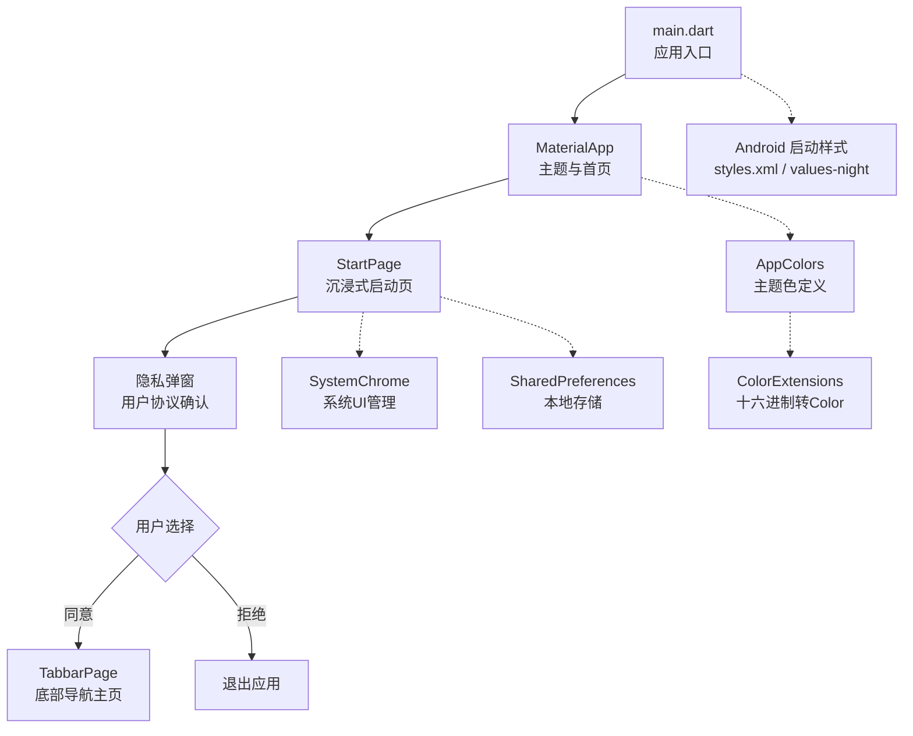
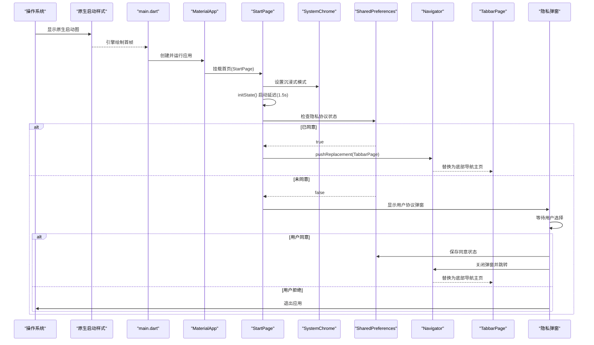
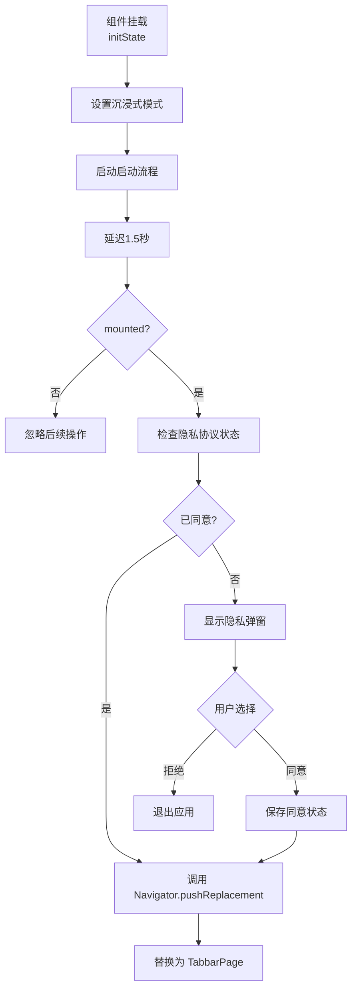
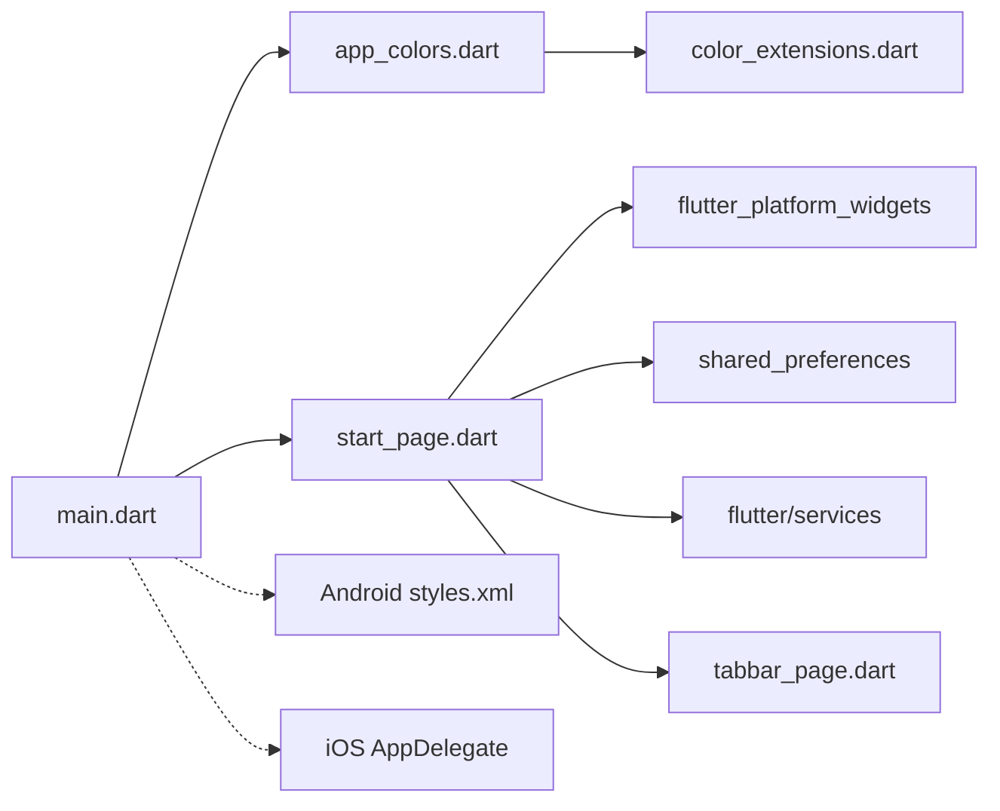

# 启动模块

<cite>
**本文引用的文件**
- [lib/main.dart](file://lib/main.dart)
- [lib/pages/starts/start_page.dart](file://lib/pages/starts/start_page.dart)
- [lib/pages/starts/tabbar_page.dart](file://lib/pages/starts/tabbar_page.dart)
- [lib/utils/app_colors.dart](file://lib/utils/app_colors.dart)
- [lib/utils/exports.dart](file://lib/utils/exports.dart)
- [pubspec.yaml](file://pubspec.yaml)
- [android/app/src/main/res/values/styles.xml](file://android/app/src/main/res/values/styles.xml)
- [android/app/src/main/res/values-night/styles.xml](file://android/app/src/main/res/values-night/styles.xml)
- [ios/Runner/AppDelegate.swift](file://ios/Runner/AppDelegate.swift)
</cite>

## 更新摘要
**变更内容**
- 完全重写了启动流程，从简单定时器跳转升级为完整的沉浸式启动体验
- 新增了隐私同意流程和用户协议确认机制
- 实现了全屏启动画面，包含品牌展示和视觉设计
- 集成了系统UI管理，支持沉浸式模式
- 添加了本地存储功能，记录用户首次启动状态
- 增强了跨平台兼容性，使用PlatformScaffold和PlatformTabScaffold

## 目录
1. [简介](#简介)
2. [项目结构](#项目结构)
3. [核心组件](#核心组件)
4. [架构总览](#架构总览)
5. [详细组件分析](#详细组件分析)
6. [依赖关系分析](#依赖关系分析)
7. [性能考虑](#性能考虑)
8. [故障排查指南](#故障排查指南)
9. [结论](#结论)
10. [附录：扩展指南](#附录扩展指南)

## 简介
本模块聚焦应用的启动流程，现已升级为包含沉浸式启动画面、隐私同意流程、系统UI集成和品牌展示的完整启动体验。文档将详细说明StartPage的设计理念与实现逻辑，包括生命周期管理、页面跳转策略、用户体验设计和隐私合规处理，并提供扩展建议与常见问题解决方案。

## 项目结构
应用采用Flutter标准工程结构，启动流程的关键代码集中在lib目录下：
- 入口与主题：lib/main.dart
- 启动页与主导航：lib/pages/starts/start_page.dart、lib/pages/starts/tabbar_page.dart
- 颜色与主题资源：lib/utils/app_colors.dart、lib/utils/exports.dart
- 平台原生启动样式：android/app/src/main/res/values/styles.xml、values-night/styles.xml
- iOS原生配置：ios/Runner/AppDelegate.swift

**图表来源**
- [lib/main.dart:5-23](file://lib/main.dart#L5-L23)
- [lib/pages/starts/start_page.dart:11-216](file://lib/pages/starts/start_page.dart#L11-L216)
- [lib/pages/starts/tabbar_page.dart:8-112](file://lib/pages/starts/tabbar_page.dart#L8-L112)
- [lib/utils/app_colors.dart:5-27](file://lib/utils/app_colors.dart#L5-L27)
- [android/app/src/main/res/values/styles.xml:3-17](file://android/app/src/main/res/values/styles.xml#L3-L17)

**章节来源**
- [lib/main.dart:1-23](file://lib/main.dart#L1-L23)
- [pubspec.yaml:99-111](file://pubspec.yaml#L99-L111)

## 核心组件
- **应用入口与主题**：在main.dart中通过runApp启动MyApp，使用MaterialApp配置标题、主题色与首页为StartPage。
- **沉浸式启动页**：StartPage是StatefulWidget，实现全屏启动画面，包含背景图、中心图标和底部品牌标识，提供1.5秒的品牌展示时间。
- **隐私同意流程**：首次启动时显示用户协议弹窗，要求用户明确同意后才能继续使用应用，符合隐私合规要求。
- **系统UI管理**：使用SystemChrome.setEnabledSystemUIMode(SystemUiMode.immersive)实现沉浸式体验，隐藏状态栏和导航栏。
- **本地状态管理**：通过SharedPreferences记录用户是否已同意隐私协议，避免重复提示。
- **主导航页**：TabbarPage使用PlatformTabScaffold构建跨平台的底部导航，包含首页、学习、我的三个页面。

**章节来源**
- [lib/main.dart:5-23](file://lib/main.dart#L5-L23)
- [lib/pages/starts/start_page.dart:11-216](file://lib/pages/starts/start_page.dart#L11-L216)
- [lib/pages/starts/tabbar_page.dart:8-112](file://lib/pages/starts/tabbar_page.dart#L8-L112)

## 架构总览
启动流程从原生层渲染启动图开始，随后进入Flutter引擎并执行main.dart中的入口函数，创建MaterialApp并挂载StartPage。StartPage在初始化时设置沉浸式模式并启动1.5秒延迟，检查用户隐私协议状态，决定跳转到主界面或显示隐私同意弹窗。

**图表来源**
- [android/app/src/main/res/values/styles.xml:3-17](file://android/app/src/main/res/values/styles.xml#L3-L17)
- [lib/main.dart:5-23](file://lib/main.dart#L5-L23)
- [lib/pages/starts/start_page.dart:21-45](file://lib/pages/starts/start_page.dart#L21-L45)
- [lib/pages/starts/start_page.dart:57-177](file://lib/pages/starts/start_page.dart#L57-L177)
- [lib/pages/starts/tabbar_page.dart:55-98](file://lib/pages/starts/tabbar_page.dart#L55-L98)

## 详细组件分析

### StartPage 设计与实现
**更新** 启动页面已从简单的定时器跳转升级为完整的沉浸式启动体验

- **设计理念**
  - 作为冷启动后的首个用户可见页面，承担"品牌展示 + 隐私合规 + 必要初始化"的职责。
  - 通过固定时长（1.5秒）的延迟保证最小品牌展示时间，提升感知流畅度。
  - 使用pushReplacement替换首页，避免返回栈堆积。
  - 实现沉浸式模式，提供全屏启动体验。

- **实现要点**
  - 使用StatefulWidget，在initState中设置沉浸式模式和启动流程。
  - 使用SystemChrome控制系统UI，隐藏状态栏和导航栏。
  - 通过Future.delayed实现1.5秒的品牌展示延迟。
  - 使用SharedPreferences检查用户隐私协议状态。
  - 实现条件跳转：已同意直接跳转，未同意显示隐私弹窗。

- **生命周期管理**
  - initState：设置沉浸式模式，启动启动流程。
  - build：渲染全屏启动画面，包含背景图、中心图标和底部品牌标识。
  - dispose：当前未持有需释放的资源，但可添加系统UI恢复逻辑。

**图表来源**
- [lib/pages/starts/start_page.dart:21-45](file://lib/pages/starts/start_page.dart#L21-L45)
- [lib/pages/starts/start_page.dart:57-177](file://lib/pages/starts/start_page.dart#L57-L177)

**章节来源**
- [lib/pages/starts/start_page.dart:11-216](file://lib/pages/starts/start_page.dart#L11-L216)

### 隐私同意流程实现
**新增** 完整的隐私合规处理机制

- **弹窗设计**
  - 使用PlatformAlertDialog提供跨平台一致的弹窗体验。
  - 包含服务协议标题、详细说明文本和两个操作按钮。
  - 支持不可点击外部区域关闭，确保用户必须做出明确选择。

- **状态管理**
  - 使用SharedPreferences存储用户隐私协议同意状态。
  - 键值对格式：'MD_APP_FIRST' -> boolean类型。
  - 首次启动默认值为false，需要显示隐私弹窗。

- **用户交互**
  - "同意并继续"按钮：保存同意状态，关闭弹窗，跳转到主界面。
  - "退出应用"按钮：直接调用exit(0)退出应用。

**章节来源**
- [lib/pages/starts/start_page.dart:57-177](file://lib/pages/starts/start_page.dart#L57-L177)

### 沉浸式启动画面设计
**新增** 全屏品牌展示体验

- **视觉布局**
  - 使用Stack组件实现多层叠加布局。
  - 背景层：全屏背景图片，使用Image.asset加载startBg.png。
  - 内容层：居中显示应用图标startCent.png（202×241像素）。
  - 品牌层：底部显示品牌标识startBot.png（125×52像素），距底部54像素。

- **技术实现**
  - 使用PlatformScaffold提供跨平台一致的容器。
  - StackFit.expand确保背景图填满整个屏幕。
  - Positioned组件精确定位底部品牌标识。
  - Image.fit属性确保图片正确缩放和定位。

**章节来源**
- [lib/pages/starts/start_page.dart:179-214](file://lib/pages/starts/start_page.dart#L179-L214)

### 应用初始化过程（main.dart）
- **入口点**：void main中调用runApp(MyApp())。
- **主题设置**：MaterialApp的theme使用ColorScheme.fromSeed，种子色来自AppColors.theme。
- **路由注册**：home设置为StartPage，作为应用首页。
- **资源与工具**：通过utils/exports.dart统一导出颜色与SVG等资源工具，便于全局使用。

**章节来源**
- [lib/main.dart:5-23](file://lib/main.dart#L5-L23)
- [lib/utils/exports.dart:1-5](file://lib/utils/exports.dart#L1-L5)
- [lib/utils/app_colors.dart:5-27](file://lib/utils/app_colors.dart#L5-L27)

### 主导航页（TabbarPage）概览
- 使用PlatformTabScaffold提供跨平台一致的底部导航体验。
- 包含三个页面：首页、学习、我的，分别对应不同业务模块。
- 图标与标签：通过flutter_svg加载矢量图标，结合主题色设置选中/未选中状态。
- 响应式设计：适配不同平台的导航栏样式和行为。

**章节来源**
- [lib/pages/starts/tabbar_page.dart:8-112](file://lib/pages/starts/tabbar_page.dart#L8-L112)

## 依赖关系分析
- **入口依赖**
  - main.dart依赖Material框架与自定义颜色工具。
- **启动页依赖**
  - start_page.dart依赖dart:async的Timer、dart:io的exit、flutter/services的SystemChrome、shared_preferences的本地存储。
- **隐私流程依赖**
  - 使用flutter_platform_widgets提供跨平台弹窗和按钮组件。
- **主题与颜色**
  - app_colors.dart依赖color_extensions.dart提供的十六进制转Color能力。
- **平台原生**
  - Android启动样式在styles.xml与values-night/styles.xml中定义，控制原生启动阶段背景。
  - iOS通过AppDelegate处理应用生命周期。

**图表来源**
- [lib/main.dart:1-23](file://lib/main.dart#L1-L23)
- [lib/pages/starts/start_page.dart:1-10](file://lib/pages/starts/start_page.dart#L1-L10)
- [lib/utils/app_colors.dart:1-27](file://lib/utils/app_colors.dart#L1-L27)
- [lib/pages/starts/tabbar_page.dart:1-6](file://lib/pages/starts/tabbar_page.dart#L1-L6)

**章节来源**
- [pubspec.yaml:90-111](file://pubspec.yaml#L90-L111)

## 性能考虑
- **启动耗时优化**
  - 保持StartPage轻量，避免在initState中进行耗时网络请求或复杂计算。
  - 1.5秒延迟主要用于品牌展示，可根据实际需求调整。
  - 隐私协议检查使用异步操作，不阻塞UI线程。
- **内存管理**
  - 当前未持有定时器引用，若未来需要取消或复用，应在dispose中释放相关资源。
  - SharedPreferences实例化后自动缓存，无需手动管理。
- **主题与资源**
  - 使用统一的AppColors减少重复计算与不一致问题。
  - 合理使用SVG图片，注意尺寸与缓存策略。
  - 启动图片资源已添加到pubspec.yaml的assets配置中。
- **原生启动图**
  - 通过Android的launch_background快速展示启动图，降低冷启动感知延迟。
  - 沉浸式模式提供更好的用户体验，减少系统UI干扰。

## 故障排查指南
- **启动后未跳转**
  - 检查定时器是否被正确触发，确认mounted判断逻辑。
  - 确认Navigator上下文可用，避免在组件销毁后调用。
  - 检查SharedPreferences是否正确初始化和访问。
- **隐私弹窗异常**
  - 确认flutter_platform_widgets包已正确导入和使用。
  - 检查PlatformAlertDialog的material和cupertino配置。
  - 验证按钮回调函数是否正确绑定和执行。
- **沉浸式模式问题**
  - 确认SystemChrome.setEnabledSystemUIMode调用时机正确。
  - 检查是否需要恢复系统UI状态。
- **主题色异常**
  - 检查AppColors与ColorExtensions是否正确导入与使用。
  - 确认MaterialApp的theme已正确设置seedColor。
- **原生启动图不显示**
  - 核对Android的styles.xml与values-night/styles.xml中LaunchTheme的背景资源路径。
  - 确认assets/images/launch目录下的图片文件存在且命名正确。
- **测试验证**
  - 使用widget_test.dart验证启动页显示与跳转行为是否符合预期。

**章节来源**
- [lib/pages/starts/start_page.dart:21-45](file://lib/pages/starts/start_page.dart#L21-L45)
- [lib/pages/starts/start_page.dart:57-177](file://lib/pages/starts/start_page.dart#L57-L177)
- [lib/utils/app_colors.dart:5-27](file://lib/utils/app_colors.dart#L5-L27)
- [android/app/src/main/res/values/styles.xml:3-17](file://android/app/src/main/res/values/styles.xml#L3-L17)

## 结论
该启动模块已从简单的定时器跳转升级为完整的沉浸式启动体验，包含品牌展示、隐私合规处理和系统UI集成。通过统一的主题管理、跨平台兼容性和完善的用户体验设计，保证了良好的应用启动性能和用户满意度。模块化设计使得后续扩展更加容易，可在不破坏现有结构的前提下平滑添加新功能。

## 附录：扩展指南
- **添加启动动画**
  - 在StartPage的build中使用AnimatedSwitcher或AnimatedOpacity实现淡入淡出效果。
  - 配合AnimationController在initState中触发动画序列。
  - 动画完成后执行原有的启动流程逻辑。
- **增强权限检查**
  - 在启动流程中加入必要的权限申请（如存储、相机、位置等）。
  - 根据权限授予状态动态调整启动流程分支。
  - 使用异步流程包装权限检查，避免阻塞UI。
- **版本更新检测**
  - 在启动流程中加入网络请求获取最新版本信息。
  - 对比本地版本决定是否引导用户更新。
  - 将更新逻辑封装为独立服务，保持StartPage职责单一。
- **多语言支持**
  - 使用intl或easy_localization包实现国际化。
  - 将启动页面的文本内容提取到语言文件中。
  - 根据系统语言环境动态切换显示内容。
- **性能优化建议**
  - 将耗时任务移至后台或延迟执行，确保首帧渲染速度。
  - 对图片与资源进行合理压缩与缓存，减少加载开销。
  - 避免在热路径中进行大量对象分配与字符串拼接。
  - 考虑使用Isolate处理复杂的启动计算任务。
- **用户体验增强**
  - 添加启动进度指示器，让用户了解启动状态。
  - 实现启动失败重试机制，提高应用健壮性。
  - 添加启动日志记录，便于问题诊断和分析。