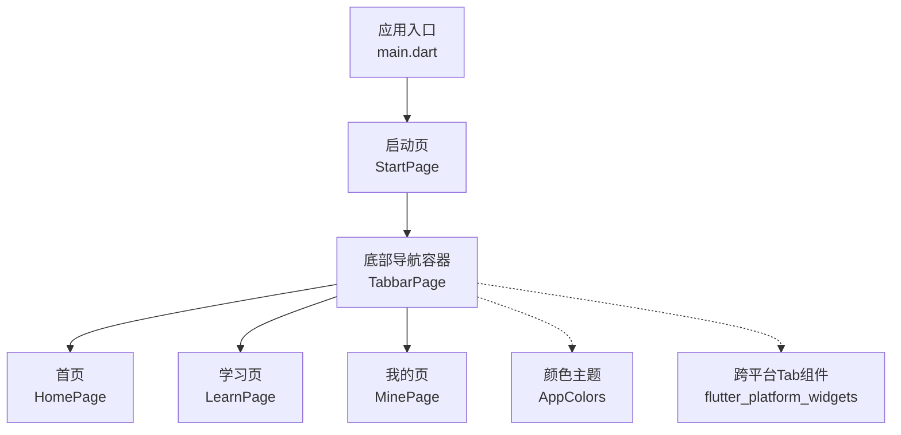
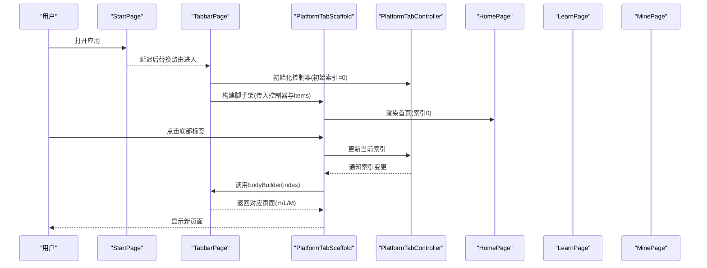
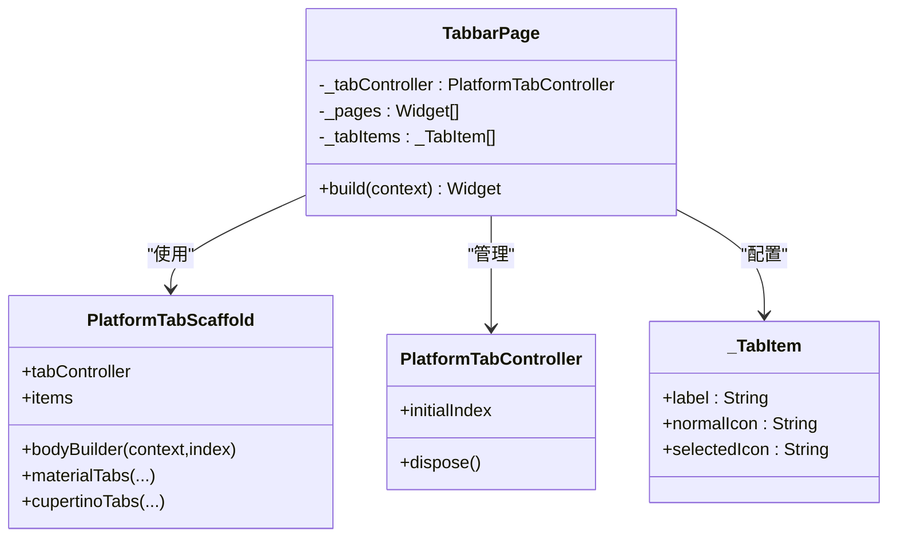
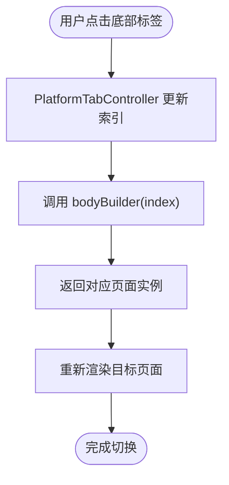
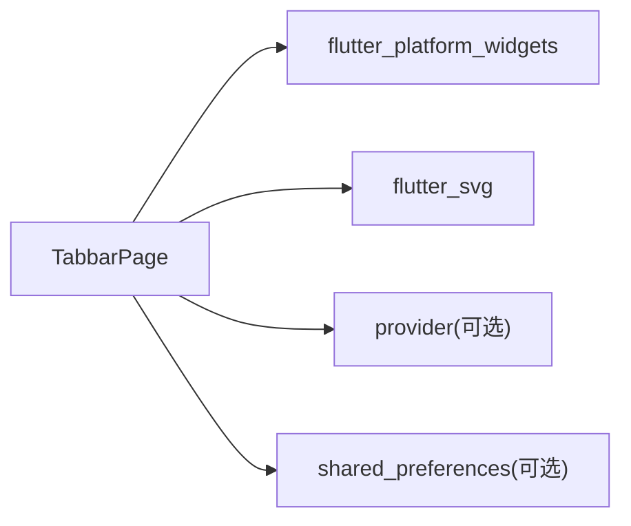

# 导航模块

<cite>
**本文引用的文件**
- [main.dart](file://lib/main.dart)
- [start_page.dart](file://lib/pages/starts/start_page.dart)
- [tabbar_page.dart](file://lib/pages/starts/tabbar_page.dart)
- [home_page.dart](file://lib/pages/home/home_page.dart)
- [learn_page.dart](file://lib/pages/courses/learn_page.dart)
- [mine_page.dart](file://lib/pages/settings/mine_page.dart)
- [app_colors.dart](file://lib/utils/app_colors.dart)
- [pubspec.yaml](file://pubspec.yaml)
- [widget_test.dart](file://test/widget_test.dart)
</cite>

## 目录
1. [简介](#简介)
2. [项目结构](#项目结构)
3. [核心组件](#核心组件)
4. [架构总览](#架构总览)
5. [详细组件分析](#详细组件分析)
6. [依赖分析](#依赖分析)
7. [性能考虑](#性能考虑)
8. [故障排查指南](#故障排查指南)
9. [结论](#结论)
10. [附录](#附录)

## 简介
本模块聚焦底部导航系统的实现，围绕 TabbarPage 组件展开，详细说明其跨平台导航方案、状态保持机制与页面切换逻辑。文档同时覆盖底部标签栏的配置项（图标、标题、选中态）、页面间通信与数据同步策略、以及导航性能优化与内存管理建议。

## 项目结构
- 应用入口 main.dart 设置主题并指定启动页为 StartPage。
- StartPage 在初始化后延迟跳转至 TabbarPage，作为主导航容器。
- TabbarPage 使用 PlatformTabScaffold 与 PlatformTabController 构建底部导航，并通过 bodyBuilder 返回三个子页面：HomePage、LearnPage、MinePage。
- 颜色与主题通过 AppColors 统一管理，确保 UI 一致性。
- 依赖 flutter_platform_widgets 提供跨平台的 Tab 组件；flutter_svg 用于 SVG 图标渲染。

图表来源
- [main.dart:9-22](file://lib/main.dart#L9-L22)
- [start_page.dart:12-24](file://lib/pages/starts/start_page.dart#L12-L24)
- [tabbar_page.dart:55-98](file://lib/pages/starts/tabbar_page.dart#L55-L98)
- [app_colors.dart:5-27](file://lib/utils/app_colors.dart#L5-L27)

章节来源
- [main.dart:9-22](file://lib/main.dart#L9-L22)
- [start_page.dart:12-24](file://lib/pages/starts/start_page.dart#L12-L24)
- [tabbar_page.dart:55-98](file://lib/pages/starts/tabbar_page.dart#L55-L98)
- [app_colors.dart:5-27](file://lib/utils/app_colors.dart#L5-L27)

## 核心组件
- TabbarPage：底部导航容器，负责维护当前选中标签、渲染底部标签栏与对应页面内容。
- PlatformTabController：跨平台标签控制器，驱动标签切换与状态同步。
- PlatformTabScaffold：跨平台脚手架，封装 Material/Cupertino 差异，统一 API。
- 子页面：HomePage、LearnPage、MinePage，作为独立功能模块挂载到导航容器。

章节来源
- [tabbar_page.dart:8-13](file://lib/pages/starts/tabbar_page.dart#L8-L13)
- [tabbar_page.dart:15-52](file://lib/pages/starts/tabbar_page.dart#L15-L52)
- [home_page.dart:3-25](file://lib/pages/home/home_page.dart#L3-L25)
- [learn_page.dart:3-25](file://lib/pages/courses/learn_page.dart#L3-L25)
- [mine_page.dart:3-28](file://lib/pages/settings/mine_page.dart#L3-L28)

## 架构总览
TabbarPage 基于 flutter_platform_widgets 的 PlatformTabScaffold 与 PlatformTabController 实现跨平台底部导航。bodyBuilder 根据当前索引返回对应页面实例，从而实现“多页常驻”的效果。Material 与 Cupertino 两套样式分别通过 materialTabs 与 cupertinoTabs 配置，保证在不同平台上的原生体验。

图表来源
- [start_page.dart:17-23](file://lib/pages/starts/start_page.dart#L17-L23)
- [tabbar_page.dart:42-52](file://lib/pages/starts/tabbar_page.dart#L42-L52)
- [tabbar_page.dart:55-98](file://lib/pages/starts/tabbar_page.dart#L55-L98)

## 详细组件分析

### TabbarPage 组件分析
- 控制器生命周期：在 initState 中创建 PlatformTabController，并在 dispose 中释放，避免内存泄漏。
- 页面列表：以静态 List<Widget> 持有 HomePage、LearnPage、MinePage，配合 bodyBuilder 按索引返回，实现“页面常驻”。
- 标签配置：_TabItem 定义 label、normalIcon、selectedIcon，映射到 BottomNavigationBarItem，支持 SVG 图标与颜色过滤。
- 跨平台样式：materialTabs 与 cupertinoTabs 分别配置背景色、高亮色、边框等，保证平台一致性。

图表来源
- [tabbar_page.dart:8-13](file://lib/pages/starts/tabbar_page.dart#L8-L13)
- [tabbar_page.dart:15-52](file://lib/pages/starts/tabbar_page.dart#L15-L52)
- [tabbar_page.dart:55-98](file://lib/pages/starts/tabbar_page.dart#L55-L98)
- [tabbar_page.dart:101-111](file://lib/pages/starts/tabbar_page.dart#L101-L111)

章节来源
- [tabbar_page.dart:8-13](file://lib/pages/starts/tabbar_page.dart#L8-L13)
- [tabbar_page.dart:15-52](file://lib/pages/starts/tabbar_page.dart#L15-L52)
- [tabbar_page.dart:55-98](file://lib/pages/starts/tabbar_page.dart#L55-L98)
- [tabbar_page.dart:101-111](file://lib/pages/starts/tabbar_page.dart#L101-L111)

### 跨平台导航实现方案
- 使用 flutter_platform_widgets 提供的 PlatformTabScaffold 与 PlatformTabController，自动适配 Material 与 Cupertino 风格。
- 通过 materialTabs 与 cupertinoTabs 回调分别注入平台特定样式，如背景色、高亮色、边框等。
- 无需在业务代码中判断平台类型，框架内部处理平台差异，简化开发。

章节来源
- [pubspec.yaml:34-35](file://pubspec.yaml#L34-L35)
- [tabbar_page.dart:55-98](file://lib/pages/starts/tabbar_page.dart#L55-L98)

### 底部标签栏配置选项
- 图标：normalIcon 与 selectedIcon 使用 SVG 资源，尺寸固定为 24x24，未选中态通过颜色滤镜着色。
- 标题：label 字段定义每个标签的文本。
- 选中状态：通过 selectedItemColor / activeColor 控制选中态颜色，unselectedItemColor / inactiveColor 控制未选中态颜色。
- 背景与间距：tabsBackgroundColor、padding、elevation 等参数调整整体外观。

章节来源
- [tabbar_page.dart:24-40](file://lib/pages/starts/tabbar_page.dart#L24-L40)
- [tabbar_page.dart:66-80](file://lib/pages/starts/tabbar_page.dart#L66-L80)
- [tabbar_page.dart:81-96](file://lib/pages/starts/tabbar_page.dart#L81-L96)
- [app_colors.dart:5-27](file://lib/utils/app_colors.dart#L5-L27)

### 页面切换逻辑与状态保持
- 切换逻辑：PlatformTabScaffold 监听用户交互，更新 PlatformTabController 的当前索引，再调用 bodyBuilder 返回对应页面。
- 状态保持：由于 _pages 是持久化的 Widget 列表，且 bodyBuilder 直接返回已创建的页面实例，因此各页面状态得以保留（类似 IndexedStack 的行为）。
- 生命周期：每个子页面的 State 随其所在页面实例而存在，离开时不会销毁，再次切回时恢复原状。

图表来源
- [tabbar_page.dart:42-52](file://lib/pages/starts/tabbar_page.dart#L42-L52)
- [tabbar_page.dart:55-65](file://lib/pages/starts/tabbar_page.dart#L55-L65)

章节来源
- [tabbar_page.dart:42-52](file://lib/pages/starts/tabbar_page.dart#L42-L52)
- [tabbar_page.dart:55-65](file://lib/pages/starts/tabbar_page.dart#L55-L65)

### 页面间通信与数据传递最佳实践
- 当前实现中，各子页面为无状态或轻量级展示，未包含复杂状态共享需求。
- 若需跨页面共享数据，可结合项目依赖 provider 进行全局状态管理，或在父组件（TabbarPage）集中管理状态并通过回调/参数向下传递。
- 对于需要持久化的数据，可使用 shared_preferences 等本地存储方案。

章节来源
- [pubspec.yaml:44-51](file://pubspec.yaml#L44-L51)
- [home_page.dart:3-25](file://lib/pages/home/home_page.dart#L3-L25)
- [learn_page.dart:3-25](file://lib/pages/courses/learn_page.dart#L3-L25)
- [mine_page.dart:3-28](file://lib/pages/settings/mine_page.dart#L3-L28)

## 依赖分析
- flutter_platform_widgets：提供跨平台 Tab 组件与控制器，屏蔽平台差异。
- flutter_svg：用于加载 SVG 图标，提升视觉表现力。
- provider：可用于后续扩展的状态管理方案。
- shared_preferences：用于本地数据持久化。

图表来源
- [pubspec.yaml:34-51](file://pubspec.yaml#L34-L51)
- [tabbar_page.dart:1-6](file://lib/pages/starts/tabbar_page.dart#L1-L6)

章节来源
- [pubspec.yaml:34-51](file://pubspec.yaml#L34-L51)
- [tabbar_page.dart:1-6](file://lib/pages/starts/tabbar_page.dart#L1-L6)

## 性能考虑
- 页面常驻：通过持久化页面实例减少重建开销，适合多标签频繁切换场景。
- 控制器释放：在 dispose 中释放 PlatformTabController，避免内存泄漏。
- 资源加载：SVG 图标尺寸固定，避免重复缩放计算；可按需懒加载更复杂的资源。
- 主题读取：从 Theme.of(context) 获取颜色，减少硬编码，便于统一管理与缓存。

章节来源
- [tabbar_page.dart:42-52](file://lib/pages/starts/tabbar_page.dart#L42-L52)
- [tabbar_page.dart:55-65](file://lib/pages/starts/tabbar_page.dart#L55-L65)
- [tabbar_page.dart:81-96](file://lib/pages/starts/tabbar_page.dart#L81-L96)

## 故障排查指南
- 启动页未跳转：检查定时器与 Navigator.pushReplacement 调用时机，确保 mounted 状态校验。
- 标签不生效：确认 PlatformTabController 已正确初始化并传递给 PlatformTabScaffold。
- 图标显示异常：检查 SVG 资源路径与尺寸，确认颜色滤镜是否覆盖预期颜色。
- 内存占用过高：确认所有控制器与资源在 dispose 中释放，避免长时间驻留的复杂对象。

章节来源
- [start_page.dart:17-23](file://lib/pages/starts/start_page.dart#L17-L23)
- [tabbar_page.dart:42-52](file://lib/pages/starts/tabbar_page.dart#L42-L52)
- [tabbar_page.dart:81-96](file://lib/pages/starts/tabbar_page.dart#L81-L96)

## 结论
本项目采用 flutter_platform_widgets 的 PlatformTabScaffold 与 PlatformTabController 实现了简洁、跨平台的底部导航系统。通过持久化页面实例实现状态保持，结合统一的配色与 SVG 图标，保证了良好的用户体验。未来可在 TabbarPage 层引入状态管理，进一步解耦页面间通信与数据同步。

## 附录
- 测试用例验证了启动页到主导航的跳转流程，可作为回归测试参考。

章节来源
- [widget_test.dart:5-19](file://test/widget_test.dart#L5-L19)