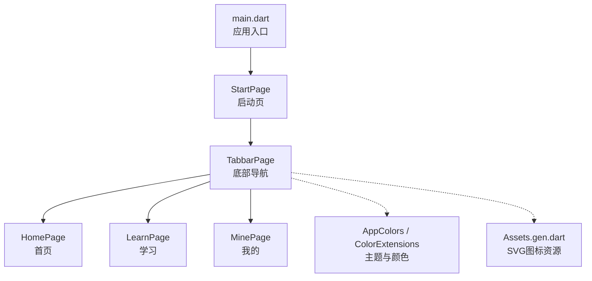
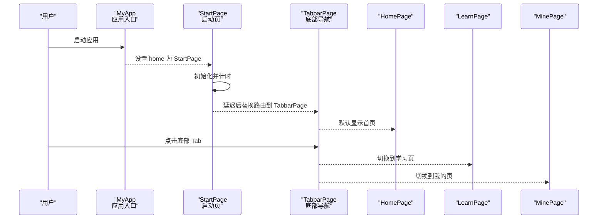
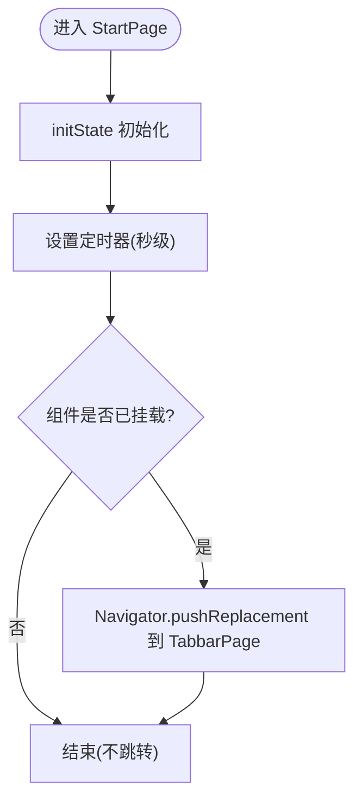
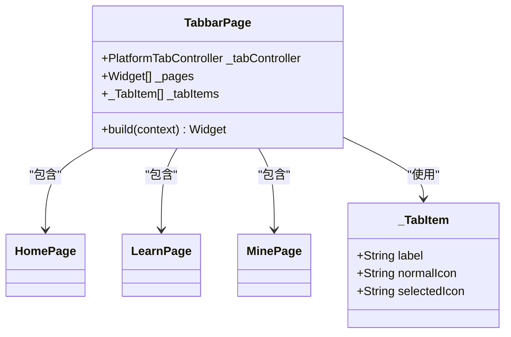
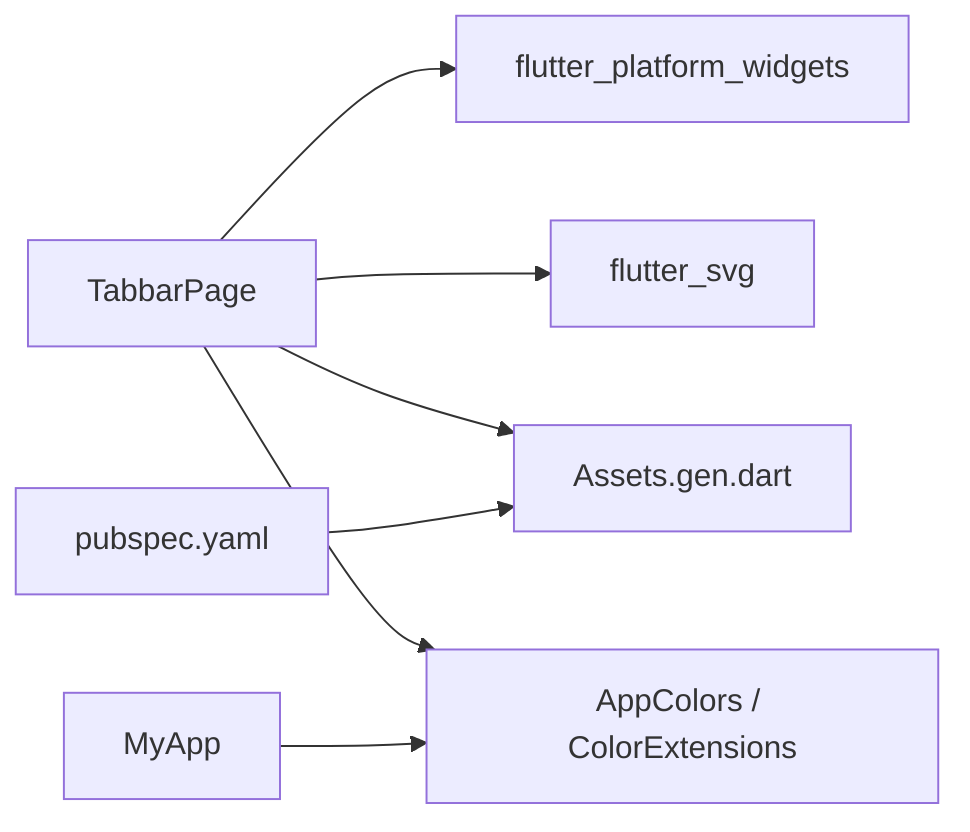

# 核心模块

<cite>
**本文引用的文件**
- [lib/main.dart](file://lib/main.dart)
- [lib/pages/starts/start_page.dart](file://lib/pages/starts/start_page.dart)
- [lib/pages/starts/tabbar_page.dart](file://lib/pages/starts/tabbar_page.dart)
- [lib/pages/home/home_page.dart](file://lib/pages/home/home_page.dart)
- [lib/pages/courses/learn_page.dart](file://lib/pages/courses/learn_page.dart)
- [lib/pages/settings/mine_page.dart](file://lib/pages/settings/mine_page.dart)
- [lib/utils/exports.dart](file://lib/utils/exports.dart)
- [lib/utils/app_colors.dart](file://lib/utils/app_colors.dart)
- [lib/extensions/color_extensions.dart](file://lib/extensions/color_extensions.dart)
- [pubspec.yaml](file://pubspec.yaml)
</cite>

## 目录
1. [简介](#简介)
2. [项目结构](#项目结构)
3. [核心组件](#核心组件)
4. [架构总览](#架构总览)
5. [详细组件分析](#详细组件分析)
6. [依赖分析](#依赖分析)
7. [性能考虑](#性能考虑)
8. [故障排查指南](#故障排查指南)
9. [结论](#结论)
10. [附录：扩展指南与API说明](#附录扩展指南与api说明)

## 简介
本仓库是一个基于 Flutter 的移动端应用，采用模块化页面组织方式。核心模块包含启动流程、底部导航（Tabbar）以及三大功能页（首页、学习、我的）。本文档聚焦于这些核心模块的实现细节、数据流、通信机制与扩展方法，帮助开发者快速理解并在此基础上进行二次开发。

## 项目结构
- 入口与主题配置在 lib/main.dart，统一设置应用主题色和初始页面。
- 启动页位于 lib/pages/starts/start_page.dart，负责短暂展示后自动跳转到主导航页。
- 底部导航页位于 lib/pages/starts/tabbar_page.dart，使用跨平台 Tab 组件承载三个功能页。
- 功能页分别位于 lib/pages/home、lib/pages/courses、lib/pages/settings。
- 工具与样式集中在 lib/utils，颜色管理通过 AppColors 与 HexColor 扩展实现。
- 资源通过 flutter_gen 生成类型安全的访问接口，并在 pubspec.yaml 中声明。

图表来源
- [lib/main.dart:1-23](file://lib/main.dart#L1-L23)
- [lib/pages/starts/start_page.dart:1-37](file://lib/pages/starts/start_page.dart#L1-L37)
- [lib/pages/starts/tabbar_page.dart:1-112](file://lib/pages/starts/tabbar_page.dart#L1-L112)
- [lib/pages/home/home_page.dart:1-25](file://lib/pages/home/home_page.dart#L1-L25)
- [lib/pages/courses/learn_page.dart:1-25](file://lib/pages/courses/learn_page.dart#L1-L25)
- [lib/pages/settings/mine_page.dart:1-28](file://lib/pages/settings/mine_page.dart#L1-L28)
- [lib/utils/app_colors.dart:1-27](file://lib/utils/app_colors.dart#L1-L27)
- [lib/extensions/color_extensions.dart:1-21](file://lib/extensions/color_extensions.dart#L1-L21)
- [pubspec.yaml:88-109](file://pubspec.yaml#L88-L109)

章节来源
- [lib/main.dart:1-23](file://lib/main.dart#L1-L23)
- [pubspec.yaml:88-109](file://pubspec.yaml#L88-L109)

## 核心组件
- 应用入口与主题：定义应用标题、主题色种子，并将启动页作为根页面。
- 启动页：显示启动界面，延迟跳转至底部导航页。
- 底部导航：使用跨平台 Tab 容器，维护三个页面的实例与切换状态。
- 功能页：首页、学习、我的均为无状态页面，用于展示各自内容。
- 颜色系统：集中管理主题色、标题色、背景色等，并通过扩展支持十六进制颜色转换。

章节来源
- [lib/main.dart:1-23](file://lib/main.dart#L1-L23)
- [lib/pages/starts/start_page.dart:1-37](file://lib/pages/starts/start_page.dart#L1-L37)
- [lib/pages/starts/tabbar_page.dart:1-112](file://lib/pages/starts/tabbar_page.dart#L1-L112)
- [lib/pages/home/home_page.dart:1-25](file://lib/pages/home/home_page.dart#L1-L25)
- [lib/pages/courses/learn_page.dart:1-25](file://lib/pages/courses/learn_page.dart#L1-L25)
- [lib/pages/settings/mine_page.dart:1-28](file://lib/pages/settings/mine_page.dart#L1-L28)
- [lib/utils/app_colors.dart:1-27](file://lib/utils/app_colors.dart#L1-L27)
- [lib/extensions/color_extensions.dart:1-21](file://lib/extensions/color_extensions.dart#L1-L21)

## 架构总览
应用采用“入口 -> 启动页 -> 底部导航 -> 功能页”的线性路由结构。底部导航通过跨平台组件统一管理页面栈与选中态，确保在不同平台上获得一致的交互体验。颜色与资源通过工具类与代码生成器统一管理，便于全局主题与图标的一致性维护。

图表来源
- [lib/main.dart:1-23](file://lib/main.dart#L1-L23)
- [lib/pages/starts/start_page.dart:1-37](file://lib/pages/starts/start_page.dart#L1-L37)
- [lib/pages/starts/tabbar_page.dart:1-112](file://lib/pages/starts/tabbar_page.dart#L1-L112)
- [lib/pages/home/home_page.dart:1-25](file://lib/pages/home/home_page.dart#L1-L25)
- [lib/pages/courses/learn_page.dart:1-25](file://lib/pages/courses/learn_page.dart#L1-L25)
- [lib/pages/settings/mine_page.dart:1-28](file://lib/pages/settings/mine_page.dart#L1-L28)

## 详细组件分析

### 启动模块（StartPage）
- 职责：展示启动画面，延迟执行路由替换，进入主导航。
- 关键逻辑：
  - 在 initState 中设置定时器，延时后调用 Navigator.pushReplacement 将路由替换为 TabbarPage。
  - 构建时返回一个简单 Scaffold，居中显示“启动页”文本。
- 注意事项：
  - 跳转前检查 mounted，避免在组件销毁后仍执行导航导致异常。
  - 当前未加载任何业务数据或权限校验，适合后续扩展登录态判断。

图表来源
- [lib/pages/starts/start_page.dart:12-24](file://lib/pages/starts/start_page.dart#L12-L24)

章节来源
- [lib/pages/starts/start_page.dart:1-37](file://lib/pages/starts/start_page.dart#L1-L37)

### 底部导航系统（TabbarPage）
- 职责：提供统一的底部导航栏，承载首页、学习、我的三个页面，并处理选中态与跨平台渲染。
- 关键设计：
  - 使用 PlatformTabController 管理 Tab 索引。
  - 维护 _pages 列表，按索引对应三个功能页。
  - 使用 PlatformTabScaffold 包装 Material/Cupertino 风格的导航栏，统一外观。
  - 通过 SvgPicture 加载 tabbar 图标，区分正常与选中状态。
- 状态保持：
  - 由于 _pages 以静态 Widget 列表形式持有，切换 Tab 时会复用已有页面实例，从而保持各页面内部状态（如滚动位置、输入框内容等）。
- 可扩展性：
  - 新增 Tab 只需在 _tabItems 与 _pages 中添加对应项，并确保图标资源存在。

图表来源
- [lib/pages/starts/tabbar_page.dart:8-112](file://lib/pages/starts/tabbar_page.dart#L8-L112)

章节来源
- [lib/pages/starts/tabbar_page.dart:1-112](file://lib/pages/starts/tabbar_page.dart#L1-L112)

### 功能页面
- 首页（HomePage）
  - 无状态页面，展示标题与中心图标、文案。
  - 适合作为内容聚合入口，可后续接入轮播、推荐列表等。
- 学习页（LearnPage）
  - 无状态页面，展示学习相关内容占位。
  - 可作为课程列表、视频播放等功能的载体。
- 我的页（MinePage）
  - 无状态页面，展示头像与个人信息区域占位。
  - 可后续接入账户信息、设置、订单等模块。

章节来源
- [lib/pages/home/home_page.dart:1-25](file://lib/pages/home/home_page.dart#L1-L25)
- [lib/pages/courses/learn_page.dart:1-25](file://lib/pages/courses/learn_page.dart#L1-L25)
- [lib/pages/settings/mine_page.dart:1-28](file://lib/pages/settings/mine_page.dart#L1-L28)

### 颜色与主题系统
- AppColors：集中定义主题色、标题色、背景色等，保证全局一致性。
- HexColor 扩展：提供从十六进制字符串创建 Color 的能力，简化颜色配置。
- 应用主题：在 MyApp 中使用 ColorScheme.fromSeed 将主题色注入到整个应用。

章节来源
- [lib/utils/app_colors.dart:1-27](file://lib/utils/app_colors.dart#L1-L27)
- [lib/extensions/color_extensions.dart:1-21](file://lib/extensions/color_extensions.dart#L1-L21)
- [lib/main.dart:13-20](file://lib/main.dart#L13-L20)

## 依赖分析
- 运行时依赖：
  - flutter_platform_widgets：提供跨平台 Tab 组件，确保 iOS/Android 一致体验。
  - flutter_svg：用于加载 SVG 图标。
  - provider、dio、rxdart、shared_preferences 等：为后续状态管理、网络请求、本地存储预留能力。
- 资源与生成：
  - flutter_gen_runner：根据 assets 生成类型安全的资源访问代码（assets.gen.dart），提升编译期安全性与开发体验。
  - pubspec.yaml 中声明了 assets/images 与 assets/images/tabbar 资源路径。

图表来源
- [lib/pages/starts/tabbar_page.dart:1-112](file://lib/pages/starts/tabbar_page.dart#L1-L112)
- [lib/utils/exports.dart:1-5](file://lib/utils/exports.dart#L1-L5)
- [pubspec.yaml:88-109](file://pubspec.yaml#L88-L109)

章节来源
- [pubspec.yaml:30-65](file://pubspec.yaml#L30-L65)
- [pubspec.yaml:88-109](file://pubspec.yaml#L88-L109)
- [lib/utils/exports.dart:1-5](file://lib/utils/exports.dart#L1-L5)

## 性能考虑
- 启动页延迟跳转：使用定时器实现短延迟，避免阻塞首帧渲染；建议在后续版本中加入必要的数据预取或权限校验，以减少首次交互等待。
- 底部导航状态保持：通过复用页面实例减少重建开销，有利于保持滚动位置与输入状态，提升用户体验。
- 资源加载：使用 flutter_gen 生成的类型安全资源访问，减少运行时错误；建议按需加载大资源，避免首屏卡顿。
- 主题与颜色：集中管理颜色，避免重复计算；必要时可使用缓存策略优化频繁使用的颜色对象。

[本节为通用性能建议，不直接分析具体文件]

## 故障排查指南
- 启动后无法跳转：
  - 检查 StartPage 的定时器是否在组件挂载后执行，确保不会在 dispose 后触发导航。
  - 确认 TabbarPage 的资源（SVG 图标）路径正确且已注册到 assets。
- 底部导航图标不显示或颜色异常：
  - 检查 Assets.images.tabbar 下的 SVG 文件是否存在。
  - 确认 AppColors 中的主题色与未选中色配置合理。
- 页面切换状态丢失：
  - 若需要持久化状态，可将页面改为有状态并保存必要数据，或使用 Provider 等状态管理方案。
- 主题色不一致：
  - 确保 MyApp 的 ColorScheme 种子色与 AppColors.theme 保持一致。

章节来源
- [lib/pages/starts/start_page.dart:12-24](file://lib/pages/starts/start_page.dart#L12-L24)
- [lib/pages/starts/tabbar_page.dart:24-40](file://lib/pages/starts/tabbar_page.dart#L24-L40)
- [lib/utils/app_colors.dart:1-27](file://lib/utils/app_colors.dart#L1-L27)
- [lib/main.dart:13-20](file://lib/main.dart#L13-L20)

## 结论
该项目的核心模块结构清晰，启动流程简洁，底部导航实现了跨平台的统一体验，并通过复用页面实例保持了状态。颜色系统与资源管理集中化，便于维护与扩展。后续可在功能页中逐步引入状态管理、网络请求与本地存储，完善业务逻辑。

[本节为总结性内容，不直接分析具体文件]

## 附录：扩展指南与API说明

### 如何添加新的功能页面
- 步骤概览：
  - 在 lib/pages 下新建页面文件（例如 new_page.dart），实现 StatelessWidget 或 StatefulWidget。
  - 在 TabbarPage 的 _tabItems 与 _pages 列表中新增对应项，确保图标资源存在。
  - 如需新 Tab 图标，将 SVG 放入 assets/images/tabbar，并在 pubspec.yaml 中确保资源路径正确。
  - 重新运行应用，Flutter Gen 会生成新的资源访问代码。
- 注意事项：
  - 新增页面应遵循现有命名与目录规范，便于维护。
  - 若页面需要状态，建议使用 StatefulWidget 或 Provider 管理。

章节来源
- [lib/pages/starts/tabbar_page.dart:18-40](file://lib/pages/starts/tabbar_page.dart#L18-L40)
- [pubspec.yaml:106-109](file://pubspec.yaml#L106-L109)

### 模块间通信与数据传递机制
- 当前实现：
  - 页面之间通过 Navigator 进行路由跳转，适合单向数据传递（参数传递）。
  - 底部导航通过复用页面实例保持状态，无需额外通信。
- 建议扩展：
  - 对于跨层级或跨模块的状态共享，可引入 Provider 或 RxDart 进行事件驱动通信。
  - 对于网络数据与本地缓存，可结合 dio 与 shared_preferences 实现数据持久化与同步。

章节来源
- [lib/pages/starts/start_page.dart:17-23](file://lib/pages/starts/start_page.dart#L17-L23)
- [lib/pages/starts/tabbar_page.dart:18-22](file://lib/pages/starts/tabbar_page.dart#L18-L22)
- [pubspec.yaml:40-55](file://pubspec.yaml#L40-L55)

### API 接口说明与使用示例
- 启动流程 API
  - 入口：MyApp.home = StartPage
  - 行为：StartPage.initState 中定时器触发后，调用 Navigator.pushReplacement 跳转到 TabbarPage
  - 使用示例：无需额外调用，应用启动即执行
- 底部导航 API
  - 组件：PlatformTabScaffold
  - 控制器：PlatformTabController(initialIndex: 0)
  - 页面列表：_pages 与 _tabItems 一一对应
  - 使用示例：在 TabbarPage 中配置 tabs 与 bodyBuilder，即可实现多页签切换
- 颜色与主题 API
  - 颜色：AppColors.theme、AppColors.title、AppColors.background 等
  - 扩展：HexColor.fromHex("...") 将十六进制字符串转为 Color
  - 使用示例：在主题或 UI 中引用 AppColors 常量，确保风格一致

章节来源
- [lib/main.dart:13-20](file://lib/main.dart#L13-L20)
- [lib/pages/starts/start_page.dart:17-23](file://lib/pages/starts/start_page.dart#L17-L23)
- [lib/pages/starts/tabbar_page.dart:42-97](file://lib/pages/starts/tabbar_page.dart#L42-L97)
- [lib/utils/app_colors.dart:5-27](file://lib/utils/app_colors.dart#L5-L27)
- [lib/extensions/color_extensions.dart:4-13](file://lib/extensions/color_extensions.dart#L4-L13)