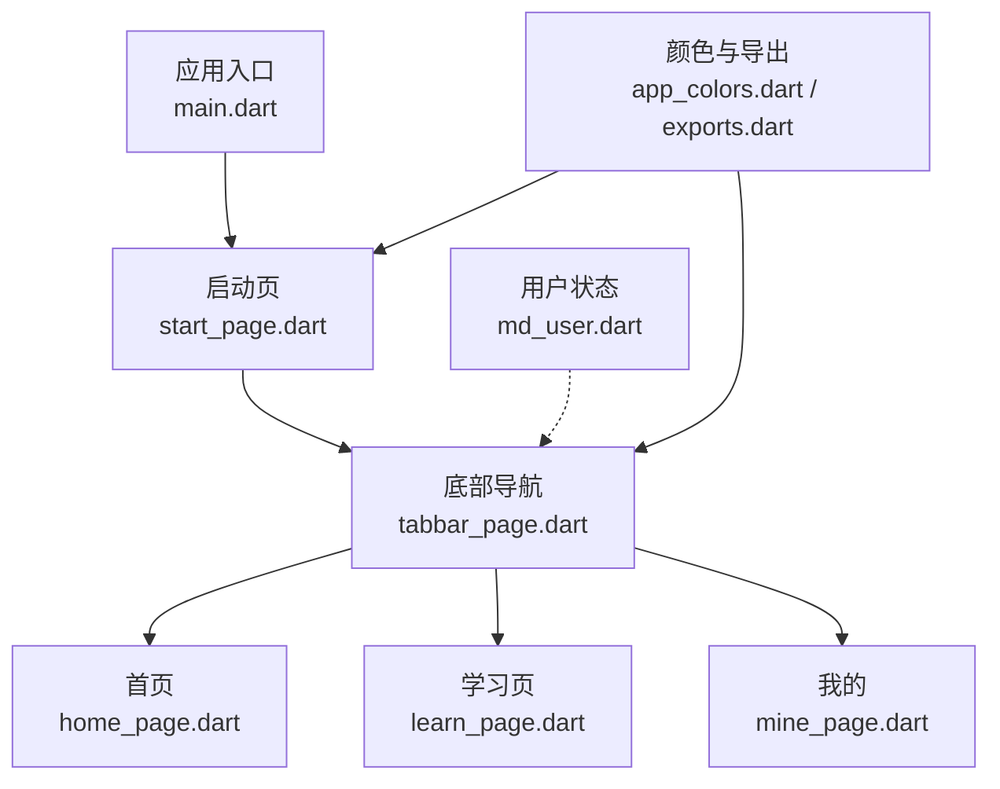
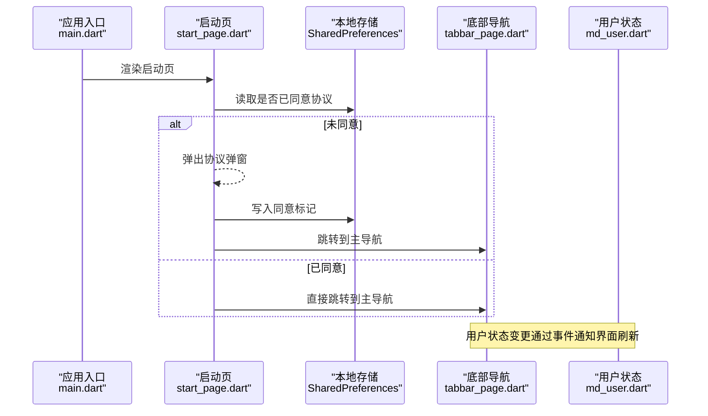
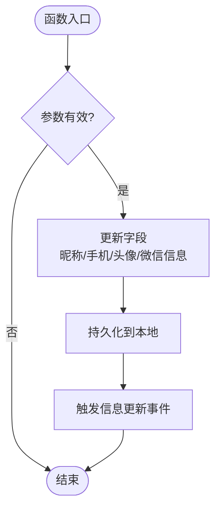
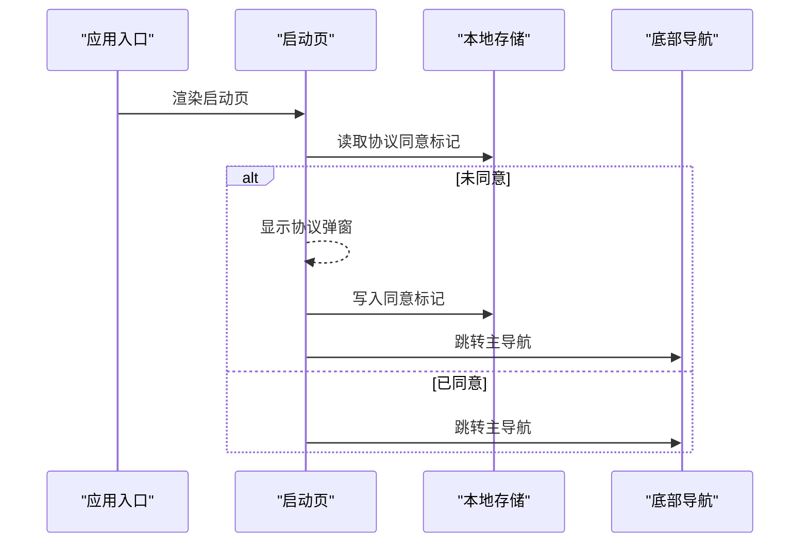
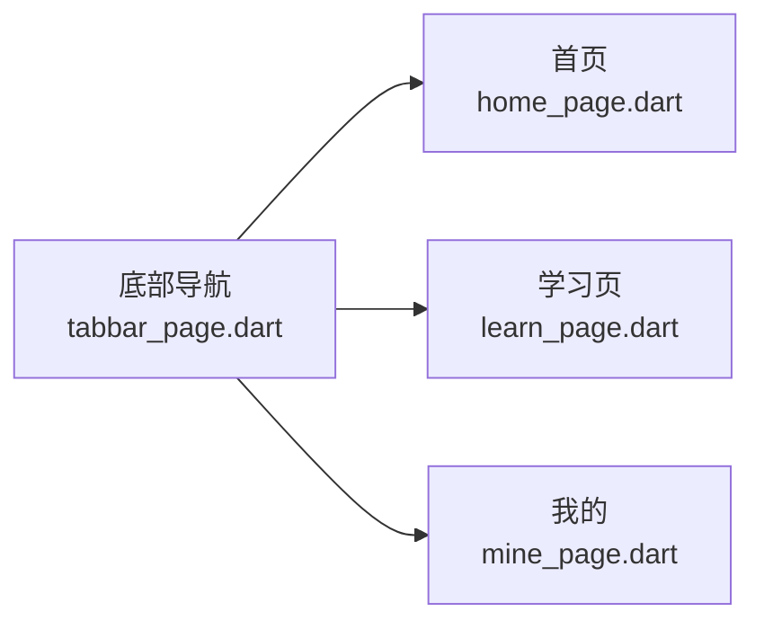
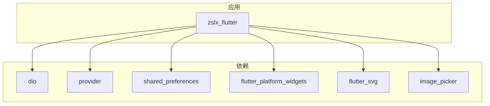

# 用户管理系统

<cite>
**本文引用的文件**
- [main.dart](file://lib/main.dart)
- [pubspec.yaml](file://pubspec.yaml)
- [md_user.dart](file://lib/users/md_user.dart)
- [start_page.dart](file://lib/pages/starts/start_page.dart)
- [tabbar_page.dart](file://lib/pages/starts/tabbar_page.dart)
- [home_page.dart](file://lib/pages/home/home_page.dart)
- [mine_page.dart](file://lib/pages/settings/mine_page.dart)
- [exports.dart](file://lib/utils/exports.dart)
- [app_colors.dart](file://lib/utils/app_colors.dart)
</cite>

## 目录
1. [简介](#简介)
2. [项目结构](#项目结构)
3. [核心组件](#核心组件)
4. [架构总览](#架构总览)
5. [详细组件分析](#详细组件分析)
6. [依赖分析](#依赖分析)
7. [性能考虑](#性能考虑)
8. [故障排查指南](#故障排查指南)
9. [结论](#结论)
10. [附录](#附录)

## 简介
本项目是一个基于 Flutter 的用户管理系统，提供应用启动流程、协议同意、底部导航与用户状态管理（登录/登出、个人信息持久化）等能力。系统通过单例化的用户状态管理器集中维护用户信息，使用本地存储实现数据持久化，并通过事件通知机制驱动界面更新。整体采用分层组织：入口与路由、页面展示、用户状态与工具类。

## 项目结构
- 入口与主题
  - 应用入口定义在 main.dart，设置主题并指定首页为启动页。
- 页面与导航
  - 启动页 start_page.dart：首次启动隐私协议弹窗，同意后进入主导航。
  - 底部导航 tabbar_page.dart：聚合首页、学习、我的三个子页面。
  - 首页 home_page.dart、我的 mine_page.dart：占位页面，便于后续扩展。
- 用户状态管理
  - users/md_user.dart：单例 MDUser，负责用户登录态、个人信息、游客标识的读写与事件广播。
- 工具与资源
  - utils/exports.dart：统一导出 SVG、资源生成代码、颜色与颜色扩展。
  - utils/app_colors.dart：集中管理主题色与常用颜色。
- 依赖配置
  - pubspec.yaml：声明网络、状态管理、本地存储、UI 适配等第三方依赖。



图表来源
- [main.dart:9-23](file://lib/main.dart#L9-L23)
- [start_page.dart:9-50](file://lib/pages/starts/start_page.dart#L9-L50)
- [tabbar_page.dart:8-98](file://lib/pages/starts/tabbar_page.dart#L8-L98)
- [home_page.dart:3-25](file://lib/pages/home/home_page.dart#L3-L25)
- [mine_page.dart:3-28](file://lib/pages/settings/mine_page.dart#L3-L28)
- [md_user.dart:8-43](file://lib/users/md_user.dart#L8-L43)
- [app_colors.dart:5-27](file://lib/utils/app_colors.dart#L5-L27)
- [exports.dart:1-5](file://lib/utils/exports.dart#L1-L5)

章节来源
- [main.dart:9-23](file://lib/main.dart#L9-L23)
- [pubspec.yaml:30-64](file://pubspec.yaml#L30-L64)

## 核心组件
- 应用入口 MyApp
  - 职责：初始化主题、设置首页为启动页。
  - 关键点：使用统一主题色，确保 UI 一致性。
- 启动页 StartPage
  - 职责：隐藏系统状态栏、延迟显示隐私协议弹窗；根据本地标记决定跳转至主导航或继续提示。
  - 关键点：使用 SharedPreferences 记录是否已同意协议。
- 底部导航 TabbarPage
  - 职责：承载首页、学习、我的三个页面，提供平台统一的底部导航样式。
  - 关键点：使用 PlatformTabScaffold 适配不同平台样式。
- 用户状态 MDUser
  - 职责：单例维护用户登录态、个人信息、游客标识；提供登录、登出、更新头像/昵称/手机号、微信绑定等方法；通过事件流通知变更。
  - 关键点：init 在应用启动时调用以恢复本地数据；所有写操作均持久化到 SharedPreferences。
- 颜色与导出 AppColors / exports
  - 职责：集中管理主题色与常用颜色；统一导出 SVG、资源与颜色扩展，简化页面引用。

章节来源
- [main.dart:9-23](file://lib/main.dart#L9-L23)
- [start_page.dart:16-50](file://lib/pages/starts/start_page.dart#L16-L50)
- [tabbar_page.dart:8-98](file://lib/pages/starts/tabbar_page.dart#L8-L98)
- [md_user.dart:8-242](file://lib/users/md_user.dart#L8-L242)
- [app_colors.dart:5-27](file://lib/utils/app_colors.dart#L5-L27)
- [exports.dart:1-5](file://lib/utils/exports.dart#L1-L5)

## 架构总览
系统采用“入口 -> 启动页 -> 主导航 -> 功能页”的分层结构，用户状态由全局单例统一管理，并通过事件流驱动界面刷新。颜色与资源通过工具模块集中管理，保证 UI 一致性与可维护性。



图表来源
- [main.dart:9-23](file://lib/main.dart#L9-L23)
- [start_page.dart:16-50](file://lib/pages/starts/start_page.dart#L16-L50)
- [tabbar_page.dart:8-98](file://lib/pages/starts/tabbar_page.dart#L8-L98)
- [md_user.dart:8-43](file://lib/users/md_user.dart#L8-L43)

## 详细组件分析

### 用户状态管理 MDUser
- 设计要点
  - 单例模式：通过私有构造函数与静态实例保证全局唯一。
  - 本地持久化：使用 SharedPreferences 保存 token、uid、guest、nick、avatar、phone 等键值。
  - 事件广播：通过 StreamController 广播登录、登出、信息更新事件，供界面订阅。
  - 访问器：提供 islogined、token、uid、nick、avatar、phone、guest 等便捷读取。
- 关键流程
  - 初始化 init：从本地恢复用户数据。
  - 登录 login：解析返回结果，持久化并触发登录事件。
  - 登出 logout：清空内存与本地数据，触发登出与信息更新事件。
  - 更新 update/updateAvatar/updateNick/updatePhone：局部更新并持久化，触发信息更新事件。
  - 微信绑定 updateWx：更新 openid 与名称，触发信息更新事件。
  - 游客标识 saveForGuest/readForGuest：生成或读取游客 UUID。

```mermaid
classDiagram
class MDUser {
-String? _priToken
-String? _priUid
-String? _priGuest
-String? _priNick
-String? _priAvatar
-String? _priPhone
+String? wxOpenid
+String? wxName
+init() Future~void~
+login(res) Future~void~
+logout() Future~void~
+update(res) Future~void~
+updateAvatar(avatar) Future~void~
+updateNick(nick) Future~void~
+updateToken(token) Future~void~
+updateWx(res) Future~void~
+updatePhone(phone) Future~void~
+updateData({animate, completed}) Future~void~
+events Stream~String~
+saveLast(phone, passwd) Future~void~
+readLast() Future~Map~
+updateLastPasswd(passwd) Future~void~
+saveForGuest(uuid) Future~void~
+readForGuest() Future~String?~
}
class SaveKey {
<<enum>>
+token
+uid
+guest
+nick
+avatar
+phone
}
class MdUserExtension {
+islogined bool
+token String?
+uid String?
+nick String?
+avatar String?
+phone String?
+guest bool
}
MDUser --> SaveKey : "持久化键枚举"
MDUser <.. MdUserExtension : "扩展方法"
```

图表来源
- [md_user.dart:8-242](file://lib/users/md_user.dart#L8-L242)



图表来源
- [md_user.dart:191-204](file://lib/users/md_user.dart#L191-L204)

章节来源
- [md_user.dart:8-242](file://lib/users/md_user.dart#L8-L242)

### 启动流程与协议同意
- 启动流程
  - 应用启动后进入启动页，隐藏系统状态栏。
  - 延迟一段时间后检查本地是否已同意协议。
  - 若未同意则弹出协议弹窗；同意后将标记写入本地并跳转至主导航。
  - 若已同意则直接跳转至主导航。
- 交互细节
  - 弹窗支持拒绝退出应用与同意继续两种操作。
  - 使用统一颜色与圆角样式保持一致体验。



图表来源
- [start_page.dart:16-50](file://lib/pages/starts/start_page.dart#L16-L50)
- [start_page.dart:52-153](file://lib/pages/starts/start_page.dart#L52-L153)

章节来源
- [start_page.dart:16-50](file://lib/pages/starts/start_page.dart#L16-L50)
- [start_page.dart:52-153](file://lib/pages/starts/start_page.dart#L52-L153)

### 底部导航与页面组织
- 导航结构
  - 使用 PlatformTabScaffold 提供跨平台一致的底部导航。
  - 包含首页、学习、我的三个标签页。
- 样式与图标
  - 使用 SVG 图标与统一主题色，保持视觉一致性。
  - 通过 Material/Cupertino 配置项适配不同平台样式。



图表来源
- [tabbar_page.dart:8-98](file://lib/pages/starts/tabbar_page.dart#L8-L98)
- [home_page.dart:3-25](file://lib/pages/home/home_page.dart#L3-L25)
- [mine_page.dart:3-28](file://lib/pages/settings/mine_page.dart#L3-L28)

章节来源
- [tabbar_page.dart:8-98](file://lib/pages/starts/tabbar_page.dart#L8-L98)
- [home_page.dart:3-25](file://lib/pages/home/home_page.dart#L3-L25)
- [mine_page.dart:3-28](file://lib/pages/settings/mine_page.dart#L3-L28)

## 依赖分析
- 第三方依赖概览
  - 网络请求：dio
  - 状态管理：provider（可用于后续接入 Provider）
  - 本地存储：shared_preferences
  - UI 适配：flutter_platform_widgets、flutter_screenutil
  - 图片与 SVG：image_picker、flutter_svg
  - 其他：rxdart、oktoast、common_utils、flutter_slidable、keyboard_actions 等
- 资源与构建
  - flutter_gen_runner 用于资源代码生成，集成 flutter_svg。
  - assets 目录包含启动图与底部导航图标等资源。



图表来源
- [pubspec.yaml:30-64](file://pubspec.yaml#L30-L64)
- [pubspec.yaml:88-96](file://pubspec.yaml#L88-L96)
- [pubspec.yaml:99-110](file://pubspec.yaml#L99-L110)

章节来源
- [pubspec.yaml:30-64](file://pubspec.yaml#L30-L64)
- [pubspec.yaml:88-96](file://pubspec.yaml#L88-L96)
- [pubspec.yaml:99-110](file://pubspec.yaml#L99-L110)

## 性能考虑
- 本地存储
  - 频繁读写 SharedPreferences 可能带来 I/O 开销，建议批量写入或合并更新。
- 事件与通知
  - 使用广播事件时需避免过多监听者导致不必要的重建；必要时结合 Provider 进行细粒度状态管理。
- 资源加载
  - SVG 与图片资源应合理压缩与缓存，避免启动卡顿。
- 导航与页面
  - 底部导航切换时注意页面生命周期，避免重复初始化；可使用 KeepAlive 策略优化体验。

## 故障排查指南
- 启动页无法跳转
  - 检查本地存储中协议同意标记是否正确写入与读取。
  - 确认 Navigator 上下文可用且页面栈正常。
- 用户状态不一致
  - 确认 MDUser.init 已在应用启动时调用，确保本地数据恢复。
  - 检查登录/登出流程是否正确触发事件与持久化。
- 颜色与资源异常
  - 检查 exports.dart 是否正确导出资源与颜色扩展。
  - 确认 assets 目录资源路径与引用一致。

章节来源
- [start_page.dart:16-50](file://lib/pages/starts/start_page.dart#L16-L50)
- [md_user.dart:35-43](file://lib/users/md_user.dart#L35-L43)
- [md_user.dart:88-114](file://lib/users/md_user.dart#L88-L114)
- [exports.dart:1-5](file://lib/utils/exports.dart#L1-L5)

## 结论
本用户管理系统以清晰的层次结构与单例化的用户状态管理为核心，实现了启动流程、协议同意、底部导航与用户信息的持久化与事件驱动更新。通过工具模块统一颜色与资源，提升了 UI 的一致性与可维护性。后续可在此基础上接入网络层与更丰富的业务页面，进一步完善用户体验。

## 附录
- 关键接口与行为说明
  - MDUser.login：接收服务端返回的用户信息，持久化并触发登录事件。
  - MDUser.logout：清空用户状态与本地数据，触发登出与信息更新事件。
  - MDUser.update/updateAvatar/updateNick/updatePhone：局部更新用户信息并持久化。
  - MDUser.updateWx：绑定微信信息，更新 openid 与名称。
  - StartPage._agreePrivacy/_denyPrivacy：处理协议同意与拒绝逻辑。
  - TabbarPage：承载多页面并提供平台统一的底部导航。

章节来源
- [md_user.dart:88-165](file://lib/users/md_user.dart#L88-L165)
- [start_page.dart:143-153](file://lib/pages/starts/start_page.dart#L143-L153)
- [tabbar_page.dart:8-98](file://lib/pages/starts/tabbar_page.dart#L8-L98)