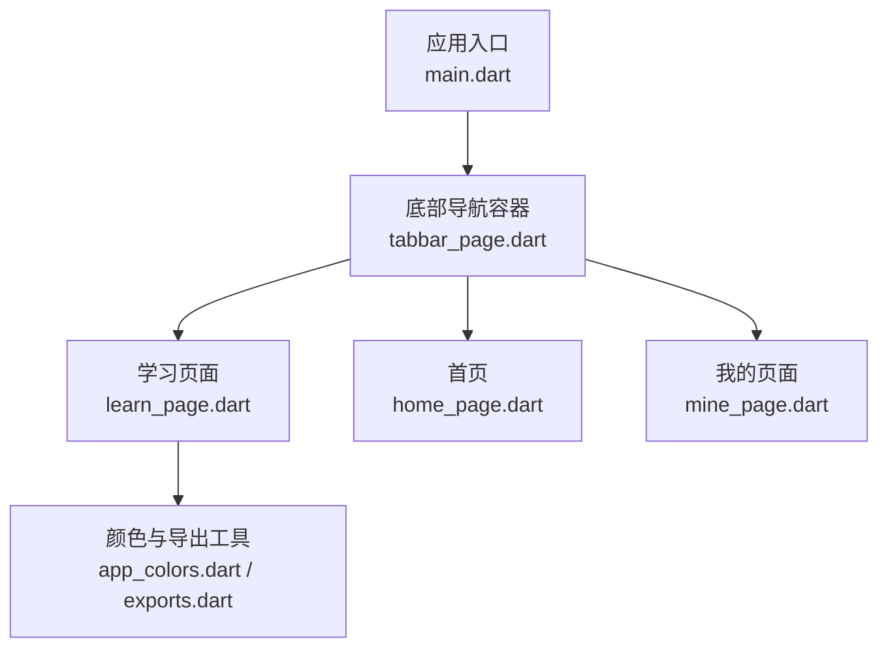
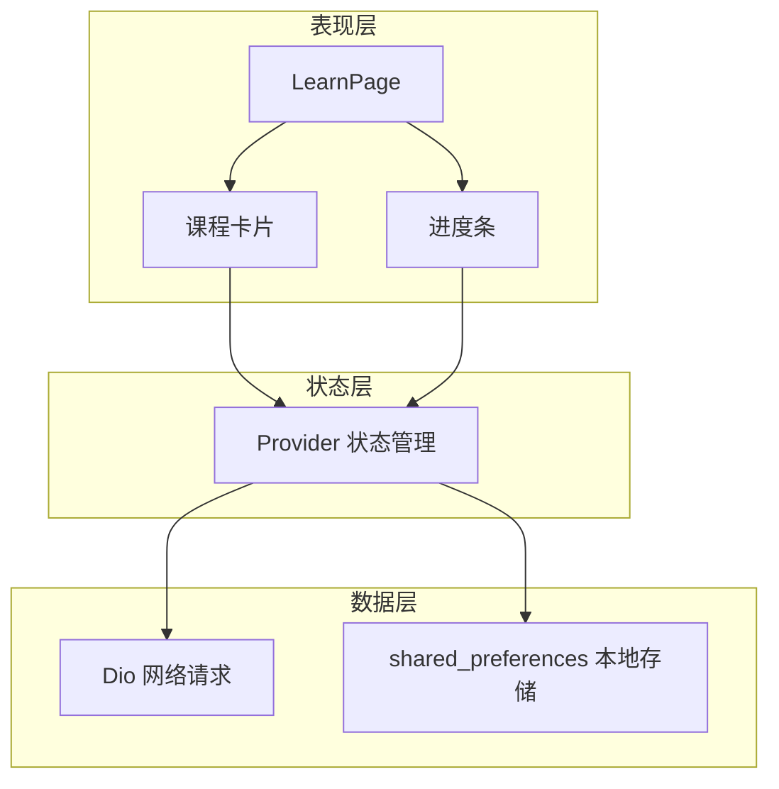
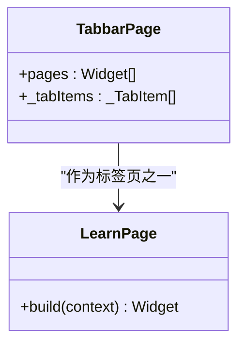
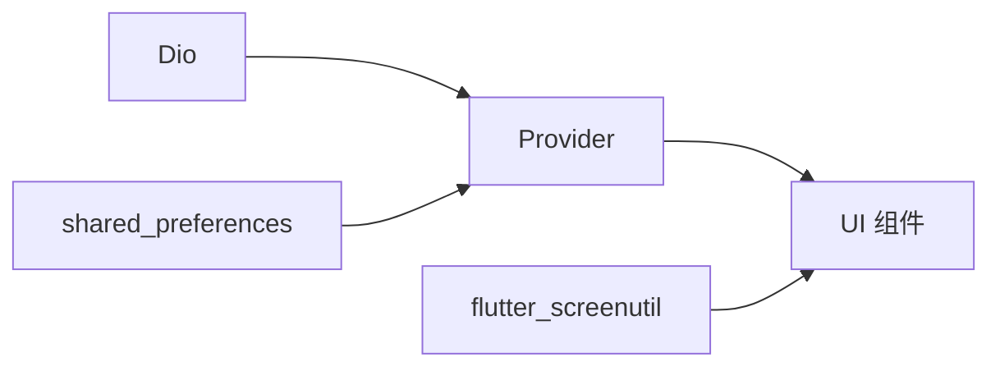
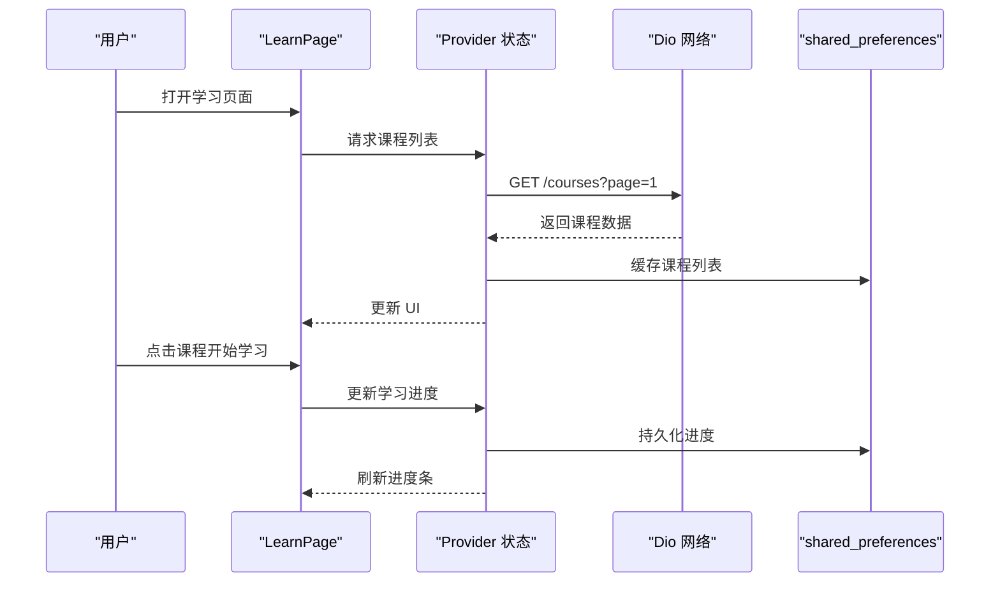

# 学习页面

<cite>
**本文引用的文件**
- [lib/pages/courses/learn_page.dart](file://lib/pages/courses/learn_page.dart)
- [lib/pages/starts/tabbar_page.dart](file://lib/pages/starts/tabbar_page.dart)
- [lib/main.dart](file://lib/main.dart)
- [pubspec.yaml](file://pubspec.yaml)
- [lib/utils/app_colors.dart](file://lib/utils/app_colors.dart)
- [lib/utils/exports.dart](file://lib/utils/exports.dart)
</cite>

## 目录
1. [简介](#简介)
2. [项目结构](#项目结构)
3. [核心组件](#核心组件)
4. [架构总览](#架构总览)
5. [详细组件分析](#详细组件分析)
6. [依赖分析](#依赖分析)
7. [性能考虑](#性能考虑)
8. [故障排查指南](#故障排查指南)
9. [结论](#结论)
10. [附录](#附录)

## 简介
本文件围绕“学习页面”（LearnPage）进行系统化文档化，目标是帮助开发者理解当前实现、掌握后续扩展方向，并给出可落地的优化建议。当前 LearnPage 是一个基础占位页面，包含应用栏与居中展示的学习入口提示。后续将基于现有工程能力（Provider、Dio、shared_preferences、flutter_screenutil 等）逐步完善课程列表、学习进度跟踪、学习记录管理、UI 卡片布局与交互反馈等能力。

## 项目结构
- 入口与应用主题：main.dart 定义应用启动与全局主题色；tabbar_page.dart 作为底部导航容器，LearnPage 作为“学习”标签页被集成。
- 工具与样式：app_colors.dart 提供统一颜色常量；exports.dart 集中导出常用资源与工具。
- 依赖能力：pubspec.yaml 声明了 Provider（状态管理）、Dio（网络请求）、shared_preferences（本地持久化）、flutter_screenutil（屏幕适配）等关键依赖，为后续学习功能的数据流、网络与存储奠定基础。

图表来源
- [lib/main.dart:9-22](file://lib/main.dart#L9-L22)
- [lib/pages/starts/tabbar_page.dart:18-22](file://lib/pages/starts/tabbar_page.dart#L18-L22)
- [lib/pages/courses/learn_page.dart:3-24](file://lib/pages/courses/learn_page.dart#L3-L24)

章节来源
- [lib/main.dart:9-22](file://lib/main.dart#L9-L22)
- [lib/pages/starts/tabbar_page.dart:18-22](file://lib/pages/starts/tabbar_page.dart#L18-L22)
- [lib/pages/courses/learn_page.dart:3-24](file://lib/pages/courses/learn_page.dart#L3-L24)
- [lib/utils/app_colors.dart:5-27](file://lib/utils/app_colors.dart#L5-L27)
- [lib/utils/exports.dart:1-5](file://lib/utils/exports.dart#L1-L5)
- [pubspec.yaml:30-65](file://pubspec.yaml#L30-L65)

## 核心组件
- LearnPage：当前为无状态页面，负责展示“学习”入口的标题与占位内容。
- TabbarPage：底部导航容器，承载“首页/学习/我的”三个标签页，LearnPage 作为其中一个页面实例。
- 主题与工具：AppColors 提供统一色彩体系；exports.dart 聚合 SVG、资源生成类与颜色工具，便于跨模块复用。

章节来源
- [lib/pages/courses/learn_page.dart:3-24](file://lib/pages/courses/learn_page.dart#L3-L24)
- [lib/pages/starts/tabbar_page.dart:18-22](file://lib/pages/starts/tabbar_page.dart#L18-L22)
- [lib/utils/app_colors.dart:5-27](file://lib/utils/app_colors.dart#L5-L27)
- [lib/utils/exports.dart:1-5](file://lib/utils/exports.dart#L1-L5)

## 架构总览
当前架构以 Flutter 原生 Widget 树为主，尚未引入业务状态管理与数据层。未来演进建议采用分层架构：
- 表现层（UI）：LearnPage 及其子组件（课程卡片、进度条、空态/加载态）。
- 状态层（State）：使用 Provider 管理课程列表、学习进度、用户偏好等。
- 数据层（Data）：Dio 负责远程课程数据获取；shared_preferences 负责本地学习记录与配置。
- 基础设施：统一的 AppColors、ScreenUtil 适配、错误处理与日志。

图表来源
- [pubspec.yaml:41-55](file://pubspec.yaml#L41-L55)
- [lib/pages/courses/learn_page.dart:3-24](file://lib/pages/courses/learn_page.dart#L3-L24)

## 详细组件分析

### LearnPage 组件
- 职责：承载“学习”页面的标题与占位内容，作为后续课程列表与学习记录的容器。
- 当前实现：无状态页面，使用 Scaffold + AppBar + Center 布局，显示图标与文案。
- 可扩展点：
  - 切换为 StatefulWidget 或使用 Provider 监听状态变化。
  - 接入课程列表（ListView/GridView），课程卡片（图片、标题、描述、进度）。
  - 接入学习进度（ProgressIndicator），支持点击开始学习、继续学习。
  - 接入空态/加载态/错误态 UI。

图表来源
- [lib/pages/courses/learn_page.dart:3-24](file://lib/pages/courses/learn_page.dart#L3-L24)
- [lib/pages/starts/tabbar_page.dart:18-22](file://lib/pages/starts/tabbar_page.dart#L18-L22)

章节来源
- [lib/pages/courses/learn_page.dart:3-24](file://lib/pages/courses/learn_page.dart#L3-L24)
- [lib/pages/starts/tabbar_page.dart:18-22](file://lib/pages/starts/tabbar_page.dart#L18-L22)

### 底部导航与页面集成
- TabbarPage 通过 PlatformTabController 管理多标签页，LearnPage 作为“学习”标签页被注册。
- 建议在后续为每个标签页维护独立的状态与生命周期，避免共享状态污染。

章节来源
- [lib/pages/starts/tabbar_page.dart:15-57](file://lib/pages/starts/tabbar_page.dart#L15-L57)

### 主题与工具
- AppColors 提供主色、标题色、背景色等，保证界面一致性。
- exports.dart 集中导出 SVG、资源生成类与颜色工具，减少重复导入。

章节来源
- [lib/utils/app_colors.dart:5-27](file://lib/utils/app_colors.dart#L5-L27)
- [lib/utils/exports.dart:1-5](file://lib/utils/exports.dart#L1-L5)

## 依赖分析
- 状态管理：provider（用于管理课程列表、学习进度、用户偏好等）。
- 网络请求：dio（用于拉取课程数据、提交学习记录）。
- 本地存储：shared_preferences（用于缓存学习进度、设置项）。
- 屏幕适配：flutter_screenutil（确保在不同设备上 UI 一致）。
- 其他：oktoast（提示反馈）、rxdart（响应式数据流，可选）、flutter_slidable（滑动操作，可选）。

图表来源
- [pubspec.yaml:41-55](file://pubspec.yaml#L41-L55)

章节来源
- [pubspec.yaml:41-55](file://pubspec.yaml#L41-L55)

## 性能考虑
- 列表渲染：课程列表建议使用 ListView.builder 或 GridView.builder，按需构建条目，避免一次性构建大量 Widget。
- 图片加载：对课程封面图使用缓存策略（如 cached_network_image），避免重复下载与内存占用。
- 状态更新：使用 Provider 的精确监听（select）仅重建必要子树，减少 rebuild 范围。
- 网络请求：合理设置超时、重试、分页加载；在列表滚动时暂停或节流请求。
- 本地存储：批量写入学习记录，避免频繁 IO；读取时合并默认值与本地值。
- 屏幕适配：使用 flutter_screenutil 统一尺寸与字体，减少不同设备上的重绘差异。

[本节为通用性能建议，不直接分析具体文件]

## 故障排查指南
- 页面空白或无内容：检查 LearnPage 是否被正确挂载到 TabbarPage；确认路由与初始化流程正常。
- 主题色异常：确认 AppColors 是否正确引用；检查 MaterialApp 的 theme 配置。
- 网络请求失败：检查 Dio 配置（baseUrl、超时、拦截器）；确认后端接口可用性与鉴权。
- 本地存储读写失败：检查 shared_preferences 的 key 命名与类型；注意异步写入完成后再读取。
- 列表卡顿：确认是否使用了懒加载；检查图片加载与动画是否阻塞主线程。

章节来源
- [lib/main.dart:9-22](file://lib/main.dart#L9-L22)
- [lib/pages/courses/learn_page.dart:3-24](file://lib/pages/courses/learn_page.dart#L3-L24)
- [lib/pages/starts/tabbar_page.dart:18-22](file://lib/pages/starts/tabbar_page.dart#L18-L22)
- [pubspec.yaml:41-55](file://pubspec.yaml#L41-L55)

## 结论
当前 LearnPage 处于基础占位阶段，具备清晰的页面结构与主题体系。借助工程中已声明的 Provider、Dio、shared_preferences 等依赖，可快速扩展出完整的课程列表、学习进度跟踪与学习记录管理能力。建议优先完成状态管理与数据层的搭建，再逐步完善 UI 与交互细节，同时遵循性能优化与用户体验最佳实践。

[本节为总结性内容，不直接分析具体文件]

## 附录

### 学习功能扩展开发指南
- 新课程添加
  - 数据模型：定义课程实体（id、标题、封面、描述、难度、时长、标签等）。
  - 数据源：通过 Dio 从服务端拉取课程列表；使用分页与搜索过滤。
  - 状态管理：使用 Provider 管理课程集合与筛选条件；支持新增课程后刷新列表。
  - 本地缓存：将热门课程或最近浏览的课程缓存至 shared_preferences，提升首屏速度。
- 学习进度跟踪
  - 进度字段：课程维度（已完成课时、总课时、完成率）与课时维度（观看时长、最后观看时间）。
  - 更新策略：在学习过程中定时上报进度；退出学习时保存最终进度。
  - 可视化：使用 ProgressIndicator 展示完成率；支持点击跳转到对应课时。
- 学习记录管理
  - 记录项：学习时间、学习时长、完成标记、复习提醒等。
  - 存储策略：按天/周聚合统计，减少存储体积；支持导出与同步。
  - 查询优化：为常用查询建立索引（如按课程 id、日期范围）。
- 个性化推荐
  - 规则引擎：基于学习历史、收藏、完成率与难度匹配推荐课程。
  - 冷启动：新用户默认推荐热门或入门课程；老用户基于行为数据推荐。
  - 迭代优化：收集点击与完成数据，持续调整推荐权重。

[本节为概念性指导，不直接分析具体文件]

### UI 设计模式与交互反馈
- 课程卡片布局
  - 元素：封面图、标题、描述、难度标签、进度条、操作按钮（开始/继续）。
  - 布局：使用 Card + Column/Row 组合，保持信息层次清晰。
  - 适配：使用 flutter_screenutil 统一间距与字号。
- 进度条显示
  - 使用 LinearProgressIndicator 或自定义进度条，结合百分比文本。
  - 支持动画过渡，提升视觉反馈。
- 用户交互反馈
  - 使用 oktoast 提供成功/失败提示。
  - 长耗时操作显示 Loading 遮罩，避免误触。
  - 错误态提供重试按钮与说明文案。

[本节为概念性指导，不直接分析具体文件]

### 数据流与状态管理流程图

图表来源
- [pubspec.yaml:41-55](file://pubspec.yaml#L41-L55)
- [lib/pages/courses/learn_page.dart:3-24](file://lib/pages/courses/learn_page.dart#L3-L24)