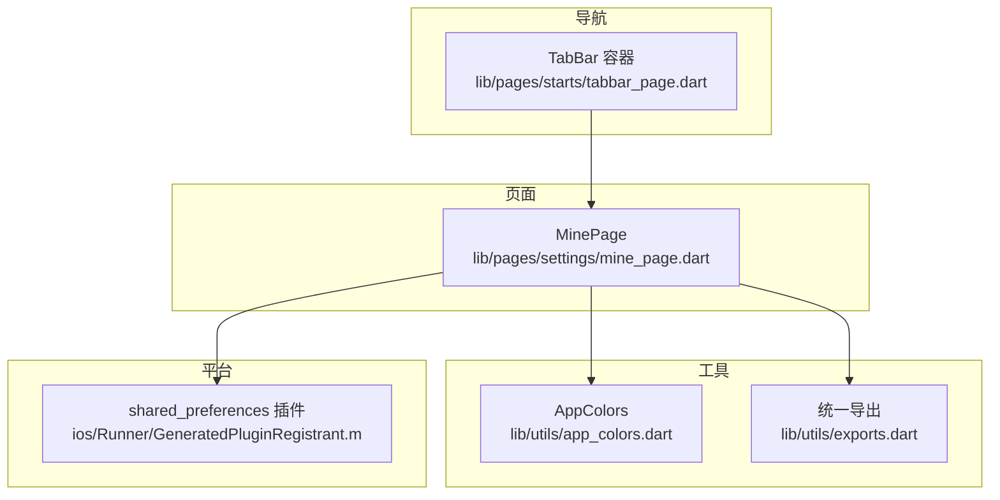
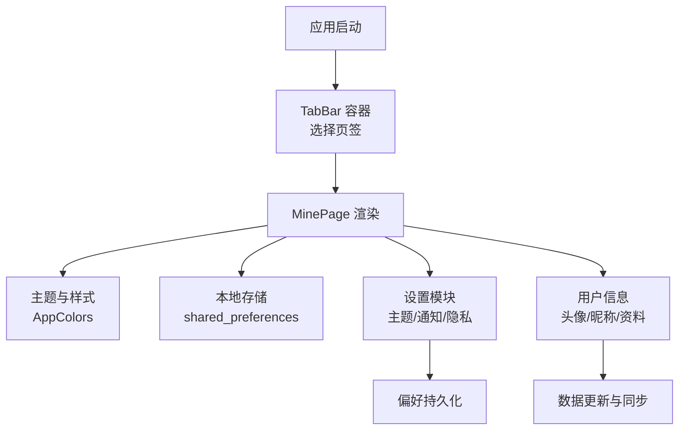
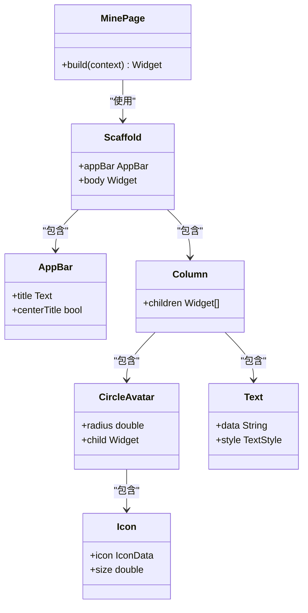
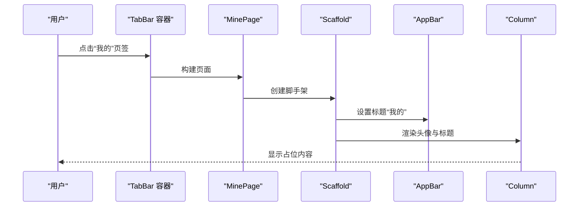
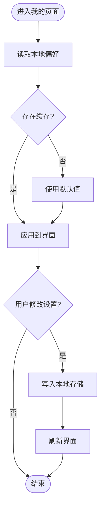
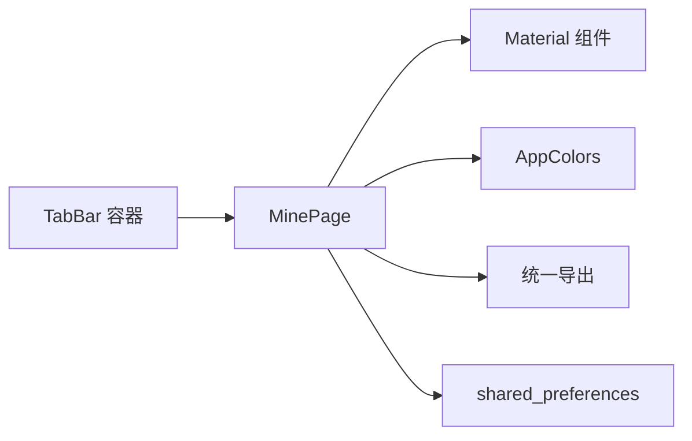

# 我的页面

<cite>
**本文引用的文件**
- [mine_page.dart](file://lib/pages/settings/mine_page.dart)
- [tabbar_page.dart](file://lib/pages/starts/tabbar_page.dart)
- [app_colors.dart](file://lib/utils/app_colors.dart)
- [exports.dart](file://lib/utils/exports.dart)
- [GeneratedPluginRegistrant.m](file://ios/Runner/GeneratedPluginRegistrant.m)
</cite>

## 目录
1. [简介](#简介)
2. [项目结构](#项目结构)
3. [核心组件](#核心组件)
4. [架构总览](#架构总览)
5. [详细组件分析](#详细组件分析)
6. [依赖分析](#依赖分析)
7. [性能考虑](#性能考虑)
8. [故障排查指南](#故障排查指南)
9. [结论](#结论)
10. [附录](#附录)

## 简介
本文件围绕“我的页面”（MinePage）进行系统化文档说明，聚焦用户中心功能的实现与扩展。当前仓库中的 MinePage 是一个基础占位页面，用于承载个人信息展示、设置入口与偏好配置等能力。本文将基于现有代码梳理其结构与职责，并给出后续扩展方案（主题切换、通知设置、隐私配置、第三方账号绑定、数据统计与个性化服务集成），同时提供安全与隐私保护建议。

## 项目结构
- 页面层：MinePage 位于 lib/pages/settings 下，作为底部导航的“我的”页签内容。
- 导航层：底部导航由 tabbar_page.dart 管理，负责页签切换与样式。
- 工具层：颜色与导出集中在 utils 目录，便于全局主题与资源复用。
- 平台插件：iOS 端已注册 shared_preferences 等插件，为本地存储提供支撑。

图表来源
- [tabbar_page.dart:55-99](file://lib/pages/starts/tabbar_page.dart#L55-L99)
- [mine_page.dart:1-28](file://lib/pages/settings/mine_page.dart#L1-L28)
- [app_colors.dart:1-27](file://lib/utils/app_colors.dart#L1-L27)
- [exports.dart:1-5](file://lib/utils/exports.dart#L1-L5)
- [GeneratedPluginRegistrant.m:21-32](file://ios/Runner/GeneratedPluginRegistrant.m#L21-L32)

章节来源
- [tabbar_page.dart:55-99](file://lib/pages/starts/tabbar_page.dart#L55-L99)
- [mine_page.dart:1-28](file://lib/pages/settings/mine_page.dart#L1-L28)
- [app_colors.dart:1-27](file://lib/utils/app_colors.dart#L1-L27)
- [exports.dart:1-5](file://lib/utils/exports.dart#L1-L5)
- [GeneratedPluginRegistrant.m:21-32](file://ios/Runner/GeneratedPluginRegistrant.m#L21-L32)

## 核心组件
- MinePage：当前实现为一个无状态页面，包含应用栏与居中头像及标题，作为用户中心的起点。
- TabBar 容器：通过 PlatformTabScaffold 管理多个页签，MinePage 是其中之一。
- AppColors：集中定义主题色、背景色、文字色等，便于统一风格。
- 插件支持：iOS 已注册 shared_preferences，可用于本地偏好存储。

章节来源
- [mine_page.dart:1-28](file://lib/pages/settings/mine_page.dart#L1-L28)
- [tabbar_page.dart:55-99](file://lib/pages/starts/tabbar_page.dart#L55-L99)
- [app_colors.dart:1-27](file://lib/utils/app_colors.dart#L1-L27)
- [GeneratedPluginRegistrant.m:21-32](file://ios/Runner/GeneratedPluginRegistrant.m#L21-L32)

## 架构总览
下图展示了 MinePage 在整体应用中的位置与依赖关系，以及未来可扩展的数据流方向（本地存储、网络同步、设置项）。

图表来源
- [tabbar_page.dart:55-99](file://lib/pages/starts/tabbar_page.dart#L55-L99)
- [mine_page.dart:1-28](file://lib/pages/settings/mine_page.dart#L1-L28)
- [app_colors.dart:1-27](file://lib/utils/app_colors.dart#L1-L27)
- [GeneratedPluginRegistrant.m:21-32](file://ios/Runner/GeneratedPluginRegistrant.m#L21-L32)

## 详细组件分析

### MinePage 组件分析
- 职责：提供“我的”页面的基础骨架，包含应用栏与占位内容。
- 交互：当前未实现具体业务逻辑，可作为后续功能扩展的挂载点。
- 可维护性：结构简单清晰，便于添加状态管理与业务模块。

图表来源
- [mine_page.dart:1-28](file://lib/pages/settings/mine_page.dart#L1-L28)

章节来源
- [mine_page.dart:1-28](file://lib/pages/settings/mine_page.dart#L1-L28)

### 底部导航与 MinePage 的集成
- TabBar 容器负责页签切换与样式，MinePage 作为其中一个页面被加载。
- 主题色与图标样式通过 AppColors 统一管理，保证视觉一致性。

图表来源
- [tabbar_page.dart:55-99](file://lib/pages/starts/tabbar_page.dart#L55-L99)
- [mine_page.dart:1-28](file://lib/pages/settings/mine_page.dart#L1-L28)

章节来源
- [tabbar_page.dart:55-99](file://lib/pages/starts/tabbar_page.dart#L55-L99)
- [mine_page.dart:1-28](file://lib/pages/settings/mine_page.dart#L1-L28)

### 主题与样式系统
- AppColors 集中管理主题色、背景色、文字色等，便于全局一致性与换肤。
- 通过 exports.dart 统一导出，降低耦合度，提升可测试性。

章节来源
- [app_colors.dart:1-27](file://lib/utils/app_colors.dart#L1-L27)
- [exports.dart:1-5](file://lib/utils/exports.dart#L1-L5)

### 本地存储与用户数据管理
- 平台侧已注册 shared_preferences，可用于保存用户偏好（如主题、通知开关、隐私选项）。
- 建议在 MinePage 中引入状态管理，将设置项与本地存储结合，实现“读取—修改—持久化”的闭环。

图表来源
- [GeneratedPluginRegistrant.m:21-32](file://ios/Runner/GeneratedPluginRegistrant.m#L21-L32)

章节来源
- [GeneratedPluginRegistrant.m:21-32](file://ios/Runner/GeneratedPluginRegistrant.m#L21-L32)

### 设置页面功能模块规划
- 主题切换：基于 AppColors 动态切换主色与背景色，并将选择结果持久化。
- 通知设置：提供开启/关闭通知的开关，并保存至本地存储。
- 隐私配置：提供数据收集、定位、相册等权限提示与开关，记录用户选择。
- 账户与安全：预留登录态检查、退出登录、密码修改入口。
- 关于与帮助：版本信息、用户协议、隐私政策链接。

章节来源
- [app_colors.dart:1-27](file://lib/utils/app_colors.dart#L1-L27)
- [GeneratedPluginRegistrant.m:21-32](file://ios/Runner/GeneratedPluginRegistrant.m#L21-L32)

### 用户中心扩展开发指导
- 第三方账号绑定：在 MinePage 中添加“账号绑定”入口，调用对应 SDK 完成授权与回调处理，成功后更新本地用户信息。
- 数据分析：接入埋点 SDK，对“我的”页面关键行为（点击设置、切换主题、查看隐私）进行统计。
- 个性化服务：根据用户偏好（主题、通知、隐私）调整首页推荐或功能可见性。
- 数据同步：当网络可用时，将本地偏好与服务器同步，确保多设备一致性。

章节来源
- [mine_page.dart:1-28](file://lib/pages/settings/mine_page.dart#L1-L28)
- [app_colors.dart:1-27](file://lib/utils/app_colors.dart#L1-L27)
- [GeneratedPluginRegistrant.m:21-32](file://ios/Runner/GeneratedPluginRegistrant.m#L21-L32)

### 安全与隐私保护措施
- 最小化采集：仅收集必要数据，明确告知用途并提供关闭选项。
- 本地数据安全：敏感信息加密存储，避免明文保存；定期清理临时数据。
- 权限控制：按需申请系统权限，提供清晰的解释与拒绝后的降级体验。
- 传输安全：所有网络请求强制 HTTPS，启用证书校验。
- 合规与审计：遵循相关法律法规，提供隐私政策与用户同意流程，保留操作日志以便审计。

[本节为通用安全建议，不直接分析具体文件]

## 依赖分析
- MinePage 依赖 Flutter Material 组件库进行 UI 构建。
- 主题与样式依赖 AppColors 与统一导出模块。
- 本地存储依赖 iOS 端注册的 shared_preferences 插件。
- 导航依赖 TabBar 容器以承载 MinePage。

图表来源
- [mine_page.dart:1-28](file://lib/pages/settings/mine_page.dart#L1-L28)
- [app_colors.dart:1-27](file://lib/utils/app_colors.dart#L1-L27)
- [exports.dart:1-5](file://lib/utils/exports.dart#L1-L5)
- [GeneratedPluginRegistrant.m:21-32](file://ios/Runner/GeneratedPluginRegistrant.m#L21-L32)
- [tabbar_page.dart:55-99](file://lib/pages/starts/tabbar_page.dart#L55-L99)

章节来源
- [mine_page.dart:1-28](file://lib/pages/settings/mine_page.dart#L1-L28)
- [tabbar_page.dart:55-99](file://lib/pages/starts/tabbar_page.dart#L55-L99)
- [app_colors.dart:1-27](file://lib/utils/app_colors.dart#L1-L27)
- [exports.dart:1-5](file://lib/utils/exports.dart#L1-L5)
- [GeneratedPluginRegistrant.m:21-32](file://ios/Runner/GeneratedPluginRegistrant.m#L21-L32)

## 性能考虑
- 保持 MinePage 轻量：避免在 build 中进行耗时计算，将数据加载与状态管理下沉到独立模块。
- 延迟初始化：非关键设置项采用懒加载，减少首屏渲染时间。
- 图片与资源优化：头像与图标使用合适尺寸与压缩格式，必要时启用缓存。
- 存储读写合并：批量写入本地存储，减少频繁 IO 操作。
- 主题切换开销：通过状态管理局部刷新，避免整树重建。

[本节提供通用性能建议，不直接分析具体文件]

## 故障排查指南
- 页面空白或无法显示：检查 TabBar 是否正确加载 MinePage，确认 Scaffold 与 AppBar 配置无误。
- 主题不生效：确认 AppColors 是否被正确引用，是否存在覆盖或未刷新状态。
- 本地存储失败：检查 shared_preferences 是否已在平台侧注册，权限是否授予。
- 设置项未持久化：确认写入逻辑与读取逻辑路径一致，避免键名不一致导致读取为空。
- 第三方登录异常：核对回调地址、包名签名与平台配置，捕获并记录错误堆栈。

章节来源
- [tabbar_page.dart:55-99](file://lib/pages/starts/tabbar_page.dart#L55-L99)
- [mine_page.dart:1-28](file://lib/pages/settings/mine_page.dart#L1-L28)
- [app_colors.dart:1-27](file://lib/utils/app_colors.dart#L1-L27)
- [GeneratedPluginRegistrant.m:21-32](file://ios/Runner/GeneratedPluginRegistrant.m#L21-L32)

## 结论
当前 MinePage 提供了“我的”页面的基础骨架，具备扩展为用户中心的条件。通过引入状态管理、本地存储与设置模块，可实现个人信息展示、主题切换、通知与隐私配置等功能。结合安全与隐私保护措施，可为用户提供可靠、可控的个人化体验。后续可按需接入第三方账号、数据分析与个性化服务，逐步完善用户中心能力。

[本节为总结性内容，不直接分析具体文件]

## 附录
- 术语
  - MinePage：我的页面组件，用户中心入口。
  - TabBar 容器：底部导航容器，负责页签切换。
  - AppColors：主题与颜色常量集合。
  - shared_preferences：本地偏好存储插件。
- 参考路径
  - 页面实现：lib/pages/settings/mine_page.dart
  - 导航容器：lib/pages/starts/tabbar_page.dart
  - 主题颜色：lib/utils/app_colors.dart
  - 统一导出：lib/utils/exports.dart
  - 插件注册：ios/Runner/GeneratedPluginRegistrant.m

[本节为补充信息，不直接分析具体文件]