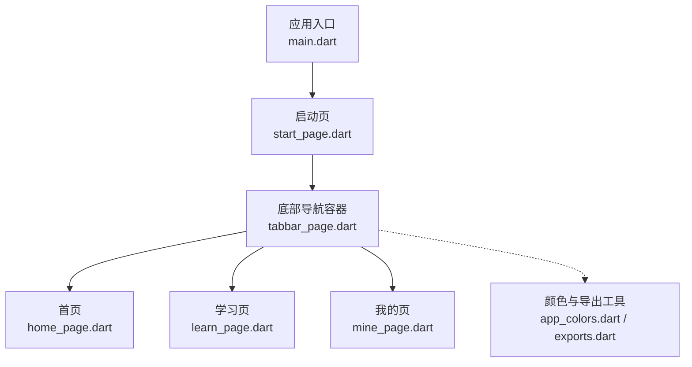
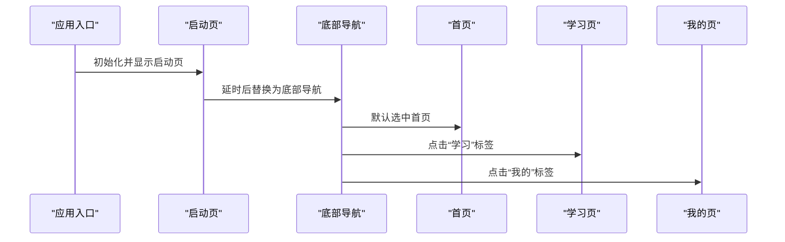
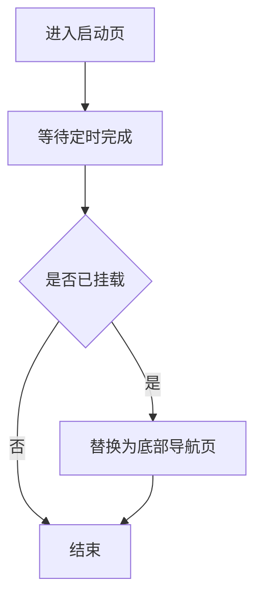
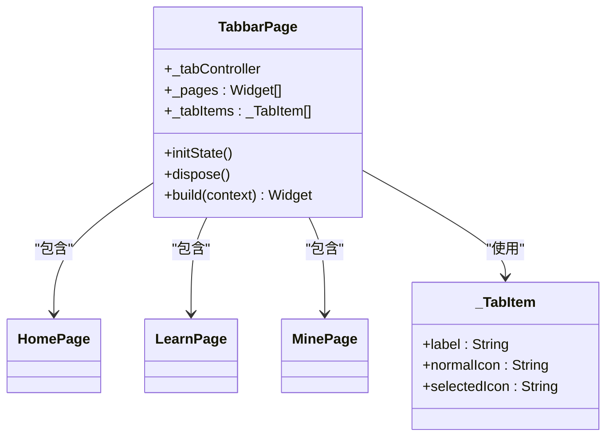
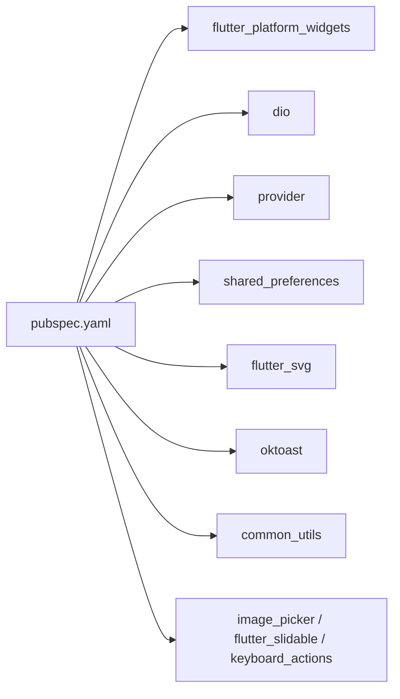

# 页面模块

<cite>
**本文引用的文件**
- [main.dart](file://lib/main.dart)
- [start_page.dart](file://lib/pages/starts/start_page.dart)
- [tabbar_page.dart](file://lib/pages/starts/tabbar_page.dart)
- [home_page.dart](file://lib/pages/home/home_page.dart)
- [learn_page.dart](file://lib/pages/courses/learn_page.dart)
- [mine_page.dart](file://lib/pages/settings/mine_page.dart)
- [app_colors.dart](file://lib/utils/app_colors.dart)
- [exports.dart](file://lib/utils/exports.dart)
- [pubspec.yaml](file://pubspec.yaml)
</cite>

## 目录
1. [简介](#简介)
2. [项目结构](#项目结构)
3. [核心组件](#核心组件)
4. [架构总览](#架构总览)
5. [详细组件分析](#详细组件分析)
6. [依赖分析](#依赖分析)
7. [性能考虑](#性能考虑)
8. [故障排查指南](#故障排查指南)
9. [结论](#结论)
10. [附录](#附录)

## 简介
本章节面向“页面模块”的文档目标，围绕首页、学习页、我的页三大功能页面进行系统化说明。当前代码实现了应用启动与底部导航框架，并提供了三个基础页面占位实现；后续可扩展为完整的学习型应用（课程列表、进度跟踪、学习记录、个人中心等）。本文同时给出页面间导航关系、数据共享机制建议、状态管理与网络请求处理策略、错误处理方案以及性能优化与用户体验改进建议。

## 项目结构
- 入口与主题：应用入口在 main.dart，统一设置主题色与初始页面。
- 启动流程：StartPage 作为启动页，延迟跳转至 TabbarPage。
- 底部导航：TabbarPage 使用 PlatformTabScaffold 管理多标签页，承载首页、学习页、我的页。
- 页面组织：pages 目录下按功能划分 home、courses、settings、starts 子目录，便于职责分离与扩展。
- 工具与资源：utils 提供颜色主题与统一导出；assets 存放图标等资源；pubspec.yaml 声明依赖与资源路径。

图表来源
- [main.dart:9-22](file://lib/main.dart#L9-L22)
- [start_page.dart:12-24](file://lib/pages/starts/start_page.dart#L12-L24)
- [tabbar_page.dart:15-99](file://lib/pages/starts/tabbar_page.dart#L15-L99)
- [home_page.dart:3-24](file://lib/pages/home/home_page.dart#L3-L24)
- [learn_page.dart:3-24](file://lib/pages/courses/learn_page.dart#L3-L24)
- [mine_page.dart:3-27](file://lib/pages/settings/mine_page.dart#L3-L27)
- [app_colors.dart:5-27](file://lib/utils/app_colors.dart#L5-L27)
- [exports.dart:1-5](file://lib/utils/exports.dart#L1-L5)

章节来源
- [main.dart:9-22](file://lib/main.dart#L9-L22)
- [pubspec.yaml:99-109](file://pubspec.yaml#L99-L109)

## 核心组件
- 应用入口 MyApp：配置主题色与初始路由，确保全局视觉一致。
- 启动页 StartPage：展示启动信息并在延时后替换到主导航页，避免阻塞首屏渲染。
- 底部导航 TabbarPage：集中管理三张页面与底部标签项，使用跨平台 Tab 组件适配不同系统风格。
- 页面占位：
  - 首页 HomePage：展示标题与图标，预留内容区域。
  - 学习页 LearnPage：展示学习相关标题与图标，预留课程列表与进度区域。
  - 我的页 MinePage：展示头像与用户中心入口，预留个人信息与设置项。

章节来源
- [main.dart:9-22](file://lib/main.dart#L9-L22)
- [start_page.dart:12-24](file://lib/pages/starts/start_page.dart#L12-L24)
- [tabbar_page.dart:15-99](file://lib/pages/starts/tabbar_page.dart#L15-L99)
- [home_page.dart:3-24](file://lib/pages/home/home_page.dart#L3-L24)
- [learn_page.dart:3-24](file://lib/pages/courses/learn_page.dart#L3-L24)
- [mine_page.dart:3-27](file://lib/pages/settings/mine_page.dart#L3-L27)

## 架构总览
整体采用“入口 -> 启动页 -> 底部导航 -> 功能页”的分层结构。底部导航通过 PlatformTabScaffold 统一管理页面切换，页面之间保持松耦合，便于后续引入状态管理与网络层。

图表来源
- [main.dart:9-22](file://lib/main.dart#L9-L22)
- [start_page.dart:12-24](file://lib/pages/starts/start_page.dart#L12-L24)
- [tabbar_page.dart:15-99](file://lib/pages/starts/tabbar_page.dart#L15-L99)

## 详细组件分析

### 启动页与导航流程
- 启动逻辑：在 initState 中设置定时器，完成后执行页面替换，进入主导航。
- 导航方式：使用 Navigator.pushReplacement 替换启动页，减少栈深度。
- 可访问性：保证 mounted 检查，避免异步回调时销毁导致的异常。

图表来源
- [start_page.dart:12-24](file://lib/pages/starts/start_page.dart#L12-L24)

章节来源
- [start_page.dart:12-24](file://lib/pages/starts/start_page.dart#L12-L24)

### 底部导航容器
- 页面集合：维护 HomePage、LearnPage、MinePage 的实例列表。
- 标签项：定义每个标签的文案与图标（正常/选中态），通过 SvgPicture 加载。
- 平台适配：使用 PlatformTabScaffold 与 Material/Cupertino 配置，保证跨端一致性。
- 生命周期：创建与释放 PlatformTabController，避免内存泄漏。

图表来源
- [tabbar_page.dart:15-112](file://lib/pages/starts/tabbar_page.dart#L15-L112)

章节来源
- [tabbar_page.dart:15-112](file://lib/pages/starts/tabbar_page.dart#L15-L112)

### 首页（内容展示与交互）
- 当前实现：展示标题栏与居中图标/文本，预留内容区。
- 扩展建议：
  - 内容展示：轮播图、推荐卡片、公告条等。
  - 用户交互：搜索、筛选、收藏、分享等。
  - 业务逻辑：拉取首页数据、缓存策略、错误重试。

章节来源
- [home_page.dart:3-24](file://lib/pages/home/home_page.dart#L3-L24)

### 学习页（课程列表、进度跟踪、学习记录）
- 当前实现：展示标题栏与学习相关图标/文本，预留内容区。
- 设计要点：
  - 课程列表：分页加载、骨架屏、空状态、下拉刷新/上拉加载更多。
  - 学习进度：以百分比或里程碑形式展示，支持本地持久化。
  - 学习记录：记录观看时长、完成度、错题集等。
- 数据流建议：Provider 管理课程与进度状态，Dio 发起网络请求，shared_preferences 缓存关键数据。

章节来源
- [learn_page.dart:3-24](file://lib/pages/courses/learn_page.dart#L3-L24)

### 我的页（用户中心、设置与偏好）
- 当前实现：展示头像与标题，预留用户中心入口。
- 功能规划：
  - 个人信息：头像、昵称、账号信息编辑。
  - 设置选项：主题、通知、语言、隐私策略等。
  - 用户偏好：学习提醒、自动播放、离线下载开关。
- 数据持久化：使用 shared_preferences 保存偏好设置。

章节来源
- [mine_page.dart:3-27](file://lib/pages/settings/mine_page.dart#L3-L27)

### 颜色与主题
- 颜色体系：AppColors 集中管理主题色、标题色、内容色、背景色等。
- 统一导出：exports.dart 统一导出 SVG、资源生成类与颜色工具，简化导入。
- 主题集成：MyApp 通过 ColorScheme.fromSeed 将主题色应用到全局。

章节来源
- [app_colors.dart:5-27](file://lib/utils/app_colors.dart#L5-L27)
- [exports.dart:1-5](file://lib/utils/exports.dart#L1-L5)
- [main.dart:14-20](file://lib/main.dart#L14-L20)

## 依赖分析
- 运行时依赖：
  - flutter_platform_widgets：跨平台 Tab 组件，用于底部导航。
  - dio：网络请求库，建议在服务层封装 API。
  - provider：状态管理，适合轻量级全局状态。
  - shared_preferences：本地存储，用于用户偏好与简单缓存。
  - flutter_svg：SVG 资源加载，用于底部图标。
  - oktoast：全局提示，提升交互反馈。
  - common_utils：常用工具方法。
  - image_picker、flutter_slidable、keyboard_actions：增强交互体验。
- 资源与构建：
  - assets 路径在 pubspec.yaml 中声明，配合 flutter_gen_runner 生成资源访问代码。

图表来源
- [pubspec.yaml:30-64](file://pubspec.yaml#L30-L64)

章节来源
- [pubspec.yaml:30-64](file://pubspec.yaml#L30-L64)

## 性能考虑
- 首屏优化：
  - 启动页仅做必要展示与跳转，避免复杂计算。
  - 使用延迟跳转，降低首次渲染压力。
- 列表与图片：
  - 课程列表使用分页与懒加载，避免一次性加载大量数据。
  - 图片使用合适的尺寸与缓存策略，减少内存占用。
- 状态管理：
  - 使用 Provider 管理跨页面共享状态，避免重复请求。
  - 对频繁更新的状态进行细粒度拆分，减少重建范围。
- 网络请求：
  - 使用 Dio 拦截器统一处理超时、重试与错误提示。
  - 合理设置缓存策略，减少重复请求。
- 资源与主题：
  - 统一颜色与主题，减少样式分支。
  - 使用 SVG 矢量图标，适配多分辨率。

[本节为通用指导，不直接分析具体文件]

## 故障排查指南
- 启动页跳转失败：
  - 检查 mounted 判断与定时器是否正确释放。
  - 确认目标路由存在且可访问。
- 底部导航异常：
  - 检查 PlatformTabController 的生命周期管理。
  - 确认图标资源路径正确且已注册。
- 页面状态不一致：
  - 使用 Provider 管理共享状态，确保单点更新。
  - 避免在多处直接修改同一状态。
- 网络请求错误：
  - 统一错误码映射与用户提示。
  - 增加重试与降级策略。

章节来源
- [start_page.dart:12-24](file://lib/pages/starts/start_page.dart#L12-L24)
- [tabbar_page.dart:42-52](file://lib/pages/starts/tabbar_page.dart#L42-L52)

## 结论
当前页面模块已完成应用入口、启动流程与底部导航框架搭建，并提供首页、学习页、我的页的基础占位实现。后续可在各页面内逐步接入课程列表、学习进度与用户中心功能，结合 Provider 与 Dio 构建稳定的数据层与服务层，完善错误处理与性能优化，提升用户体验。

[本节为总结性内容，不直接分析具体文件]

## 附录
- 页面间导航关系：
  - 启动页 -> 底部导航 -> 首页/学习页/我的页。
- 数据共享机制建议：
  - 使用 Provider 管理全局状态（如用户信息、学习进度）。
  - 使用 shared_preferences 保存用户偏好与本地缓存。
- 网络请求与错误处理：
  - 使用 Dio 封装请求与响应拦截器，统一错误提示与重试。
  - 对关键操作增加加载态与失败重试。
- 最佳实践：
  - 页面职责单一，组件复用优先。
  - 统一颜色与主题，减少样式差异。
  - 合理使用异步与生命周期，避免内存泄漏。

[本节为补充说明，不直接分析具体文件]