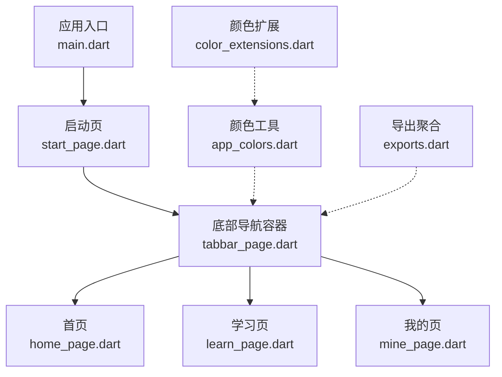
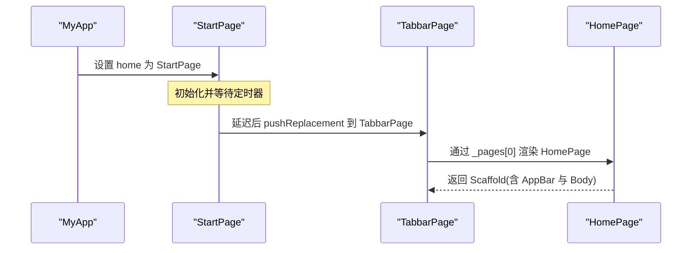
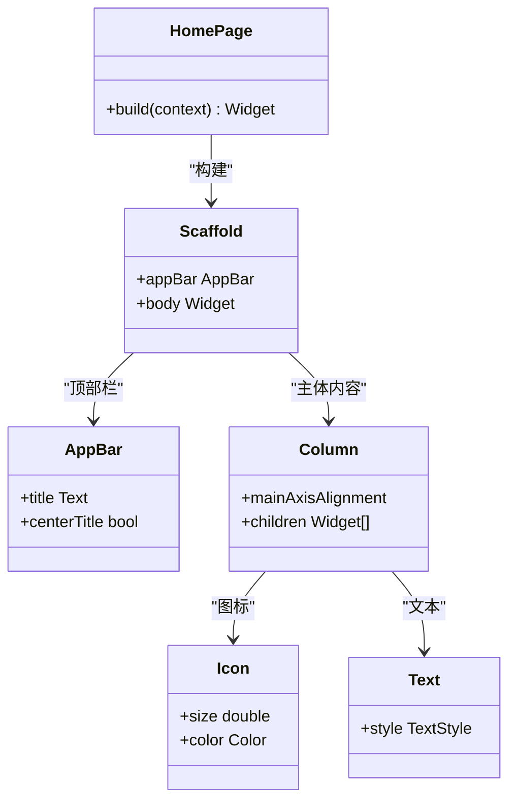
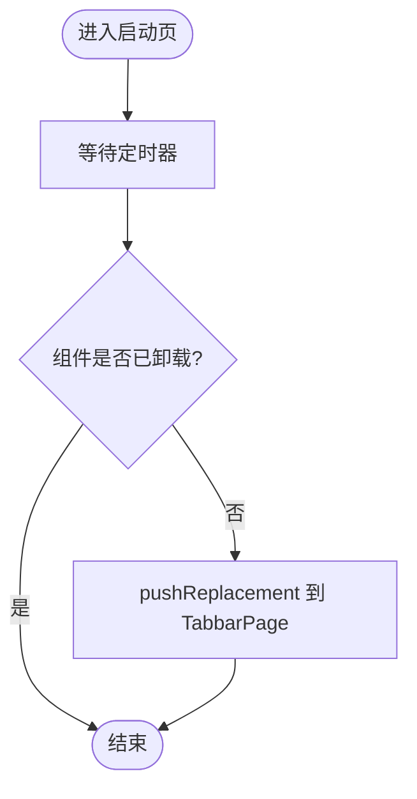
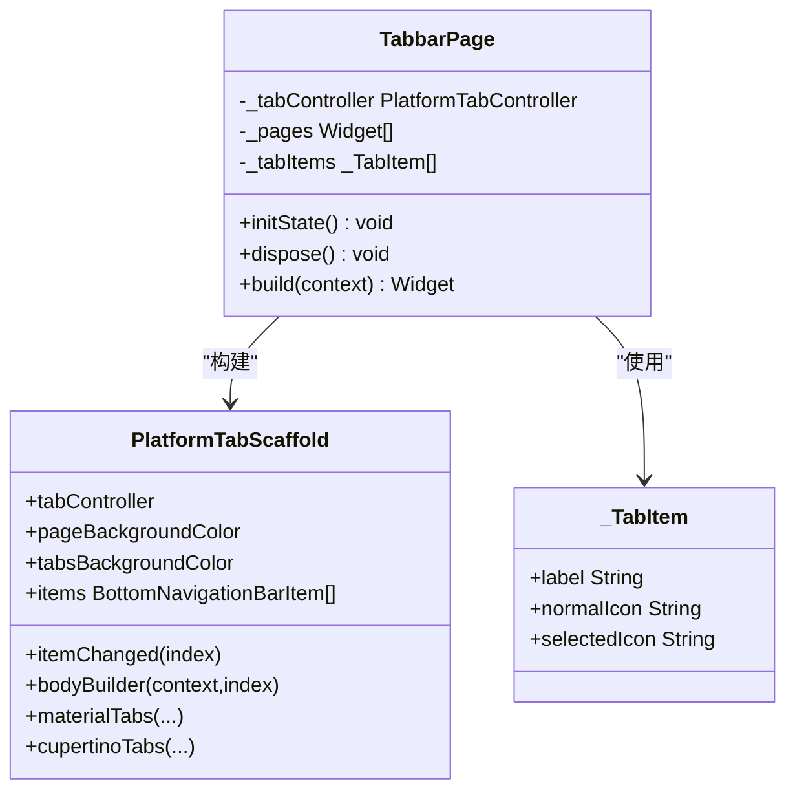
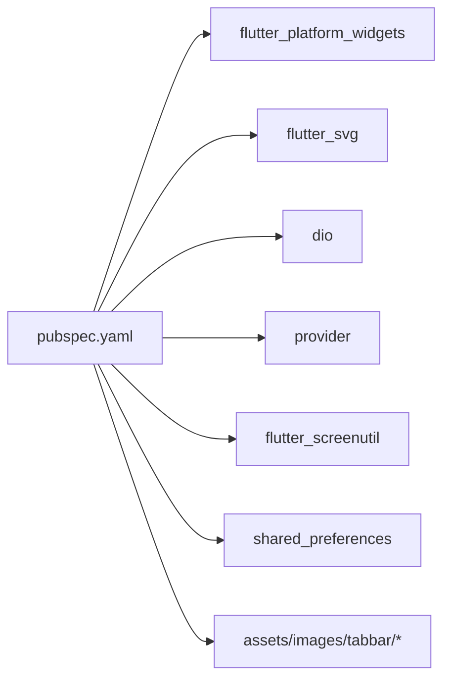

# 首页模块

<cite>
**本文引用的文件**
- [lib/main.dart](file://lib/main.dart)
- [lib/pages/home/home_page.dart](file://lib/pages/home/home_page.dart)
- [lib/pages/starts/start_page.dart](file://lib/pages/starts/start_page.dart)
- [lib/pages/starts/tabbar_page.dart](file://lib/pages/starts/tabbar_page.dart)
- [lib/utils/app_colors.dart](file://lib/utils/app_colors.dart)
- [lib/utils/exports.dart](file://lib/utils/exports.dart)
- [lib/extensions/color_extensions.dart](file://lib/extensions/color_extensions.dart)
- [pubspec.yaml](file://pubspec.yaml)
</cite>

## 目录
1. [简介](#简介)
2. [项目结构](#项目结构)
3. [核心组件](#核心组件)
4. [架构总览](#架构总览)
5. [详细组件分析](#详细组件分析)
6. [依赖分析](#依赖分析)
7. [性能考虑](#性能考虑)
8. [故障排查指南](#故障排查指南)
9. [结论](#结论)
10. [附录](#附录)

## 简介
本章节面向“首页模块”，围绕 HomePage 组件的实现进行系统化文档说明。内容涵盖：
- UI 结构设计：AppBar 配置、内容布局与样式
- 状态管理方式：StatelessWidget 静态页面构建
- 响应式设计：图标显示、文本样式与间距设置
- 扩展开发指导：动态内容、网络请求集成、用户交互处理
- 性能优化建议与最佳实践

## 项目结构
本项目采用按功能分层的目录组织方式，首页相关代码位于 pages 目录下，主题与工具类位于 utils 与 extensions 下，应用入口在 main.dart。TabBar 容器负责承载多个页面（包括首页）。

图表来源
- [lib/main.dart:5-23](file://lib/main.dart#L5-L23)
- [lib/pages/starts/start_page.dart:5-37](file://lib/pages/starts/start_page.dart#L5-L37)
- [lib/pages/starts/tabbar_page.dart:8-113](file://lib/pages/starts/tabbar_page.dart#L8-L113)
- [lib/pages/home/home_page.dart:1-25](file://lib/pages/home/home_page.dart#L1-L25)
- [lib/utils/app_colors.dart:1-27](file://lib/utils/app_colors.dart#L1-L27)
- [lib/utils/exports.dart:1-5](file://lib/utils/exports.dart#L1-L5)
- [lib/extensions/color_extensions.dart:1-21](file://lib/extensions/color_extensions.dart#L1-L21)

章节来源
- [lib/main.dart:5-23](file://lib/main.dart#L5-L23)
- [pubspec.yaml:99-109](file://pubspec.yaml#L99-L109)

## 核心组件
- 应用入口 MyApp：配置主题色并指定首页为 StartPage。
- 启动页 StartPage：展示启动信息并在延迟后跳转到 TabbarPage。
- 底部导航容器 TabbarPage：使用 PlatformTabScaffold 管理多页签，包含首页、学习页、我的页。
- 首页 HomePage：使用 StatelessWidget 构建的静态页面，包含 AppBar 与居中的图标和文本。

章节来源
- [lib/main.dart:9-23](file://lib/main.dart#L9-L23)
- [lib/pages/starts/start_page.dart:5-37](file://lib/pages/starts/start_page.dart#L5-L37)
- [lib/pages/starts/tabbar_page.dart:8-113](file://lib/pages/starts/tabbar_page.dart#L8-L113)
- [lib/pages/home/home_page.dart:1-25](file://lib/pages/home/home_page.dart#L1-L25)

## 架构总览
从应用启动到首页展示的调用链如下：

图表来源
- [lib/main.dart:14-21](file://lib/main.dart#L14-L21)
- [lib/pages/starts/start_page.dart:14-23](file://lib/pages/starts/start_page.dart#L14-L23)
- [lib/pages/starts/tabbar_page.dart:18-22](file://lib/pages/starts/tabbar_page.dart#L18-L22)
- [lib/pages/home/home_page.dart:7-24](file://lib/pages/home/home_page.dart#L7-L24)

## 详细组件分析

### 首页 HomePage 组件
- 组件类型：StatelessWidget，适合无内部状态的静态页面。
- AppBar 配置：标题居中显示，便于统一风格。
- 内容布局：使用 Center + Column 垂直居中，包含图标与文本，并通过 SizedBox 控制间距。
- 样式与主题：图标尺寸与颜色、文本字号可直接定义；如需全局一致，可结合 AppColors 与 Theme.of(context)。

图表来源
- [lib/pages/home/home_page.dart:3-24](file://lib/pages/home/home_page.dart#L3-L24)

章节来源
- [lib/pages/home/home_page.dart:1-25](file://lib/pages/home/home_page.dart#L1-L25)

### 启动页与导航流程
- 启动页职责：展示启动信息，延迟后替换路由至底部导航容器。
- 导航实现：使用 Navigator.pushReplacement 将 StartPage 替换为 TabbarPage，避免返回栈堆积。
- 生命周期注意：在跳转前检查 mounted，确保组件仍有效。

图表来源
- [lib/pages/starts/start_page.dart:14-23](file://lib/pages/starts/start_page.dart#L14-L23)

章节来源
- [lib/pages/starts/start_page.dart:5-37](file://lib/pages/starts/start_page.dart#L5-L37)

### 底部导航容器 TabbarPage
- 容器类型：StatefulWidget，维护 PlatformTabController 与页面列表。
- 页面集合：_pages 包含 HomePage、LearnPage、MinePage。
- 标签项：_tabItems 定义每个标签的文案与图标资源路径。
- 平台适配：使用 flutter_platform_widgets 的 PlatformTabScaffold 提供 Material/Cupertino 一致的底部导航体验。
- 样式：通过 MaterialNavBarData/CupertinoTabBarData 配置背景、阴影、选中/未选中颜色、内边距等。

图表来源
- [lib/pages/starts/tabbar_page.dart:8-113](file://lib/pages/starts/tabbar_page.dart#L8-L113)

章节来源
- [lib/pages/starts/tabbar_page.dart:8-113](file://lib/pages/starts/tabbar_page.dart#L8-L113)

### 颜色与主题
- 颜色集中管理：AppColors 提供主题主色、标题色、内容色、背景色等，便于全局一致性。
- 颜色扩展：HexColor.fromHex 支持十六进制字符串转 Color，简化颜色定义。
- 导出聚合：exports.dart 统一导出 Svg、Assets、AppColors、颜色扩展，减少重复 import。

章节来源
- [lib/utils/app_colors.dart:1-27](file://lib/utils/app_colors.dart#L1-L27)
- [lib/extensions/color_extensions.dart:1-21](file://lib/extensions/color_extensions.dart#L1-L21)
- [lib/utils/exports.dart:1-5](file://lib/utils/exports.dart#L1-L5)

## 依赖分析
- 关键依赖：
  - flutter_platform_widgets：跨平台底部导航容器
  - flutter_svg：SVG 图标加载
  - dio：网络请求（可用于后续动态内容）
  - provider：状态管理（可用于后续数据驱动）
  - flutter_screenutil：屏幕适配（可用于响应式布局）
  - shared_preferences：本地存储（可用于缓存或用户偏好）
- 资源声明：assets 中声明了 images 与 tabbar 资源路径，供 Tabbar 图标使用。

图表来源
- [pubspec.yaml:30-64](file://pubspec.yaml#L30-L64)
- [pubspec.yaml:99-109](file://pubspec.yaml#L99-L109)

章节来源
- [pubspec.yaml:30-64](file://pubspec.yaml#L30-L64)
- [pubspec.yaml:99-109](file://pubspec.yaml#L99-L109)

## 性能考虑
- 使用 StatelessWidget：HomePage 作为无状态组件，避免不必要的重建开销。
- 固定尺寸与简单布局：当前使用固定图标尺寸与简单 Column 布局，利于快速渲染。
- 资源复用：Tabbar 图标使用 SVG，建议在 assets 中预加载并复用实例，减少重复解码。
- 避免频繁 rebuild：若后续引入状态变化，建议使用 Provider 或 Riverpod 等细粒度更新策略，仅更新必要节点。
- 首屏优化：启动页延迟跳转逻辑合理，避免阻塞首帧；可在后续加入骨架屏提升感知性能。

## 故障排查指南
- 启动后无法进入首页：
  - 检查 StartPage 定时器与 mounted 判断是否正确，确保组件未被提前销毁。
  - 确认 TabbarPage 的 _pages 索引与 items 数量一致，避免越界。
- 图标不显示或颜色异常：
  - 确认 assets 路径已在 pubspec.yaml 中声明，且资源存在。
  - 检查 SvgPicture 的 width/height 与 colorFilter 配置是否符合预期。
- 主题色不一致：
  - 确认 AppColors 与 Theme.of(context).primaryColor 的使用位置正确。
  - 检查 MyApp 的 theme 配置是否生效。

章节来源
- [lib/pages/starts/start_page.dart:14-23](file://lib/pages/starts/start_page.dart#L14-L23)
- [lib/pages/starts/tabbar_page.dart:18-22](file://lib/pages/starts/tabbar_page.dart#L18-L22)
- [lib/pages/starts/tabbar_page.dart:82-97](file://lib/pages/starts/tabbar_page.dart#L82-L97)
- [lib/main.dart:14-21](file://lib/main.dart#L14-L21)
- [pubspec.yaml:99-109](file://pubspec.yaml#L99-L109)

## 结论
HomePage 以 StatelessWidget 形式实现了简洁、稳定的静态首页，配合统一的 AppBar 与居中对齐的内容布局，具备良好的可读性与可扩展性。通过 TabbarPage 的多页签容器，首页与其他页面形成清晰的导航结构。借助 AppColors 与主题系统，界面风格保持一致。后续可通过 Provider/dio/flutter_screenutil 等依赖逐步引入动态内容与响应式适配，进一步提升用户体验。

## 附录

### 首页扩展开发指导
- 添加动态内容
  - 使用 Provider 管理数据状态，在 HomePage 中监听并刷新局部 UI。
  - 使用 ListView/GridView 替代 Column，按需加载与分页展示。
- 集成网络请求
  - 使用 dio 发起请求，封装 Service 层，结合 Provider 更新状态。
  - 增加 Loading 与错误提示，提升容错能力。
- 处理用户交互
  - 为按钮或卡片添加 onTap 回调，触发导航或业务逻辑。
  - 使用 OkToast 提供轻量级反馈提示。
- 响应式设计
  - 使用 flutter_screenutil 根据屏幕尺寸缩放字体与间距。
  - 针对不同屏幕宽度调整布局（如单列/双列切换）。

### 最佳实践
- 组件拆分：将复杂 UI 拆分为小组件，提高复用性与可测试性。
- 样式集中：通过 AppColors 与主题统一管理颜色与字体。
- 资源管理：集中声明 assets，避免硬编码路径。
- 状态最小化：优先使用 StatelessWidget，必要时再引入 StatefulWidget 或外部状态管理。
- 性能监控：关注 rebuild 次数与内存占用，必要时使用 devtools 分析。