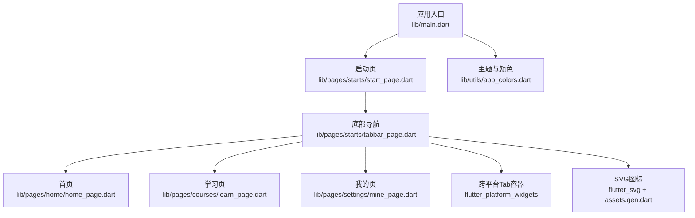
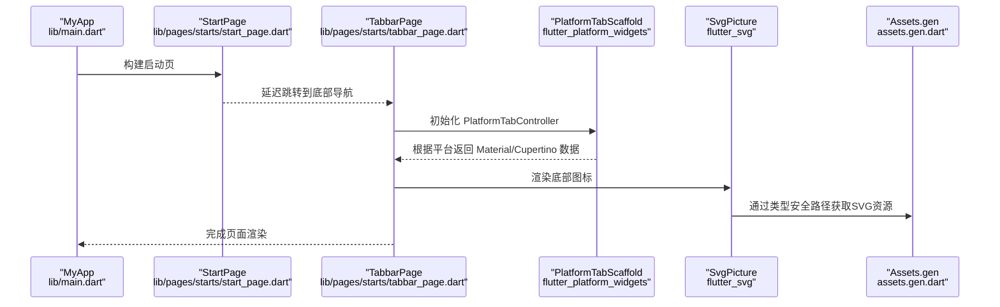
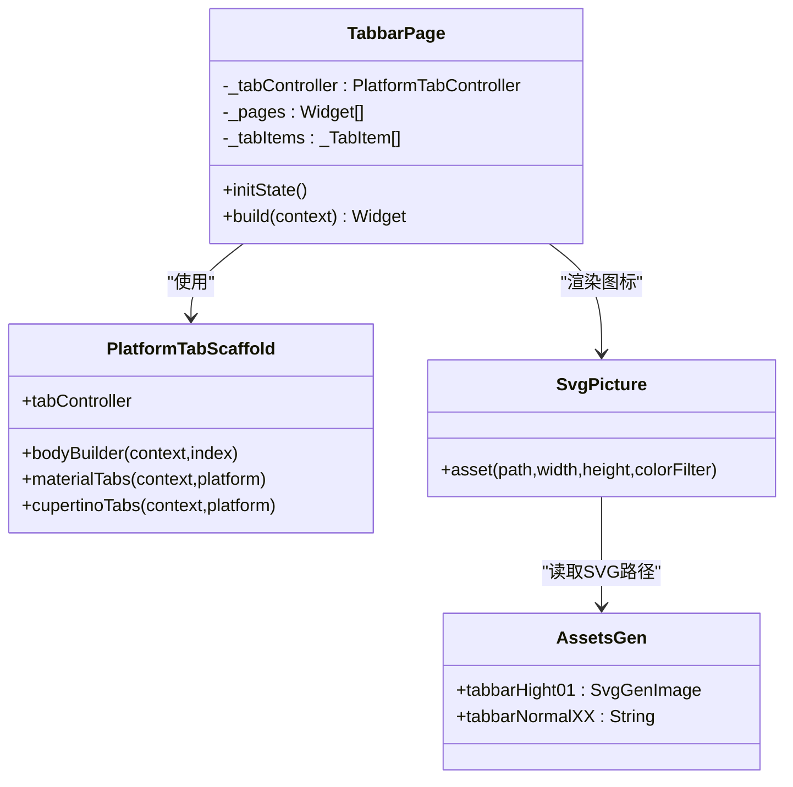
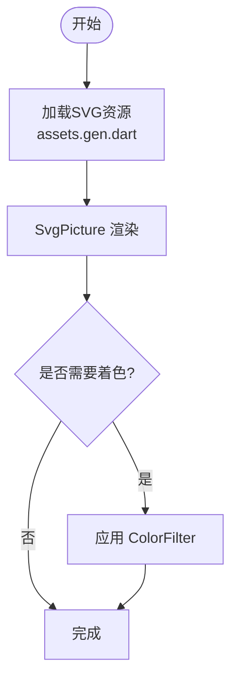
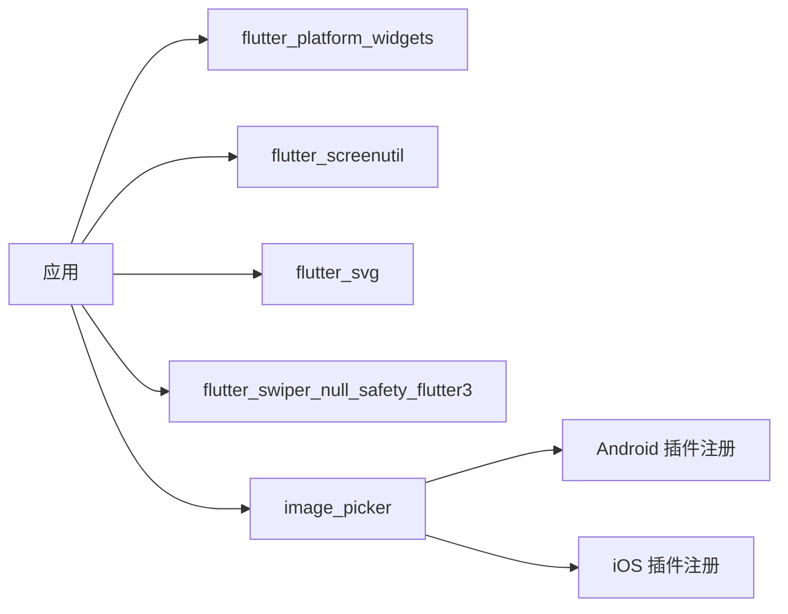

# UI组件集成

<cite>
**本文引用的文件**
- [pubspec.yaml](file://pubspec.yaml)
- [main.dart](file://lib/main.dart)
- [tabbar_page.dart](file://lib/pages/starts/tabbar_page.dart)
- [start_page.dart](file://lib/pages/starts/start_page.dart)
- [home_page.dart](file://lib/pages/home/home_page.dart)
- [learn_page.dart](file://lib/pages/courses/learn_page.dart)
- [mine_page.dart](file://lib/pages/settings/mine_page.dart)
- [app_colors.dart](file://lib/utils/app_colors.dart)
- [exports.dart](file://lib/utils/exports.dart)
- [assets.gen.dart](file://lib/gen/assets.gen.dart)
- [GeneratedPluginRegistrant.java](file://android/app/src/main/java/io/flutter/plugins/GeneratedPluginRegistrant.java)
- [GeneratedPluginRegistrant.m](file://ios/Runner/GeneratedPluginRegistrant.m)
</cite>

## 目录
1. [简介](#简介)
2. [项目结构](#项目结构)
3. [核心组件](#核心组件)
4. [架构总览](#架构总览)
5. [详细组件分析](#详细组件分析)
6. [依赖分析](#依赖分析)
7. [性能考虑](#性能考虑)
8. [故障排查指南](#故障排查指南)
9. [结论](#结论)
10. [附录](#附录)

## 简介
本文件面向UI组件集成，聚焦以下目标：
- 使用 flutter_platform_widgets 实现跨平台（Material/Cupertino）UI统一。
- 说明屏幕适配库 flutter_screenutil 的配置与策略（本项目已引入）。
- 介绍 SVG 图片处理库 flutter_svg 的使用、资源管理与性能优化。
- 说明轮播图 flutter_swiper_null_safety_flutter3 的配置与自定义（本项目已引入）。
- 说明图片选择 image_picker 的使用方法、权限处理与压缩建议（本项目已引入）。
- 提供每个组件的具体使用示例与最佳实践（样式定制、事件处理、性能优化）。

## 项目结构
项目采用分层组织：入口在 main.dart；页面集中在 lib/pages；工具与颜色在 lib/utils；资源通过 FlutterGen 生成类型安全的访问器 assets.gen.dart；平台插件注册由 Android/iOS 自动生成。

图表来源
- [main.dart:1-23](file://lib/main.dart#L1-L23)
- [tabbar_page.dart:1-113](file://lib/pages/starts/tabbar_page.dart#L1-L113)
- [assets.gen.dart:17-40](file://lib/gen/assets.gen.dart#L17-L40)
- [app_colors.dart:1-27](file://lib/utils/app_colors.dart#L1-L27)

章节来源
- [main.dart:1-23](file://lib/main.dart#L1-L23)
- [pubspec.yaml:34-64](file://pubspec.yaml#L34-L64)

## 核心组件
- 跨平台UI统一：使用 flutter_platform_widgets 的 PlatformTabScaffold/PlatformTabController，在同一份代码中为 Material 和 Cupertino 分别配置外观与行为。
- SVG资源：通过 flutter_svg 加载矢量图标，结合 FlutterGen 生成的 assets.gen.dart 进行类型安全引用。
- 屏幕适配：已引入 flutter_screenutil，可在后续页面中使用其API进行尺寸适配。
- 轮播图：已引入 flutter_swiper_null_safety_flutter3，可按需替换或扩展。
- 图片选择：已引入 image_picker，Android/iOS 端插件已在原生侧自动注册。

章节来源
- [pubspec.yaml:34-64](file://pubspec.yaml#L34-L64)
- [tabbar_page.dart:1-113](file://lib/pages/starts/tabbar_page.dart#L1-L113)
- [assets.gen.dart:161-233](file://lib/gen/assets.gen.dart#L161-L233)

## 架构总览
下图展示了从应用启动到底部导航切换的调用链，以及跨平台组件如何根据平台渲染不同风格。

图表来源
- [main.dart:1-23](file://lib/main.dart#L1-L23)
- [start_page.dart:1-37](file://lib/pages/starts/start_page.dart#L1-L37)
- [tabbar_page.dart:1-113](file://lib/pages/starts/tabbar_page.dart#L1-L113)
- [assets.gen.dart:161-233](file://lib/gen/assets.gen.dart#L161-L233)

## 详细组件分析

### 跨平台UI：flutter_platform_widgets
- 作用：以一套API同时支持 Material 与 Cupertino 风格的导航与控件，减少平台分支代码。
- 在本项目中的体现：
  - 使用 PlatformTabScaffold 包裹多页面，并通过 materialTabs/cupertinoTabs 回调分别设置外观。
  - 使用 PlatformTabController 管理标签页切换状态。
- 关键要点：
  - 在 Material 上可配置 elevation、padding、选中/未选中颜色等。
  - 在 Cupertino 上可配置 activeColor、inactiveColor、边框等。
  - 与 SvgPicture 配合，保证图标在不同平台下视觉一致。

图表来源
- [tabbar_page.dart:1-113](file://lib/pages/starts/tabbar_page.dart#L1-L113)
- [assets.gen.dart:17-40](file://lib/gen/assets.gen.dart#L17-L40)

章节来源
- [tabbar_page.dart:1-113](file://lib/pages/starts/tabbar_page.dart#L1-L113)

### SVG图片：flutter_svg 与资源管理
- 资源生成：通过 flutter_gen_runner 与 flutter_svg 集成，生成 assets.gen.dart，提供类型安全的资源访问。
- 使用方式：
  - 在 tabbar_page.dart 中通过 SvgPicture.asset 加载 SVG 图标，并设置 colorFilter 实现主题色着色。
  - 通过 Assets.images.tabbar.* 获取资源路径，避免硬编码字符串。
- 性能优化建议：
  - 优先使用矢量SVG，缩放不失真且体积小。
  - 合理设置 width/height，避免过大绘制区域。
  - 对频繁使用的图标可复用 SvgPicture 实例或使用缓存策略。
  - 使用 FlutterGen 生成类型化资源，减少运行时错误。

图表来源
- [assets.gen.dart:161-233](file://lib/gen/assets.gen.dart#L161-L233)
- [tabbar_page.dart:82-97](file://lib/pages/starts/tabbar_page.dart#L82-L97)

章节来源
- [assets.gen.dart:161-233](file://lib/gen/assets.gen.dart#L161-L233)
- [tabbar_page.dart:82-97](file://lib/pages/starts/tabbar_page.dart#L82-L97)

### 屏幕适配：flutter_screenutil
- 现状：已在 pubspec.yaml 引入 flutter_screenutil，便于后续页面按设计稿尺寸进行适配。
- 推荐用法：
  - 在页面根节点使用 ScreenUtilInit 包裹，指定设计稿尺寸。
  - 使用 SpUtil 或 ScreenUtil 提供的扩展方法设置字体、间距、宽高。
  - 针对不同密度屏幕，保持相对比例一致。
- 注意：当前页面尚未使用该库，建议在新增页面逐步接入。

章节来源
- [pubspec.yaml:46-48](file://pubspec.yaml#L46-L48)

### 轮播图：flutter_swiper_null_safety_flutter3
- 现状：已在 pubspec.yaml 引入，可用于首页或内容页展示轮播。
- 推荐用法：
  - 使用 Swiper 组件包裹多个子项，配置自动播放、指示器、分页等。
  - 结合网络图片时注意占位与错误处理。
  - 控制内存占用，避免过多大图同时加载。
- 注意：当前页面未使用该库，可在首页或课程页按需集成。

章节来源
- [pubspec.yaml:56-58](file://pubspec.yaml#L56-L58)

### 图片选择：image_picker
- 现状：已在 pubspec.yaml 引入，Android/iOS 原生插件已在 GeneratedPluginRegistrant 中注册。
- 权限与流程：
  - Android：需在清单文件中声明相机/存储相关权限（若需要），并在运行时请求用户授权。
  - iOS：需在 Info.plist 中添加相机/相册权限描述。
- 压缩与优化：
  - 选择图片后建议进行压缩与格式转换（如转 JPEG/WebP），以减少内存与体积。
  - 限制最大分辨率与质量，平衡清晰度与性能。
- 注意：当前项目未直接调用 image_picker API，但原生侧已就绪。

章节来源
- [pubspec.yaml:58-60](file://pubspec.yaml#L58-L60)
- [GeneratedPluginRegistrant.java:17-35](file://android/app/src/main/java/io/flutter/plugins/GeneratedPluginRegistrant.java#L17-L35)
- [GeneratedPluginRegistrant.m:27-33](file://ios/Runner/GeneratedPluginRegistrant.m#L27-L33)

## 依赖分析
- 直接依赖：
  - flutter_platform_widgets：跨平台UI统一。
  - flutter_screenutil：屏幕适配。
  - flutter_svg：SVG渲染。
  - flutter_swiper_null_safety_flutter3：轮播图。
  - image_picker：图片选择。
- 间接依赖：
  - 原生插件注册由 Android/iOS 自动生成，确保 image_picker 等平台能力可用。

图表来源
- [pubspec.yaml:34-64](file://pubspec.yaml#L34-L64)
- [GeneratedPluginRegistrant.java:17-35](file://android/app/src/main/java/io/flutter/plugins/GeneratedPluginRegistrant.java#L17-L35)
- [GeneratedPluginRegistrant.m:27-33](file://ios/Runner/GeneratedPluginRegistrant.m#L27-L33)

章节来源
- [pubspec.yaml:34-64](file://pubspec.yaml#L34-L64)

## 性能考虑
- SVG渲染：
  - 控制尺寸与数量，避免一次性加载大量大尺寸SVG。
  - 使用类型化资源减少解析开销。
- 跨平台组件：
  - 尽量复用 PlatformTabScaffold 与控制器，减少重建。
  - 将静态配置外置，降低 build 开销。
- 图片选择：
  - 选择后进行压缩与裁剪，减少内存峰值。
  - 使用懒加载与占位图提升首屏体验。
- 屏幕适配：
  - 使用 flutter_screenutil 统一单位，避免重复计算。
  - 针对大屏设备做响应式布局，避免过度缩放。

## 故障排查指南
- 插件未注册导致功能不可用：
  - 检查 Android 的 GeneratedPluginRegistrant.java 是否包含 image_picker_android。
  - 检查 iOS 的 GeneratedPluginRegistrant.m 是否包含 image_picker_ios。
- SVG无法显示：
  - 确认 assets.gen.dart 已正确生成，路径存在。
  - 检查 SvgPicture 的宽高与父容器约束。
- 底部导航样式异常：
  - 核对 materialTabs 与 cupertinoTabs 回调参数是否正确。
  - 检查颜色与边框配置是否与主题一致。
- 权限问题：
  - Android：确认清单权限与运行时授权逻辑。
  - iOS：确认 Info.plist 权限描述。

章节来源
- [GeneratedPluginRegistrant.java:17-35](file://android/app/src/main/java/io/flutter/plugins/GeneratedPluginRegistrant.java#L17-L35)
- [GeneratedPluginRegistrant.m:27-33](file://ios/Runner/GeneratedPluginRegistrant.m#L27-L33)
- [tabbar_page.dart:60-98](file://lib/pages/starts/tabbar_page.dart#L60-L98)
- [assets.gen.dart:161-233](file://lib/gen/assets.gen.dart#L161-L233)

## 结论
本项目通过 flutter_platform_widgets 实现了跨平台UI的统一，结合 flutter_svg 与 FlutterGen 提供了类型安全的SVG资源管理；同时引入了 flutter_screenutil、flutter_swiper_null_safety_flutter3 与 image_picker，为后续页面扩展预留了良好基础。建议在新增页面中逐步接入屏幕适配与轮播图，并对图片选择进行权限与压缩处理，以提升用户体验与性能。

## 附录
- 颜色与主题：
  - 使用 app_colors.dart 集中管理颜色，并通过 Theme.of(context).primaryColor 获取主色。
- 页面示例：
  - 首页、学习页、我的页均为简单 Scaffold 示例，可作为模板扩展。

章节来源
- [app_colors.dart:1-27](file://lib/utils/app_colors.dart#L1-L27)
- [home_page.dart:1-25](file://lib/pages/home/home_page.dart#L1-L25)
- [learn_page.dart:1-25](file://lib/pages/courses/learn_page.dart#L1-L25)
- [mine_page.dart:1-28](file://lib/pages/settings/mine_page.dart#L1-L28)