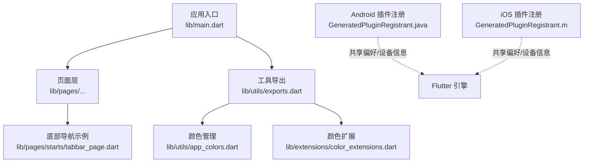
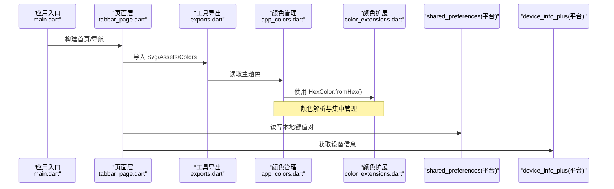
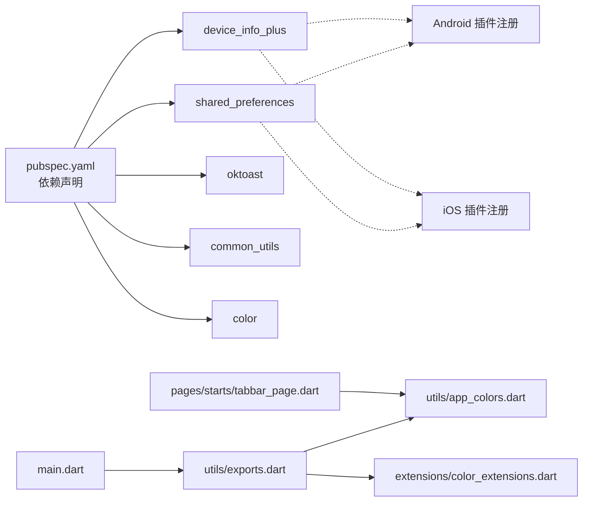

# 存储与工具库

<cite>
**本文引用的文件**
- [pubspec.yaml](file://pubspec.yaml)
- [main.dart](file://lib/main.dart)
- [app_colors.dart](file://lib/utils/app_colors.dart)
- [color_extensions.dart](file://lib/extensions/color_extensions.dart)
- [exports.dart](file://lib/utils/exports.dart)
- [tabbar_page.dart](file://lib/pages/starts/tabbar_page.dart)
- [GeneratedPluginRegistrant.java](file://android/app/src/main/java/io/flutter/plugins/GeneratedPluginRegistrant.java)
- [GeneratedPluginRegistrant.m](file://ios/Runner/GeneratedPluginRegistrant.m)
</cite>

## 目录
1. [简介](#简介)
2. [项目结构](#项目结构)
3. [核心组件](#核心组件)
4. [架构总览](#架构总览)
5. [详细组件分析](#详细组件分析)
6. [依赖关系分析](#依赖关系分析)
7. [性能考虑](#性能考虑)
8. [故障排查指南](#故障排查指南)
9. [结论](#结论)
10. [附录](#附录)

## 简介
本文件聚焦于本项目中的“存储与工具库”主题，围绕以下方面提供系统化说明：
- 本地存储 shared_preferences 的配置与使用（基础类型与复杂数据）
- 设备信息获取 device_info_plus 在 Android/iOS 的使用要点
- 常用工具库 common_utils 的功能模块概览（字符串、日期、加密等）
- Toast 提示 oktoast 的集成与显示控制
- 颜色处理 color 与项目内颜色体系（HexColor、AppColors）
- 每个库的使用示例路径、最佳实践、错误处理、性能与兼容性说明

## 项目结构
本项目采用分层组织方式：
- lib/main.dart：应用入口，初始化主题与首页
- lib/utils：统一导出与颜色管理
- lib/extensions：扩展方法（如 HexColor）
- lib/pages：页面层（包含底部导航等示例）
- android/ios：平台侧插件注册（shared_preferences、device_info_plus 等）

图表来源
- [main.dart:1-23](file://lib/main.dart#L1-L23)
- [exports.dart:1-5](file://lib/utils/exports.dart#L1-L5)
- [app_colors.dart:1-27](file://lib/utils/app_colors.dart#L1-L27)
- [color_extensions.dart:1-21](file://lib/extensions/color_extensions.dart#L1-L21)
- [tabbar_page.dart:59-111](file://lib/pages/starts/tabbar_page.dart#L59-L111)
- [GeneratedPluginRegistrant.java:1-35](file://android/app/src/main/java/io/flutter/plugins/GeneratedPluginRegistrant.java#L1-L35)
- [GeneratedPluginRegistrant.m:1-35](file://ios/Runner/GeneratedPluginRegistrant.m#L1-L35)

章节来源
- [main.dart:1-23](file://lib/main.dart#L1-L23)
- [pubspec.yaml:30-65](file://pubspec.yaml#L30-L65)

## 核心组件
- 本地存储 shared_preferences：用于持久化用户设置、登录态、轻量配置等
- 设备信息 device_info_plus：获取系统版本、设备型号、厂商信息等
- 工具库 common_utils：字符串、日期、加密解密等通用能力
- Toast 提示 oktoast：轻量级全局提示
- 颜色处理 color + 自定义扩展：十六进制转 Color、集中式主题色管理

章节来源
- [pubspec.yaml:38-65](file://pubspec.yaml#L38-L65)

## 架构总览
下图展示应用启动后，页面层通过工具导出访问颜色与资源；同时，平台侧已自动注册 shared_preferences 与 device_info_plus，供上层调用。

图表来源
- [main.dart:1-23](file://lib/main.dart#L1-L23)
- [tabbar_page.dart:59-111](file://lib/pages/starts/tabbar_page.dart#L59-L111)
- [exports.dart:1-5](file://lib/utils/exports.dart#L1-L5)
- [app_colors.dart:1-27](file://lib/utils/app_colors.dart#L1-L27)
- [color_extensions.dart:1-21](file://lib/extensions/color_extensions.dart#L1-L21)
- [GeneratedPluginRegistrant.java:1-35](file://android/app/src/main/java/io/flutter/plugins/GeneratedPluginRegistrant.java#L1-L35)
- [GeneratedPluginRegistrant.m:1-35](file://ios/Runner/GeneratedPluginRegistrant.m#L1-L35)

## 详细组件分析

### 本地存储 shared_preferences
- 依赖声明与版本：见 pubspec 依赖项
- 平台注册：Android 与 iOS 均已自动注册 SharedPreferences 插件
- 基本数据类型：支持 String、int、double、bool、List<String> 等
- 复杂数据：建议将对象序列化为 JSON 字符串后再存储；读取时反序列化
- 异步操作：所有读写均为异步，需 await 或 then 处理
- 命名空间：按功能模块划分 key 前缀，避免冲突
- 错误处理：捕获异常并降级为默认值；记录日志便于定位
- 性能建议：批量写入合并；避免频繁小写；大对象缓存到内存再落盘
- 兼容性：跨平台一致 API；注意不同平台底层实现差异（如 Android SharedPreferences vs iOS UserDefaults）

使用示例路径
- 依赖声明位置：[pubspec.yaml:50-51](file://pubspec.yaml#L50-L51)
- Android 插件注册：[GeneratedPluginRegistrant.java:33-37](file://android/app/src/main/java/io/flutter/plugins/GeneratedPluginRegistrant.java#L33-L37)
- iOS 插件注册：[GeneratedPluginRegistrant.m:21-25](file://ios/Runner/GeneratedPluginRegistrant.m#L21-L25), [GeneratedPluginRegistrant.m:32-32](file://ios/Runner/GeneratedPluginRegistrant.m#L32-L32)

章节来源
- [pubspec.yaml:50-51](file://pubspec.yaml#L50-L51)
- [GeneratedPluginRegistrant.java:33-37](file://android/app/src/main/java/io/flutter/plugins/GeneratedPluginRegistrant.java#L33-L37)
- [GeneratedPluginRegistrant.m:21-25](file://ios/Runner/GeneratedPluginRegistrant.m#L21-L25)

### 设备信息 device_info_plus
- 依赖声明与版本：见 pubspec 依赖项
- 平台注册：Android 与 iOS 均已自动注册 DeviceInfoPlus 插件
- 典型能力：获取系统版本、设备型号、厂商、唯一标识（受权限限制）
- 权限与隐私：部分信息需要运行时权限或受限访问，需做好兼容与兜底
- 错误处理：捕获异常返回空值或默认值；区分平台差异
- 性能建议：仅在必要时获取；结果可缓存

使用示例路径
- 依赖声明位置：[pubspec.yaml:38-39](file://pubspec.yaml#L38-L39)
- Android 插件注册：[GeneratedPluginRegistrant.java:19-22](file://android/app/src/main/java/io/flutter/plugins/GeneratedPluginRegistrant.java#L19-L22)
- iOS 插件注册：[GeneratedPluginRegistrant.m:9-13](file://ios/Runner/GeneratedPluginRegistrant.m#L9-L13), [GeneratedPluginRegistrant.m:30-30](file://ios/Runner/GeneratedPluginRegistrant.m#L30-L30)

章节来源
- [pubspec.yaml:38-39](file://pubspec.yaml#L38-L39)
- [GeneratedPluginRegistrant.java:19-22](file://android/app/src/main/java/io/flutter/plugins/GeneratedPluginRegistrant.java#L19-L22)
- [GeneratedPluginRegistrant.m:9-13](file://ios/Runner/GeneratedPluginRegistrant.m#L9-L13)

### 工具库 common_utils
- 依赖声明与版本：见 pubspec 依赖项
- 常见模块：
  - 字符串处理：判空、格式化、编码解码等
  - 日期时间：格式化、计算、时区处理
  - 加密解密：哈希、对称/非对称加密工具
  - 其他：正则、数值、集合等实用方法
- 使用建议：封装业务相关工具函数，复用 common_utils 能力
- 错误处理：输入校验失败时返回安全默认值或抛出明确异常
- 性能建议：避免在高频路径中创建大量临时对象

使用示例路径
- 依赖声明位置：[pubspec.yaml:54-55](file://pubspec.yaml#L54-L55)

章节来源
- [pubspec.yaml:54-55](file://pubspec.yaml#L54-L55)

### Toast 提示 oktoast
- 依赖声明与版本：见 pubspec 依赖项
- 特性：轻量、全局、可定制样式与显示时长
- 使用建议：在关键交互节点提示成功/失败；避免过度打扰
- 样式控制：可通过主题或配置统一风格
- 错误处理：捕获异常并给出友好提示

使用示例路径
- 依赖声明位置：[pubspec.yaml:52-53](file://pubspec.yaml#L52-L53)

章节来源
- [pubspec.yaml:52-53](file://pubspec.yaml#L52-L53)

### 颜色处理 color 与项目颜色体系
- 依赖声明与版本：见 pubspec 依赖项
- 项目内实现：
  - 颜色扩展：HexColor.fromHex 支持 "#FFFFFF" 与 "FFFFFF"
  - 颜色管理：AppColors 集中定义主题色、内容色、背景色等
  - 统一导出：exports.dart 暴露 Svg、Assets、AppColors、颜色扩展
- 使用建议：
  - 通过 AppColors 获取颜色，保证一致性
  - 使用 HexColor 快速从设计稿色值转换
  - 在主题中注入主色，影响全局 primaryColor
- 性能建议：颜色对象可复用，避免重复构造

使用示例路径
- 依赖声明位置：[pubspec.yaml:64-64](file://pubspec.yaml#L64-L64)
- 颜色扩展：[color_extensions.dart:1-21](file://lib/extensions/color_extensions.dart#L1-L21)
- 颜色管理：[app_colors.dart:1-27](file://lib/utils/app_colors.dart#L1-L27)
- 统一导出：[exports.dart:1-5](file://lib/utils/exports.dart#L1-L5)
- 主题注入：[main.dart:16-19](file://lib/main.dart#L16-L19)
- 页面使用：[tabbar_page.dart:60-81](file://lib/pages/starts/tabbar_page.dart#L60-L81)

章节来源
- [pubspec.yaml:64-64](file://pubspec.yaml#L64-L64)
- [color_extensions.dart:1-21](file://lib/extensions/color_extensions.dart#L1-L21)
- [app_colors.dart:1-27](file://lib/utils/app_colors.dart#L1-L27)
- [exports.dart:1-5](file://lib/utils/exports.dart#L1-L5)
- [main.dart:16-19](file://lib/main.dart#L16-L19)
- [tabbar_page.dart:60-81](file://lib/pages/starts/tabbar_page.dart#L60-L81)

## 依赖关系分析
- 直接依赖：shared_preferences、device_info_plus、oktoast、common_utils、color
- 平台侧：Android/iOS 自动生成插件注册，确保上述库可用
- 内部依赖：页面层依赖 utils 与 extensions，统一管理颜色与资源

图表来源
- [pubspec.yaml:30-65](file://pubspec.yaml#L30-L65)
- [main.dart:1-23](file://lib/main.dart#L1-L23)
- [exports.dart:1-5](file://lib/utils/exports.dart#L1-L5)
- [app_colors.dart:1-27](file://lib/utils/app_colors.dart#L1-L27)
- [color_extensions.dart:1-21](file://lib/extensions/color_extensions.dart#L1-L21)
- [tabbar_page.dart:59-111](file://lib/pages/starts/tabbar_page.dart#L59-L111)
- [GeneratedPluginRegistrant.java:1-35](file://android/app/src/main/java/io/flutter/plugins/GeneratedPluginRegistrant.java#L1-L35)
- [GeneratedPluginRegistrant.m:1-35](file://ios/Runner/GeneratedPluginRegistrant.m#L1-L35)

章节来源
- [pubspec.yaml:30-65](file://pubspec.yaml#L30-L65)

## 性能考虑
- shared_preferences
  - 避免在热路径频繁读写；合并多次写入
  - 复杂数据以 JSON 字符串形式存储，减少对象序列化开销
  - 合理设置默认值，降低冷启动时的等待
- device_info_plus
  - 按需获取，结果可缓存；避免每次渲染都查询
  - 对受限信息做降级处理，防止阻塞 UI
- common_utils
  - 选择合适的数据结构与算法；避免不必要的字符串拼接
  - 加密操作耗时较高，尽量异步执行并反馈进度
- oktoast
  - 控制显示频率与时长，避免覆盖重要信息
  - 在列表滚动等高刷新场景谨慎使用
- color
  - 颜色对象复用；避免重复解析十六进制字符串
  - 主题色集中管理，减少分散硬编码

## 故障排查指南
- shared_preferences
  - 现象：读不到数据或崩溃
  - 排查：检查 key 是否一致；确认异步完成；查看平台日志
  - 参考：Android 插件注册与错误日志输出
- device_info_plus
  - 现象：无法获取设备信息
  - 排查：确认平台权限；检查返回值是否为空；区分平台差异
  - 参考：Android/iOS 插件注册
- oktoast
  - 现象：提示不显示或样式异常
  - 排查：检查是否在正确的上下文中调用；确认主题配置
- color
  - 现象：颜色解析异常
  - 排查：检查十六进制格式；确认长度与透明度处理逻辑

章节来源
- [GeneratedPluginRegistrant.java:19-22](file://android/app/src/main/java/io/flutter/plugins/GeneratedPluginRegistrant.java#L19-L22)
- [GeneratedPluginRegistrant.java:33-37](file://android/app/src/main/java/io/flutter/plugins/GeneratedPluginRegistrant.java#L33-L37)
- [GeneratedPluginRegistrant.m:9-13](file://ios/Runner/GeneratedPluginRegistrant.m#L9-L13)
- [GeneratedPluginRegistrant.m:21-25](file://ios/Runner/GeneratedPluginRegistrant.m#L21-L25)

## 结论
本项目通过统一的依赖管理与平台插件注册，构建了稳定的存储与工具能力：
- shared_preferences 提供跨平台本地存储
- device_info_plus 满足设备信息采集需求
- common_utils 与 oktoast 提升开发效率与用户体验
- color 与项目颜色体系保障视觉一致性
建议在业务中遵循本文的最佳实践，结合错误处理与性能优化，获得更健壮的工程体验。

## 附录
- 使用示例路径汇总
  - shared_preferences：依赖与平台注册
    - [pubspec.yaml:50-51](file://pubspec.yaml#L50-L51)
    - [GeneratedPluginRegistrant.java:33-37](file://android/app/src/main/java/io/flutter/plugins/GeneratedPluginRegistrant.java#L33-L37)
    - [GeneratedPluginRegistrant.m:21-25](file://ios/Runner/GeneratedPluginRegistrant.m#L21-L25)
  - device_info_plus：依赖与平台注册
    - [pubspec.yaml:38-39](file://pubspec.yaml#L38-L39)
    - [GeneratedPluginRegistrant.java:19-22](file://android/app/src/main/java/io/flutter/plugins/GeneratedPluginRegistrant.java#L19-L22)
    - [GeneratedPluginRegistrant.m:9-13](file://ios/Runner/GeneratedPluginRegistrant.m#L9-L13)
  - common_utils：依赖声明
    - [pubspec.yaml:54-55](file://pubspec.yaml#L54-L55)
  - oktoast：依赖声明
    - [pubspec.yaml:52-53](file://pubspec.yaml#L52-L53)
  - color 与颜色体系：依赖、扩展与管理
    - [pubspec.yaml:64-64](file://pubspec.yaml#L64-L64)
    - [color_extensions.dart:1-21](file://lib/extensions/color_extensions.dart#L1-L21)
    - [app_colors.dart:1-27](file://lib/utils/app_colors.dart#L1-L27)
    - [exports.dart:1-5](file://lib/utils/exports.dart#L1-L5)
    - [main.dart:16-19](file://lib/main.dart#L16-L19)
    - [tabbar_page.dart:60-81](file://lib/pages/starts/tabbar_page.dart#L60-L81)