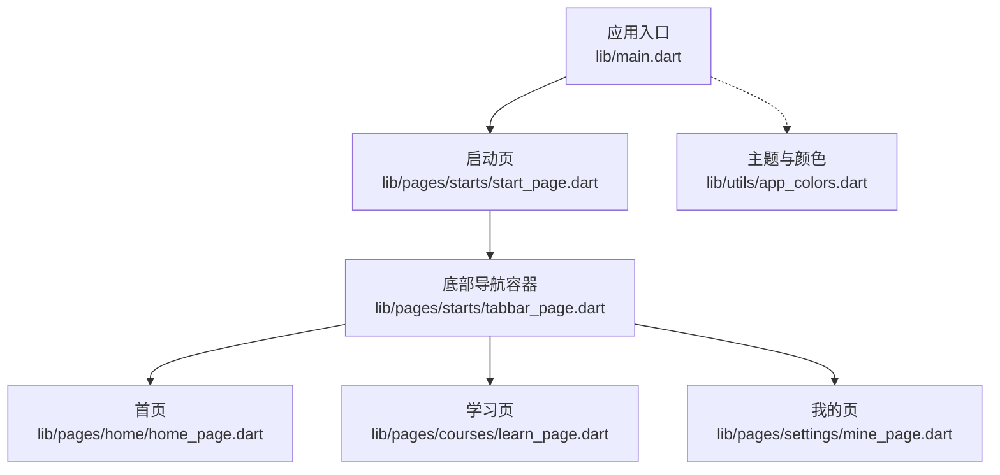
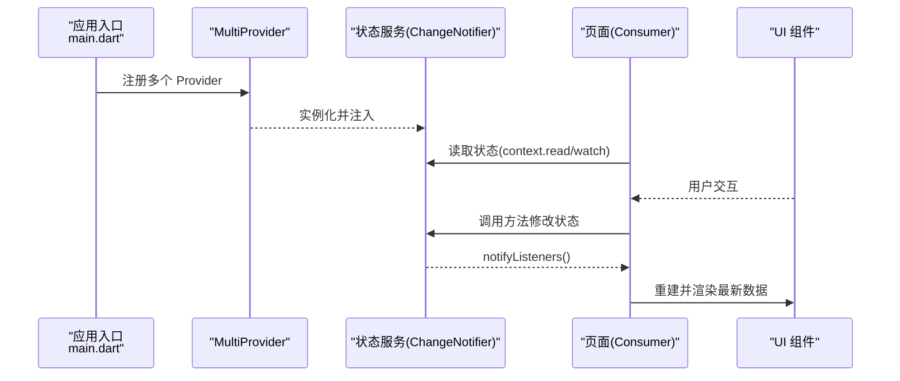
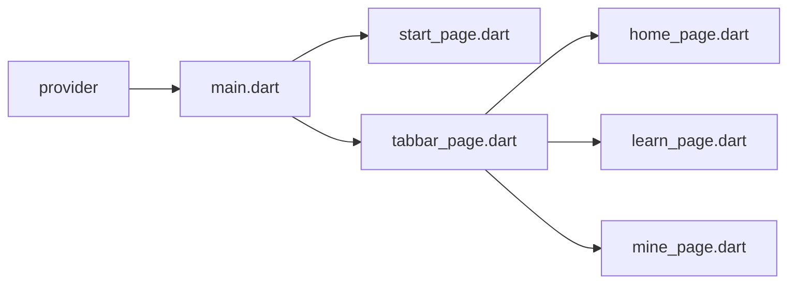

# 状态管理

<cite>
**本文引用的文件**
- [pubspec.yaml](file://pubspec.yaml)
- [main.dart](file://lib/main.dart)
- [start_page.dart](file://lib/pages/starts/start_page.dart)
- [tabbar_page.dart](file://lib/pages/starts/tabbar_page.dart)
- [home_page.dart](file://lib/pages/home/home_page.dart)
- [learn_page.dart](file://lib/pages/courses/learn_page.dart)
- [mine_page.dart](file://lib/pages/settings/mine_page.dart)
- [app_colors.dart](file://lib/utils/app_colors.dart)
- [exports.dart](file://lib/utils/exports.dart)
</cite>

## 目录
1. [简介](#简介)
2. [项目结构](#项目结构)
3. [核心组件](#核心组件)
4. [架构总览](#架构总览)
5. [详细组件分析](#详细组件分析)
6. [依赖分析](#依赖分析)
7. [性能考虑](#性能考虑)
8. [故障排查指南](#故障排查指南)
9. [结论](#结论)
10. [附录](#附录)

## 简介
本文件面向在 Flutter 项目中引入 Provider 进行状态管理的开发者，结合当前仓库现状与最佳实践，系统讲解：
- Provider 的基本概念与工作原理（ChangeNotifier、Consumer、Provider）
- 如何定义状态类并使用 ChangeNotifier 管理应用状态
- 如何在 Widget 树中提供和消费状态（含 MultiProvider 的使用场景）
- 状态更新的最佳实践与性能优化（如 shouldRebuild 的合理使用）
- 全局状态与局部状态的落地方式
- 状态持久化、调试技巧与常见问题解决方案

本项目已在依赖中声明 provider，但尚未在业务代码中使用。下文将基于现有入口与页面结构，给出可落地的集成方案与示例路径指引。

## 项目结构
当前工程采用按功能域划分的目录组织方式：
- lib/main.dart：应用入口，创建 MaterialApp 并设置首页
- lib/pages：页面模块（启动页、首页、学习页、我的等）
- lib/utils：工具与主题色等通用资源
- pubspec.yaml：声明了 provider 等第三方依赖

图表来源
- [main.dart:5-22](file://lib/main.dart#L5-L22)
- [start_page.dart:5-36](file://lib/pages/starts/start_page.dart#L5-L36)
- [tabbar_page.dart:42-100](file://lib/pages/starts/tabbar_page.dart#L42-L100)
- [home_page.dart:3-24](file://lib/pages/home/home_page.dart#L3-L24)
- [learn_page.dart:3-24](file://lib/pages/courses/learn_page.dart#L3-L24)
- [mine_page.dart:3-27](file://lib/pages/settings/mine_page.dart#L3-L27)
- [app_colors.dart:5-27](file://lib/utils/app_colors.dart#L5-L27)

章节来源
- [pubspec.yaml:30-55](file://pubspec.yaml#L30-L55)
- [main.dart:5-22](file://lib/main.dart#L5-L22)

## 核心组件
- ChangeNotifier：用于承载状态并提供通知机制，当状态变化时调用 notifyListeners() 触发监听者重建
- Provider：将状态对象注入到 Widget 树中，供后代通过 context 获取
- Consumer：以函数式方式订阅特定 Provider 的状态变化，仅重建需要的子树
- MultiProvider：在根节点集中注册多个 Provider，便于统一管理全局状态

在本项目中，建议在应用入口处使用 MultiProvider 注入全局状态（例如用户信息、主题、网络请求服务等），在页面内按需使用 Consumer 或 context.read 访问状态。

章节来源
- [pubspec.yaml:44-45](file://pubspec.yaml#L44-L45)

## 架构总览
下图展示 Provider 在 Flutter 中的典型数据流：Provider 暴露状态，Widget 通过 Consumer 或 context.read/watch 订阅；状态变更时，受影响的 Widget 会增量重建。

图表来源
- [main.dart:5-22](file://lib/main.dart#L5-L22)

## 详细组件分析

### 状态类设计（ChangeNotifier）
- 职责单一：每个状态类只负责一组相关状态与行为
- 不可变数据片段：对频繁更新的字段，尽量拆分为独立的小块，减少重建范围
- 明确的通知边界：仅在必要时调用 notifyListeners()，避免过度刷新
- 线程安全：异步操作完成后回到主线程再更新状态

建议位置：lib/services 或 lib/users（可按领域划分）

章节来源
- [pubspec.yaml:44-45](file://pubspec.yaml#L44-L45)

### 在 Widget 树中提供与消费状态
- 全局状态：在应用根节点使用 MultiProvider 统一注入，便于跨页面共享
- 局部状态：在页面内部使用 Provider 包裹，限制作用域，降低无关重建
- 消费方式：
  - Consumer：精确订阅，适合小范围重建
  - context.read：无订阅，适合事件处理（不触发重建）
  - context.watch：订阅并重建，适合需要响应状态变化的整块 UI

章节来源
- [pubspec.yaml:44-45](file://pubspec.yaml#L44-L45)

### 多 Provider 的组织（MultiProvider）
- 将不同领域的状态与服务（如用户、主题、网络）集中注册
- 便于测试与替换（可通过覆盖实现 Mock）
- 推荐在 main.dart 附近集中配置，保持入口清晰

章节来源
- [main.dart:5-22](file://lib/main.dart#L5-L22)
- [pubspec.yaml:44-45](file://pubspec.yaml#L44-L45)

### 页面级状态管理示例（以启动页为例）
- 启动页为 StatefulWidget，内部维护本地计时器与路由跳转逻辑
- 若需将“是否已登录”“首次启动标记”等状态提升为全局，可在入口用 Provider 注入，并在启动页通过 context.read 读取

章节来源
- [start_page.dart:5-36](file://lib/pages/starts/start_page.dart#L5-L36)

### 底部导航与页面切换
- 底部导航容器负责 Tab 切换与页面集合
- 各页面（首页、学习页、我的页）目前为无状态页面，适合接入 Provider 后作为纯展示层

章节来源
- [tabbar_page.dart:42-100](file://lib/pages/starts/tabbar_page.dart#L42-L100)
- [home_page.dart:3-24](file://lib/pages/home/home_page.dart#L3-L24)
- [learn_page.dart:3-24](file://lib/pages/courses/learn_page.dart#L3-L24)
- [mine_page.dart:3-27](file://lib/pages/settings/mine_page.dart#L3-L27)

### 主题与颜色（与状态解耦）
- 颜色与主题集中在 utils 中，便于统一管理与扩展
- 可将主题切换状态放入 Provider，配合 Consumer 实现动态换肤

章节来源
- [app_colors.dart:5-27](file://lib/utils/app_colors.dart#L5-L27)
- [exports.dart:1-5](file://lib/utils/exports.dart#L1-L5)

## 依赖分析
- 项目依赖中包含 provider，版本稳定，可用于状态管理
- 其他依赖（dio、shared_preferences、rxdart 等）可与 Provider 组合，形成完整的数据流与持久化方案

图表来源
- [pubspec.yaml:44-45](file://pubspec.yaml#L44-L45)
- [main.dart:5-22](file://lib/main.dart#L5-L22)
- [start_page.dart:5-36](file://lib/pages/starts/start_page.dart#L5-L36)
- [tabbar_page.dart:42-100](file://lib/pages/starts/tabbar_page.dart#L42-L100)
- [home_page.dart:3-24](file://lib/pages/home/home_page.dart#L3-L24)
- [learn_page.dart:3-24](file://lib/pages/courses/learn_page.dart#L3-L24)
- [mine_page.dart:3-27](file://lib/pages/settings/mine_page.dart#L3-L27)

章节来源
- [pubspec.yaml:30-55](file://pubspec.yaml#L30-L55)

## 性能考虑
- 精准订阅：优先使用 Consumer 或 context.select 订阅最小必要字段，避免整棵树重建
- 合理拆分状态：将高频更新的状态拆成独立的 ChangeNotifier，缩小重建范围
- 避免在 build 中执行昂贵计算：将结果缓存或使用 computed 派生状态
- shouldRebuild 的使用：
  - 自定义 StatelessWidget 时可重写 shouldRebuild，返回 false 跳过不必要的重建
  - 注意：shouldRebuild 不能替代正确的状态订阅，应配合细粒度状态与 Consumer 使用
- 列表优化：使用 ListView.builder、const Widget、key 等手段减少重绘

[本节为通用性能建议，不直接分析具体文件]

## 故障排查指南
- 状态未更新
  - 检查是否在 ChangeNotifier 中调用了 notifyListeners()
  - 确认 Consumer 订阅的是正确的 Provider 与字段
- 过度重建
  - 使用 context.read 替代 watch 处理事件回调
  - 将大段 UI 拆分为独立 Widget，并用 const 构造
- 内存泄漏
  - 确保在 dispose 中释放定时器、控制器等资源（参考启动页的 Timer 使用）
- 异步更新顺序
  - 确保在异步任务完成后在主线程更新状态
- 调试技巧
  - 使用 DevTools 的 Performance 面板观察 rebuild
  - 打印 Provider 的变更日志，定位频繁更新的字段

章节来源
- [start_page.dart:12-24](file://lib/pages/starts/start_page.dart#L12-L24)

## 结论
本项目已具备引入 Provider 的基础条件。建议从应用入口集中注入全局状态，页面内按需消费；通过细粒度状态与精准订阅实现高性能 UI 更新。结合 shared_preferences 等存储方案可实现状态持久化，配合 DevTools 进行性能分析与问题定位。

[本节为总结性内容，不直接分析具体文件]

## 附录
- 推荐的文件组织
  - lib/services：状态服务（ChangeNotifier）
  - lib/providers：Provider 包装与工厂
  - lib/pages：页面（消费状态）
  - lib/utils：工具与主题
- 常见模式
  - 全局用户信息：在入口 MultiProvider 注入，页面通过 context.read 获取
  - 局部表单状态：在页面内 Provider 包裹，使用 Consumer 更新输入
  - 主题切换：将主题状态放入 Provider，配合 Consumer 动态换肤
- 与现有页面的结合点
  - 启动页：可读取“是否首次启动”等全局标记
  - 底部导航：各子页可订阅各自所需的全局状态
  - 主题：可基于 Provider 切换主题色

[本节为概念性说明，不直接分析具体文件]