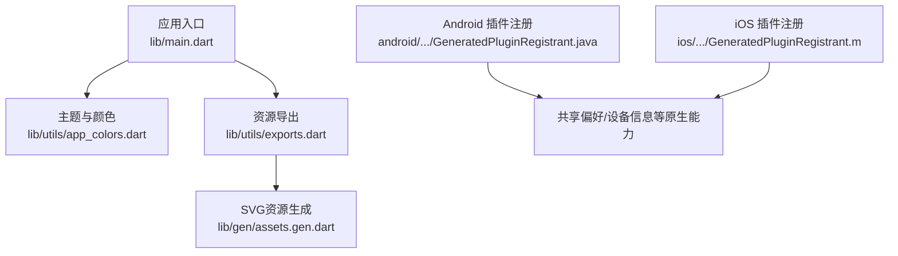
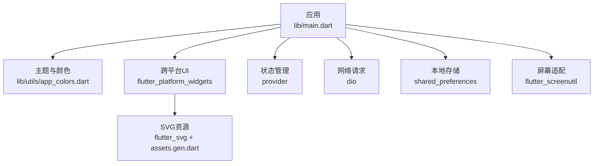
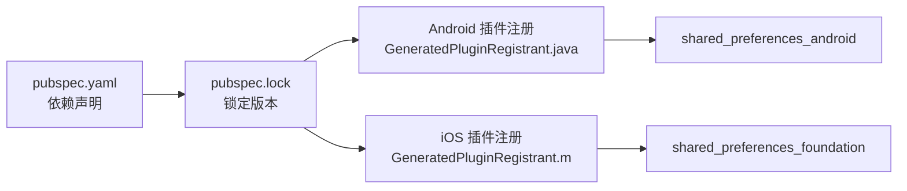

# 第三方集成

<cite>
**本文引用的文件**
- [pubspec.yaml](file://pubspec.yaml)
- [pubspec.lock](file://pubspec.lock)
- [main.dart](file://lib/main.dart)
- [app_colors.dart](file://lib/utils/app_colors.dart)
- [exports.dart](file://lib/utils/exports.dart)
- [assets.gen.dart](file://lib/gen/assets.gen.dart)
- [GeneratedPluginRegistrant.java](file://android/app/src/main/java/io/flutter/plugins/GeneratedPluginRegistrant.java)
- [GeneratedPluginRegistrant.m](file://ios/Runner/GeneratedPluginRegistrant.m)
- [AppDelegate.swift](file://ios/Runner/AppDelegate.swift)
</cite>

## 目录
1. [简介](#简介)
2. [项目结构](#项目结构)
3. [核心组件](#核心组件)
4. [架构总览](#架构总览)
5. [详细组件分析](#详细组件分析)
6. [依赖关系分析](#依赖关系分析)
7. [性能考虑](#性能考虑)
8. [故障排查指南](#故障排查指南)
9. [结论](#结论)
10. [附录](#附录)

## 简介
本文件聚焦本项目中第三方库与SDK的集成方式，覆盖网络请求（Dio）、状态管理（Provider）、跨平台UI（flutter_platform_widgets）、屏幕适配（flutter_screenutil）、本地存储（shared_preferences）等。文档基于仓库中的依赖声明、锁定版本以及平台插件注册信息，给出配置要点、使用建议、最佳实践与常见问题解决方案，并附带版本兼容性与升级指引。

## 项目结构
项目采用标准Flutter工程结构：
- 入口与主题初始化在 lib/main.dart
- 颜色与资源导出集中在 lib/utils 与 lib/gen
- 平台侧通过 Flutter 工具自动生成的插件注册器完成原生能力接入

图表来源
- [main.dart:1-23](file://lib/main.dart#L1-L23)
- [app_colors.dart:1-27](file://lib/utils/app_colors.dart#L1-L27)
- [exports.dart:1-5](file://lib/utils/exports.dart#L1-L5)
- [assets.gen.dart:1-171](file://lib/gen/assets.gen.dart#L1-L171)
- [GeneratedPluginRegistrant.java:17-39](file://android/app/src/main/java/io/flutter/plugins/GeneratedPluginRegistrant.java#L17-L39)
- [GeneratedPluginRegistrant.m:27-35](file://ios/Runner/GeneratedPluginRegistrant.m#L27-L35)

章节来源
- [pubspec.yaml:21-65](file://pubspec.yaml#L21-L65)
- [main.dart:1-23](file://lib/main.dart#L1-L23)

## 核心组件
- 网络请求：dio（HTTP客户端，支持拦截器、错误处理、多平台适配）
- 状态管理：provider（基于InheritedWidget的状态管理与通知机制）
- 跨平台UI：flutter_platform_widgets（提供平台自适应控件）
- 屏幕适配：flutter_screenutil（按屏幕尺寸适配字体与间距）
- 本地存储：shared_preferences（键值对持久化）
- 其他：rxdart（响应式流）、device_info_plus（设备信息）、oktoast（提示）、flutter_svg（矢量图）、image_picker（图片选择）、flutter_slidable（滑动操作）、keyboard_actions（键盘处理）、common_utils（通用工具）

章节来源
- [pubspec.yaml:30-65](file://pubspec.yaml#L30-L65)
- [pubspec.lock:228-235](file://pubspec.lock#L228-L235)
- [pubspec.lock:747-754](file://pubspec.lock#L747-L754)
- [pubspec.lock:787-794](file://pubspec.lock#L787-L794)

## 架构总览
下图展示第三方库在项目中的角色与交互关系：应用启动后通过主题与资源系统加载UI；业务层使用Provider进行状态管理；网络层通过Dio发起请求；数据持久化通过shared_preferences；跨平台差异由flutter_platform_widgets统一封装；屏幕适配由flutter_screenutil保障一致性。

图表来源
- [main.dart:1-23](file://lib/main.dart#L1-L23)
- [app_colors.dart:1-27](file://lib/utils/app_colors.dart#L1-L27)
- [assets.gen.dart:1-171](file://lib/gen/assets.gen.dart#L1-L171)

## 详细组件分析

### Dio 网络请求集成
- 依赖与版本
  - 声明版本：^5.4.0
  - 实际锁定版本：5.11.0
- 集成要点
  - 创建 Dio 实例并配置基础URL、超时、Content-Type等
  - 使用拦截器统一处理请求头、日志、重试、鉴权等
  - 统一错误处理：将网络异常、HTTP状态码、业务错误映射为统一结果类型
  - 取消令牌：用于页面销毁时取消未完成的请求
- 最佳实践
  - 将API按模块拆分，每个模块维护独立BaseOptions或拦截器链
  - 对敏感接口启用加密或签名拦截器
  - 结合缓存策略减少重复请求
- 常见问题
  - 跨域与HTTPS证书校验：在Web与移动端分别配置
  - 大文件上传/下载：使用分块与进度回调
  - 并发控制：限制同时请求数避免阻塞

章节来源
- [pubspec.yaml:42-43](file://pubspec.yaml#L42-L43)
- [pubspec.lock:228-235](file://pubspec.lock#L228-L235)

### Provider 状态管理
- 依赖与版本
  - 声明版本：^6.1.2
  - 实际锁定版本：6.1.5+1
- 集成要点
  - 使用ChangeNotifier/ValueNotifier定义可观察状态
  - 通过Provider.of或context.select访问状态，按需更新
  - 在顶层App或模块根节点包裹MultiProvider集中管理
- 最佳实践
  - 细粒度状态拆分，避免全局大对象
  - 使用Selector/select减少不必要的重建
  - 异步状态更新使用FutureProvider或结合rxdart
- 常见问题
  - 状态丢失：确保在路由切换时正确保存/恢复
  - 性能抖动：避免在build中执行重计算，使用memoization

章节来源
- [pubspec.yaml:44-45](file://pubspec.yaml#L44-L45)
- [pubspec.lock:747-754](file://pubspec.lock#L747-L754)

### flutter_platform_widgets 跨平台UI
- 依赖与版本
  - 声明版本：^6.1.0
- 集成要点
  - 使用平台自适应组件替代Material/Cupertino原生控件，自动适配不同平台样式
  - 针对平台差异进行条件渲染或样式覆盖
- 最佳实践
  - 优先使用该库提供的控件以保持一致性
  - 自定义主题时注意平台差异
- 常见问题
  - 某些平台特性不可用时的降级方案
  - 与现有Material/Cupertino混用时的一致性

章节来源
- [pubspec.yaml:34-35](file://pubspec.yaml#L34-L35)

### flutter_screenutil 屏幕适配
- 依赖与版本
  - 声明版本：^5.9.0
- 集成要点
  - 在应用启动时初始化屏幕适配参数
  - 使用扩展方法将设计稿尺寸转换为当前屏幕适配后的数值
- 最佳实践
  - 统一使用适配后的单位，避免硬编码像素
  - 针对不同屏幕比例做断点检查
- 常见问题
  - 横竖屏切换导致的布局错乱：监听方向变化并重新适配
  - 动态内容高度估算不准确：使用最小/最大约束

章节来源
- [pubspec.yaml:46-47](file://pubspec.yaml#L46-L47)

### shared_preferences 本地存储
- 依赖与版本
  - 声明版本：^2.0.0
  - 实际锁定版本：2.5.5
- 集成要点
  - 通过SharedPreferences实例读写键值对
  - 区分数据类型（字符串、布尔、整型、浮点、列表）
- 最佳实践
  - 对敏感数据加密存储或使用安全存储方案
  - 批量读写合并以减少IO次数
  - 设置合理的默认值与过期策略
- 常见问题
  - 主线程阻塞：大量写入时使用异步并控制频率
  - 数据迁移：版本升级时处理旧数据结构

章节来源
- [pubspec.yaml:50-51](file://pubspec.yaml#L50-L51)
- [pubspec.lock:787-794](file://pubspec.lock#L787-L794)
- [GeneratedPluginRegistrant.java:33-39](file://android/app/src/main/java/io/flutter/plugins/GeneratedPluginRegistrant.java#L33-L39)
- [GeneratedPluginRegistrant.m:21-35](file://ios/Runner/GeneratedPluginRegistrant.m#L21-L35)

### 其他第三方库概览
- rxdart：响应式流，适合复杂事件编排与组合
- device_info_plus：获取设备信息，需关注权限与隐私合规
- oktoast：轻量级提示框，注意层级与生命周期
- flutter_svg：矢量图加载，结合assets.gen.dart使用
- image_picker：图片选择，需配置平台权限
- flutter_slidable：滑动删除/操作，注意手势冲突
- keyboard_actions：键盘处理，避免遮挡输入框
- common_utils：常用工具类，提升开发效率

章节来源
- [pubspec.yaml:38-64](file://pubspec.yaml#L38-L64)

## 依赖关系分析
- 直接依赖
  - dio、provider、flutter_platform_widgets、flutter_screenutil、shared_preferences 等均在 pubspec.yaml 中声明
- 锁定版本
  - 通过 pubspec.lock 记录实际解析到的版本，便于复现与回滚
- 平台插件注册
  - Android：GeneratedPluginRegistrant.java 自动注册 shared_preferences_android 等插件
  - iOS：GeneratedPluginRegistrant.m 自动注册 SharedPreferencesPlugin 等插件
  - AppDelegate.swift 中调用 GeneratedPluginRegistrant.register 完成引擎桥接

图表来源
- [pubspec.yaml:30-65](file://pubspec.yaml#L30-L65)
- [pubspec.lock:228-235](file://pubspec.lock#L228-L235)
- [pubspec.lock:747-754](file://pubspec.lock#L747-L754)
- [pubspec.lock:787-794](file://pubspec.lock#L787-L794)
- [GeneratedPluginRegistrant.java:33-39](file://android/app/src/main/java/io/flutter/plugins/GeneratedPluginRegistrant.java#L33-L39)
- [GeneratedPluginRegistrant.m:21-35](file://ios/Runner/GeneratedPluginRegistrant.m#L21-L35)
- [AppDelegate.swift:13-15](file://ios/Runner/AppDelegate.swift#L13-L15)

章节来源
- [pubspec.yaml:30-65](file://pubspec.yaml#L30-L65)
- [pubspec.lock:228-235](file://pubspec.lock#L228-L235)
- [pubspec.lock:747-754](file://pubspec.lock#L747-L754)
- [pubspec.lock:787-794](file://pubspec.lock#L787-L794)
- [GeneratedPluginRegistrant.java:17-39](file://android/app/src/main/java/io/flutter/plugins/GeneratedPluginRegistrant.java#L17-L39)
- [GeneratedPluginRegistrant.m:27-35](file://ios/Runner/GeneratedPluginRegistrant.m#L27-L35)
- [AppDelegate.swift:1-16](file://ios/Runner/AppDelegate.swift#L1-L16)

## 性能考虑
- 网络层
  - 合理设置超时与重试策略，避免频繁重试导致雪崩
  - 使用连接池与缓存减少重复请求
- 状态管理
  - 使用select/Selector精确订阅，降低重建范围
  - 避免在build中进行昂贵计算
- UI与适配
  - 使用flutter_screenutil统一适配，避免过度测量
  - 合理使用flutter_svg，避免过多大图矢量渲染
- 本地存储
  - 批量写入，减少磁盘IO
  - 对热点数据加内存缓存

[本节为通用指导，不直接分析具体文件]

## 故障排查指南
- 插件未生效
  - 检查Android/iOS平台的GeneratedPluginRegistrant是否包含对应插件注册
  - 确认AppDelegate中已调用GeneratedPluginRegistrant.register
- 网络请求失败
  - 检查Dio基础配置（URL、超时、Content-Type）
  - 查看拦截器日志定位问题（鉴权、签名、重试）
- 状态更新不生效
  - 确认Provider包裹位置与读取上下文一致
  - 检查是否误用了只读上下文
- 本地存储异常
  - 检查键名与数据类型匹配
  - 主线程阻塞：改为异步并控制写入频率
- 屏幕适配错位
  - 确认初始化时机与方向变化处理
  - 检查动态内容的高度估算逻辑

章节来源
- [GeneratedPluginRegistrant.java:17-39](file://android/app/src/main/java/io/flutter/plugins/GeneratedPluginRegistrant.java#L17-L39)
- [GeneratedPluginRegistrant.m:27-35](file://ios/Runner/GeneratedPluginRegistrant.m#L27-L35)
- [AppDelegate.swift:13-15](file://ios/Runner/AppDelegate.swift#L13-L15)

## 结论
本项目围绕dio、provider、flutter_platform_widgets、flutter_screenutil、shared_preferences等核心第三方库构建，配合rxdart、device_info_plus、oktoast、flutter_svg等增强能力，形成完整的网络、状态、UI、适配与存储体系。通过统一的依赖管理与平台插件注册，保障了跨平台一致性与可维护性。建议在后续迭代中持续优化拦截器、状态粒度与存储策略，并结合测试与监控提升稳定性。

[本节为总结性内容，不直接分析具体文件]

## 附录

### 版本兼容性与升级指南
- 关键依赖当前锁定版本
  - dio：5.11.0
  - provider：6.1.5+1
  - shared_preferences：2.5.5
- 升级建议
  - 先在小分支升级单一依赖，验证功能与兼容性
  - 关注pub.dev公告与Breaking Changes
  - 对网络层、状态层与存储层进行回归测试
  - 若涉及平台插件变更，重新执行flutter build以刷新GeneratedPluginRegistrant

章节来源
- [pubspec.lock:228-235](file://pubspec.lock#L228-L235)
- [pubspec.lock:747-754](file://pubspec.lock#L747-L754)
- [pubspec.lock:787-794](file://pubspec.lock#L787-L794)