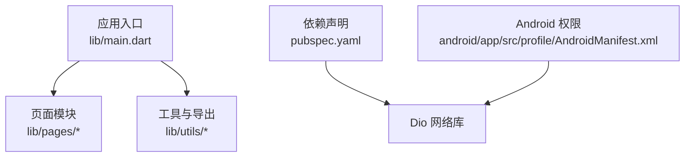
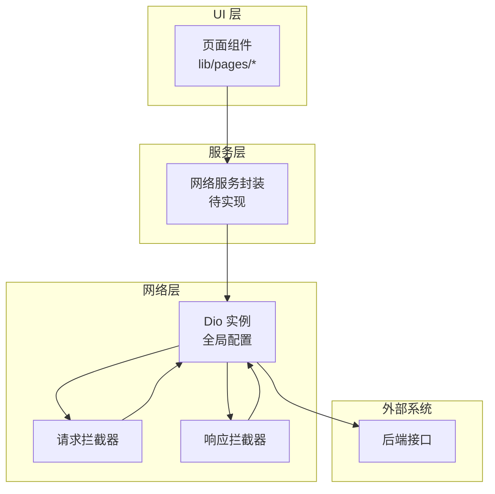
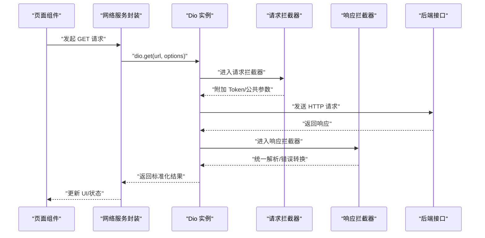
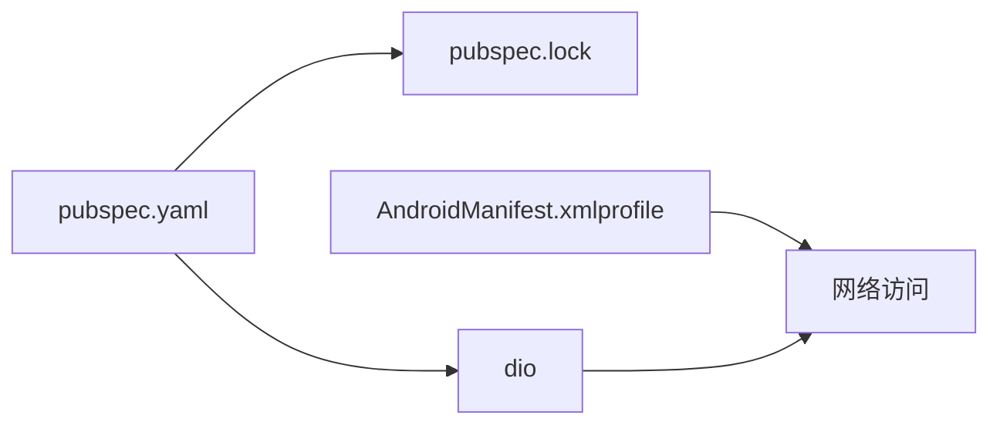

# 网络层集成

<cite>
**本文引用的文件**
- [pubspec.yaml](file://pubspec.yaml)
- [pubspec.lock](file://pubspec.lock)
- [main.dart](file://lib/main.dart)
- [AndroidManifest.xml（profile）](file://android/app/src/profile/AndroidManifest.xml)
</cite>

## 目录
1. [简介](#简介)
2. [项目结构](#项目结构)
3. [核心组件](#核心组件)
4. [架构总览](#架构总览)
5. [详细组件分析](#详细组件分析)
6. [依赖分析](#依赖分析)
7. [性能考虑](#性能考虑)
8. [故障排查指南](#故障排查指南)
9. [结论](#结论)
10. [附录](#附录)

## 简介
本章节面向本项目中网络层的集成与使用，重点围绕 Dio 库的引入、配置与最佳实践。当前仓库已声明对 Dio 的依赖，但尚未包含具体的网络封装代码。本文将基于现有依赖关系，给出在该项目中如何系统化地集成 Dio 的完整方案，包括基础 URL、超时、请求头、拦截器、错误处理、通用方法封装以及异步、取消、上传下载等能力的使用建议，并结合项目结构给出落地路径。

## 项目结构
- 应用入口位于 lib/main.dart，负责启动应用并设置主题与首页。
- 页面组织在 lib/pages 下，当前为 UI 骨架，未包含网络调用逻辑。
- 工具与导出集中在 lib/utils，当前仅包含颜色与资源导出。
- 依赖管理通过 pubspec.yaml 声明，Dio 作为直接依赖已被引入。
- Android 平台权限在 profile 清单中声明了 INTERNET 权限，便于调试时进行网络访问。

图表来源
- [main.dart:1-23](file://lib/main.dart#L1-L23)
- [pubspec.yaml:30-45](file://pubspec.yaml#L30-L45)
- [AndroidManifest.xml（profile）:1-7](file://android/app/src/profile/AndroidManifest.xml#L1-L7)

章节来源
- [main.dart:1-23](file://lib/main.dart#L1-L23)
- [pubspec.yaml:30-45](file://pubspec.yaml#L30-L45)
- [AndroidManifest.xml（profile）:1-7](file://android/app/src/profile/AndroidManifest.xml#L1-L7)

## 核心组件
- Dio 客户端实例：建议在应用启动时创建单例或全局可访问的 Dio 实例，统一配置基础 URL、超时、请求头等。
- 拦截器：
  - 请求拦截器：用于注入认证信息（如 Token）、公共参数、日志打印等。
  - 响应拦截器：用于统一解析响应体、状态码校验、错误转换等。
- 通用网络方法：封装 GET、POST、PUT、DELETE 等方法，屏蔽底层细节，提供统一的返回类型与错误处理。
- 错误处理：区分网络异常、HTTP 状态码异常、业务错误，并提供一致的异常类型与提示策略。
- 高级能力：支持取消请求、文件上传/下载、进度回调、缓存策略等。

章节来源
- [pubspec.yaml:30-45](file://pubspec.yaml#L30-L45)

## 架构总览
下图展示了在本项目中引入 Dio 后的典型分层与数据流：UI 层通过服务层发起请求，服务层使用 Dio 实例执行 HTTP 操作，并通过拦截器完成鉴权与响应标准化。

图表来源
- [pubspec.yaml:30-45](file://pubspec.yaml#L30-L45)

## 详细组件分析

### Dio 客户端初始化与配置
- 基础 URL：集中配置到 Dio 实例，便于多环境切换。
- 超时：设置连接、读取、写入超时，避免长时间阻塞。
- 请求头：统一设置 Content-Type、Accept、User-Agent 等。
- 适配器：根据运行平台自动选择合适适配器（Flutter 默认即可）。

章节来源
- [pubspec.yaml:30-45](file://pubspec.yaml#L30-L45)

### 拦截器设计
- 请求拦截器
  - 注入认证信息（如从本地存储获取 Token）。
  - 添加公共参数（如设备信息、版本号）。
  - 记录请求日志（URL、方法、参数）。
- 响应拦截器
  - 统一解析响应体结构（如 data/code/message）。
  - 针对非 2xx 状态码抛出统一异常。
  - 处理会话失效、权限不足等场景的重定向或登出流程。

章节来源
- [pubspec.yaml:30-45](file://pubspec.yaml#L30-L45)

### 通用网络方法封装
- GET：查询类接口，支持分页、缓存键。
- POST：提交表单或 JSON 数据，支持文件字段。
- PUT/PATCH：更新资源。
- DELETE：删除资源。
- 统一返回：定义成功/失败模型，便于上层消费。
- 取消请求：提供 CancelToken，支持页面销毁时取消未完成请求。

章节来源
- [pubspec.yaml:30-45](file://pubspec.yaml#L30-L45)

### 错误处理机制
- 网络异常：断网、DNS 解析失败、连接超时等。
- HTTP 状态码：4xx/5xx 分类处理，结合业务码映射。
- 自定义错误：将底层异常转换为业务友好提示。
- 重试策略：对幂等请求（GET）可配置指数退避重试。

章节来源
- [pubspec.yaml:30-45](file://pubspec.yaml#L30-L45)

### 异步与取消
- 使用 async/await 处理请求结果。
- 使用 CancelToken 在页面卸载或用户主动取消时中断请求。
- 结合 Provider/Riverpod 等状态管理，统一管理加载态与错误态。

章节来源
- [pubspec.yaml:30-45](file://pubspec.yaml#L30-L45)

### 文件上传与下载
- 上传：multipart/form-data，支持进度回调。
- 下载：分块下载、保存路径、进度展示、断点续传（按需）。
- 安全：校验文件类型、大小限制、MD5 校验（可选）。

章节来源
- [pubspec.yaml:30-45](file://pubspec.yaml#L30-L45)

### 在页面中的使用示例（概念流程）
以下序列图展示页面发起一次带认证的 GET 请求的典型流程：

图表来源
- [pubspec.yaml:30-45](file://pubspec.yaml#L30-L45)

## 依赖分析
- 直接依赖：Dio 已在 pubspec.yaml 中声明，版本锁定在 pubspec.lock。
- 平台权限：Android profile 清单已声明 INTERNET 权限，满足网络访问需求。
- 其他依赖：Provider、RxDart 等可用于状态管理与响应式编程，配合网络层提升体验。

图表来源
- [pubspec.yaml:30-45](file://pubspec.yaml#L30-L45)
- [pubspec.lock:228-235](file://pubspec.lock#L228-L235)
- [AndroidManifest.xml（profile）:1-7](file://android/app/src/profile/AndroidManifest.xml#L1-L7)

章节来源
- [pubspec.yaml:30-45](file://pubspec.yaml#L30-L45)
- [pubspec.lock:228-235](file://pubspec.lock#L228-L235)
- [AndroidManifest.xml（profile）:1-7](file://android/app/src/profile/AndroidManifest.xml#L1-L7)

## 性能考虑
- 合理设置超时与重试：避免长耗时请求拖慢界面。
- 复用 Dio 实例：减少握手开销。
- 合理使用缓存：对静态或低频变化数据启用缓存。
- 压缩与分页：大列表采用分页加载，必要时启用 gzip。
- 图片与文件：控制尺寸、格式，优先使用 CDN。
- 并发控制：限制同时进行的请求数量，避免拥塞。

[本节为通用指导，不直接分析具体文件]

## 故障排查指南
- 网络不可用：检查设备网络与代理设置；确认 Android 权限是否开启。
- 证书问题：测试环境可使用信任所有证书的调试模式（生产环境不建议）。
- 跨域与 HTTPS：确保域名与证书正确，必要时配置域名白名单。
- 超时与重试：调整超时阈值，对幂等请求增加重试。
- 日志定位：在请求/响应拦截器中输出关键信息，快速定位问题。

章节来源
- [AndroidManifest.xml（profile）:1-7](file://android/app/src/profile/AndroidManifest.xml#L1-L7)

## 结论
本项目已引入 Dio 作为网络库，具备构建健壮网络层的条件。建议在应用入口处统一初始化 Dio 实例，并通过拦截器实现鉴权与响应标准化；在服务层封装通用请求方法，提供一致的错误处理与取消机制；结合状态管理实现友好的加载与错误反馈。后续可在 pages 与 services 中逐步落地具体接口调用。

[本节为总结性内容，不直接分析具体文件]

## 附录
- 推荐目录结构
  - lib/services/network：Dio 实例、拦截器、通用方法封装
  - lib/models/api：统一响应模型、错误模型
  - lib/pages：页面中调用网络服务，处理 UI 状态
- 参考要点
  - 基础 URL、超时、请求头集中配置
  - 请求/响应拦截器统一处理
  - 错误类型与提示策略
  - 取消请求、上传下载、进度回调
  - 性能优化与常见问题排查

[本节为补充说明，不直接分析具体文件]