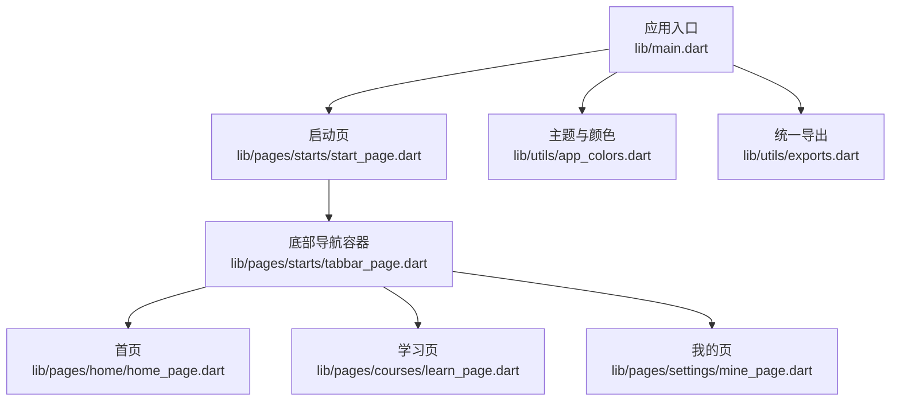
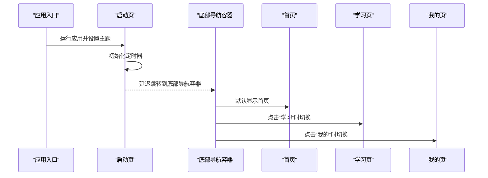
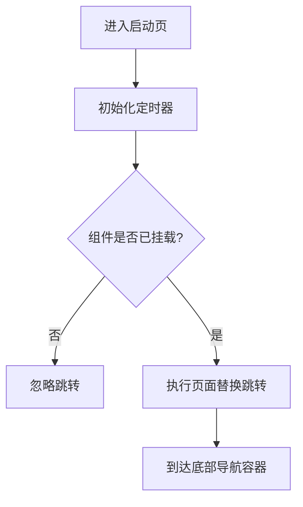
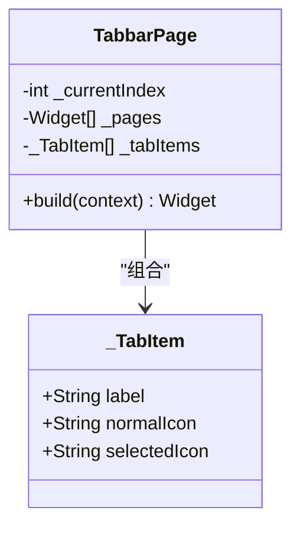
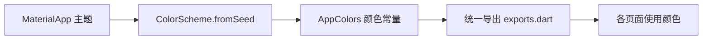
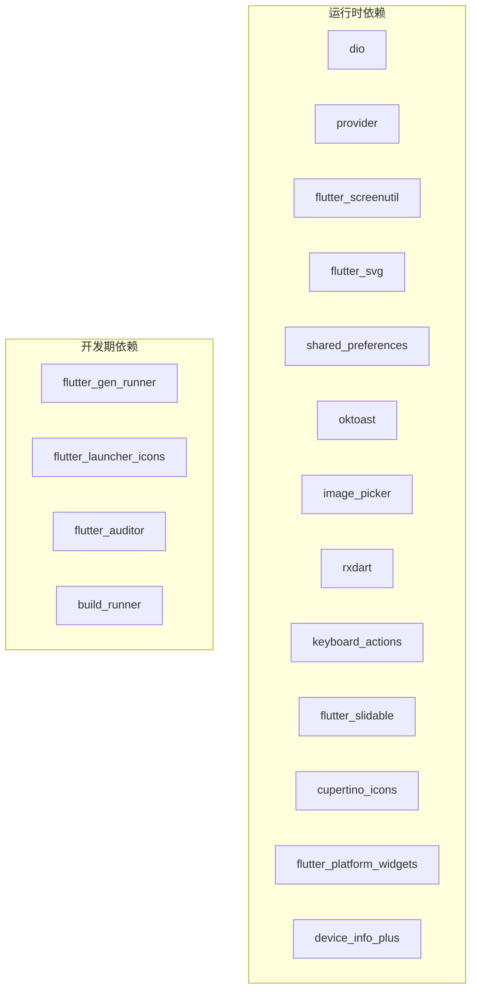

# 项目概述

<cite>
**本文引用的文件**
- [lib/main.dart](file://lib/main.dart)
- [pubspec.yaml](file://pubspec.yaml)
- [README.md](file://README.md)
- [lib/pages/starts/start_page.dart](file://lib/pages/starts/start_page.dart)
- [lib/pages/starts/tabbar_page.dart](file://lib/pages/starts/tabbar_page.dart)
- [lib/pages/home/home_page.dart](file://lib/pages/home/home_page.dart)
- [lib/pages/courses/learn_page.dart](file://lib/pages/courses/learn_page.dart)
- [lib/pages/settings/mine_page.dart](file://lib/pages/settings/mine_page.dart)
- [lib/utils/app_colors.dart](file://lib/utils/app_colors.dart)
- [lib/utils/exports.dart](file://lib/utils/exports.dart)
</cite>

## 目录
1. [简介](#简介)
2. [项目结构](#项目结构)
3. [核心组件](#核心组件)
4. [架构总览](#架构总览)
5. [详细组件分析](#详细组件分析)
6. [依赖分析](#依赖分析)
7. [性能考虑](#性能考虑)
8. [故障排查指南](#故障排查指南)
9. [结论](#结论)
10. [附录：快速开始](#附录快速开始)

## 简介
本项目是一个基于 Flutter 的跨平台移动应用，目标是为 Android 与 iOS 提供一致的用户体验。项目采用现代 Flutter 工程结构，围绕“启动流程管理、底部导航系统、主题系统”等基础能力构建，并通过第三方库增强网络、状态管理、屏幕适配、图片与本地存储等能力。整体设计强调可维护性与可扩展性，便于后续功能迭代与团队协作。

## 项目结构
项目采用分层与按功能模块组织相结合的方式：
- lib/main.dart：应用入口，负责初始化主题与首页路由。
- lib/pages：页面层，包含启动页、底部导航容器以及各业务页面（首页、学习、我的）。
- lib/utils：工具与资源导出，集中颜色定义与统一导出。
- pubspec.yaml：依赖与资源声明，配置图标生成与资源代码生成。
- android/ 与 ios/：原生平台工程，用于打包与平台相关配置。

图表来源
- [lib/main.dart:1-23](file://lib/main.dart#L1-L23)
- [lib/pages/starts/start_page.dart:1-37](file://lib/pages/starts/start_page.dart#L1-L37)
- [lib/pages/starts/tabbar_page.dart:1-185](file://lib/pages/starts/tabbar_page.dart#L1-L185)
- [lib/pages/home/home_page.dart:1-25](file://lib/pages/home/home_page.dart#L1-L25)
- [lib/pages/courses/learn_page.dart:1-25](file://lib/pages/courses/learn_page.dart#L1-L25)
- [lib/pages/settings/mine_page.dart:1-28](file://lib/pages/settings/mine_page.dart#L1-L28)
- [lib/utils/app_colors.dart:1-27](file://lib/utils/app_colors.dart#L1-L27)
- [lib/utils/exports.dart:1-5](file://lib/utils/exports.dart#L1-L5)

章节来源
- [lib/main.dart:1-23](file://lib/main.dart#L1-L23)
- [pubspec.yaml:1-136](file://pubspec.yaml#L1-L136)

## 核心组件
- 应用入口与主题：在应用入口处创建 MaterialApp，并基于种子色生成 ColorScheme，作为全局主题；首页默认指向启动页。
- 启动流程：启动页在初始化后延迟跳转到底部导航容器，完成冷启动过渡。
- 底部导航系统：根据平台选择 CupertinoTabScaffold（iOS）或自定义 Scaffold + IndexedStack（Android），实现统一的 Tab 切换与动画效果。
- 主题与颜色：集中管理颜色常量，通过工具类暴露主色、背景色、标题色等，供全应用复用。
- 资源与导出：通过统一导出文件聚合 SVG 加载、资源生成类与颜色扩展，简化页面导入。

章节来源
- [lib/main.dart:9-23](file://lib/main.dart#L9-L23)
- [lib/pages/starts/start_page.dart:12-24](file://lib/pages/starts/start_page.dart#L12-L24)
- [lib/pages/starts/tabbar_page.dart:16-171](file://lib/pages/starts/tabbar_page.dart#L16-L171)
- [lib/utils/app_colors.dart:4-27](file://lib/utils/app_colors.dart#L4-L27)
- [lib/utils/exports.dart:1-5](file://lib/utils/exports.dart#L1-L5)

## 架构总览
应用以“入口 → 启动 → 导航容器 → 业务页面”为主线，配合主题系统与工具导出形成稳定的基础层。

图表来源
- [lib/main.dart:5-23](file://lib/main.dart#L5-L23)
- [lib/pages/starts/start_page.dart:12-24](file://lib/pages/starts/start_page.dart#L12-L24)
- [lib/pages/starts/tabbar_page.dart:16-171](file://lib/pages/starts/tabbar_page.dart#L16-L171)
- [lib/pages/home/home_page.dart:1-25](file://lib/pages/home/home_page.dart#L1-L25)
- [lib/pages/courses/learn_page.dart:1-25](file://lib/pages/courses/learn_page.dart#L1-L25)
- [lib/pages/settings/mine_page.dart:1-28](file://lib/pages/settings/mine_page.dart#L1-L28)

## 详细组件分析

### 启动流程管理
- 职责：展示启动画面并在完成后跳转到主导航容器。
- 关键点：使用定时器进行延时跳转；跳转前检查组件是否已挂载，避免内存泄漏。
- 交互：从启动页替换到 TabbarPage，确保栈干净。

图表来源
- [lib/pages/starts/start_page.dart:12-24](file://lib/pages/starts/start_page.dart#L12-L24)

章节来源
- [lib/pages/starts/start_page.dart:1-37](file://lib/pages/starts/start_page.dart#L1-L37)

### 底部导航系统
- 职责：承载多个业务页面并提供平台感知的底部导航。
- 关键点：
  - iOS 使用 CupertinoTabScaffold + CupertinoTabBar，保持原生风格。
  - Android 使用自定义 BottomNavigationBar，结合 AnimatedContainer 实现选中态高亮与平滑过渡。
  - 使用 SvgPicture 渲染图标，支持选中/未选中不同样式。
  - 使用 IndexedStack 保持页面状态，避免重复重建。
- 数据模型：内部 _TabItem 封装标签与图标路径，便于扩展新 Tab。

图表来源
- [lib/pages/starts/tabbar_page.dart:9-185](file://lib/pages/starts/tabbar_page.dart#L9-L185)

章节来源
- [lib/pages/starts/tabbar_page.dart:1-185](file://lib/pages/starts/tabbar_page.dart#L1-L185)

### 主题系统
- 职责：统一管理应用色彩体系，提供一致的视觉风格。
- 关键点：
  - 在应用入口通过 ColorScheme.fromSeed 生成主题色。
  - 颜色常量集中在 AppColors，包括主色、背景、标题、内容、价格、线条等。
  - 通过统一导出文件对外暴露颜色与 SVG 能力，降低耦合。

图表来源
- [lib/main.dart:13-21](file://lib/main.dart#L13-L21)
- [lib/utils/app_colors.dart:4-27](file://lib/utils/app_colors.dart#L4-L27)
- [lib/utils/exports.dart:1-5](file://lib/utils/exports.dart#L1-L5)

章节来源
- [lib/main.dart:9-23](file://lib/main.dart#L9-L23)
- [lib/utils/app_colors.dart:1-27](file://lib/utils/app_colors.dart#L1-L27)
- [lib/utils/exports.dart:1-5](file://lib/utils/exports.dart#L1-L5)

### 业务页面（首页、学习、我的）
- 职责：展示各自业务占位内容与基本 UI。
- 特点：均使用 Scaffold + AppBar 构建，便于后续扩展具体业务逻辑。

章节来源
- [lib/pages/home/home_page.dart:1-25](file://lib/pages/home/home_page.dart#L1-L25)
- [lib/pages/courses/learn_page.dart:1-25](file://lib/pages/courses/learn_page.dart#L1-L25)
- [lib/pages/settings/mine_page.dart:1-28](file://lib/pages/settings/mine_page.dart#L1-L28)

## 依赖分析
- 框架与语言：Dart 与 Flutter SDK，保证跨平台一致性。
- 平台适配：flutter_platform_widgets 提供跨平台组件差异处理。
- 网络与状态：dio 负责网络请求，provider 提供状态管理。
- 屏幕与资源：flutter_screenutil 做屏幕适配，flutter_svg 加载矢量图，image_picker 选择图片。
- 本地存储与提示：shared_preferences 持久化，oktoast 提示反馈。
- 工具与交互：common_utils 常用工具，flutter_slidable 侧滑删除，keyboard_actions 键盘事件处理，rxdart 响应式流。
- 开发期工具：flutter_gen_runner 生成资源代码，flutter_launcher_icons 自动生成多尺寸图标，flutter_auditor 审计与安全检查。

图表来源
- [pubspec.yaml:30-97](file://pubspec.yaml#L30-L97)

章节来源
- [pubspec.yaml:1-136](file://pubspec.yaml#L1-L136)

## 性能考虑
- 页面状态保持：底部导航使用 IndexedStack，避免重复构建，提升切换流畅度。
- 动画与渲染：选中态使用 AnimatedContainer 控制过渡时长，减少重绘开销。
- 资源优化：SVG 按需加载，建议对大图进行压缩与懒加载策略。
- 主题与颜色：集中管理颜色，减少重复计算与不一致导致的重绘。
- 依赖精简：仅引入必要依赖，避免包体积膨胀。

## 故障排查指南
- 启动页跳转无效：检查是否在 initState 中正确判断 mounted，并确保 Timer 回调内执行 Navigator 替换。
- 底部导航不生效：确认当前平台分支是否正确（iOS 使用 CupertinoTabScaffold，Android 使用自定义布局）；检查 _currentIndex 更新与 setState 调用。
- 图标显示异常：确认 assets 路径与 flutter_gen 生成类可用；必要时重新运行资源生成命令。
- 主题色不生效：检查 MaterialApp 的 theme 配置与 AppColors 的使用位置。

章节来源
- [lib/pages/starts/start_page.dart:12-24](file://lib/pages/starts/start_page.dart#L12-L24)
- [lib/pages/starts/tabbar_page.dart:44-171](file://lib/pages/starts/tabbar_page.dart#L44-L171)
- [lib/main.dart:13-21](file://lib/main.dart#L13-L21)

## 结论
本项目以清晰的入口与启动流程为基础，构建了跨平台的底部导航与主题系统，并通过合理的依赖选型提升了开发效率与用户体验。后续可在现有骨架上快速扩展业务页面与服务层，逐步完善功能矩阵。

## 附录：快速开始
- 环境准备：安装 Flutter SDK 与 Dart 工具链，配置 Android/iOS 开发环境。
- 获取依赖：在项目根目录执行依赖拉取命令，确保所有依赖安装成功。
- 资源生成：如需使用生成的资源类，请运行资源生成器命令。
- 运行项目：连接设备或启动模拟器，运行应用即可看到启动页与底部导航。
- 参考文档：详见项目 README，了解更多入门资源与官方文档链接。

章节来源
- [README.md:1-18](file://README.md#L1-L18)
- [pubspec.yaml:81-97](file://pubspec.yaml#L81-L97)